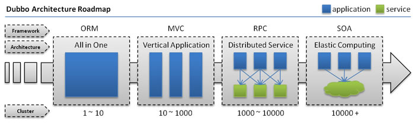
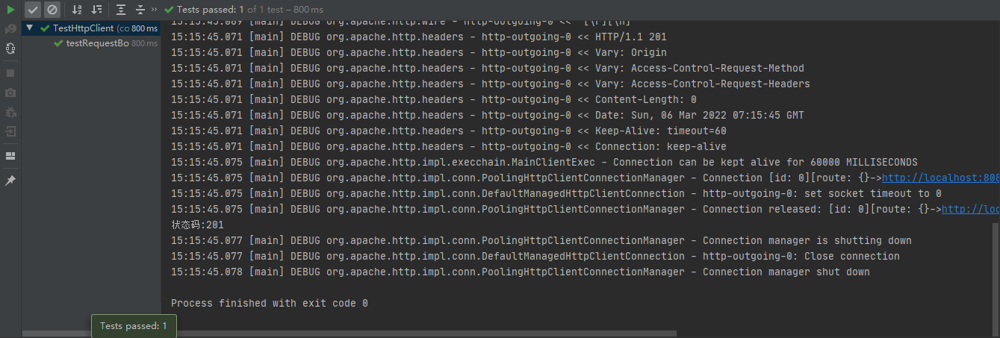
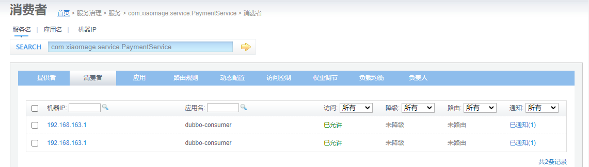

[TOC]


# 软件架构的演进过程

​		随着互联网的发展,网站应用的规模不断扩大,常规的垂直应用架构已无法应对,分布式服务架构以及流动计算架构势在必行,亟需一个治理系统确保架构有条不紊的演进.



## 单一应用架构

​		当网站流量很小时,只需一个应用,将所有功能都部署在一起,以减少部署节点和成本.此时,用于简化增删改查工作量的数据访问框架(ORM)是关键.


说明: 

- 全部功能集中在一个项目内(All in one)

优点: 

- 架构简单,前期开发成本低,开发周期短,适合小型项目.

缺点:

- 功能集中在一个项目中,不利于开发、扩展、维护
- 系统扩张只能通过集群的方式
- 项目之间功能冗余、数据冗余、耦合性强

## 垂直应用架构

​		当访问量逐渐增大,单一应用增加机器带来的加速度越来越小,提升效率的方法之一是将应用拆成互不相干的几个应用,以提升效率.此时,用于加速前端页面开发的Web框架(MVC)是关键.

## 分布式服务架构

​		当垂直应用越来越多,应用之间交互不可避免,将核心业务抽取出来,作为独立的服务,逐渐形成稳定的服务中心,使前端应用能更快速的响应多变的市场需求.此时,用于提高业务复用及整合的分布式服务框架(RPC)是关键.

## 流动计算架构

​		当服务越来越多,容量的评估,小服务资源的浪费等问题逐渐显现,此时需增加一个调度中心基于访问压力实时管理集群容量,提高集群利用率.此时,用于提高机器利用率的资源调度和治理中心(SOA)是关键.

# RPC

## RPC简介

### RFC

​		RFC(Request For Comments)是由互联网工程任务组(IETF)发布的文件集.文件集中每个文件都有自己唯一编号,例如:rfc1831.目前RFC文件由互联网协会(Internet Society,ISOC)赞助发型.

 		RPC就收集到rfc1831中.可以通过链接查看:https://datatracker.ietf.org/doc/rfc1831/

### RPC

​		RPC(Remote Procedure Call): 远程过程调用协议.RPC协议规定允许互联网中一台主机程序调用另一台主机程序,而程序员无需对这个交互过程进行编程.在RPC协议中强调当A程序调用B程序中功能或方法时,A是不知道B中方法具体实现的.

​		RPC是上层协议,底层可以基于TCP协议,也可以基于HTTP协议.一般我们说RPC都是基于RPC的具体实现,如:Dubbo框架.从广义上讲只要是满足网络中进行通讯调用都统称为RPC,甚至HTTP协议都可以说是RPC的具体实现,但是具体分析看来RPC协议要比HTTP协议更加高效,基于RPC的框架功能更多.

​		RPC协议是基于分布式架构而出现的,所以RPC在分布式项目中有着得天独厚的优势.

## RPC与HTTP对比

| 对比     | RPC                                                       | HTTP                                                         |
| -------- | --------------------------------------------------------- | ------------------------------------------------------------ |
| 具体实现 | 可以基于TCP协议,也可以基于HTTP协议                        | 使用TCP进行传输                                              |
| 效率     | 自定义具体实现可以减少很多无用的报文内容,使得报文体积更小 | 如果是HTTP1.1报文中很多内容都是无用的.如果是HTTP2.0以后和RPC相差不大,比RPC少的可能就是一些服务治理等功能 |
| 连接方式 | 长连接支持                                                | 每次连接都是3次握手                                          |
| 性能     | RPC可以基于很多序列化方式.如:thrift                       | HTTP主要是通过JSON,序列化和反序列化效率更低                  |
| 负载均衡 | 绝大多数RPC框架都带有负载均衡策略                         | 一般都需要借助第三方工具.如:nginx                            |
| 注册中心 | 一般RPC框架都带有注册中心                                 | 都是直连                                                     |

​		综上:RPC框架一般都带有丰富的服务治理等功能,更适合企业内部接口调用.而HTTP更适合多平台之间相互调用.

## HTTPClient实现RPC

​		在JDK中java.net包下提供了用户HTTP访问的基本功能,但是它缺少灵活性或许多应用所需要的功能.

​		HttpClient起初是Apache Jakarta Common 的子项目,用来提供高效的、最新的、功能丰富的支持HTTP协议的客户端编程工具包,并且它支持 HTTP 协议最新的版本.2007年成为顶级项目.

​		通俗解释: HttpClient可以实现使用Java代码完成标准HTTP请求及响应.

### 项目HttpClientServer

创建SpringBoot Web项目,使用默认端口号8080

**pom.xml**

```xml
<?xml version="1.0" encoding="UTF-8"?>
<project xmlns="http://maven.apache.org/POM/4.0.0"
         xmlns:xsi="http://www.w3.org/2001/XMLSchema-instance"
         xsi:schemaLocation="http://maven.apache.org/POM/4.0.0 http://maven.apache.org/xsd/maven-4.0.0.xsd">
    <modelVersion>4.0.0</modelVersion>

    <groupId>com.xiaomage</groupId>
    <artifactId>HttpClientServer</artifactId>
    <version>1.0-SNAPSHOT</version>
    <parent>
        <artifactId>spring-boot-starter-parent</artifactId>
        <groupId>org.springframework.boot</groupId>
        <version>2.5.8</version>
    </parent>

    <dependencies>
        <dependency>
            <groupId>org.springframework.boot</groupId>
            <artifactId>spring-boot-starter-web</artifactId>
        </dependency>
    </dependencies>

</project>
```

**启动器**

```java
package com.xiaomage;

import org.springframework.boot.SpringApplication;
import org.springframework.boot.autoconfigure.SpringBootApplication;

@SpringBootApplication
public class HttpClientServerApplication {
    public static void main(String[] args) {
        SpringApplication.run(HttpClientServerApplication.class,args);
    }
}
```

**实体类**

```java
package com.xiaomage.pojo;

public class Payment {
    private Integer id;
    private String message;

    public Payment() {
    }

    public Payment(Integer id, String message) {
        this.id = id;
        this.message = message;
    }

    public Integer getId() {
        return id;
    }

    public void setId(Integer id) {
        this.id = id;
    }

    public String getMessage() {
        return message;
    }

    public void setMessage(String message) {
        this.message = message;
    }

    @Override
    public String toString() {
        return "Payment{" +
                "id=" + id +
                ", message='" + message + '\'' +
                '}';
    }
}
```

**处理器控制器**

```java
package com.xiaomage.controller;

import com.xiaomage.pojo.Payment;
import org.springframework.http.HttpStatus;
import org.springframework.http.ResponseEntity;
import org.springframework.web.bind.annotation.*;

import java.util.HashMap;

@RestController
@RequestMapping("/payment")
public class PaymentController {

    @GetMapping
    public ResponseEntity<HashMap<String,Object>> payment_get(@RequestParam("id") Integer id) {
        HashMap<String, Object> map = new HashMap<>();
        map.put("id",id);
        map.put("message","支付成功");
        return ResponseEntity.ok(map);
    }

    @PostMapping
    public ResponseEntity<HashMap<String,Object>> payment_post(@RequestParam("id") Integer id) {
        HashMap<String, Object> map = new HashMap<>();
        map.put("id",id);
        map.put("message","支付成功");
        return ResponseEntity.ok(map);
    }

    @PostMapping("/add")
    public ResponseEntity<Void> payment_add(@RequestBody Payment payment) {
        System.out.println(payment);
        return ResponseEntity.status(HttpStatus.CREATED).build();
    }

}
```

### 项目HttpClientDemo

创建SpringBoot Web项目,使用端口8081,可以用来模拟跨域请求.

**pom.xml**

```xml
<?xml version="1.0" encoding="UTF-8"?>
<project xmlns="http://maven.apache.org/POM/4.0.0"
         xmlns:xsi="http://www.w3.org/2001/XMLSchema-instance"
         xsi:schemaLocation="http://maven.apache.org/POM/4.0.0 http://maven.apache.org/xsd/maven-4.0.0.xsd">
    <modelVersion>4.0.0</modelVersion>

    <groupId>com.xiaomage</groupId>
    <artifactId>HttpClientDemo</artifactId>
    <version>1.0-SNAPSHOT</version>
    <parent>
        <artifactId>spring-boot-starter-parent</artifactId>
        <groupId>org.springframework.boot</groupId>
        <version>2.5.8</version>
    </parent>

    <dependencies>
        <dependency>
            <groupId>org.springframework.boot</groupId>
            <artifactId>spring-boot-starter-web</artifactId>
        </dependency>
        <dependency>
            <groupId>org.springframework.boot</groupId>
            <artifactId>spring-boot-starter-thymeleaf</artifactId>
        </dependency>
        <dependency>
            <groupId>org.apache.httpcomponents</groupId>
            <artifactId>httpclient</artifactId>
            <version>4.5.13</version>
        </dependency>
        <dependency>
            <groupId>junit</groupId>
            <artifactId>junit</artifactId>
            <version>4.12</version>
            <scope>test</scope>
        </dependency>
    </dependencies>

</project>
```

**application.yml**

```yaml
server:
  port: 8081

spring:
  thymeleaf:
    prefix: classpath:/templates/
    suffix: .html
    cache: false
```

**启动器**

```java
package com.xiaomage;

import org.springframework.boot.SpringApplication;
import org.springframework.boot.autoconfigure.SpringBootApplication;

@SpringBootApplication
public class HttpClientApplication {

    public static void main(String[] args) {
        SpringApplication.run(HttpClientApplication.class,args);
    }
}
```

**处理器控制器**

用于跳转主页等.

```java
package com.xiaomage.controller;

import org.springframework.stereotype.Controller;
import org.springframework.web.bind.annotation.PathVariable;
import org.springframework.web.bind.annotation.RequestMapping;
import org.springframework.web.bind.annotation.RequestMethod;

@Controller
public class PageController {

    @RequestMapping(value = "/{page}",method = RequestMethod.GET)
    public String toPage(@PathVariable("page") String page){
        return page;
    }
}
```

**测试类**

测试通过HttpClient发送请求和接收响应.

```java
package com.xiaomage.test;

import com.sun.xml.internal.ws.client.sei.ResponseBuilder;
import org.apache.http.HttpEntity;
import org.apache.http.client.ClientProtocolException;
import org.apache.http.client.entity.UrlEncodedFormEntity;
import org.apache.http.client.methods.CloseableHttpResponse;
import org.apache.http.client.methods.HttpGet;
import org.apache.http.client.methods.HttpPost;
import org.apache.http.client.methods.HttpUriRequest;
import org.apache.http.client.utils.URIBuilder;
import org.apache.http.entity.ContentType;
import org.apache.http.entity.StringEntity;
import org.apache.http.impl.client.CloseableHttpClient;
import org.apache.http.impl.client.HttpClients;
import org.apache.http.message.BasicNameValuePair;
import org.apache.http.util.EntityUtils;
import org.junit.After;
import org.junit.Before;
import org.junit.Test;

import java.io.IOException;
import java.net.URISyntaxException;
import java.util.ArrayList;
import java.util.List;

public class TestHttpClient {
    private CloseableHttpClient httpClient = null;

    @Before
    public void before(){
        // 创建http工具(理解成浏览器),发起请求,解析响应
        httpClient = HttpClients.createDefault();
    }


    @After
    public void after(){
        // 释放资源
        try {
            if (httpClient != null)
                httpClient.close();
        } catch (IOException e) {
            e.printStackTrace();
        }
    }

    @Test
    public void testGet(){
        try {
            // 请求路径
            URIBuilder uriBuilder = new URIBuilder("http://localhost:8080/payment");
            uriBuilder.addParameter("id","1");
            // 创建HTTP请求
            HttpUriRequest get = new HttpGet(uriBuilder.build());
            // 获取响应
            CloseableHttpResponse response = httpClient.execute(get);
            // 由于响应体是字符串,因此把HttpEntity类型转换为字符串类型,并设置字符编码
            String result = EntityUtils.toString(response.getEntity(), "utf-8");
            // 输出结果
            System.out.println(result);
        } catch (URISyntaxException | IOException e) {
            e.printStackTrace();
        }
    }

    @Test
    public void testPost(){
        try {
            // 请求路径
            URIBuilder uriBuilder = new URIBuilder("http://localhost:8080/payment");
            // 创建HTTP请求
            HttpPost post = new HttpPost(uriBuilder.build());
            // 准备请求参数
            List<BasicNameValuePair> nameValuePair = new ArrayList<>();
            nameValuePair.add(new BasicNameValuePair("id","2"));
            // 构建请求实体
            HttpEntity entity = new UrlEncodedFormEntity(nameValuePair,"utf-8");
            // 设置请求实体
            post.setEntity(entity);
            // 获取响应
            CloseableHttpResponse response = httpClient.execute(post);
            // 由于响应体是字符串,因此把HttpEntity类型转换为字符串类型,并设置字符编码
            String result = EntityUtils.toString(response.getEntity(), "utf-8");
            // 输出结果
            System.out.println(result);
        } catch (URISyntaxException | IOException e) {
            e.printStackTrace();
        }
    }

    @Test
    public void testRequestBody(){
        try {
            // 请求路径
            URIBuilder uriBuilder = new URIBuilder("http://localhost:8080/payment/add");
            // 创建HTTP请求
            HttpPost post = new HttpPost(uriBuilder.build());
            // 构建请求实体
            String payment = "{\"id\":1,\"message\":\"支付成功\"}";
            HttpEntity entity = new StringEntity(payment, ContentType.APPLICATION_JSON);
            // 设置请求实体
            post.setEntity(entity);
            // 获取响应
            CloseableHttpResponse response = httpClient.execute(post);
            // 获取响应状态码
            int statusCode = response.getStatusLine().getStatusCode();
            // 输出结果
            System.out.println("状态码:" + statusCode);
        } catch (URISyntaxException | IOException e) {
            e.printStackTrace();
        }
    }

}
```

**index.html**

```html
<!DOCTYPE html>
<html lang="en">
<head>
    <meta charset="UTF-8">
    <title>Title</title>
    <script type="application/javascript" src="js/jquery-1.10.2.min.js"></script>
    <script type="application/javascript">
        $(function(){
            const json = '{"id":1,"message":"支付成功"}';
            $("#btn").click(function(){
                $.ajax({
                    url: "http://127.0.0.1:8080/payment/add",// 端口不同,跨域请求
                    type: "post",
                    data: json,
                    dataType: "text",// 响应内容类型
                    contentType: "application/json",// 请求体中的内容类型
                    success: function(dat,testStatus,xhr){
                        // 打印状态信息与状态码
                        console.log(xhr.status + ":" + testStatus)
                    }
                })
            });
        })
    </script>
</head>
<body>
    <button type="button" id="btn">测试发送跨域请求</button>
</body>
</html>
```

### 测试

- 测试通过HttpClient发送get请求并携带参数:


- 测试通过HttpClient发送post请求并携带参数:


- 测试通过HttpClient发送post请求并传递JSON数据:



优化方案:用于提供http服务的控制器类上通常会添加`@CrossOrigin`注解,表示允许跨域请求.本质上是在响应头中添加`Access-Control-Allow-Origin: *`


测试跨域请求,访问http://127.0.0.1:8081/index


## RMI实现RPC

### RMI简介

​		RMI(Remote Method Invocation):远程方法调用.

​		RMI是从JDK1.2推出的功能,它可以实现在一个Java应用中可以像调用本地方法一样调用另一个服务器中Java应用(JVM)中的内容.RMI是Java语言的远程调用,无法实现跨语言.

### RMI执行流程


​		Registry(注册表)是放置所有服务器对象的命名空间. 每次服务端创建一个对象时,它都会使用bind()或rebind()方法注册该对象. 这些是使用称为绑定名称的唯一名称注册的.

### API介绍

#### Remote

java.rmi.Remote.

定义了此接口为远程调用接口.如果接口被外部调用.需要继承此接口.

#### RemoteException

java.rmi.RemoteException.

继承了Remote接口的接口中,如果方法是允许被远程调用的,需要抛出异常.

#### UnicastRemoteObject

java.rmi.server.UnicastRemoteObject.

此类实现了Remote接口和Serializable接口.

自定义接口实现类除了实现自定义接口还需要继承此类.

#### LocateRegistry

java.rmi.registry.LocateRegistry.

可以通过LocateRegistry在本机上创建Registry,通过特定的端口就可以访问这个Registry.

#### Naming

java.rmi.Naming.

Naming定义了发布内容可访问RMI名称.也是通过Naming获取到指定的远程方法.

### 案例

#### 项目RmiServer

**service接口与实现类**

```java
package com.xiaomage.service;

import java.rmi.Remote;
import java.rmi.RemoteException;
import java.util.HashMap;

public interface PaymentService extends Remote {
    HashMap<String,Object> payment(Integer id) throws RemoteException;
}
```

```java
package com.xiaomage.service.impl;

import com.xiaomage.service.PaymentService;

import java.rmi.RemoteException;
import java.rmi.server.UnicastRemoteObject;
import java.util.HashMap;

public class PaymentServiceImpl extends UnicastRemoteObject implements PaymentService {
    // 这里需要使用public修饰符
    public PaymentServiceImpl() throws RemoteException {
    }

    @Override
    public HashMap<String, Object> payment(Integer id) {
        HashMap<String, Object> map = new HashMap<>();
        map.put("id",id);
        map.put("message","支付成功");
        return map;
    }
}
```

**启动类**

​		包含主方法,在主方法中进行service的注册并开启RMI服务.运行该类,其他项目就可以远程调用此项目中的远程方法.

```java
package com.xiaomage;

import com.xiaomage.service.PaymentService;
import com.xiaomage.service.impl.PaymentServiceImpl;

import java.net.MalformedURLException;
import java.rmi.AlreadyBoundException;
import java.rmi.Naming;
import java.rmi.RemoteException;
import java.rmi.registry.LocateRegistry;

public class RmiServerApplication {
    public static void main(String[] args) {
        try {
            PaymentService paymentService = new PaymentServiceImpl();
            LocateRegistry.createRegistry(8989);
            Naming.bind("rmi://127.0.0.1:8989/paymentService",paymentService);
            System.out.println("Rmi服务已启动");
        } catch (RemoteException | MalformedURLException | AlreadyBoundException e) {
            e.printStackTrace();
        }
    }
}
```

#### 项目RmiClient

**service接口(冗余的部分)**

```java
package com.xiaomage.service;

import java.rmi.Remote;
import java.rmi.RemoteException;
import java.util.HashMap;

public interface PaymentService extends Remote {
    HashMap<String,Object> payment(Integer id) throws RemoteException;
}
```

**测试类**

```java
package com.xiaomage;

import com.xiaomage.service.PaymentService;

import java.net.MalformedURLException;
import java.rmi.Naming;
import java.rmi.NotBoundException;
import java.rmi.Remote;
import java.rmi.RemoteException;
import java.util.HashMap;

public class RmiClientApplication {
    public static void main(String[] args) {
        try {
            Remote remote = Naming.lookup("rmi://127.0.0.1:8989/paymentService");
            if (remote instanceof PaymentService){
                PaymentService paymentService = (PaymentService)remote;
                HashMap<String, Object> payment = paymentService.payment(123);
                System.out.println(payment);
            }
        } catch (NotBoundException | MalformedURLException | RemoteException e) {
            e.printStackTrace();
        }
    }
}
```

运行结果:


## Zookeeper

​		zookeeper可以用做注册中心、配置文件中心、分布式锁配置、集群管理等.zookeeper作为注册中心在RPC框架中使用广泛,包括后面我们要学习的Dubbo,官方也是推荐使用Zookeeper作为服务注册中心.

### Zookeeper简介

​		Zookeeper是Apache Hadoop的子项目,是一个树型的目录服务,支持变更推送,适合作为Dubbo服务的注册中心,工业强度较高,可用于生产环境,并推荐使用.

​		为了便于理解Zookeeper的树型目录服务,我们先来看一下我们电脑的文件系统(也是一个树型目录结构):


​		我们的电脑可以分为多个盘符(例如C、D、E等),每个盘符下可以创建多个目录,每个目录下面可以创建文件,也可以创建子目录,最终构成了一个树型结构.通过这种树型结构的目录,我们可以将文件分门别类的进行存放,方便我们后期查找.而且磁盘上的每个文件都有一个唯一的访问路径,例如:`C:\Windows\kkb\hello.txt`.

​		Zookeeper树型目录服务:


​		流程说明:

- 服务提供者(Provider)启动时: 向`/dubbo/com.foo.BarService/providers` 目录下写入自己的
  URL 地址
- 服务消费者(Consumer)启动时: 订阅`/dubbo/com.foo.BarService/providers`目录下的提供者URL地址,并向  `/dubbo/com.foo.BarService/consumers` 目录下写入自己的 URL 地址.
- 监控中心(Monitor)启动时: 订阅` /dubbo/com.foo.BarService`目录下的所有提供者和消费者URL地址.

### 安装

#### zookeeper安装

下载安装包:

```shell
cd /usr/local/tmp
wget https://downloads.apache.org/zookeeper/zookeeper-3.5.9/apache-zookeeper-3.5.9-bin.tar.gz
```

解压:

```shell
tar zxf apache-zookeeper-3.5.9-bin.tar.gz
```

拷贝:

```shell
cp -r apache-zookeeper-3.5.9-bin /usr/local/zookeeper
```

在zookeeper安装目录下创建data目录:

```shell
cd /usr/local/zookeeper
mkdir data
```

修改配置文件:

```shell
cd /usr/local/zookeeper/conf
cp zoo_sample.cfg zoo.cfg
vim zoo.cfg
```

```
dataDir=/usr/local/zookeeper/data
```

#### JDK安装

zookeeper是java语言开发的,所以还需要安装jdk

通过Xftp传输JDK8的安装包到/usr/local/tmp目录下

```shell
[root@xiaomage bin]# cd /usr/local/tmp
[root@xiaomage tmp]# ll
总用量 247016
drwxr-xr-x.  6 root root        134 3月   6 16:24 apache-zookeeper-3.5.9-bin
-rw-r--r--.  1 root root    9623007 3月   6 16:21 apache-zookeeper-3.5.9-bin.tar.gz
-rw-r--r--.  1 root root  146815279 3月   6 16:48 jdk-8u321-linux-x64.tar.gz
drwxr-xr-x. 12 2004 wheel      4096 3月   4 10:49 otp_src_22.0
-rw-r--r--.  1 root root   86444982 3月   4 10:46 otp_src_22.0.tar.gz
drwxr-xr-x. 10 root root       4096 9月  17 2019 rabbitmq_server-3.7.18
-rw-r--r--.  1 root root   10044888 3月   4 10:46 rabbitmq-server-generic-unix-3.7.18.tar.xz
```

解压:

```shell
tar zxf jdk-8u321-linux-x64.tar.gz
```

拷贝:

```shell
cp -r jdk1.8.0_321 /usr/local/jdk8
```

#### 配置环境变量

编辑:

```shell
vim /etc/profile
```

跳转至最后一行添加如下内容:

```
#java environment
export JAVA_HOME=/usr/java/jdk1.8.0_144
export CLASSPATH=.:${JAVA_HOME}/jre/lib/rt.jar:${JAVA_HOME}/lib/dt.jar:${JAVA_HOME}/lib/tools.jar
export PATH=$PATH:${JAVA_HOME}/bin
```

测试是否安装成功:

```shell
[root@xiaomage tmp]# java -version
java version "1.8.0_321"
Java(TM) SE Runtime Environment (build 1.8.0_321-b07)
Java HotSpot(TM) 64-Bit Server VM (build 25.321-b07, mixed mode)

```

#### 启动、停止Zookeeper

```shell
[root@xiaomage tmp]# cd /usr/local/zookeeper/bin
[root@xiaomage bin]# ./zkServer.sh start
ZooKeeper JMX enabled by default
Using config: /usr/local/zookeeper/bin/../conf/zoo.cfg
Starting zookeeper ... STARTED

```

- 停止服务命令: ./zkServer.sh stop
- 查看服务状态: ./zkServer.sh status
- 客户端连接: ./zkCli.sh

### 客户端常用命令

- ls    --- 查看当前znode中所包含的内容

  ls [-s] [-R] /path

  >  -s 详细信息,替代老版的ls2
  >
  > -R 当前目录和子目录中内容都罗列出来

  ```shell
  [zk: localhost:2181(CONNECTED) 8] ls -s /
  [zookeeper]cZxid = 0x0
  ctime = Thu Jan 01 08:00:00 CST 1970
  mZxid = 0x0
  mtime = Thu Jan 01 08:00:00 CST 1970
  pZxid = 0x3
  cversion = 1
  dataVersion = 0
  aclVersion = 0
  ephemeralOwner = 0x0
  dataLength = 0
  numChildren = 1
  
  [zk: localhost:2181(CONNECTED) 9] ls -s -R /
  /
  /zookeeper
  /zookeeper/config
  /zookeeper/quota
  
  ```

- create    --- 创建节点

  create [-s] [-e] /path [data]

  > -s 带序号节点
  >
  > -e 临时节点,默认是持久节点
  >
  > data 节点对应的值

  ```shell
  [zk: localhost:2181(CONNECTED) 25] create /demo AA
  Created /demo
  [zk: localhost:2181(CONNECTED) 26] create -s /demo BB
  Created /demo0000000005
  [zk: localhost:2181(CONNECTED) 27] create -s /demo CC
  Created /demo0000000006
  
  ```

- get    --- 查看指定节点的信息

  get [-s] /path

  > -s 详细信息

  ```shell
  [zk: localhost:2181(CONNECTED) 28] get -s /demo
  AA
  cZxid = 0xb
  ctime = Sun Mar 06 20:04:23 CST 2022
  mZxid = 0xb
  mtime = Sun Mar 06 20:04:23 CST 2022
  pZxid = 0xb
  cversion = 0
  dataVersion = 0
  aclVersion = 0
  ephemeralOwner = 0x0
  dataLength = 2
  numChildren = 0
  
  ```

  > AA: 存放的数据
  >
  > cZxid: 创建时zxid(znode每次改变时递增的事务id)
  >
  > ctime: 创建时间戳
  >
  > mZxid: 最近一次更新的zxid
  >
  > pZxid: 子节点的zxid
  >
  > cversion: 子节点更新次数
  >
  > dataversion: 节点数据更新次数
  >
  > aclVersion: 节点ACL(授权信息)的更新次数
  >
  > ephemeralOwner: 如果该节点为ephemeral节点(临时,生命周期与session一样),ephemeralOwner值表示与该节点绑定的session id. 如果该节点不是ephemeral节点, ephemeralOwner值为0.
  >
  > dataLength: 节点数据字节数
  >
  > numChildren: 子节点数量

- set    --- 修改节点值

  set /path data

- delete    --- 删除节点

  delete /path

###  程序访问zookeeper

创建maven项目,导入zookeeper和junit的依赖包.

**pom.xml**

```xml
<?xml version="1.0" encoding="UTF-8"?>
<project xmlns="http://maven.apache.org/POM/4.0.0"
         xmlns:xsi="http://www.w3.org/2001/XMLSchema-instance"
         xsi:schemaLocation="http://maven.apache.org/POM/4.0.0 http://maven.apache.org/xsd/maven-4.0.0.xsd">
    <modelVersion>4.0.0</modelVersion>

    <groupId>com.xiaomage</groupId>
    <artifactId>ZookeeperClient</artifactId>
    <version>1.0-SNAPSHOT</version>

    <dependencies>
        <dependency>
            <groupId>org.apache.zookeeper</groupId>
            <artifactId>zookeeper</artifactId>
            <version>3.5.5</version>
        </dependency>
        <dependency>
            <groupId>junit</groupId>
            <artifactId>junit</artifactId>
            <version>4.12</version>
            <scope>test</scope>
        </dependency>
    </dependencies>
</project>
```

**测试类**

```java
package com.xiaomage.test;

import org.apache.zookeeper.*;
import org.junit.After;
import org.junit.Before;
import org.junit.Test;

import java.io.IOException;
import java.util.List;

public class TestZookeeperClient {
    private ZooKeeper zooKeeper = null;

    @Before
    public void before(){
        try {
            zooKeeper = new ZooKeeper("192.168.163.60:2181", 10000, new Watcher() {
                @Override
                public void process(WatchedEvent watchedEvent) {
                    System.out.println("获取连接");
                }
            });
        } catch (IOException e) {
            e.printStackTrace();
        }
    }

    @After
    public void after(){
        if (zooKeeper != null) {
            try {
                zooKeeper.close();
            } catch (InterruptedException e) {
                e.printStackTrace();
            }
        }
    }

    // 测试注册信息
    @Test
    public void testRegistry() throws KeeperException, InterruptedException {
        // 需要先保证有/demo节点
        zooKeeper.create("/demo/nn","content".getBytes()
                , ZooDefs.Ids.OPEN_ACL_UNSAFE
                , CreateMode.PERSISTENT_SEQUENTIAL);
        // ZooDefs.Ids.OPEN_ACL_UNSAFE表示权限
        // CreateMode.PERSISTENT_SEQUENTIAL表示永久存储,文件内容编号递增
        System.out.println("注册成功！");

    }

    // 测试抓取信息
    @Test
    public void testFetch() throws KeeperException, InterruptedException {
        List<String> children = zooKeeper.getChildren("/demo", false);
        for (String child : children) {
            byte[] data = zooKeeper.getData("/demo/" + child, false, null);
            System.out.println(new String(data));
        }
    }
}
```

测试注册信息:


测试抓取信息:


## 手写RPC框架(zookeeper+RMI)

创建父项目,包括4个聚合子项目:

- pojo: 实体类
- service: 包含被provider和consumer依赖的接口
- provider: service中接口的具体实现,会被consumer远程调用
- consumer: 消费者,调用provider提供的服务

### 项目pojo

**pom.xml**

```xml
<?xml version="1.0" encoding="UTF-8"?>
<project xmlns="http://maven.apache.org/POM/4.0.0"
         xmlns:xsi="http://www.w3.org/2001/XMLSchema-instance"
         xsi:schemaLocation="http://maven.apache.org/POM/4.0.0 http://maven.apache.org/xsd/maven-4.0.0.xsd">
    <parent>
        <artifactId>MyRPC</artifactId>
        <groupId>com.xiaoma</groupId>
        <version>1.0-SNAPSHOT</version>
    </parent>
    <modelVersion>4.0.0</modelVersion>

    <artifactId>pojo</artifactId>
    
</project>
```

**实体类**

```java
package com.xiaoma.pojo;

import java.io.Serializable;

public class Payment implements Serializable {
    private Integer id;
    private String message;

    public Payment() {
    }

    public Payment(Integer id, String message) {
        this.id = id;
        this.message = message;
    }

    public Integer getId() {
        return id;
    }

    public void setId(Integer id) {
        this.id = id;
    }

    public String getMessage() {
        return message;
    }

    public void setMessage(String message) {
        this.message = message;
    }

    @Override
    public String toString() {
        return "Payment{" +
                "id=" + id +
                ", message='" + message + '\'' +
                '}';
    }
}
```

### 项目service

引入pojo依赖

**pom.xml**

```xml
<?xml version="1.0" encoding="UTF-8"?>
<project xmlns="http://maven.apache.org/POM/4.0.0"
         xmlns:xsi="http://www.w3.org/2001/XMLSchema-instance"
         xsi:schemaLocation="http://maven.apache.org/POM/4.0.0 http://maven.apache.org/xsd/maven-4.0.0.xsd">
    <parent>
        <artifactId>MyRPC</artifactId>
        <groupId>com.xiaoma</groupId>
        <version>1.0-SNAPSHOT</version>
    </parent>
    <modelVersion>4.0.0</modelVersion>

    <artifactId>service</artifactId>

    <dependencies>
        <dependency>
            <groupId>com.xiaoma</groupId>
            <artifactId>pojo</artifactId>
            <version>1.0-SNAPSHOT</version>
        </dependency>
    </dependencies>
</project>
```

**远程调用服务接口**

需要继承Remote接口,抽象方法声明抛出RemoteException.

```java
package com.xiaoma.service;

import com.xiaoma.pojo.Payment;

import java.rmi.Remote;
import java.rmi.RemoteException;

public interface PaymentService extends Remote {
    Payment payment(Integer id) throws RemoteException;
}
```

### 项目provider

引入pojo依赖,service依赖和zookeeper依赖.

**pom.xml**

```xml
<?xml version="1.0" encoding="UTF-8"?>
<project xmlns="http://maven.apache.org/POM/4.0.0"
         xmlns:xsi="http://www.w3.org/2001/XMLSchema-instance"
         xsi:schemaLocation="http://maven.apache.org/POM/4.0.0 http://maven.apache.org/xsd/maven-4.0.0.xsd">
    <parent>
        <artifactId>MyRPC</artifactId>
        <groupId>com.xiaoma</groupId>
        <version>1.0-SNAPSHOT</version>
    </parent>
    <modelVersion>4.0.0</modelVersion>

    <artifactId>provider</artifactId>
    <dependencies>
        <dependency>
            <groupId>com.xiaoma</groupId>
            <artifactId>pojo</artifactId>
            <version>1.0-SNAPSHOT</version>
        </dependency>
        <dependency>
            <groupId>com.xiaoma</groupId>
            <artifactId>service</artifactId>
            <version>1.0-SNAPSHOT</version>
        </dependency>
        <dependency>
            <groupId>org.apache.zookeeper</groupId>
            <artifactId>zookeeper</artifactId>
            <version>3.5.5</version>
        </dependency>
    </dependencies>

</project>
```

**远程调用服务实现类**

需要继承UnicastRemoteObject类并实现远程调用服务接口.

```java
package com.xiaoma.service.impl;

import com.xiaoma.pojo.Payment;
import com.xiaoma.service.PaymentService;

import java.rmi.RemoteException;
import java.rmi.server.UnicastRemoteObject;

public class PaymentServiceImpl extends UnicastRemoteObject implements PaymentService {
    public PaymentServiceImpl() throws RemoteException {
    }

    @Override
    public Payment payment(Integer id) throws RemoteException {
        System.out.println("支付:" + id);
        return new Payment(id,"支付成功");
    }
}
```

**生产者启动类**

注册并启动RMI服务,将RMI调用链接注册到zookeeper中.

```java
package com.xiaoma;

import com.xiaoma.service.impl.PaymentServiceImpl;
import org.apache.zookeeper.*;

import java.io.IOException;
import java.rmi.AlreadyBoundException;
import java.rmi.Naming;
import java.rmi.Remote;
import java.rmi.registry.LocateRegistry;

public class ProviderRun {
    public static void main(String[] args) {
        try {
            LocateRegistry.createRegistry(8989);
            Remote remote = new PaymentServiceImpl();
            String connString = "rmi://127.0.0.1:8989/paymentService";
            Naming.bind(connString,remote);
            System.out.println("Rmi服务已启动");

            ZooKeeper zooKeeper = new ZooKeeper("192.168.163.60:2181", 10000, new Watcher() {
                @Override
                public void process(WatchedEvent watchedEvent) {
                    System.out.println("连接zookeeper成功");
                }
            });
            zooKeeper.create("/MyRPC/paymentService",connString.getBytes()
                    , ZooDefs.Ids.OPEN_ACL_UNSAFE
                    , CreateMode.PERSISTENT);
            System.out.println("服务发布成功...");
        } catch (AlreadyBoundException | IOException | InterruptedException | KeeperException e) {
            e.printStackTrace();
        }
    }
}
```

### 项目consumer

Spring Boot Web项目,引入pojo依赖,service依赖,zookeeper依赖.

**pom.xml**

```xml
<?xml version="1.0" encoding="UTF-8"?>
<project xmlns="http://maven.apache.org/POM/4.0.0"
         xmlns:xsi="http://www.w3.org/2001/XMLSchema-instance"
         xsi:schemaLocation="http://maven.apache.org/POM/4.0.0 http://maven.apache.org/xsd/maven-4.0.0.xsd">
    <parent>
        <artifactId>MyRPC</artifactId>
        <groupId>com.xiaoma</groupId>
        <version>1.0-SNAPSHOT</version>
    </parent>
    <modelVersion>4.0.0</modelVersion>

    <artifactId>consumer</artifactId>

    <dependencies>
        <dependency>
            <groupId>com.xiaoma</groupId>
            <artifactId>pojo</artifactId>
            <version>1.0-SNAPSHOT</version>
        </dependency>
        <dependency>
            <groupId>com.xiaoma</groupId>
            <artifactId>service</artifactId>
            <version>1.0-SNAPSHOT</version>
        </dependency>
        <dependency>
            <groupId>org.apache.zookeeper</groupId>
            <artifactId>zookeeper</artifactId>
            <version>3.5.5</version>
            <!-- 解决jar包冲突 -->
            <exclusions>
                <exclusion>
                    <groupId>org.slf4j</groupId>
                    <artifactId>slf4j-log4j12</artifactId>
                </exclusion>
                <exclusion>
                    <groupId>org.slf4j</groupId>
                    <artifactId>slf4j-api</artifactId>
                </exclusion>
            </exclusions>
        </dependency>
        <dependency>
            <groupId>org.springframework.boot</groupId>
            <artifactId>spring-boot-starter-web</artifactId>
        </dependency>
    </dependencies>
    <dependencyManagement>
        <dependencies>
            <dependency>
                <groupId>org.springframework.boot</groupId>
                <artifactId>spring-boot-starter-parent</artifactId>
                <version>2.5.8</version>
                <type>pom</type>
                <scope>import</scope>
            </dependency>
        </dependencies>
    </dependencyManagement>
</project>
```

**启动器**

```java
package com.xiaoma;

import org.springframework.boot.SpringApplication;
import org.springframework.boot.autoconfigure.SpringBootApplication;

@SpringBootApplication
public class ConsumerApplication {
    public static void main(String[] args) {
        SpringApplication.run(ConsumerApplication.class,args);
    }
}
```

**业务层**

```java
package com.xiaoma.service;

import com.xiaoma.pojo.Payment;

public interface MyPaymentService {
    Payment myPayment(Integer id);
}
```

```java
package com.xiaoma.service.impl;

import com.xiaoma.pojo.Payment;
import com.xiaoma.service.MyPaymentService;
import com.xiaoma.service.PaymentService;
import org.apache.zookeeper.KeeperException;
import org.apache.zookeeper.WatchedEvent;
import org.apache.zookeeper.Watcher;
import org.apache.zookeeper.ZooKeeper;
import org.springframework.stereotype.Service;

import java.io.IOException;
import java.rmi.Naming;
import java.rmi.NotBoundException;
import java.rmi.Remote;

@Service
public class MyPaymentServiceImpl implements MyPaymentService {

    public Payment myPayment(Integer id) {
        try {
            ZooKeeper zooKeeper = new ZooKeeper("192.168.163.60:2181", 10000, new Watcher() {
                @Override
                public void process(WatchedEvent watchedEvent) {
                    System.out.println("已连接zookeeper");
                }
            });
            byte[] data = zooKeeper.getData("/MyRPC/paymentService0000000000", false, null);
            String url = new String(data);
            Remote remote = Naming.lookup(url);
            if (remote instanceof PaymentService) {
                PaymentService paymentService = (PaymentService) remote;
                Payment payment = paymentService.payment(id);
                return payment;
            }
        } catch (KeeperException | InterruptedException | IOException | NotBoundException e) {
            e.printStackTrace();
        }
        return null;
    }
}
```

**控制层**

```java
package com.xiaoma.controller;

import com.xiaoma.pojo.Payment;
import com.xiaoma.service.MyPaymentService;
import org.springframework.web.bind.annotation.GetMapping;
import org.springframework.web.bind.annotation.PathVariable;
import org.springframework.web.bind.annotation.RequestMapping;
import org.springframework.web.bind.annotation.RestController;

import javax.annotation.Resource;

@RequestMapping("payment")
@RestController
public class PaymentController {
    @Resource
    private MyPaymentService myPaymentService;

    @GetMapping("{id}")
    public Payment payment(@PathVariable Integer id){
        Payment payment = myPaymentService.myPayment(id);
        System.out.println(payment);
        return payment;
    }
}
```

### 启动并测试

先启动项目provider中的ProviderRun,再启动consumer中的ConsumerApplication,访问http://localhost:8080/payment/1


# Dubbo

## Dubbo简介

访问[Apache Dubbo官网](https://dubbo.apache.org/zh/)看一下官方对Dubbo的介绍.


​		Apache Dubbo是一款高性能的、轻量级的开源服务框架.Apache Dubbo提供了六大核心能力:面向接口代理的高性能RPC调用,智能容错和负载均衡,服务自动注册与发现,高度可扩展能力,运行期流量调度,可视化的服务治理与运维.

​		Dubbo一开始是阿里巴巴内部使用的RPC框架,2011年对外提供,2012年停止更新,2017年开始继续更新,2019年捐献给Apache基金会,由Apache维护2.7以上版本.

## Dubbo架构


节点角色说明:

| 节点      | 角色                                             |
| --------- | ------------------------------------------------ |
| Provider  | 暴露服务的服务提供方.编写持久层和事务代码        |
| Consumer  | 调用远程服务的服务消费方.编写service和controller |
| Registry  | 服务注册与发现的注册中心.                        |
| Monitor   | 统计服务调用次数和调用时间的监控中心             |
| Container | 服务运行容器                                     |

0. start: 服务容器负责启动,加载,运行服务提供者.
1. register: 服务提供者在启动时,向注册中心注册自己提供的服务.
2. subscribe: 服务消费者在启动时,向注册中心订阅自己所需的服务.
3. notify: 注册中心返回服务提供者地址列表给消费者,如果有变更,注册中心将基于长连接推送变更数据给消费者
4. invoke: 服务消费者,从提供者地址列表中,基于软负载均衡算法,选一个提供者进行调用,如果调用失败,再选另一个调用.
5. count: 服务消费者和提供者,在内存中累计调用次数和调用时间,定时每分钟发送一次统计数据到监控中心. 

## 支持的协议

### Dubbo协议

优点:

- 采用NIO复用单一长连接,并使用线程池并发处理请求,减少握手和加大并发效率,性能较好(推荐使用)

缺点:

- 在大文件传输时,单一连接会成为瓶颈(通常并不会使用Dubbo文件上传).

### Rmi协议

优点:

- 可与原生RMI互操作,基于TCP协议

缺点:

- 偶尔会连接失败,需重建Stub

### Hessian协议

优点:

- 可与原生Hessian互操作,基于HTTP协议

缺点:

- 需hessian.jar支持,http短连接的开销大

## 支持的注册中心

### Zookeeper注册中心

**优点:**

- 支持基于网络的集群方式,有广泛周边开源产品,建议使用dubbo-2.3.3以上版本(推荐使用)

**缺点:**

- 依赖于Zookeeper的稳定性

### Redis注册中心

**优点:**

- 支持基于客户端双写的集群方式,性能高

**缺点:**

- 要求服务器时间同步,用于检查心跳过期脏数据

### Multicast注册中心

**优点:**

- 去中心化,不需要安装注册中心

**缺点:**

- 依赖于网络拓扑和路由,跨机房有风险

### Simple注册中心

**优点:**

- Dogfooding,注册中心本身也是一个标准的RPC服务 

**缺点:**

-  没有集群支持,可能单点故障 

## Dubbo快速入门

创建父项目,包括3个聚合子项目

- api: 存放实体类和service接口
- provider: service中接口的具体实现,会被消费者远程调用
- dubbo-consumer: 消费者,调用provider提供的服务

### 项目api

jar项目,用于其他项目导入改依赖.

**pom.xml**

```xml
<?xml version="1.0" encoding="UTF-8"?>
<project xmlns="http://maven.apache.org/POM/4.0.0"
         xmlns:xsi="http://www.w3.org/2001/XMLSchema-instance"
         xsi:schemaLocation="http://maven.apache.org/POM/4.0.0 http://maven.apache.org/xsd/maven-4.0.0.xsd">
    <parent>
        <artifactId>HelloDubbo</artifactId>
        <groupId>com.xiaomage</groupId>
        <version>1.0-SNAPSHOT</version>
    </parent>
    <modelVersion>4.0.0</modelVersion>
    <packaging>jar</packaging>

    <artifactId>api</artifactId>
    
    <properties>
        <project.build.sourceEncoding>UTF-8</project.build.sourceEncoding>
        <maven.compiler.source>1.8</maven.compiler.source>
        <maven.compiler.target>1.8</maven.compiler.target>
    </properties>

</project>
```

**实体类**

注意: 必须要实现Serializable接口.

```java
package com.xiaomage.pojo;

import java.io.Serializable;

public class Payment implements Serializable {
    private Integer id;
    private String message;

    public Payment() {
    }

    public Payment(Integer id, String message) {
        this.id = id;
        this.message = message;
    }

    public Integer getId() {
        return id;
    }

    public void setId(Integer id) {
        this.id = id;
    }

    public String getMessage() {
        return message;
    }

    public void setMessage(String message) {
        this.message = message;
    }

    @Override
    public String toString() {
        return "Payment{" +
                "id=" + id +
                ", message='" + message + '\'' +
                '}';
    }
}
```

**service接口**

```java
package com.xiaomage.service;

import com.xiaomage.pojo.Payment;

public interface PaymentService {
    Payment payment(Integer id);
}
```

### 项目provider

war包项目,用于注册并提供远程调用服务.

**pom.xml**

```xml
<?xml version="1.0" encoding="UTF-8"?>
<project xmlns="http://maven.apache.org/POM/4.0.0"
         xmlns:xsi="http://www.w3.org/2001/XMLSchema-instance"
         xsi:schemaLocation="http://maven.apache.org/POM/4.0.0 http://maven.apache.org/xsd/maven-4.0.0.xsd">
    <parent>
        <artifactId>HelloDubbo</artifactId>
        <groupId>com.xiaomage</groupId>
        <version>1.0-SNAPSHOT</version>
    </parent>
    <modelVersion>4.0.0</modelVersion>
    <packaging>war</packaging>

    <artifactId>provider</artifactId>

    <properties>
        <project.build.sourceEncoding>UTF-8</project.build.sourceEncoding>
        <maven.compiler.source>1.8</maven.compiler.source>
        <maven.compiler.target>1.8</maven.compiler.target>
    </properties>

    <dependencies>
        <!-- https://mvnrepository.com/artifact/org.apache.dubbo/dubbo -->
        <dependency>
            <groupId>com.alibaba</groupId>
            <artifactId>dubbo</artifactId>
            <version>2.6.0</version>
        </dependency>
        <dependency>
            <groupId>org.springframework</groupId>
            <artifactId>spring-webmvc</artifactId>
            <version>4.3.10.RELEASE</version>
        </dependency>
        <dependency>
            <groupId>org.apache.zookeeper</groupId>
            <artifactId>zookeeper</artifactId>
            <version>3.5.5</version>
        </dependency>
        <!-- https://mvnrepository.com/artifact/com.101tec/zkclient -->
        <dependency>
            <groupId>com.101tec</groupId>
            <artifactId>zkclient</artifactId>
            <version>0.10</version>
        </dependency>
        <dependency>
            <groupId>com.xiaomage</groupId>
            <artifactId>api</artifactId>
            <version>1.0-SNAPSHOT</version>
        </dependency>
    </dependencies>

    <build>
        <plugins>
            <plugin>
                <groupId>org.apache.tomcat.maven</groupId>
                <artifactId>tomcat7-maven-plugin</artifactId>
                <version>2.2</version>
                <configuration>
                    <port>8081</port>
                    <path>/</path>
                </configuration>
            </plugin>
        </plugins>
    </build>

</project>
```

**service实现类**

注意:这里的@Service是Dubbo中提供的注解.

```java
package com.xiaomage.service.impl;

import com.alibaba.dubbo.config.annotation.Service;
import com.xiaomage.pojo.Payment;
import com.xiaomage.service.PaymentService;

@Service
public class PaymentServiceImpl implements PaymentService {

    @Override
    public Payment payment(Integer id) {
        return new Payment(id,"支付成功");
    }
}
```

**applicationContext-service.xml(spring配置文件)**

```xml
<?xml version="1.0" encoding="UTF-8"?>
<beans xmlns="http://www.springframework.org/schema/beans"
       xmlns:xsi="http://www.w3.org/2001/XMLSchema-instance"
       xmlns:dubbo="http://code.alibabatech.com/schema/dubbo"
       xsi:schemaLocation="http://www.springframework.org/schema/beans
       http://www.springframework.org/schema/beans/spring-beans.xsd
       http://code.alibabatech.com/schema/dubbo
       http://code.alibabatech.com/schema/dubbo/dubbo.xsd">

    <!-- 当前应用名称,用于注册中心计算应用间依赖关系,注意:消费者和提供者应用名不要一样 -->
    <dubbo:application name="dubbo-provider"/>
    <!-- 连接服务注册中心zookeeper ip为zookeeper所在服务器的ip地址 -->
    <dubbo:registry address="zookeeper://192.168.163.60:2181"/>
    <!-- 注册 协议和port -->
    <dubbo:protocol name="dubbo" port="20881"/>
    <!-- 扫描指定包,加入@Service注解的类会被发布为服务 -->
    <dubbo:annotation package="com.xiaomage.service.impl"/>
</beans>
```

**web.xml**

```xml
<?xml version="1.0" encoding="UTF-8"?>
<web-app xmlns="http://xmlns.jcp.org/xml/ns/javaee"
         xmlns:xsi="http://www.w3.org/2001/XMLSchema-instance"
         xsi:schemaLocation="http://xmlns.jcp.org/xml/ns/javaee http://xmlns.jcp.org/xml/ns/javaee/web-app_4_0.xsd"
         version="4.0">
    <context-param>
        <param-name>contextConfigLocation</param-name>
        <param-value>classpath*:applicationContext*.xml</param-value>
    </context-param>
    <listener>
        <listener-class>org.springframework.web.context.ContextLoaderListener</listener-class>
    </listener>
</web-app>
```

### 项目dubbo-consumer

war包项目,提供用户交互,业务上远程调用provider中的服务.

**pom.xml**

```xml
<?xml version="1.0" encoding="UTF-8"?>
<project xmlns="http://maven.apache.org/POM/4.0.0"
         xmlns:xsi="http://www.w3.org/2001/XMLSchema-instance"
         xsi:schemaLocation="http://maven.apache.org/POM/4.0.0 http://maven.apache.org/xsd/maven-4.0.0.xsd">
    <parent>
        <artifactId>HelloDubbo</artifactId>
        <groupId>com.xiaomage</groupId>
        <version>1.0-SNAPSHOT</version>
    </parent>
    <modelVersion>4.0.0</modelVersion>
    <packaging>war</packaging>

    <artifactId>dubbo-consumer</artifactId>
    <properties>
        <project.build.sourceEncoding>UTF-8</project.build.sourceEncoding>
        <maven.compiler.source>1.8</maven.compiler.source>
        <maven.compiler.target>1.8</maven.compiler.target>
    </properties>

    <dependencies>
        <dependency>
            <groupId>org.springframework</groupId>
            <artifactId>spring-webmvc</artifactId>
            <version>4.3.10.RELEASE</version>
        </dependency>
        <dependency>
            <groupId>com.fasterxml.jackson.core</groupId>
            <artifactId>jackson-databind</artifactId>
            <version>2.12.6</version>
        </dependency>
        <dependency>
            <groupId>com.alibaba</groupId>
            <artifactId>dubbo</artifactId>
            <version>2.6.0</version>
        </dependency>
        <dependency>
            <groupId>org.apache.zookeeper</groupId>
            <artifactId>zookeeper</artifactId>
            <version>3.5.5</version>
        </dependency>
        <dependency>
            <groupId>com.101tec</groupId>
            <artifactId>zkclient</artifactId>
            <version>0.10</version>
        </dependency>
        <dependency>
            <groupId>com.xiaomage</groupId>
            <artifactId>api</artifactId>
            <version>1.0-SNAPSHOT</version>
        </dependency>
        <dependency>
            <groupId>javax.servlet</groupId>
            <artifactId>servlet-api</artifactId>
            <version>2.5</version>
            <scope>provided</scope>
        </dependency>
    </dependencies>

    <build>
        <plugins>
            <plugin>
                <groupId>org.apache.tomcat.maven</groupId>
                <artifactId>tomcat7-maven-plugin</artifactId>
                <version>2.2</version>
                <configuration>
                    <path>/</path>
                    <port>8082</port>
                </configuration>
            </plugin>
        </plugins>
    </build>

</project>
```

**控制器**

注意:远程服务的属性注入用的是@Reference,是dubbo中提供的注解

```java
package com.xiaomage.controller;

import com.alibaba.dubbo.config.annotation.Reference;
import com.xiaomage.pojo.Payment;
import com.xiaomage.service.PaymentService;
import org.springframework.web.bind.annotation.GetMapping;
import org.springframework.web.bind.annotation.PathVariable;
import org.springframework.web.bind.annotation.RequestMapping;
import org.springframework.web.bind.annotation.RestController;

@RestController
@RequestMapping("payment")
public class PaymentController {
    @Reference
    private PaymentService paymentService;

    @GetMapping("{id}")
    public Payment payment(@PathVariable Integer id){
        return paymentService.payment(id);
    }
}
```

**applicationContext-web.xml(SpringMVC配置文件)**

```xml
<?xml version="1.0" encoding="UTF-8"?>
<beans xmlns="http://www.springframework.org/schema/beans"
       xmlns:xsi="http://www.w3.org/2001/XMLSchema-instance"
       xmlns:context="http://www.springframework.org/schema/context"
       xmlns:mvc="http://www.springframework.org/schema/mvc"
       xmlns:dubbo="http://code.alibabatech.com/schema/dubbo"
       xsi:schemaLocation="http://www.springframework.org/schema/beans
       http://www.springframework.org/schema/beans/spring-beans.xsd
       http://www.springframework.org/schema/context
       http://www.springframework.org/schema/context/spring-context.xsd
       http://www.springframework.org/schema/mvc
       http://www.springframework.org/schema/mvc/spring-mvc.xsd
       http://code.alibabatech.com/schema/dubbo
       http://code.alibabatech.com/schema/dubbo/dubbo.xsd">
    <context:component-scan base-package="com.xiaomage.controller"/>
    <mvc:annotation-driven />
    <dubbo:application name="dubbo-consumer"/>
    <dubbo:registry address="zookeeper://192.168.163.60:2181"/>
    <dubbo:annotation package="com.xiaomage.controller"/>
</beans>
```

**web.xml**

```xml
<?xml version="1.0" encoding="UTF-8"?>
<web-app xmlns="http://xmlns.jcp.org/xml/ns/javaee"
         xmlns:xsi="http://www.w3.org/2001/XMLSchema-instance"
         xsi:schemaLocation="http://xmlns.jcp.org/xml/ns/javaee http://xmlns.jcp.org/xml/ns/javaee/web-app_4_0.xsd"
         version="4.0">
    <context-param>
        <param-name>contextConfigLocation</param-name>
        <param-value>classpath*:applicationContext*.xml</param-value>
    </context-param>
    <listener>
        <listener-class>org.springframework.web.context.ContextLoaderListener</listener-class>
    </listener>
    <servlet>
        <servlet-name>springmvc</servlet-name>
        <servlet-class>org.springframework.web.servlet.DispatcherServlet</servlet-class>
        <init-param>
            <param-name>contextConfigLocation</param-name>
            <param-value>classpath*:applicationContext-web.xml</param-value>
        </init-param>
        <load-on-startup>1</load-on-startup>
    </servlet>
    <servlet-mapping>
        <servlet-name>springmvc</servlet-name>
        <url-pattern>/</url-pattern>
    </servlet-mapping>
</web-app>
```

### 启动并测试

先启动provider项目,使用tomcat7插件启动:


再启动dubbo-consumer项目,使用tomcat7插件启动报错:


网上查了一下,说是tomcat7的缘故,所以我用本地安装的tomcat8进行启动,只需要将dubbo-consumer项目进行打包,放入本地tomcat的webapps目录下并启动即可.


访问链接:http://localhost:8080/dubbo-consumer-1.0-SNAPSHOT/payment/2


思考一: 在服务消费者工程(dubbo_consumer)中只是引用了PaymentService接口,并没有提供实现类,Dubbo是如何做到远程调用的?
答: Dubbo底层是基于代理技术为PaymentService接口创建代理对象,远程调用是通过此代理对象完成的.可以通过开发工具的debug功能查看此代理对象的内部结构.另外,Dubbo实现网络传输底层是基于Netty框架完成的.

思考二: 上面的Dubbo入门案例中我们使用Zookeeper作为服务注册中心,服务提供者需要将自己的服务信息注册到Zookeeper,服务消费者需要从Zookeeper订阅自己所需要的服务,此时Zookeeper服务就变得非常重要了,那如何防止Zookeeper单点故障呢?
答; Zookeeper其实是支持集群模式的,可以配置Zookeeper集群来达到Zookeeper服务的高可用,防止出现单点故障.

## Dubbo进阶

### 包扫描

```xml
<!-- 服务提供者和服务消费者都需要配置,表示包扫描,作用是扫描指定包(包括子包)下的类. -->
<dubbo:annotation package="com.xiaomage.service.impl"/>
```

​		如果不使用包扫描,也可以通过如下配置的方式来发布服务:

```xml
<bean id="paymentService" class="com.xiaomage.service.impl.PaymentServiceImpl" />
<dubbo:service interface="com.xiaomage.service.PaymentService" ref="paymentService" />
```

​		作为消费者,可以通过如下配置来引用服务:

```xml
<!-- 生成远程服务代理,可以和本地bean一样使用paymentService -->
<dubbo:reference id="paymentService" interface="com.xiaomage.service.PaymentService" />
```

​		上面这种方式发布和引用服务,一个配置项(dubbo:service、dubbo:reference)只能发布或引用一个服务,如果有多个服务,这种方式就比较繁琐了.推荐使用包扫描方式.

### 协议

​		一般在服务提供者一方配置,可以指定使用的协议名称和端口号.

```xml
<dubbo:protocol name="dubbo" port="20880"/>
```

​		其中Dubbo支持的协议有: dubbo、rmi、hessian、http、webservice、rest等,推荐使用的是dubbo协议.

​		dubbo协议采用单一长连接和NIO异步通讯,适合于小数据量大并发的服务调用,以及服务消费者机器远大于服务提供者机器数的情况.不适合传送大数据量的服务,比如传文件、传视频等,除非请求量很低.

​		也可以在同一个工程中配置多个协议,不同服务可以使用不同的协议,例如:

```xml
<!-- 多协议配置 -->
<dubbo:protocol name="dubbo" port="20880" />
<dubbo:protocol name="rmi" port="1099" />
<!-- 使用dubbo协议暴露服务 -->
<dubbo:service interface="com.xiaomage.HelloService" ref="helloService" protocol="dubbo" />
<!-- 使用rmi协议暴露服务 -->
<dubbo:service interface="com.xiaomage.DemoService" ref="demoService" protocol="rmi" />
```

### 负载均衡

集群: 一个服务,部署多个,形成的整体称为集群.集群中每个个体应该部署到不同的服务器上.

伪集群: 集群中服务部署到同一台服务器上,通过端口区分不同个体.

负载均衡: 将请求分摊到多个操作单元上进行执行,从而共同完成工作任务.

#### 负载均衡策略

**Random**

随机.随机访问集群中节点,访问概率和权重有关.

权重(weight): 占有比例.集群中每个项目部署的服务器性能可能不同,性能好的服务器权重应该高一些.

**RoundRobin**

轮询.访问频率和权重有关.

**LeastActice**

最少活跃数.活跃数相同的随机,不同的活跃数高的放前面.

**ConsistentHash**

一致性Hash.相同参数请求总是发到一个提供者.

#### 负载均衡配置

**局部配置**

既可以在服务提供者一方配置,也可以在服务消费者一方配置.

**@Service**

```java
// 在服务提供者一方配置负载均衡,可以设置权重
@Service(loadbalance = "random",weight = 4)
public class PaymentServiceImpl implements PaymentService {

    @Override
    public Payment payment(Integer id) {
        return new Payment(id,"支付成功");
    }
}
```

**@Reference**

```java
@RestController
@RequestMapping("payment")
public class PaymentController {
    // 在服务消费者一方配置负载均衡
    @Reference(check = false,loadbalance = "random")
    private PaymentService paymentService;

    @GetMapping("{id}")
    public Payment payment(@PathVariable Integer id){
        return paymentService.payment(id);
    }
}

```


**全局配置**

```xml
<dubbo:consumer check="false" loadbalance="roundrobin"/>
```

```xml
<dubbo:provider loadbalance="roundrobin" weight="4"/>
```

### Dubbo管控台

​		我们在开发时,需要知道Zookeeper注册中心都注册了哪些服务,有哪些消费者来消费这些服务.我们可以通过部署一个管理中心来实现.其实管理中心就是一个web应用,部署到tomcat即可.

#### 安装

安装步骤:

1. 将dubbo-admin-2.6.0.war文件复制到tomcat的webapps目录下

2. 启动tomcat,此war文件会自动解压

3. 修改WEB-INF下的dubbo.properties文件,注意dubbo.registry.address对应的值需要对应当前使用的Zookeeper的ip地址和端口号

   ```properties
   dubbo.registry.address=zookeeper://192.168.163.60:2181
   dubbo.admin.root.password=root
   dubbo.admin.guest.password=guest
   ```

4. 重启tomcat

#### 使用

操作步骤:

1. 访问http://localhost:8080/dubbo-admin-2.6.0/,输入用户名(root)和密码(root)


2. 启动服务提供者工程和服务消费者工程,可以在查看到对应的信息.





### 解决Dubbo无法发布被事务代理的Service问题

​		前面我们已经完成了Dubbo的入门案例,通过入门案例我们可以看到通过Dubbo提供的标签配置就可以进行包扫描,扫描到@Service注解的类就可以被发布为服务.

​		但是我们如果在服务提供者类上加入@Transactional事务控制注解后,服务就发布不成功了.原因是事务控制的底层原理是为服务提供者类创建代理对象,而默认情况下Spring是基于JDK动态代理方式创建代理对象,而此代理对象的完整类名为com.sun.proxy.$Proxy42(最后两位数字不是固定的),导致Dubbo在发布服务前进行包匹配时无法完成匹配,进而没有进行服务的发布.

#### 问题展示

在入门案例的服务提供者provider工程基础上进行扩展

1. 在pom.xml文件中增加maven坐标

   ```xml
           <dependency>
               <groupId>mysql</groupId>
               <artifactId>mysql-connector-java</artifactId>
               <version>8.0.25</version>
           </dependency>
           <dependency>
               <groupId>com.alibaba</groupId>
               <artifactId>druid</artifactId>
               <version>1.2.8</version>
           </dependency>
           <dependency>
               <groupId>org.mybatis</groupId>
               <artifactId>mybatis-spring</artifactId>
               <version>2.0.4</version>
           </dependency>
           <dependency>
               <groupId>org.springframework</groupId>
               <artifactId>spring-jdbc</artifactId>
               <version>4.3.10.RELEASE</version>
           </dependency>
   ```

2. 在applicationContext-service.xml配置文件中加入数据源、事务管理器、开启事务注解的相关配
   置

   ```xml
       <!-- 数据源 -->
       <bean id="dataSource" class="com.alibaba.druid.pool.DruidDataSource" destroy-method="close">
           <property name="driverClassName" value="com.mysql.cj.jdbc.Driver"></property>
           <property name="url" value="jdbc:mysql://127.0.0.1:3306/bill-manager?useSSL=false&amp;useUnicode=true&amp;characterEncoding=UTF8&amp;serverTimezone=GMT%2B8"></property>
           <property name="username" value="root"></property>
           <property name="password" value="root"></property>
       </bean>
       <!-- 事务管理器 -->
       <bean id="transactionManager" class="org.springframework.jdbc.datasource.DataSourceTransactionManager">
           <property name="dataSource" ref="dataSource"></property>
       </bean>
       <!-- 开启事务控制的注解支持 -->
       <tx:annotation-driven transaction-manager="transactionManager"/>
   ```

3. 在PaymentServiceImpl类上添加@Transactional注解

   ```java
   @Transactional
   @Service(loadbalance = "random",weight = 4)
   public class PaymentServiceImpl implements PaymentService {
   
       @Override
       public Payment payment(Integer id) {
           return new Payment(id,"支付成功");
       }
   }
   ```

4. 启动服务生产者和服务消费者,并访问

   

   查看dubbo管理控制台发现服务并没有发布,如下:

   

   为什么服务没有发布成功呢?我们通过断点调试的方式查看Dubbo执行过程,Dubbo通过AnnotationBean的
   postProcessAfterInitialization方法进行处理.

   


#### 解决方案

​		通过上面的断点调试可以看到,在PaymentServiceImpl类上加入事务注解后,Spring会为此类基于JDK动态代理技术创建代理对象,创建的代理对象完整类名为com.sun.proxy.$Proxy35,导致Dubbo在进行包匹配时没有成功(因为我们在发布服务时扫描的包为com.xiaomage.service.impl),所以后面真正发布服务的代码没有执行.

操作步骤:

1. 修改applicationContext-service.xml配置文件,开启事务控制注解支持时指定proxy-target-class属性,值为true.其作用是使用cglib代理方式为Service类创建代理对象.

   ```xml
   <tx:annotation-driven transaction-manager="transactionManager" proxy-target-class="true"/>
   ```

   再次debug调试,这回包名就可以匹配上了.

   

2. 修改PaymentServiceImpl类,在Service注解中加入interfaceClass属性,值为PaymentService.class,作用是指定服务的接口类型.

   ```java
   @Transactional
   @Service(interfaceClass = PaymentService.class, loadbalance = "random",weight = 4)
   public class PaymentServiceImpl implements PaymentService {
   
       @Override
       public Payment payment(Integer id) {
           return new Payment(id,"支付成功");
       }
   }
   ```

   此处也是必须要修改的,否则会导致发布的服务接口为SpringProxy,而不是PaymentService接口,如下:

   

   

3. 启动并测试

   

   

   再次访问链接:http://localhost:8080/dubbo-consumer-1.0-SNAPSHOT/payment/4

   

