## 常用快捷键

- 提示与代码生成部分

```
Alt+Enter	IDEA根据光标所在问题，提供快速修复选择
Ctrl+Alt+T	对选中的代码弹出环绕选项弹出层（try,if等语句块包裹）
Alt+Insert	代码自动生成，如生成对象的set/get方法，构造方法，toString()等
Ctrl+O		选择可重写的方法
Ctrl+I		选择可实现的方法
Ctrl+/		注释光标所在行代码，会根据当前不同文件类型使用不同的注释符号
```

- 选择/移动/复制代码

```
Ctrl+W			递进式选择代码块
Ctrl+Shift+W	递进式取消选择代码块
Ctrl+D			复制光标所在行或复制选择内容，并把复制内容插入光标位置的下一行
Ctrl+Shift+↑或↓	移动当前行或代码结构
Ctrl+Y			删除光标所在行或删除选中的行
Ctrl+X			剪切光标所在行或剪切选择内容
```

- 代码优化

```
Ctrl+Alt+O	优化导入的类，可以对当前文件和整个包目录使用
Ctrl+Alt+L	格式化代码，可以对当前文件和整个包目录使用
```

- 查找与替换

```
Ctrl+F			在当前文件进行文本查找
Ctrl+Shift+F	根据输入内容查找整个项目或指定目录内文件

Ctrl+R			在当前文件进行文本替换
Ctrl+Shift+R	根据输入内容替换对应内容，范围为整个项目或指定目录内文件
```

- 阅读代码部分

```
Ctrl+F12	弹出当前文件结构层（类的方法属性等），可以在弹出的层上直接输入，进行筛选
Ctrl+Q		光标所在的变量/类名/方法名等上面（也可以在提示补充的时候按），显示文档内容
```

## 快捷键大全

### Ctrl相关

```
Ctrl + F 在当前文件进行文本查找 （必备）
Ctrl + R 在当前文件进行文本替换 （必备）
Ctrl + Z 撤销 （必备）
Ctrl + Y 删除光标所在行 或 删除选中的行 （必备）
Ctrl + X 剪切光标所在行 或 剪切选择内容
Ctrl + C 复制光标所在行 或 复制选择内容
Ctrl + D 复制光标所在行 或 复制选择内容，并把复制内容插入光标位置下面 （必备）
Ctrl + W 递进式选择代码块。可选中光标所在的单词或段落，连续按会在原有选中的基础上再扩展选中范围 （必备）
Ctrl + E 显示最近打开的文件记录列表
Ctrl + N 根据输入的 类名 查找类文件
Ctrl + G 在当前文件跳转到指定行处
Ctrl + J 插入自定义动态代码模板
Ctrl + P 方法参数提示显示
Ctrl + Q 光标所在的变量 / 类名 / 方法名等上面（也可以在提示补充的时候按），显示文档内容
Ctrl + U 前往当前光标所在的方法的父类的方法 / 接口定义
Ctrl + B 进入光标所在的方法/变量的接口或是定义处，等效于 Ctrl + 左键单击
Ctrl + K 版本控制提交项目，需要此项目有加入到版本控制才可用
Ctrl + T 版本控制更新项目，需要此项目有加入到版本控制才可用
Ctrl + H 显示当前类的层次结构
Ctrl + O 选择可重写的方法
Ctrl + I 选择可继承的方法
Ctrl + + 展开代码
Ctrl + - 折叠代码
Ctrl + / 注释光标所在行代码，会根据当前不同文件类型使用不同的注释符号 （必备）
Ctrl + [ 移动光标到当前所在代码的花括号开始位置
Ctrl + ] 移动光标到当前所在代码的花括号结束位置
Ctrl + F1 在光标所在的错误代码处显示错误信息
Ctrl + F3 调转到所选中的词的下一个引用位置
Ctrl + F4 关闭当前编辑文件
Ctrl + F8 在 Debug 模式下，设置光标当前行为断点，如果当前已经是断点则去掉断点
Ctrl + F9 执行 Make Project 操作
Ctrl + F11 选中文件 / 文件夹，使用助记符设定 / 取消书签
Ctrl + F12 弹出当前文件结构层，可以在弹出的层上直接输入，进行筛选
Ctrl + Tab 编辑窗口切换，如果在切换的过程又加按上delete，则是关闭对应选中的窗口
Ctrl + Enter 智能分隔行
Ctrl + End 跳到文件尾
Ctrl + Home 跳到文件头
Ctrl + Space 基础代码补全，默认在 Windows 系统上被输入法占用，需要进行修改，建议修改为 ALT+/（必备）
Ctrl + Delete 删除光标后面的单词或是中文句
Ctrl + BackSpace 删除光标前面的单词或是中文句
Ctrl + 1,2,3...9 定位到对应数值的书签位置
Ctrl + 左键单击 在打开的文件标题上，弹出该文件路径
Ctrl + 光标定位 按 Ctrl 不要松开，会显示光标所在的类信息摘要
Ctrl + 左方向键 光标跳转到当前单词 / 中文句的左侧开头位置
Ctrl + 右方向键 光标跳转到当前单词 / 中文句的右侧开头位置
Ctrl + 前方向键 等效于鼠标滚轮向前效果
Ctrl + 后方向键 等效于鼠标滚轮向后效果
```

### Alt相关

```
Alt + ` 显示版本控制常用操作菜单弹出层
Alt + Q 弹出一个提示，显示当前类的声明 / 上下文信息
Alt + F1 显示当前文件选择目标弹出层，弹出层中有很多目标可以进行选择
Alt + F2 对于前面页面，显示各类浏览器打开目标选择弹出层
Alt + F3 选中文本，逐个往下查找相同文本，并高亮显示
Alt + F7 查找光标所在的方法 / 变量 / 类被调用的地方
Alt + F8 在 Debug 的状态下，选中对象，弹出可输入计算表达式调试框，查看该输入内容的调试结果
Alt + Home 定位 / 显示到当前文件的 Navigation Bar
Alt + Enter IntelliJ IDEA 根据光标所在问题，提供快速修复选择，光标放在的位置不同提示的结果也不同 （必备）
Alt + Insert 代码自动生成，如生成对象的 set / get 方法，构造函数，toString() 等（必备）
Alt + 左方向键 按左方向切换当前已打开的文件视图
Alt + 右方向键 按右方向切换当前已打开的文件视图
Alt + 前方向键 当前光标跳转到当前文件的前一个方法名位置
Alt + 后方向键 当前光标跳转到当前文件的后一个方法名位置
Alt + 1,2,3...9 显示对应数值的选项卡，其中 1 是 Project 用得最多
```

### Shift相关

```
Shift + F1 如果有外部文档可以连接外部文档
Shift + F2 跳转到上一个高亮错误 或 警告位置
Shift + F3 在查找模式下，查找匹配上一个
Shift + F4 对当前打开的文件，使用新Windows窗口打开，旧窗口保留
Shift + F6 对文件 / 文件夹 重命名
Shift + F7 在 Debug 模式下，智能步入。断点所在行上有多个方法调用，会弹出进入哪个方法
Shift + F8 在 Debug 模式下，跳出，表现出来的效果跟 F9 一样
Shift + F9 等效于点击工具栏的 Debug 按钮
Shift + F10 等效于点击工具栏的 Run 按钮
Shift + F11 弹出书签显示层
Shift + Tab 取消缩进
Shift + ESC 隐藏当前 或 最后一个激活的工具窗口
Shift + End 选中光标到当前行尾位置
Shift + Home 选中光标到当前行头位置
Shift + Enter 开始新一行。光标所在行下空出一行，光标定位到新行位置
Shift + 左键单击 在打开的文件名上按此快捷键，可以关闭当前打开文件
Shift + 滚轮前后滚动 当前文件的横向滚动轴滚动
```

### Ctrl+Alt相关

```
Ctrl + Alt + L 格式化代码，可以对当前文件和整个包目录使用 （必备）
Ctrl + Alt + O 优化导入的类，可以对当前文件和整个包目录使用 （必备）
Ctrl + Alt + I 光标所在行 或 选中部分进行自动代码缩进，有点类似格式化
Ctrl + Alt + T 对选中的代码弹出环绕选项弹出层
Ctrl + Alt + J 弹出模板选择窗口，将选定的代码加入动态模板中
Ctrl + Alt + H 调用层次
Ctrl + Alt + B 在某个调用的方法名上使用会跳到具体的实现处，可以跳过接口
Ctrl + Alt + V 快速引进变量
Ctrl + Alt + Y 同步、刷新
Ctrl + Alt + S 打开 IntelliJ IDEA 系统设置
Ctrl + Alt + F7 显示使用的地方。寻找被该类或是变量被调用的地方，用弹出框的方式找出来
Ctrl + Alt + F11 切换全屏模式
Ctrl + Alt + Enter 光标所在行上空出一行，光标定位到新行
Ctrl + Alt + Home 弹出跟当前文件有关联的文件弹出层
Ctrl + Alt + Space 类名自动完成
Ctrl + Alt + 左方向键 退回到上一个操作的地方 （必备）
Ctrl + Alt + 右方向键 前进到上一个操作的地方 （必备）
Ctrl + Alt + 前方向键 在查找模式下，跳到上个查找的文件
Ctrl + Alt + 后方向键 在查找模式下，跳到下个查找的文件
```

### Ctrl+Shift相关

```
Ctrl + Shift + F 根据输入内容查找整个项目 或 指定目录内文件 （必备）
Ctrl + Shift + R 根据输入内容替换对应内容，范围为整个项目 或 指定目录内文件 （必备）
Ctrl + Shift + J 自动将下一行合并到当前行末尾 （必备）
Ctrl + Shift + Z 取消撤销 （必备）
Ctrl + Shift + W 递进式取消选择代码块。可选中光标所在的单词或段落，连续按会在原有选中的基础上再扩展取消选中范围 （必备）
Ctrl + Shift + N 通过文件名定位 / 打开文件 / 目录，打开目录需要在输入的内容后面多加一个正斜杠 （必备）
Ctrl + Shift + U 对选中的代码进行大 / 小写轮流转换 （必备）
Ctrl + Shift + T 对当前类生成单元测试类，如果已经存在的单元测试类则可以进行选择
Ctrl + Shift + C 复制当前文件磁盘路径到剪贴板
Ctrl + Shift + V 弹出缓存的最近拷贝的内容管理器弹出层
Ctrl + Shift + E 显示最近修改的文件列表的弹出层
Ctrl + Shift + H 显示方法层次结构
Ctrl + Shift + B 跳转到类型声明处
Ctrl + Shift + I 快速查看光标所在的方法 或 类的定义
Ctrl + Shift + A 查找动作 / 设置
Ctrl + Shift + / 代码块注释 （必备）
Ctrl + Shift + [ 选中从光标所在位置到它的顶部中括号位置
Ctrl + Shift + ] 选中从光标所在位置到它的底部中括号位置
Ctrl + Shift + + 展开所有代码
Ctrl + Shift + - 折叠所有代码
Ctrl + Shift + F7 高亮显示所有该选中文本，按Esc高亮消失
Ctrl + Shift + F8 在 Debug 模式下，指定断点进入条件
Ctrl + Shift + F9 编译选中的文件 / 包 / Module
Ctrl + Shift + F12 编辑器最大化
Ctrl + Shift + Space 智能代码提示
Ctrl + Shift + Enter 自动结束代码，行末自动添加分号 （必备）
Ctrl + Shift + Backspace 退回到上次修改的地方
Ctrl + Shift + 1,2,3...9 快速添加指定数值的书签
Ctrl + Shift + 左键单击 把光标放在某个类变量上，按此快捷键可以直接定位到该类中 （必备）
Ctrl + Shift + 左方向键 在代码文件上，光标跳转到当前单词 / 中文句的左侧开头位置，同时选中该单词 / 中文句
Ctrl + Shift + 右方向键 在代码文件上，光标跳转到当前单词 / 中文句的右侧开头位置，同时选中该单词 / 中文句
Ctrl + Shift + 左方向键 在光标焦点是在工具选项卡上，缩小选项卡区域
Ctrl + Shift + 右方向键 在光标焦点是在工具选项卡上，扩大选项卡区域
Ctrl + Shift + 前方向键 光标放在方法名上，将方法移动到上一个方法前面，调整方法排序
Ctrl + Shift + 后方向键 光标放在方法名上，将方法移动到下一个方法前面，调整方法排序
```

### Alt+Shift相关

```
Alt + Shift + N 选择 / 添加 task
Alt + Shift + F 显示添加到收藏夹弹出层 / 添加到收藏夹
Alt + Shift + C 查看最近操作项目的变化情况列表
Alt + Shift + I 查看项目当前文件
Alt + Shift + F7 在 Debug 模式下，下一步，进入当前方法体内，如果方法体还有方法，则会进入该内嵌的方法中，依此循环进入
Alt + Shift + F9 弹出 Debug 的可选择菜单
Alt + Shift + F10 弹出 Run 的可选择菜单
Alt + Shift + 左键双击 选择被双击的单词 / 中文句，按住不放，可以同时选择其他单词 / 中文句
Alt + Shift + 前方向键 移动光标所在行向上移动
Alt + Shift + 后方向键 移动光标所在行向下移动
```

### 其他

```
F2 跳转到下一个高亮错误 或 警告位置 （必备）
F3 在查找模式下，定位到下一个匹配处
F4 编辑源
F7 在 Debug 模式下，进入下一步，如果当前行断点是一个方法，则进入当前方法体内，如果该方法体还有方法，则不会进入该内嵌的方法中
F8 在 Debug 模式下，进入下一步，如果当前行断点是一个方法，则不进入当前方法体内
F9 在 Debug 模式下，恢复程序运行，但是如果该断点下面代码还有断点则停在下一个断点上
F11 添加书签
F12 回到前一个工具窗口
Tab 缩进
ESC 从工具窗口进入代码文件窗口

Ctrl + Shift + Alt + V 无格式黏贴
Ctrl + Shift + Alt + N 前往指定的变量 / 方法
Ctrl + Shift + Alt + S 打开当前项目设置
Ctrl + Shift + Alt + C 复制参考信息
```

## 自定义注释模板

### 类文档注释模板

效果：


步骤：

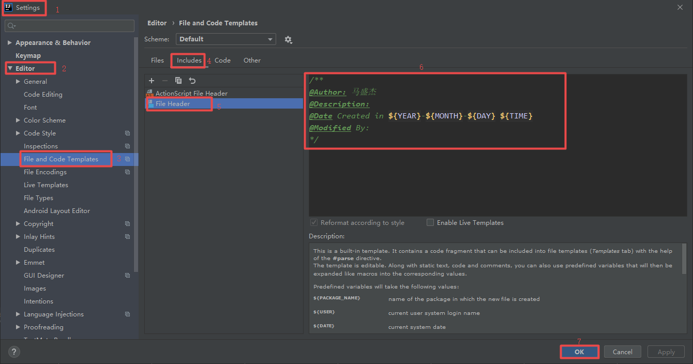

```
/**
@Author: 马盛杰
@Description:
@Date Created in ${YEAR}-${MONTH}-${DAY} ${TIME}
@Modified By:
*/
```

直接在右边的文件框里编辑你说需要注释的东西，然后应用保存之后,当你创建类的时候就会自动生成注释。

### 方法文档注释模板

效果：

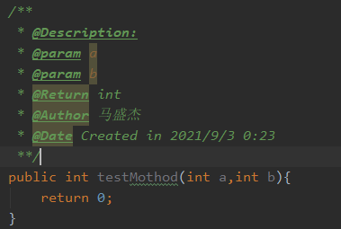

步骤：

Settings->Editor->Live Templates->点击右上角加号，选择Template Group，然后弹出一个窗口，起个文艺的名字，比如MyLiveTemplateGroup然后点击ok。

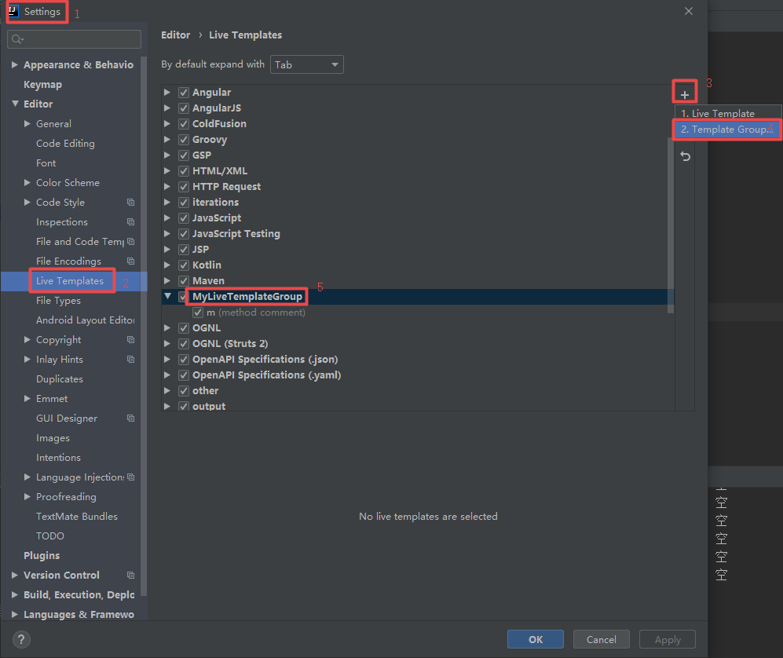

Settings->Editor->Live Templates这个路径下点击一下刚刚你添加的那个MyLiveTemplateGroup，然后点击右上角的加号，选择Live Template，按如下步骤进行配置：

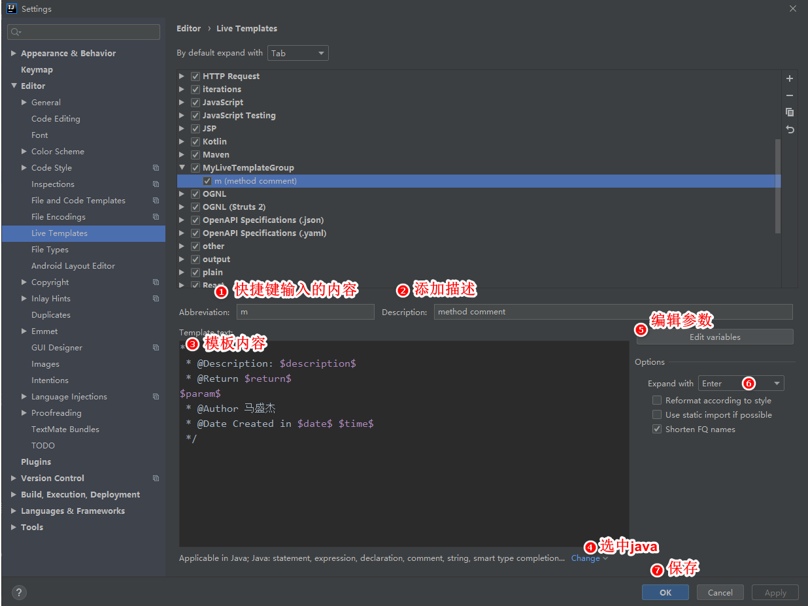

其中模板内容为，注意开头并没有`/`：

```
*
 * @Description: $description$
 * @Return $return$
$param$
 * @Author 马盛杰
 * @Date Created in $date$ $time$
 */
```

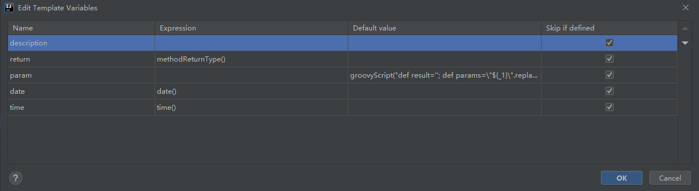

params的默认值为：

```
groovyScript("def result=''; def params=\"${_1}\".replaceAll('[\\\\[|\\\\]|\\\\s]', '').split(',').toList(); for(i = 0; i < params.size(); i++) {result+=' * @param ' + params[i] + ((i < params.size() - 1) ? '\\n':'')}; return result", methodParameters()) 
```

在方法前一行输入`/*m`并按回车键，就会出现我们所要的方法文档注释模板；如果想要默认的方法文档注释，在方法前一行输入`/**`并按回车键即可。

## 单元测试

1. 安装插件

Settings->Plugins->在输入框中输入JUnitGenerator V2.0，点击查询到的插件进行Install->重启IDEA

2. 配置插件

Settings->Other Settings->JUnit Generator->Properties页签->修改Output Path为`${SOURCEPATH}/test/${PACKAGE}/${FILENAME}`，修改 Default Template为`JUnit 4` 

3. 创建并配置测试目录

步骤：

右键项目new一个lib目录，将junit4的jar包拷贝到此目录

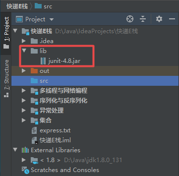

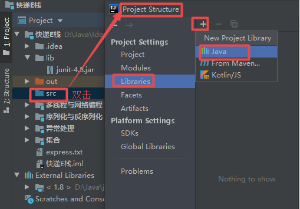

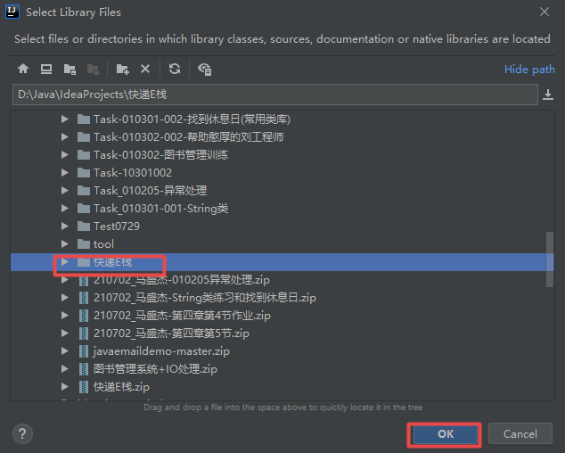

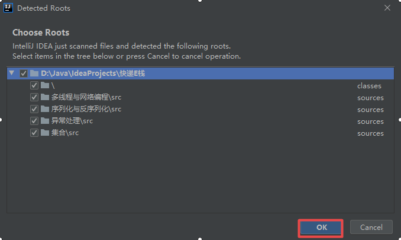

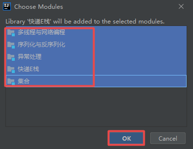


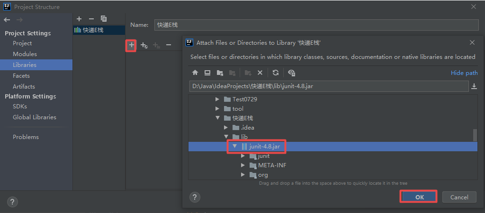

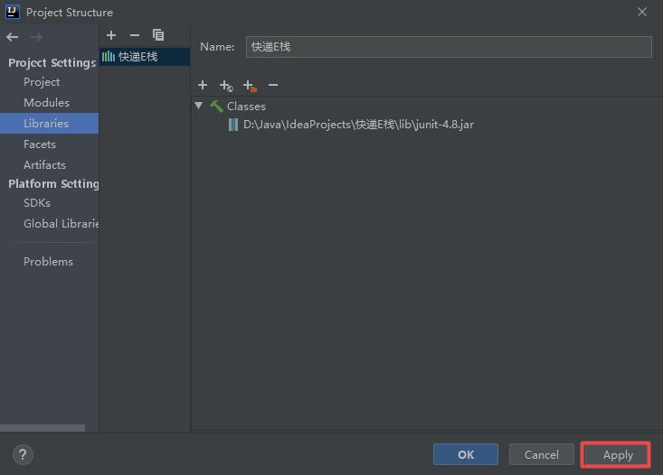

我们要测试多线程与网络编程模块中的部分方法，检查该Module的Dependencies是否含有刚刚配置的Library，没问题则点击OK进行保存。

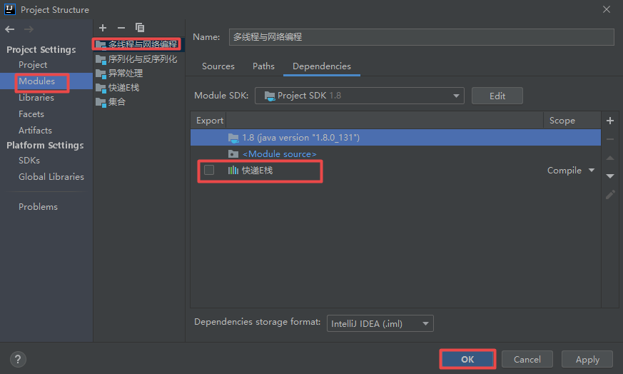

4. 自动生成JUnit 4测试类

进入需要进行单元测试的类，通过Ctrl+Shift+T创建测试类，勾选需要测试的方法（public修饰的方法），点击确定。

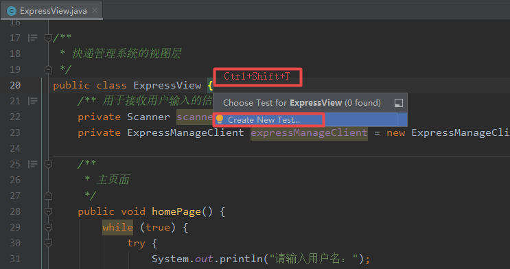

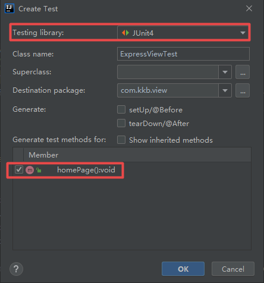

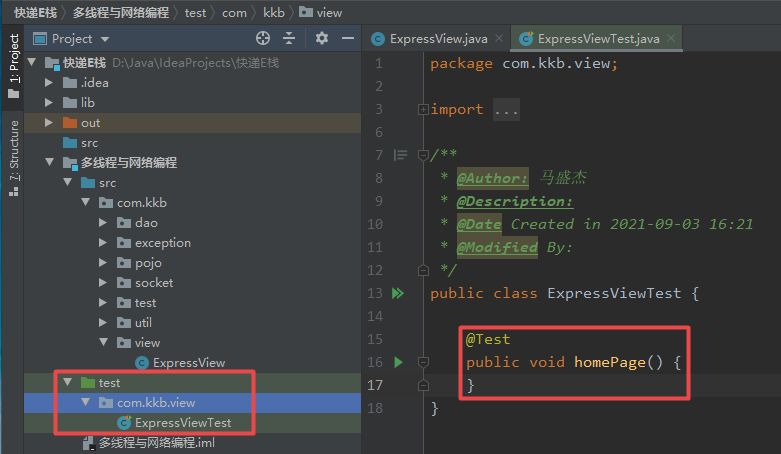

这样就自动生成了测试方法，可以在方法中编写测试逻辑。每个方法左侧会有一个向右的绿色三角形，点击该三角形即运行该测试方法，运行结果在下方窗口显示，绿色为通过，红色为未通过。

### Assert

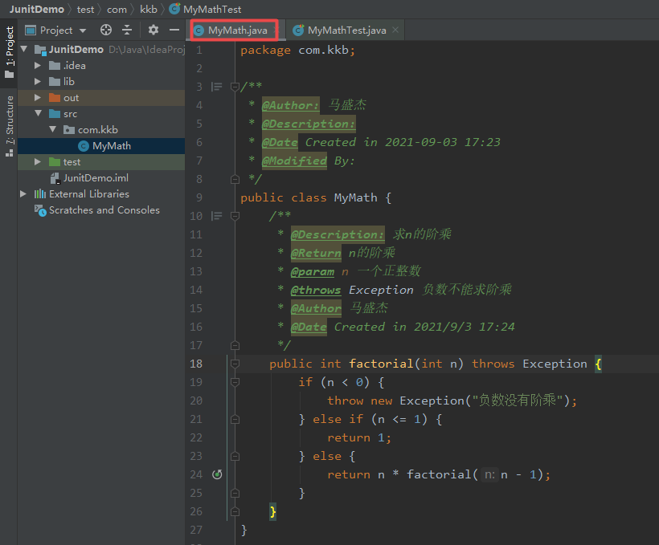

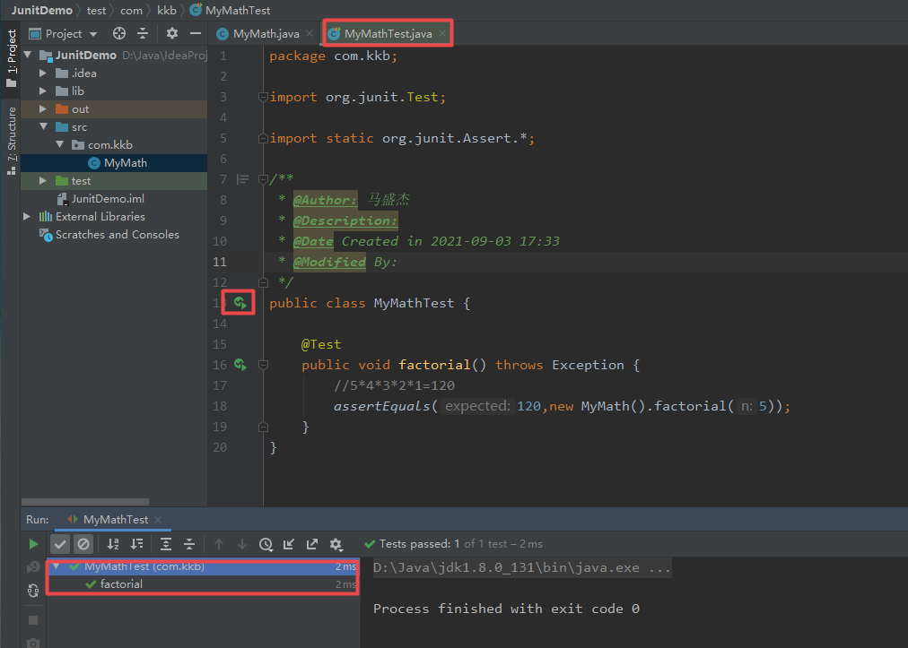

右下方绿色条说明测试通过，如果把120改为别的数那么就会测试不通过显示红色条。

### 执行顺序

JUnit 4利用JDK5的新特性Annotation，使用注解来定义测试规则。
 这里讲一下以下几个常用的注解：

- @Test：把一个方法标记为测试方法
- @Before：每一个测试方法执行前自动调用一次
- @After：每一个测试方法执行完自动调用一次
- @BeforeClass：所有测试方法执行前执行一次，在测试类还没有实例化就已经被加载，所以用static修饰
- @AfterClass：所有测试方法执行完执行一次，在测试类还没有实例化就已经被加载，所以用static修饰
- @Ignore：暂不执行该测试方法

我们来试验一下，我新建一个测试类AnnotationTest，然后每个注解都用了，其中有两个用@Test标记的方法分别是test1和test2，还有一个用@Ignore标记的方法test3。然后我还创建了一个构造方法，这个构造方法很重要一会儿会引出一个问题。

具体代码如下：

```java
import org.junit.*;

/**
 * @Author: 马盛杰
 * @Description: 测试执行顺序
 * @Date Created in 2021-09-03 17:54
 * @Modified By:
 */
public class AnnotationTest {
    public AnnotationTest() {
        System.out.println("构造方法");
    }

    @BeforeClass
    public static void setUpBeforeClass() {
        System.out.println("BeforeClass");
    }

    @AfterClass
    public static void tearDownAfterClass() {
        System.out.println("AfterClass");
    }

    @Before
    public void setUp() {
        System.out.println("Before");
    }

    @After
    public void tearDown() {
        System.out.println("After");
    }

    @Test
    public void test1() {
        System.out.println("test1");
    }

    @Test
    public void test2() {
        System.out.println("test2");
    }

    @Ignore
    public void test3() {
        System.out.println("test3");
    }
}
```

运行结果：

```
BeforeClass
构造方法
Before
test1
After
构造方法
Before
test2
After
AfterClass
```

分析一下：

很显然，每一个测试方法执行前都会运行构造方法和@Before标记的方法，测试结束后还会运行@After标记的方法。所有测试方法执行前后会执行一次@BeforeClass和@AfterClass标记的方法，它们是静态方法，只会执行一次，通常用来初始化和关闭资源。@Ignore标记的方法不会被执行。需要说明的是，JUnit 4为了保证每个测试方法都是单元测试，是独立互不影响的，所以每个测试方法执行前都会重新实例化测试类。

### @Test的属性

**expected：**


`expected = Exception.class`意味着这个测试方法会检查是否抛出Exception异常，如果抛出了Exception异常那么测试通过，没有抛出Exception异常则测试不通过。

**timeout：**
timeout用来测试一个方法能不能在规定的时间内完成。

回到MyMath类，创建一个数组排序的方法，用的是冒泡排序。

```java
    public void sort(int[] arr) {
        //冒泡排序
        for (int i = 0; i < arr.length - 1; i++) { //控制比较轮数
            for (int j = 0; j < arr.length - i - 1; j++) { //控制每轮的两两比较次数
                if (arr[j] > arr[j + 1]) {
                    int temp = arr[j];
                    arr[j] = arr[j + 1];
                    arr[j + 1] = temp;
                }
            }
        }
    }
```

在测试类中创建测试方法，随机生成一个长度为50000的数组然后测试排序所用的时间。timeout的值为2000，单位为毫秒，也就是说超出2秒将视为测试不通过。

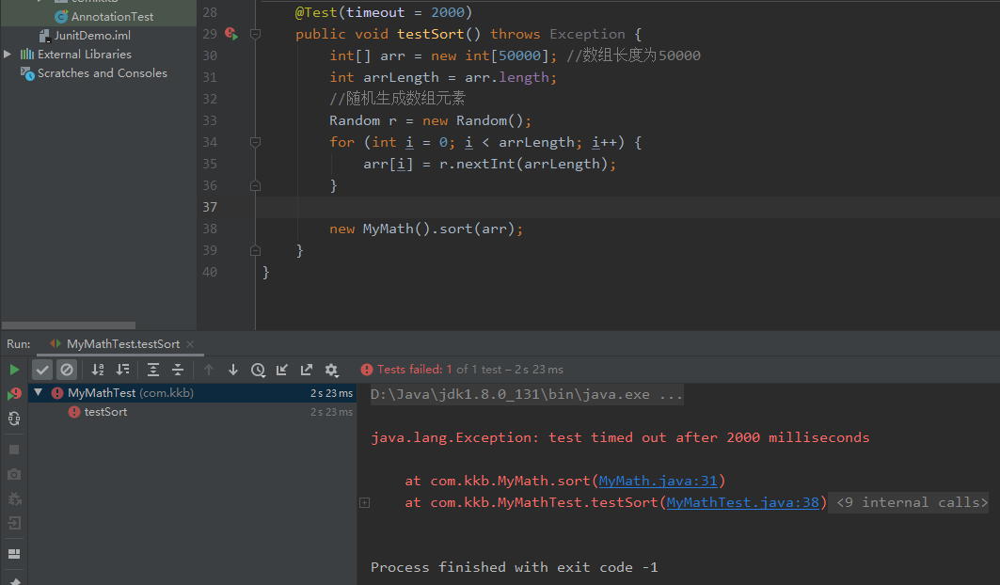

修改代码用快速排序提升性能：

```java
    public void sort(int[] arr) {
        //快速排序
        if (arr.length <= 1) {
            return;
        } else {
            partition(arr, 0, arr.length - 1);
        }

    }

    static void partition(int[] arr, int left, int right) {
        int i = left;
        int j = right;
        int pivotKey = arr[left]; //基准数

        while (i < j) {

            while (i < j && arr[j] >= pivotKey) {
                j--;
            }

            while (i < j && arr[i] <= pivotKey) {
                i++;
            }

            if (i < j) {
                int temp = arr[i];
                arr[i] = arr[j];
                arr[j] = temp;
            }
        }

        if (i != left) {
            arr[left] = arr[i];
            arr[i] = pivotKey;
        }

        if (i - left > 1) {
            partition(arr, left, i - 1);
        }

        if (right - j > 1) {
            partition(arr, j + 1, right);
        }

    }
```

在运行测试方法，绿色条出现了，测试通过妥妥的。

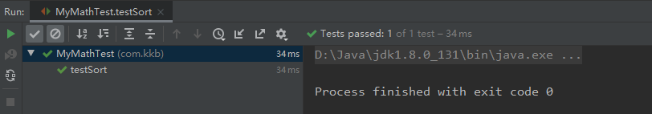

## Debug

在现在的开发中，我们经常采用Debug来追踪代码的运行流程，通常在程序运行过程中出现异常，启用Debug模式可以分析定位异常发生的位置，以及在运行过程中参数的变化。通常我们也可以启用Debug模式来追踪代码的运行流程去学习三方框架的源码。


第一组按钮，共8个按钮：


- Show Execution Point (Alt + F10)：如果你的光标在其它行或其它页面，点击这个按钮可跳转到当前代码执行的行。

- Step Over (F8)：步过，一行一行地往下走，如果这一行上有方法不会进入方法。

- Step Into (F7)：步入，如果当前行有方法，可以进入方法内部，一般用于进入自定义方法内，不会进入官方类库的方法。

- Force Step Into (Alt + Shift + F7)：强制步入，能进入任何方法，查看底层源码的时候可以用这个进入官方类库的方法。

- Step Out (Shift + F8)：步出，从步入的方法内退出到方法调用处，此时方法已执行完毕，只是还没有完成赋值。

- Drop Frame (默认无)：回退断点。

- Run to Cursor (Alt + F9)：运行到光标处，你可以将光标定位到你需要查看的那一行，然后使用这个功能，代码会运行至光标行，而不需要打断点。

- Evaluate Expression (Alt + F8)：计算表达式，这个表达式可以是一般变量或参数，也可以是方法，甚至可以改变变量的值。


第二组按钮，共7个按钮：


- Rerun 'xxx'： 重新运行程序，会关闭服务后重新启动程序。
- Rerun failed tests：重新运行出错的单元测试方法。
- Resume Program (F9)：恢复程序，运行到下一个断点处，如果后面已经没有断点了那么就运行完整个流程。 
- Stop 'xxx' (Ctrl + F2)：连续按两下，关闭程序。有时候你会发现关闭服务再启动时，报端口被占用，这是因为没完全关闭服务的原因，你就需要查杀所有JVM进程了。
- View Breakpoints (Ctrl + Shift + F8)：查看所有断点。
- Mute Breakpoints：哑的断点，选择这个后，所有断点变为灰色，断点失效，按F9则可以直接运行完程序。再次点击，断点变为红色，有效。如果只想使某一个断点失效，可以在断点上右键取消Enabled，则该行断点失效。

 ### 断点条件设置

 通过设置断点条件，在满足条件时，才停在断点处，否则直接运行。 

 在断点上右键直接设置当前断点的条件，如图，我设置i==10为true时断点才生效。 

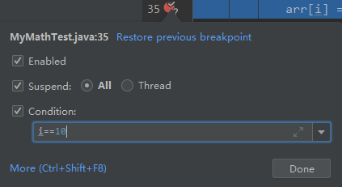

### 多线程调试

　　一般情况下我们调试的时候是在一个线程中的，一步一步往下走。但有时候你会发现在Debug的时候，想发起另外一个请求都无法进行了？

　　那是因为IDEA在Debug时默认阻塞级别是ALL，会阻塞其它线程，只有在当前调试线程走完时才会走其它线程。可以在View Breakpoints里选择Thread，然后点击Make Default设置为默认选项。

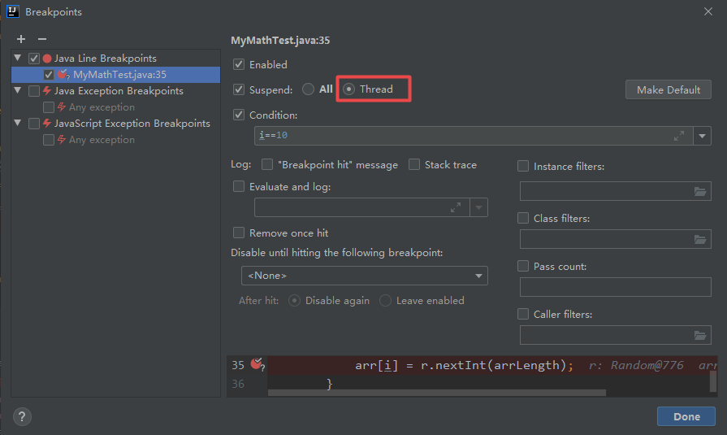

 切换线程，在Frames的下拉列表里，可以切换当前的线程，如下我这里有两个Debug的线程，切换另外一个则进入另一个Debug的线程。 

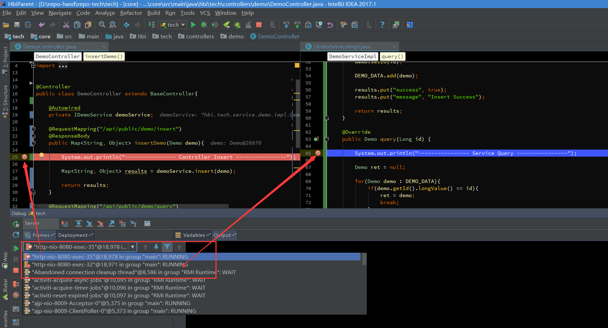 
