# Nginx简介

​		Nginx是一个高性能的HTTP和反向代理web服务器,同时也提供了IMAP/POP3/SMTP服务,在BSD-like协议下发行.Nginx是由伊戈尔·赛索耶夫为俄罗斯访问量第二的Rambler.ru站点开发的,公开版本1.19.6发布于2020年12月15日.

​		Nginx的特点是占用内存少,并发能力强,事实上nginx的并发能力在同类型的网页服务器中表现较好,中国大陆使用nginx网站用户有:百度、京东、新浪、网易、腾讯、淘宝等.官方测试Nginx能够支撑五万并发连接,并且cpu、内存等资源消耗却非常低,运行非常稳定.


​		**应用场景:**

- **http服务器**

  Nginx是一个http服务可以独立提供http服务,可以做网页静态服务器.

- **虚拟主机**

  可以实现一台服务器虚拟出多个网站.例如个人网站使用的虚拟主机.

- **反向代理,负载均衡**

  当网站的访问量达到一定程度后,单台服务器不能满足用户的请求时,需要用多台服务器集群,可以使用nginx做反向代理.并且多台服务器可以平均分摊负载,不会因为某台服务器负载高宕机而某台服务器闲置的情况.

# Nginx的安装

​		这里使用docker安装Nginx.

1. 搜索nginx镜像

   ```shell
   docker search nginx
   ```

2. 拉取nginx镜像

   ```shell
   docker pull nginx
   ```

3. 创建容器,设置端口映射、目录映射

   ```shell
   # 在/root⽬录下创建nginx⽬录⽤于存储nginx数据信息
   cd ~
   mkdir nginx
   cd nginx
   mkdir conf
   cd conf
   # 在~/nginx/conf/下创建nginx.conf⽂件,粘贴下⾯内容
   vim nginx.conf
   ```

   ```
   user nginx;
   worker_processes 1;
   
   error_log /var/log/nginx/error.log warn;
   pid /var/run/nginx.pid;
   
   events {
   	worker_connections 1024;
   }
   
   http {
       include /etc/nginx/mime.types;
       default_type application/octet-stream;
       log_format main '$remote_addr - $remote_user [$time_local] "$request" '
       '$status $body_bytes_sent "$http_referer" '
       '"$http_user_agent" "$http_x_forwarded_for"';
       access_log /var/log/nginx/access.log main;
       sendfile on;
       #tcp_nopush on;
       keepalive_timeout 65;
       #gzip on;
       include /etc/nginx/conf.d/*.conf;
   }
   ```

   ```shell
   cd ~/nginx
   mkdir conf.d
   # 在~/nginx/conf.d/下创建80.conf⽂件,粘贴下⾯内容
   vim 80.conf
   ```

   ```
   server {
   	listen 80; # 监听的端⼝
   	server_name localhost; # 域名或ip
   	location / { # 访问路径配置
   		root /usr/share/nginx/html;# 根目录
   		index index.html index.htm; # 默认首页
   	}
   	error_page 500 502 503 504 /50x.html; # 错误页面
   	location = /50x.html {
   		root html;
   	}
   }
   ```

   ```shell
   cd ~/nginx
   # 创建日志目录
   mkdir logs
   # 创建web资源目录
   mkdir html
   # 新建首页index.html
   vim index.html
   ```

   ```html
   <h1>hello docker nginx</h1>
   ```

   ```shell
   cd ~/nginx
   # 运行nginx的docker容器
   docker run -id --name=c_nginx \
   -p 80:80 \
   -v $PWD/conf/nginx.conf:/etc/nginx/nginx.conf \
   -v $PWD/conf.d:/etc/nginx/conf.d \
   -v $PWD/logs:/var/log/nginx \
   -v $PWD/html:/usr/share/nginx/html \
   nginx
   ```

4. 使用外部机器访问nginx

   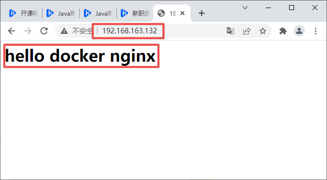

# Nginx静态网站部署

## 静态网站的部署

​		在Nginx安装测试过程中我们在html目录中新建了一个`index.html`并书写了部分内容,我们通过浏览器便可以访问首页了.同样的,要部署静态网站,只需要将静态资源拷贝到html目录下即可.

## 配置虚拟主机

​		虚拟主机,也叫"网站空间",就是把一台运行在互联网上的物理服务器划分成多个"虚拟"服务器.虚拟主机技术极大的促进了网络技术的应用和普及.同时虚拟主机的租用服务也成为了网络时代的一种新型经济形式.

### 端口绑定

1. 准备静态资源文件和目录

   ```shell
   cd ~/nginx
   mkdir index
   cd index
   # 准备index页面
   echo "<h1>index page ...</h1>" >> ~/nginx/index/index.html
   
   cd ~/nginx
   mkdir register
   cd register
   # 准备register页面
   echo "<h1>register page ...</h1>" >> ~/nginx/register/register.html
   ```

2. 新建nginx的配置文件`~/nginx/conf.d/port.conf`

   ```
   server {
       listen 81; # 监听的端口
       server_name localhost; # 域名或ip
       location / { # 访问路径配置
           root /usr/share/nginx/index;# 根目录
           index index.html index.htm; # 默认首页
   	}
       error_page 500 502 503 504 /50x.html; # 错误页面
       location = /50x.html {
       	root html;
       }
   }
   
   server {
       listen 82; # 监听的端口
       server_name localhost; # 域名或ip
       location / { # 访问路径配置
           root /usr/share/nginx/register;# 根目录
           index register.html; # 默认首页
       }
       error_page 500 502 503 504 /50x.html; # 错误页面
       location = /50x.html {
       	root html;
       }
   }
   ```

3. 启动容器,添加81和82端口的映射,并添加两个数据卷

   ```shell
   cd ~/nginx
   # 运行nginx的docker容器
   docker run -id --name=c_nginx \
   -p 80:80 \
   -p 81:81 \
   -p 82:82 \
   -v $PWD/conf/nginx.conf:/etc/nginx/nginx.conf \
   -v $PWD/conf.d:/etc/nginx/conf.d \
   -v $PWD/logs:/var/log/nginx \
   -v $PWD/html:/usr/share/nginx/html \
   -v $PWD/index:/usr/share/nginx/index \
   -v $PWD/register:/usr/share/nginx/register \
   nginx
   ```

4. 访问测试

   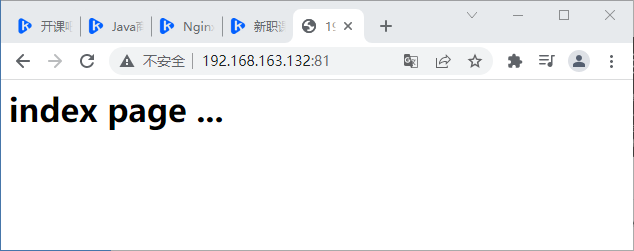

   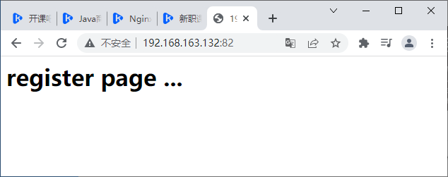

### 域名绑定

#### 域名简介

​		域名(Domain Name),是一串用"点"分隔的字符组成的Internet上的某一台计算机或计算机组的名称,用于在数据传输时标识计算机的电子方位.在DNS中注册的任何名称都是域名,域名用于各种网络环境和应用程序特定的命名和寻址目的.

##### 域名级别

1. 顶级域名

   顶级域名又分为两类:国家顶级域名和国际顶级域名

   **国家顶级域名(**national top-level domainnames,简称**nTLDs**),200多个国家都按照ISO3166国家代码分配了顶级域名,例如中国是cn,美国是us,日本是jp等

   **国际顶级域名**(international top-level domainnames,简称**iTLDs**),例如表示工商企业的`.com` `.top`,表示网络提供商的`.net`,表示非盈利组织的`.org`,表示教育的`.edu`,以及没有限制的中性域名如`.xyz`等.

   例如: ***baidu***.com(付费)

2. 二级域名

   二级域名(second-level domain,简称**SLD**),就是最靠近顶级域名左侧的字段.

   例如: ***map***.baidu.com(免费)

3. 三级域名

   三级域名就是最靠近二级域名左侧的字段.

   例如: ***item***.map.baidu.com


1. 设置域名与IP绑定

   ⼀个域名对应⼀个 ip 地址,⼀个 ip 地址可以被多个域名绑定.本地测试可以修改 hosts ⽂件`C:\Windows\System32\drivers\etc`,可以配置域名和 ip 的映射关系,如果 hosts ⽂件中配置了域名和 ip 的对应关系,不需要⾛dns 服务器.

   ```
   # nginx domain test
   192.168.163.132 www.xzk.com
   192.168.163.132 regist.xzk.com
   ```

2. 准备web资源文件,并新建domain.conf配置文件

   ```shell
   cd ~/nginx
   mkdir cart
   echo "<h1>cart page ...</h1>" >> cart/cart.html
   mkdir search
   echo "<h1>search page ...</h1>" >> search/search.html
   ```
   
   ```
   server {
       listen 80;
       server_name www.xzk.com;
       location / {
           root /usr/share/nginx/cart;
           index cart.html;
       }
   }
   server {
       listen 80;
       server_name regist.xzk.com;
       location / {
           root /usr/share/nginx/search;
           index search.html;
       }
   }
   ```

3. 运行docker容器

   ```
   docker run -id --name=c_nginx \
   -p 80:80 \
   -v $PWD/conf/nginx.conf:/etc/nginx/nginx.conf \
   -v $PWD/conf.d:/etc/nginx/conf.d \
   -v $PWD/logs:/var/log/nginx \
   -v $PWD/html:/usr/share/nginx/html \
   -v $PWD/cart:/usr/share/nginx/cart \
   -v $PWD/search:/usr/share/nginx/search \
   nginx
   ```

4. 访问测试

   通过ip访问:

   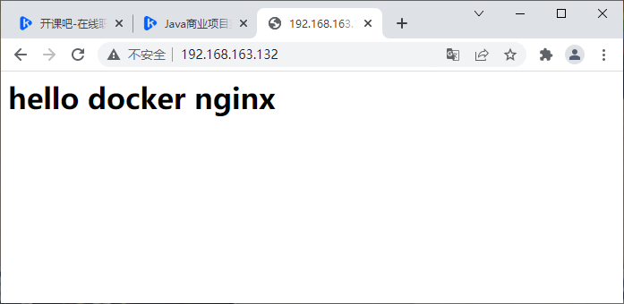

   访问www.xzk.com:

   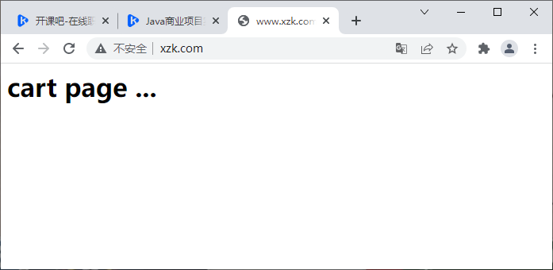

   访问[regist.xzk.com](http://regist.xzk.com):

   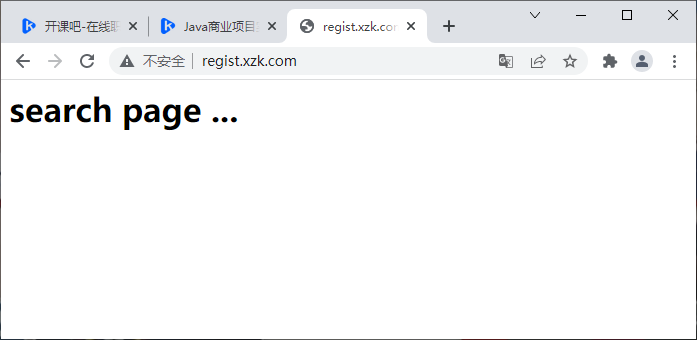

# Nginx反向代理与负载均衡

## 反向代理

​		反向代理(Reverse Proxy)方式是指以代理服务器来接受Internet上的连接请求,然后将请求转发给内部网络上的服务器,并将从服务器上得到的结果返回给Internet上请求连接的客户端,此时代理服务器对外表现为一个反向代理服务器.

​		正向代理(针对的是你的客户端):

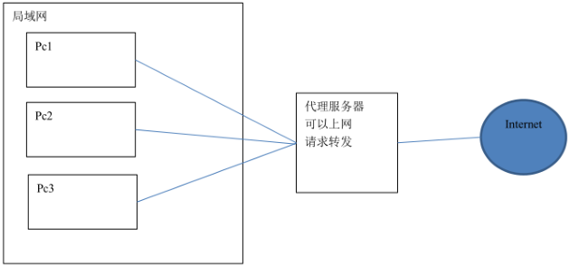

​		反向代理(针对的是服务器):

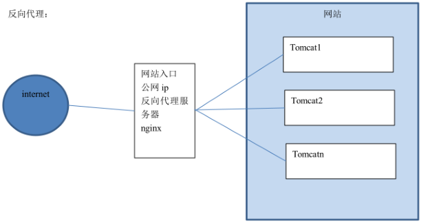

### 配置反向代理

1. 准备工作: 部署tomcat、配置www.kkb.com域名指向

   ```shell
   docker search tomcat
   docker pull tomcat
   cd ~
   mkdir tomcat
   # 配置容器中的8080端口映射到宿主机的8081端口
   docker run -id --name=c_tomcat \
   -p 8081:8080 \
   -v $PWD:/usr/local/tomcat/webapps \
   tomcat
   ```

   外部访问tomcat:

   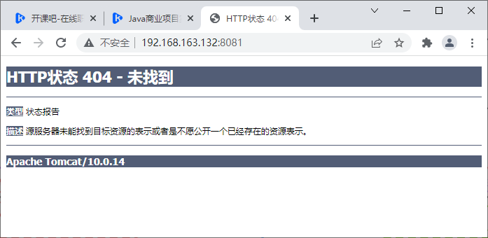

   ```
   # nginx proxy test
   192.168.163.132 www.kkb.com
   ```

2. 在~/nginx/conf.d目录下创建proxy.conf配置文件,用来配置反向代理

   ```
   upstream tomcat-kkb{
   	server 192.168.163.132:8081;
   }
   server {
       listen 80; # 监听的端口
       server_name www.kkb.com; # 域名或ip
       location / { # 访问路径配置
           # root index;# 根目录
           proxy_pass http://tomcat-kkb;
           index index.html index.htm; # 默认首页
       }
   }
   ```

3. 启动docker容器

   ```
   docker run -id --name=c_nginx \
   -p 80:80 \
   -v $PWD/conf/nginx.conf:/etc/nginx/nginx.conf \
   -v $PWD/conf.d:/etc/nginx/conf.d \
   -v $PWD/logs:/var/log/nginx \
   -v $PWD/html:/usr/share/nginx/html \
   nginx
   ```

4. 访问测试

   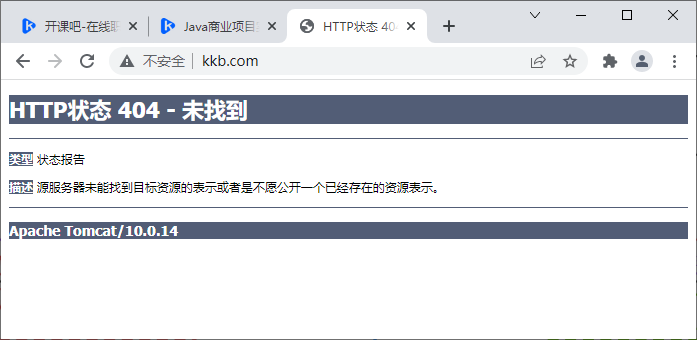

   其实根据上图说明我们已经配置成功了.为了更明显地体现,我们在tomcat的web资源目录下创建index.html再重新测试.

   ```shell
   cd ~/tomcat
   mkdir proxy
   echo "proxy 192.168.163.132:8081 to www.kkb.com:80" >> proxy/index.html
   ```

   不通过反向代理访问http://192.168.163.132:8081/proxy/index.html:

   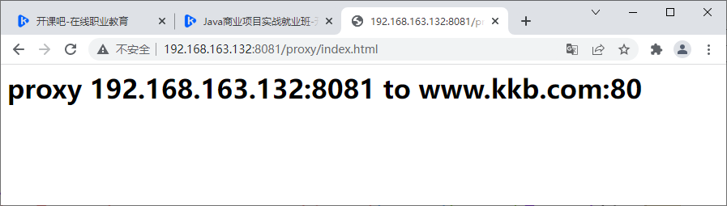

   通过反向代理访问http://www.kkb.com/proxy/index.html:

   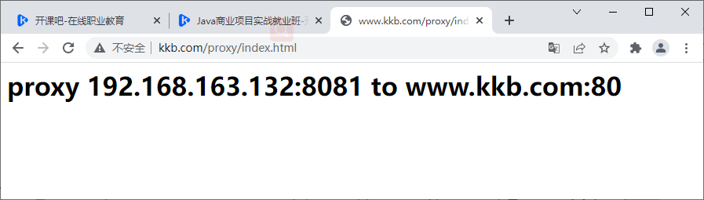

## 负载均衡

​		负载均衡(Load Balance),就是将请求分摊到多个操作单元上进行执行,建立在现有网络结构之上,提供了一种廉价有效透明的方法扩展网络设备和服务器的带宽、提升吞吐量、加强网络数据处理能力、提高网络的灵活性和可用性.

1. 准备工作: 部署3台tomcat、配置www.lb.com域名指向

   ```shell
   cd ~
   mkdir tomcat_lb
   # 创建3台tomcat的ROOT web资源目录 -p表示会创建父目录
   mkdir -p tomcat8091/ROOT
   mkdir -p tomcat8092/ROOT
   mkdir -p tomcat8093/ROOT
   # 准备3台tomcat服务器的index.html
   echo "<h1>tomcat8091 index.html</h1>" >> tomcat8091/ROOT/index.html
   echo "<h1>tomcat8092 index.html</h1>" >> tomcat8093/ROOT/index.html
   echo "<h1>tomcat8093 index.html</h1>" >> tomcat8093/ROOT/index.html
   ```

   启动tomcat的docker容器:

   ```shell
   docker run -id --name=c_tomcat1 \
   -p 8091:8080 \
   -v $PWD/tomcat8091:/usr/local/tomcat/webapps \
   tomcat
   
   docker run -id --name=c_tomcat2 \
   -p 8092:8080 \
   -v $PWD/tomcat8092:/usr/local/tomcat/webapps \
   tomcat
   
   docker run -id --name=c_tomcat3 \
   -p 8093:8080 \
   -v $PWD/tomcat8093:/usr/local/tomcat/webapps \
   tomcat
   ```

   配置域名www.lb.com指向:

   ```
   # nginx loadbalance test
   192.168.163.132 www.lb.com
   ```

2. 在nginx的配置文件目录中创建lb.conf

   ```
   upstream tomcat-lb{
   	server 192.168.163.132:8091;
   	server 192.168.163.132:8092;
   	server 192.168.163.132:8093;
   }
   server {
       listen 80; # 监听的端口
       server_name www.lb.com; # 域名或ip
       location / { # 访问路径配置
           # root index;# 根目录
           proxy_pass http://tomcat-lb;
           index index.html index.htm; # 默认首页
       }
   }
   ```

3. 启动nginx的docker容器

4. 访问测试

   访问www.lb.com:

   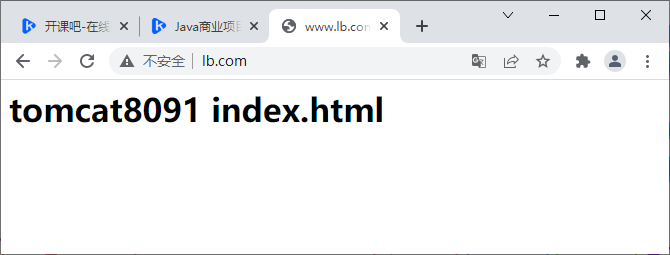

   

   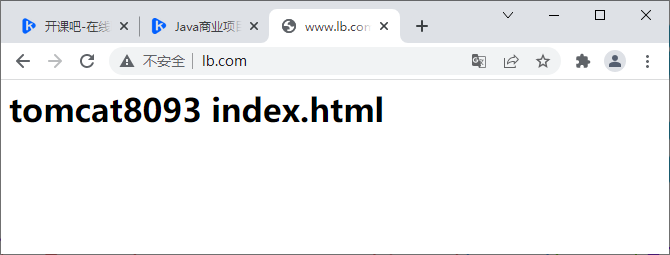

   不停的点击刷新,会发现这三个页面会轮流交替出现,出现的概率都是三分之一.

   如果其中一台tomcat服务器的性能比较好,想让其承担更多的压力,可以设置权重.比如想让第一台tomcat处理次数是其他服务器的两倍,可以设置为:

   ```
   upstream tomcat-lb{
   	server 192.168.163.132:8091 weight=2;
   	server 192.168.163.132:8092;
   	server 192.168.163.132:8093;
   }
   ```

