[TOC]


# MQ简介

​		MQ(Message Queue),消息队列,是在传输过程中保存信息的容器,多用于分布式系统之间进行通信.

​		应用之间的远程调用:

​		加入MQ后应用之间的调用: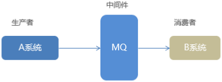

## MQ的优势

### 应用解耦

​		MQ相当于一个中介,生产方通过MQ与消费方交互,它将应用程序进行解耦合.

​		系统的耦合性越高,容错性就越低,可维护性就越低.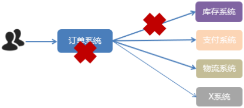

​		使用MQ使得应用间解耦,提升容错性和可维护性.


### 任务异步处理

​		将不需要同步处理的并且耗时的操作由消息队列通知消息接收方进行异步处理.提高了应用程序的响应时间.

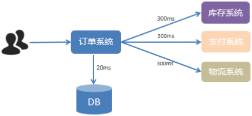

​		一个下单操作耗时: 20+300+300+300=920ms,用户点击完下单按钮后,需要等待920ms才能得到下单响应,太慢!

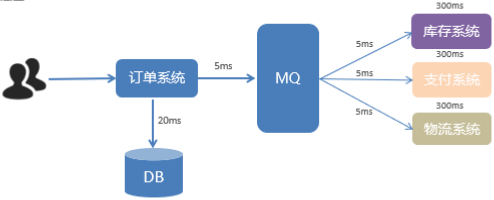

​		一个下单操作耗时:20+5=25ms,只需要25ms就能得到下单响应,提升了用户体验和系统吞吐量(单位时间内处理请求的数目).

### 削峰填谷

​		如订单系统,在下单的时候就会往数据库写数据.但是数据库只能支撑每秒1000左右的并发写入,并发量再高就容易宕机.低峰期的时候并发也就100多个,但是在高峰期时候,并发量会突然激增到5000以上,这个时候数据库肯定卡死了.

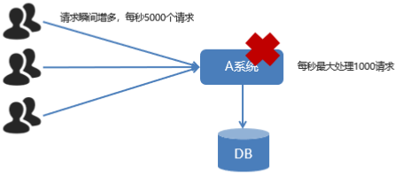

​		消息被MQ保存起来,然后系统就可以按照自己的消费能力来消费,比如每秒1000个消息,这样慢慢写入数据库,这样数据就不会卡死数据库了.


​		使用MQ之后,限制消费消息的速度为1000,但是这样一来,高峰期产生的数据势必会被积压在MQ中,高峰就被"削"掉了.但是因为消息积压,在高峰期过后的一段时间内,消费消息的速度还是会维持在1000QPS,直到消费完积压的信息,这就叫做"填谷".

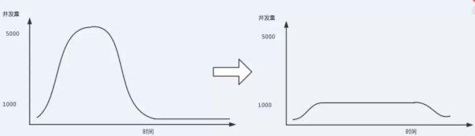

## MQ的劣势

- 系统可用性降低

  系统引入的外部依赖越多,系统稳定性越差.一旦MQ宕机,就会对业务造成影响.如何保证MQ的高可用?

- 系统复杂度提高

  MQ的加入大大增加了系统的复杂度,以前系统间是同步的远程调用,现在是通过MQ进行异步调用.如何保证信息没有被重复消费?怎么处理消息丢失情况?怎么保证消息传递的顺序性?

- 一致性问题

  A系统处理完业务,通过MQ给B、C、D三个系统发消息,如果B系统、C系统处理成功,但是D系统处理失败,如何保证消息数据处理的一致性?

## 常见的MQ产品

​		目前业界有很多的MQ产品,例如RabbitMQ、RocketMQ、ActiveMQ、Kafka、ZeroMQ、MetaMQ等,也有直接使用Redis充当消息队列的案例,而这些消息队列产品,各有侧重,在实际选型时,需要结合自身需求以及MQ产品特征,综合考虑.

|                | RabbitMQ                                                    | ActiveMQ                          | RocketMQ                  | Kafka                                       |
| -------------- | ----------------------------------------------------------- | --------------------------------- | ------------------------- | ------------------------------------------- |
| 公司/社区      | Rabbit                                                      | Apache                            | 阿里                      | Apache                                      |
| 开发语言       | Erlang                                                      | Java                              | Java                      | Scala&Java                                  |
| 协议支持       | **AMQP**,XMPP,SMTP,STOMP                                    | OpenWire,STOMP,REST,XMPP,AMQP     | 自定义                    | 自定义协议,社区封装了http协议支持           |
| 客户端支持语言 | 官方支持Erlang,Java,Ruby等,社区产出多种API,几乎支持所有语言 | java,c,c++,python,php,perl,.net等 | Java,C++(不成熟)          | 官方支持Java,社区产出多种API,如php,python等 |
| 单机吞吐量     | **万级(其次)**                                              | 万级(最差)                        | 十万级(最好)              | 十万级(次之)                                |
| 消息延迟       | **微秒级**                                                  | 毫秒级                            | 毫秒级                    | 毫秒以内                                    |
| 功能特性       | 并发能力强,性能极其好,延迟低,社区活跃,管理界面丰富          | 老牌产品,成熟度高,文档较多        | MQ功能比较完备,扩展性能佳 | 只支持主要的MQ功能,毕竟为大数据领域准备的   |

## AMQP与JMS

​		实现MQ大致有两种主流方式: AMQP、JMS.

### AMQP

​		AMQP(Advanced Message Queue Protocal),高级消息队列协议,是一个网络协议,是应用层协议的一个开发标准,为面向消息的中间件设计.基于此协议的客户端与消息中间件可传递消息,遵循此协议,不受客户端和中间件产品和开发语言限制.2006年,AMQP规范发布.类比HTTP.

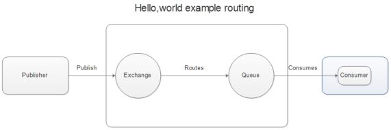

### JMS

​		JMS(JavaMessage Service),java消息服务应用程序接口,是一个Java平台中关于面向消息中间件的API.JMS是JavaEE规范中的一种,类比JDBC.

​		很多消息中间件都实现了JMS规范,例如:ActiveMQ.RabbitMQ官方没有提供JMS的实现包,但是开源社区有.

### AMQP与JMS区别

- JMS是定义了统一的接口,来对消息操作进行统一;AMQP是通过规定协议来统一数据交互的格式
- JMS限定了必须使用Java语言;AMQP只是协议,不规定实现方式,因此是跨语言的.
- JMS规定了两种消息模式;AMQP的消息模式更加丰富

# RabbitMQ简介

​		RabbitMQ官网:https://www.rabbitmq.com/

​		2007年,Rabbit 技术公司基于 AMQP 标准开发的 RabbitMQ 1.0 发布.RabbitMQ采用Erlang语言开发.Erlang语言专门为开发高并发和分布式系统的一种语言,在电信领域使用广泛.

​		RabbitMQ基础架构图:

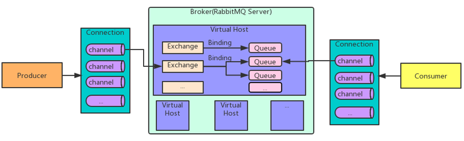

RabbitMQ中的相关概念:

- Broker: 接收和分发消息的应用,RabbitMQ Server就是Message Broker
- Virtual host: 出于多用户和安全因素设计的,把AMQP的基本组件划分到一个虚拟的分组中,类似于网络中的namespace概念.当多个不同的用户使用同一个RabbitMQ Server提供的服务时,可以划分出多个vhost,每个用户在自己的vhost创建exchange/queue等
- Connection: publisher/consumer和broker之间的TCP连接
- Channel: 如果每一次访问RabbitMQ都建立一个Connection,在消息量大的时候建立TCP Connection的开销将是巨大的,效率也较低.Channel是在connection内部建立的逻辑连接,如果应用程序支持多线程,通常每一个thread创建单独的channel进行通讯,AMQP method包含了channel id帮助客户端和message broker识别channel,所以channel之间是完全隔离的.Channel作为轻量级的Connection极大减少了操作系统建立TCP connection的开销.
- Exchange: message到达broker的第一站,根据分发规则,匹配查询表中的routing key,分发消息到queue中去.常用的类型有: direct(point-to-point)、topic(publish-subcsribe)和fanout(multicast)
- Queue: 消息最终被送到这里等待consumer取走
- Binding: exchange和queue之间的虚拟连接,binding中可以包含routing key.Binding信息被保存到exchange中的查询表中,用于message的分发数据.

RabbitMQ提供了6种模式:

- 简单模式
- 工作队列模式
- 发布与订阅模式
- 路由模式
- 主题模式
- RPC远程调用

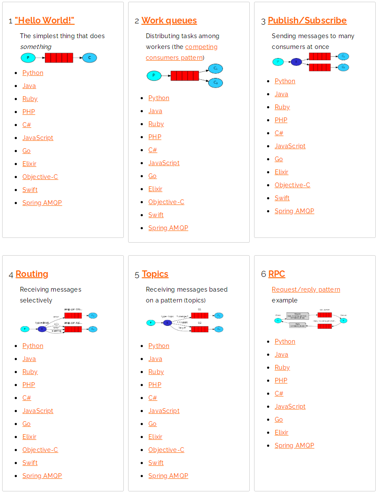

# RabbitMQ工作模式

## 简单模式

1. 添加依赖

```xml
        <dependency>
            <groupId>com.rabbitmq</groupId>
            <artifactId>amqp-client</artifactId>
            <version>5.6.0</version>
        </dependency>
```

2. 编写生产者与消费者行为

工具类:

```java
package com.xiaoma.rabbitmq.util;

import com.rabbitmq.client.Connection;
import com.rabbitmq.client.ConnectionFactory;

import java.io.IOException;
import java.util.concurrent.TimeoutException;

public class ConnectionUtil {
    private static ConnectionFactory connectionFactory;
    static {
        // 创建连接工厂
        connectionFactory = new ConnectionFactory();
        // 主机地址: 默认localhost
        connectionFactory.setHost("192.168.163.132");
        // 连接端口: 默认5672
        connectionFactory.setPort(5672);
        // 虚拟主机名称: 默认/
        connectionFactory.setVirtualHost("/xzk");
        // 连接用户名: 默认guest
        connectionFactory.setUsername("xiaoma");
        // 连接密码: 默认guest
        connectionFactory.setPassword("xiaoma");
    }

    public static Connection getConnection() throws IOException, TimeoutException {
        return connectionFactory.newConnection();
    }
}

```

生产者:

```java
package com.xiaoma.rabbitmq.simple;

import com.rabbitmq.client.Channel;
import com.rabbitmq.client.Connection;

import java.io.IOException;

public class Producer {
    private final static String QUEUE_NAME = "hello";

    public static void main(String[] args) {

        Connection connection = null;
        Channel channel = null;
        try {
            // 创建连接
            connection = ConnectionUtil.getConnection();
            // 创建频道
            channel = connection.createChannel();
            // 声明(创建)队列
            /**
             * 参数1：队列名称
             * 参数2：是否定义持久化队列
             * 参数3：是否独占本次连接
             * 参数4：是否在不使用的时候自动删除队列
             * 参数5：队列其它参数
             */
            channel.queueDeclare(QUEUE_NAME,true,false,false,null);
            // 要发送的消息
            String message = "Hello World!";
            /**
             * 参数1：交换机名称，如果没有指定则使用默认Default Exchage
             * 参数2：路由key,简单模式可以传递队列名称
             * 参数3：消息其它属性
             * 参数4：消息内容
             */
            channel.basicPublish("",QUEUE_NAME,null,message.getBytes());
        } catch (Exception e) {
            e.printStackTrace();
        } finally {
            // 关闭资源
            try {
                if (channel != null)
                    channel.close();
            } catch (Exception e) {
                e.printStackTrace();
            }
            try {
                if (connection != null)
                    connection.close();
            } catch (IOException e) {
                e.printStackTrace();
            }
        }
    }
}
```

消费者:

```java
package com.xiaoma.rabbitmq.simple;

import com.rabbitmq.client.*;

import java.io.IOException;

public class Consumer {
    private final static String QUEUE_NAME = "hello";

    public static void main(String[] args) {

        Connection connection = null;
        Channel channel = null;
        try {
            // 创建连接
            connection = ConnectionUtil.getConnection();
            // 创建频道
            channel = connection.createChannel();
            // 监听消息
            /**
             * 参数1：队列名称
             * 参数2：是否自动确认,设置为true为表示消息接收到自动向mq回复接收到了,mq接收到回复会删除消息,设置为false则需要手动确认
             * 参数3：消息接收到后回调
             */
            channel.basicConsume(QUEUE_NAME,true, new DefaultConsumer(channel){
                @Override
                /**
                 * consumerTag:消息者标签,在channel.basicConsume时候可以指定
                 * envelope:消息包的内容,可从中获取消息id,消息routingkey,交换机,消息和重传标志(收到消息失败后是否需要重新发送)
                 * properties:属性信息
                 * body:消息
                 */
                public void handleDelivery(String consumerTag, Envelope envelope, AMQP.BasicProperties properties, byte[] body) throws IOException {
                    //路由key
                    System.out.println("路由key为：" + envelope.getRoutingKey());
                    //交换机
                    System.out.println("交换机为：" + envelope.getExchange());
                    //消息id
                    System.out.println("消息id为：" + envelope.getDeliveryTag());
                    //收到的消息
                    System.out.println("接收到的消息为：" + new String(body, "utf-8"));
                }
            });
        } catch (Exception e) {
            e.printStackTrace();
        }
        // 不关闭资源,应该一直监听消息
    }
}
```

3. 测试

   依次启动生产者与消费者,查看消费者的控制台信息:

   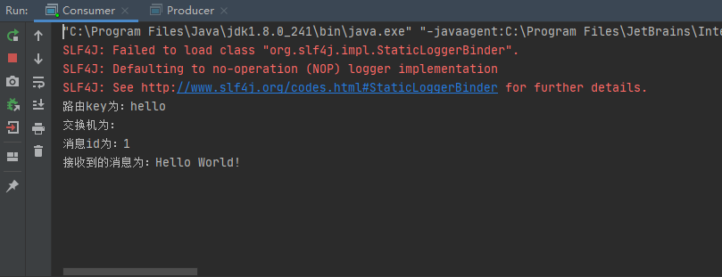

## 工作队列模式

应用场景:对于任务过重或任务较多情况使用工作队列可以提高任务处理的速度.

1. 生产者:

```java
package com.xiaoma.rabbitmq.work;

import com.rabbitmq.client.Channel;
import com.rabbitmq.client.Connection;
import com.xiaoma.rabbitmq.util.ConnectionUtil;

import java.io.IOException;

public class Producer {
    private final static String QUEUE_NAME = "work_queue";

    public static void main(String[] args) {
        Connection connection = null;
        Channel channel = null;
        try {
            // 创建连接
            connection = ConnectionUtil.getConnection();
            // 创建频道
            channel = connection.createChannel();
            /**
             * 创建队列
             * 参数1：队列名称
             * 参数2：是否定义持久化队列
             * 参数3：是否独占本次连接
             * 参数4：是否在不使用的时候自动删除队列
             * 参数5：队列其它参数
             */
            channel.queueDeclare(QUEUE_NAME,true,false,false,null);

            // 要发送的消息
            String message = "";
            for (int i = 0; i < 30; i++) {
                message = "message index: " + i;
                /**
                 * 参数1：交换机名称，如果没有指定则使用默认Default Exchage
                 * 参数2：路由key,简单模式可以传递队列名称
                 * 参数3：消息其它属性
                 * 参数4：消息内容
                 */
                channel.basicPublish("",QUEUE_NAME,null,message.getBytes());
            }

        } catch (Exception e) {
            e.printStackTrace();
        } finally {
            // 关闭资源
            try {
                if (channel != null)
                    channel.close();
            } catch (Exception e) {
                e.printStackTrace();
            }
            try {
                if (connection != null)
                    connection.close();
            } catch (IOException e) {
                e.printStackTrace();
            }
        }
    }
}
```

2. 两个消费者:

> 两个消费者都做了如下配置,使得处理完成一个消息之后才能再消费一个消息,如果消费者的执行效率越高,就会越多的去处理队列中的消息,显然Consumer1将会消费更多的消息.
>
> `channel.basicQos(1);`	一次只能接收并处理一个消息
>
> `channel.basicConsume(QUEUE_NAME,false, consumer);`	关闭了自动确认

```java
package com.xiaoma.rabbitmq.work;

import com.rabbitmq.client.*;
import com.xiaoma.rabbitmq.util.ConnectionUtil;

import java.io.IOException;

public class Consumer1 {
    private final static String QUEUE_NAME = "work_queue";

    public static void main(String[] args) {

        Connection connection = null;
        try {
            // 创建连接
            connection = ConnectionUtil.getConnection();
            // 创建频道
            Channel channel = connection.createChannel();
            channel.basicQos(1);
            DefaultConsumer consumer = new DefaultConsumer(channel){
                @Override
                /**
                 * consumerTag:消息者标签,在channel.basicConsume时候可以指定
                 * envelope:消息包的内容,可从中获取消息id,消息routingkey,交换机,消息和重传标志(收到消息失败后是否需要重新发送)
                 * properties:属性信息
                 * body:消息
                 */
                public void handleDelivery(String consumerTag, Envelope envelope, AMQP.BasicProperties properties, byte[] body) throws IOException {
                    //路由key
                    System.out.println("路由key为：" + envelope.getRoutingKey());
                    //交换机
                    System.out.println("交换机为：" + envelope.getExchange());
                    //消息id
                    System.out.println("消息id为：" + envelope.getDeliveryTag());
                    //收到的消息
                    System.out.println("接收到的消息为：" + new String(body, "utf-8"));
                    try {
                        Thread.sleep(100);
                    } catch (InterruptedException e) {
                        e.printStackTrace();
                    }
                    channel.basicAck(envelope.getDeliveryTag(),false);

                }
            };
            // 监听消息
            /**
             * 参数1：队列名称
             * 参数2：是否自动确认,设置为true为表示消息接收到自动向mq回复接收到了,mq接收到回复会删除消息,设置为false则需要手动确认
             * 参数3：消息接收到后回调
             */
            channel.basicConsume(QUEUE_NAME,false, consumer);
        } catch (Exception e) {
            e.printStackTrace();
        }
        // 不关闭资源,应该一直监听消息
    }
}
```

```java
package com.xiaoma.rabbitmq.work;

import com.rabbitmq.client.*;
import com.xiaoma.rabbitmq.util.ConnectionUtil;

import java.io.IOException;

public class Consumer2 {
    private final static String QUEUE_NAME = "work_queue";

    public static void main(String[] args) {

        Connection connection = null;
        try {
            // 创建连接
            connection = ConnectionUtil.getConnection();
            // 创建频道
            Channel channel = connection.createChannel();
            channel.basicQos(1);
            DefaultConsumer consumer = new DefaultConsumer(channel){
                @Override
                /**
                 * consumerTag:消息者标签,在channel.basicConsume时候可以指定
                 * envelope:消息包的内容,可从中获取消息id,消息routingkey,交换机,消息和重传标志(收到消息失败后是否需要重新发送)
                 * properties:属性信息
                 * body:消息
                 */
                public void handleDelivery(String consumerTag, Envelope envelope, AMQP.BasicProperties properties, byte[] body) throws IOException {
                    //路由key
                    System.out.println("路由key为：" + envelope.getRoutingKey());
                    //交换机
                    System.out.println("交换机为：" + envelope.getExchange());
                    //消息id
                    System.out.println("消息id为：" + envelope.getDeliveryTag());
                    //收到的消息
                    System.out.println("接收到的消息为：" + new String(body, "utf-8"));
                    try {
                        Thread.sleep(500);
                    } catch (InterruptedException e) {
                        e.printStackTrace();
                    }
                    channel.basicAck(envelope.getDeliveryTag(),false);

                }
            };
            // 监听消息
            /**
             * 参数1：队列名称
             * 参数2：是否自动确认,设置为true为表示消息接收到自动向mq回复接收到了,mq接收到回复会删除消息,设置为false则需要手动确认
             * 参数3：消息接收到后回调
             */
            channel.basicConsume(QUEUE_NAME,false, consumer);
        } catch (Exception e) {
            e.printStackTrace();
        }
        // 不关闭资源,应该一直监听消息
    }
}
```

经测试发现,两个消费者竞争消费同一个信息,处理性能越高的会更多地竞争到信息.

## 发布与订阅模式

> 订阅模式的说明:
>
> - 生产者: 不再是发送到队列中,而是发给交换机
>
> - 消费者: 每个消费者监听自己的队列
>
> - 消息队列: 接收消息、缓存消息
>
> - 交换机: 一方面接收生产者发送的消息.另一方面,转发消息给任务队列.到底如何操作,取决于交换机的类型
>
>   - fanout: 广播,将消息交给所有绑定到交换机的队列
>   - direct: 定向,把消息交给符合指定routing key的队列
>   - topic: 通配符,把消息交给符合routing pattern(路由模式)的队列
>
>   注意:交换机只负责转发消息,不具备存储消息的能力,因此如果没有任务队列与交换机绑定,或者没有符合路由规则的队列,那么消息会丢失!

1. 两个消费者监听两个队列

   ```java
   package com.xiaoma.rabbitmq.ps;
   
   import com.rabbitmq.client.*;
   import com.xiaoma.rabbitmq.util.ConnectionUtil;
   
   import java.io.IOException;
   
   public class Consumer1 {
       private final static String FANOUT_EXCHANGE = "fanout_exchange";
       private final static String QUEUE_NAME = "fanout_queue_1";
   
       public static void main(String[] args) {
           try {
               // 创建连接
               Connection connection = ConnectionUtil.getConnection();
               // 创建频道
               Channel channel = connection.createChannel();
               // 声明队列
               channel.queueDeclare(QUEUE_NAME, true, false, false, null);
               // 队列绑定交换机
               channel.queueBind(QUEUE_NAME,FANOUT_EXCHANGE,"");
   
               // 每次处理一个请求
               channel.basicQos(1);
               // 定义消费行为
               DefaultConsumer consumer = new DefaultConsumer(channel){
                   @Override
                   /**
                    * consumerTag:消息者标签,在channel.basicConsume时候可以指定
                    * envelope:消息包的内容,可从中获取消息id,消息routingkey,交换机,消息和重传标志(收到消息失败后是否需要重新发送)
                    * properties:属性信息
                    * body:消息
                    */
                   public void handleDelivery(String consumerTag, Envelope envelope, AMQP.BasicProperties properties, byte[] body) throws IOException {
                       //路由key
                       System.out.println("路由key为：" + envelope.getRoutingKey());
                       //交换机
                       System.out.println("交换机为：" + envelope.getExchange());
                       //消息id
                       System.out.println("消息id为：" + envelope.getDeliveryTag());
                       //收到的消息
                       System.out.println("接收到的消息为：" + new String(body, "utf-8"));
                       channel.basicAck(envelope.getDeliveryTag(),false);
                   }
               };
               // 监听消息
               /**
                * 参数1：队列名称
                * 参数2：是否自动确认,设置为true为表示消息接收到自动向mq回复接收到了,mq接收到回复会删除消息,设置为false则需要手动确认
                * 参数3：消息接收到后回调
                */
               channel.basicConsume(QUEUE_NAME,true, consumer);
           } catch (Exception e) {
               e.printStackTrace();
           }
           // 不关闭资源,应该一直监听消息
       }
   }
   ```

   ```java
   package com.xiaoma.rabbitmq.ps;
   
   import com.rabbitmq.client.*;
   import com.xiaoma.rabbitmq.util.ConnectionUtil;
   
   import java.io.IOException;
   
   public class Consumer2 {
       private final static String FANOUT_EXCHANGE = "fanout_exchange";
       private final static String QUEUE_NAME = "fanout_queue_2";
   
       public static void main(String[] args) {
           try {
               // 创建连接
               Connection connection = ConnectionUtil.getConnection();
               // 创建频道
               Channel channel = connection.createChannel();
               // 声明队列
               channel.queueDeclare(QUEUE_NAME, true, false, false, null);
               // 队列绑定交换机
               channel.queueBind(QUEUE_NAME,FANOUT_EXCHANGE,"");
   
               channel.basicQos(1);
               DefaultConsumer consumer = new DefaultConsumer(channel){
                   @Override
                   /**
                    * consumerTag:消息者标签,在channel.basicConsume时候可以指定
                    * envelope:消息包的内容,可从中获取消息id,消息routingkey,交换机,消息和重传标志(收到消息失败后是否需要重新发送)
                    * properties:属性信息
                    * body:消息
                    */
                   public void handleDelivery(String consumerTag, Envelope envelope, AMQP.BasicProperties properties, byte[] body) throws IOException {
                       //路由key
                       System.out.println("路由key为：" + envelope.getRoutingKey());
                       //交换机
                       System.out.println("交换机为：" + envelope.getExchange());
                       //消息id
                       System.out.println("消息id为：" + envelope.getDeliveryTag());
                       //收到的消息
                       System.out.println("接收到的消息为：" + new String(body, "utf-8"));
                       channel.basicAck(envelope.getDeliveryTag(),false);
                   }
               };
               // 监听消息
               /**
                * 参数1：队列名称
                * 参数2：是否自动确认,设置为true为表示消息接收到自动向mq回复接收到了,mq接收到回复会删除消息,设置为false则需要手动确认
                * 参数3：消息接收到后回调
                */
               channel.basicConsume(QUEUE_NAME,true, consumer);
           } catch (Exception e) {
               e.printStackTrace();
           }
           // 不关闭资源,应该一直监听消息
       }
   }
   ```

2. 生产者

   ```java
   package com.xiaoma.rabbitmq.ps;
   
   import com.rabbitmq.client.BuiltinExchangeType;
   import com.rabbitmq.client.Channel;
   import com.rabbitmq.client.Connection;
   import com.xiaoma.rabbitmq.util.ConnectionUtil;
   
   import java.io.IOException;
   
   public class Producer {
       private final static String FANOUT_EXCHANGE = "fanout_exchange";
   
       public static void main(String[] args) {
           Connection connection = null;
           Channel channel = null;
           try {
               // 创建连接
               connection = ConnectionUtil.getConnection();
               // 创建频道
               channel = connection.createChannel();
   
               /**
                * 声明(创建)交换机
                * 参数1：交换机名称
                * 参数2：交换机类型,fanout、topic、direct、headers
                */
               channel.exchangeDeclare(FANOUT_EXCHANGE, BuiltinExchangeType.FANOUT);
   
               // 要发送的消息
               String message = "";
               for (int i = 0; i < 10; i++) {
                   message = "发布订阅模式,message index: " + i;
                   /**
                    * 参数1：交换机名称，如果没有指定则使用默认Default Exchage
                    * 参数2：路由key,简单模式可以传递队列名称
                    * 参数3：消息其它属性
                    * 参数4：消息内容
                    */
                   channel.basicPublish(FANOUT_EXCHANGE,"",null,message.getBytes());
               }
           } catch (Exception e) {
               e.printStackTrace();
           } finally {
               // 关闭资源
               try {
                   if (channel != null)
                       channel.close();
               } catch (Exception e) {
                   e.printStackTrace();
               }
               try {
                   if (connection != null)
                       connection.close();
               } catch (IOException e) {
                   e.printStackTrace();
               }
           }
       }
   }
   ```

   经测试,Fanout类型交换机接收到的消息会**广播**给两个消息队列,这样监听这两个消息队列的消费者都接收并处理消息.

   > 发布订阅模式与工作队列模式的区别:
   >
   > - 工作队列模式不用定义交换机,而发布订阅模式需要定义交换机
   > - 发布订阅模式的生产方是面向交换机发送消息,工作队列模式的生产方是面向队列发送消息(底层使用默认交换机)
   > - 发布订阅模式需要设置队列和交换机的绑定,工作队列模式不需要设置,实际上工作队列模式会将队列绑定到默认的交换机

## 路由模式

> 路由模式说明:
>
> - 队列与交换机的绑定,不能是任意绑定的了,而是要指定一个`Routing Key`(路由)
> - 消息的发送方向交换机发送消息时,也必须指定消息的`Routing Key`
> - 交换机不再把消息交给每一个绑定的队列,而是根据消息的`Routing Key`进行判断,只有队列的`Routing Key`与消息的`Routing Key`完全一致时,才会接收到消息

1. 两个消费者监听两个队列,队列通过指定的`Routing Key`绑定到交换机

   ```java
   package com.xiaoma.rabbitmq.direct;
   
   import com.rabbitmq.client.*;
   import com.xiaoma.rabbitmq.util.ConnectionUtil;
   
   import java.io.IOException;
   
   public class Consumer1 {
       private final static String DIRECT_EXCHANGE = "direct_exchange";
       private final static String QUEUE_NAME = "direct_queue_insert";
       private final static String ROUTING_KEY = "insert";
   
       public static void main(String[] args) {
           try {
               // 创建连接
               Connection connection = ConnectionUtil.getConnection();
               // 创建频道
               Channel channel = connection.createChannel();
               // 创建交换机
               channel.exchangeDeclare(DIRECT_EXCHANGE,BuiltinExchangeType.DIRECT);
               // 创建队列
               channel.queueDeclare(QUEUE_NAME, true, false, false, null);
               // 队列绑定到交换机
               channel.queueBind(QUEUE_NAME,DIRECT_EXCHANGE,ROUTING_KEY);
   
               // 每次处理一个请求
               channel.basicQos(1);
               // 定义消费行为
               DefaultConsumer consumer = new DefaultConsumer(channel){
                   @Override
                   /**
                    * consumerTag:消息者标签,在channel.basicConsume时候可以指定
                    * envelope:消息包的内容,可从中获取消息id,消息routingkey,交换机,消息和重传标志(收到消息失败后是否需要重新发送)
                    * properties:属性信息
                    * body:消息
                    */
                   public void handleDelivery(String consumerTag, Envelope envelope, AMQP.BasicProperties properties, byte[] body) throws IOException {
                       //路由key
                       System.out.println("路由key为：" + envelope.getRoutingKey());
                       //交换机
                       System.out.println("交换机为：" + envelope.getExchange());
                       //消息id
                       System.out.println("消息id为：" + envelope.getDeliveryTag());
                       //收到的消息
                       System.out.println("接收到的消息为：" + new String(body, "utf-8"));
                       channel.basicAck(envelope.getDeliveryTag(),false);
                   }
               };
               // 监听消息
               /**
                * 参数1：队列名称
                * 参数2：是否自动确认,设置为true为表示消息接收到自动向mq回复接收到了,mq接收到回复会删除消息,设置为false则需要手动确认
                * 参数3：消息接收到后回调
                */
               channel.basicConsume(QUEUE_NAME,true, consumer);
           } catch (Exception e) {
               e.printStackTrace();
           }
           // 不关闭资源,应该一直监听消息
       }
   }
   ```

   ```java
   package com.xiaoma.rabbitmq.direct;
   
   import com.rabbitmq.client.*;
   import com.xiaoma.rabbitmq.util.ConnectionUtil;
   
   import java.io.IOException;
   
   public class Consumer2 {
       private final static String DIRECT_EXCHANGE = "direct_exchange";
       private final static String QUEUE_NAME = "direct_queue_update";
       private final static String ROUTING_KEY = "update";
   
       public static void main(String[] args) {
           try {
               // 创建连接
               Connection connection = ConnectionUtil.getConnection();
               // 创建频道
               Channel channel = connection.createChannel();
               // 创建交换机
               channel.exchangeDeclare(DIRECT_EXCHANGE, BuiltinExchangeType.DIRECT);
               // 创建队列
               channel.queueDeclare(QUEUE_NAME, true, false, false, null);
               // 队列绑定交换机
               channel.queueBind(QUEUE_NAME,DIRECT_EXCHANGE,ROUTING_KEY);
   
               channel.basicQos(1);
               DefaultConsumer consumer = new DefaultConsumer(channel){
                   @Override
                   /**
                    * consumerTag:消息者标签,在channel.basicConsume时候可以指定
                    * envelope:消息包的内容,可从中获取消息id,消息routingkey,交换机,消息和重传标志(收到消息失败后是否需要重新发送)
                    * properties:属性信息
                    * body:消息
                    */
                   public void handleDelivery(String consumerTag, Envelope envelope, AMQP.BasicProperties properties, byte[] body) throws IOException {
                       //路由key
                       System.out.println("路由key为：" + envelope.getRoutingKey());
                       //交换机
                       System.out.println("交换机为：" + envelope.getExchange());
                       //消息id
                       System.out.println("消息id为：" + envelope.getDeliveryTag());
                       //收到的消息
                       System.out.println("接收到的消息为：" + new String(body, "utf-8"));
                       channel.basicAck(envelope.getDeliveryTag(),false);
                   }
               };
               // 监听消息
               /**
                * 参数1：队列名称
                * 参数2：是否自动确认,设置为true为表示消息接收到自动向mq回复接收到了,mq接收到回复会删除消息,设置为false则需要手动确认
                * 参数3：消息接收到后回调
                */
               channel.basicConsume(QUEUE_NAME,true, consumer);
           } catch (Exception e) {
               e.printStackTrace();
           }
           // 不关闭资源,应该一直监听消息
       }
   }
   ```

2. 生产者

   ```java
   package com.xiaoma.rabbitmq.direct;
   
   import com.rabbitmq.client.BuiltinExchangeType;
   import com.rabbitmq.client.Channel;
   import com.rabbitmq.client.Connection;
   import com.xiaoma.rabbitmq.util.ConnectionUtil;
   
   import java.io.IOException;
   
   public class Producer {
       private final static String DIRECT_EXCHANGE = "direct_exchange";
       private final static String ROUTING_KEY_INSERT = "insert";
       private final static String ROUTING_KEY_UPDATE = "update";
   
       public static void main(String[] args) {
           Connection connection = null;
           Channel channel = null;
           try {
               // 创建连接
               connection = ConnectionUtil.getConnection();
               // 创建频道
               channel = connection.createChannel();
   
               /**
                * 声明(创建)交换机
                * 参数1：交换机名称
                * 参数2：交换机类型,fanout、topic、direct、headers
                */
               channel.exchangeDeclare(DIRECT_EXCHANGE, BuiltinExchangeType.DIRECT);
   
               // 要发送的消息
               String message = "";
               for (int i = 0; i < 12; i++) {
                   String routingKey = ROUTING_KEY_UPDATE;
                   if (i % 3 == 0){
                       routingKey = ROUTING_KEY_INSERT;
                   }
                   message = "路由模式-路由key: " + routingKey + ",message index: " + i;
                   /**
                    * 参数1：交换机名称，如果没有指定则使用默认Default Exchage
                    * 参数2：路由key,简单模式可以传递队列名称
                    * 参数3：消息其它属性
                    * 参数4：消息内容
                    */
                   channel.basicPublish(DIRECT_EXCHANGE,routingKey,null,message.getBytes());
               }
           } catch (Exception e) {
               e.printStackTrace();
           } finally {
               // 关闭资源
               try {
                   if (channel != null)
                       channel.close();
               } catch (Exception e) {
                   e.printStackTrace();
               }
               try {
                   if (connection != null)
                       connection.close();
               } catch (IOException e) {
                   e.printStackTrace();
               }
           }
       }
   }
   ```

   经测试,生产者将消息(标记了`Routing Key`)发送给路由类型交换机,消费者将队列(标记了`Routing Key`)绑定了交换机,交换机根据`Routing Key`将消息转发给对应`Routing Key`的队列.

## 通配符模式

> 通配符模式说明:
>
> 通配符模式与路由模式类似,都是可以根据`Routing Key`把消息路由到不同的队列,不过通配符类型交换机可以让队列在绑定`Routing Key`的时候使用通配符!
>
> `Routing Key`一般都是由一个或多个单词组成,多个单词之间以"."分隔,例如:`item.insert`
>
> 通配符规则:
>
> `#`:匹配一个或多个单词
>
> `*`:匹配不多不少恰好1个词

1. 两个消费者

   ```java
   package com.xiaoma.rabbitmq.topic;
   
   import com.rabbitmq.client.*;
   import com.xiaoma.rabbitmq.util.ConnectionUtil;
   
   import java.io.IOException;
   
   public class Consumer1 {
       private final static String TOPIC_EXCHANGE = "topic_exchange";
       private final static String QUEUE_NAME = "topic_queue_insert_update";
       private final static String ROUTING_KEY_INSERT = "item.insert";
       private final static String ROUTING_KEY_UPDATE = "item.update";
   
       public static void main(String[] args) {
           try {
               // 创建连接
               Connection connection = ConnectionUtil.getConnection();
               // 创建频道
               Channel channel = connection.createChannel();
               // 创建交换机
               channel.exchangeDeclare(TOPIC_EXCHANGE,BuiltinExchangeType.TOPIC);
               // 创建队列
               channel.queueDeclare(QUEUE_NAME, true, false, false, null);
               // 队列绑定到交换机
               channel.queueBind(QUEUE_NAME,TOPIC_EXCHANGE,ROUTING_KEY_INSERT);
               channel.queueBind(QUEUE_NAME,TOPIC_EXCHANGE,ROUTING_KEY_UPDATE);
   
               // 每次处理一个请求
               channel.basicQos(1);
               // 定义消费行为
               DefaultConsumer consumer = new DefaultConsumer(channel){
                   @Override
                   /**
                    * consumerTag:消息者标签,在channel.basicConsume时候可以指定
                    * envelope:消息包的内容,可从中获取消息id,消息routingkey,交换机,消息和重传标志(收到消息失败后是否需要重新发送)
                    * properties:属性信息
                    * body:消息
                    */
                   public void handleDelivery(String consumerTag, Envelope envelope, AMQP.BasicProperties properties, byte[] body) throws IOException {
                       //路由key
                       System.out.println("路由key为：" + envelope.getRoutingKey());
                       //交换机
                       System.out.println("交换机为：" + envelope.getExchange());
                       //消息id
                       System.out.println("消息id为：" + envelope.getDeliveryTag());
                       //收到的消息
                       System.out.println("接收到的消息为：" + new String(body, "utf-8"));
                       channel.basicAck(envelope.getDeliveryTag(),false);
                   }
               };
               // 监听消息
               /**
                * 参数1：队列名称
                * 参数2：是否自动确认,设置为true为表示消息接收到自动向mq回复接收到了,mq接收到回复会删除消息,设置为false则需要手动确认
                * 参数3：消息接收到后回调
                */
               channel.basicConsume(QUEUE_NAME,true, consumer);
           } catch (Exception e) {
               e.printStackTrace();
           }
           // 不关闭资源,应该一直监听消息
       }
   }
   ```

   ```java
   package com.xiaoma.rabbitmq.topic;
   
   import com.rabbitmq.client.*;
   import com.xiaoma.rabbitmq.util.ConnectionUtil;
   
   import java.io.IOException;
   
   public class Consumer2 {
       private final static String TOPIC_EXCHANGE = "topic_exchange";
       private final static String QUEUE_NAME = "topic_queue_all";
       private final static String ROUTING_KEY_ALL = "item.*";
   
       public static void main(String[] args) {
           try {
               // 创建连接
               Connection connection = ConnectionUtil.getConnection();
               // 创建频道
               Channel channel = connection.createChannel();
               // 创建交换机
               channel.exchangeDeclare(TOPIC_EXCHANGE, BuiltinExchangeType.TOPIC);
               // 创建队列
               channel.queueDeclare(QUEUE_NAME, true, false, false, null);
               // 队列绑定交换机
               channel.queueBind(QUEUE_NAME,TOPIC_EXCHANGE,ROUTING_KEY_ALL);
   
               channel.basicQos(1);
               DefaultConsumer consumer = new DefaultConsumer(channel){
                   @Override
                   /**
                    * consumerTag:消息者标签,在channel.basicConsume时候可以指定
                    * envelope:消息包的内容,可从中获取消息id,消息routingkey,交换机,消息和重传标志(收到消息失败后是否需要重新发送)
                    * properties:属性信息
                    * body:消息
                    */
                   public void handleDelivery(String consumerTag, Envelope envelope, AMQP.BasicProperties properties, byte[] body) throws IOException {
                       //路由key
                       System.out.println("路由key为：" + envelope.getRoutingKey());
                       //交换机
                       System.out.println("交换机为：" + envelope.getExchange());
                       //消息id
                       System.out.println("消息id为：" + envelope.getDeliveryTag());
                       //收到的消息
                       System.out.println("接收到的消息为：" + new String(body, "utf-8"));
                       channel.basicAck(envelope.getDeliveryTag(),false);
                   }
               };
               // 监听消息
               /**
                * 参数1：队列名称
                * 参数2：是否自动确认,设置为true为表示消息接收到自动向mq回复接收到了,mq接收到回复会删除消息,设置为false则需要手动确认
                * 参数3：消息接收到后回调
                */
               channel.basicConsume(QUEUE_NAME,true, consumer);
           } catch (Exception e) {
               e.printStackTrace();
           }
           // 不关闭资源,应该一直监听消息
       }
   }
   ```

2. 生产者

   ```java
   package com.xiaoma.rabbitmq.topic;
   
   import com.rabbitmq.client.BuiltinExchangeType;
   import com.rabbitmq.client.Channel;
   import com.rabbitmq.client.Connection;
   import com.xiaoma.rabbitmq.util.ConnectionUtil;
   
   import java.io.IOException;
   
   public class Producer {
       private final static String TOPIC_EXCHANGE = "topic_exchange";
       private final static String ROUTING_KEY_INSERT = "item.insert";
       private final static String ROUTING_KEY_UPDATE = "item.update";
       private final static String ROUTING_KEY_DELETE = "item.delete";
   
       public static void main(String[] args) {
           Connection connection = null;
           Channel channel = null;
           try {
               // 创建连接
               connection = ConnectionUtil.getConnection();
               // 创建频道
               channel = connection.createChannel();
   
               /**
                * 声明(创建)交换机
                * 参数1：交换机名称
                * 参数2：交换机类型,fanout、topic、direct、headers
                */
               channel.exchangeDeclare(TOPIC_EXCHANGE, BuiltinExchangeType.TOPIC);
   
               // 要发送的消息
               String message = "";
               for (int i = 0; i < 12; i++) {
                   String routingKey = ROUTING_KEY_DELETE;
                   if (i % 3 == 0){
                       routingKey = ROUTING_KEY_INSERT;
                   }else if (i % 3 == 1){
                       routingKey = ROUTING_KEY_UPDATE;
                   }
                   message = "路由模式-路由key: " + routingKey + ",message index: " + i;
                   /**
                    * 参数1：交换机名称，如果没有指定则使用默认Default Exchage
                    * 参数2：路由key,简单模式可以传递队列名称
                    * 参数3：消息其它属性
                    * 参数4：消息内容
                    */
                   channel.basicPublish(TOPIC_EXCHANGE,routingKey,null,message.getBytes());
               }
           } catch (Exception e) {
               e.printStackTrace();
           } finally {
               // 关闭资源
               try {
                   if (channel != null)
                       channel.close();
               } catch (Exception e) {
                   e.printStackTrace();
               }
               try {
                   if (connection != null)
                       connection.close();
               } catch (IOException e) {
                   e.printStackTrace();
               }
           }
       }
   }
   ```

## 模式总结

1. **简单模式 HelloWorld**: 一个生产者、一个消费者,不需要设置交换机(使用默认的交换机).
2. **工作队列模式 Work Queue**: 一个生产者、多个消费者(竞争关系),不需要设置交换机(使用默认
   的交换机).
3. **发布订阅模式 Publish/subscribe**: 需要设置类型为fanout的交换机,并且交换机和队列进行绑定,当发送消息到交换机后,交换机会将消息发送到绑定的队列.
4. **路由模式 Routing**: 需要设置类型为direct的交换机,交换机和队列进行绑定,并且指定`Routing Key`,当发送消息到交换机后,交换机会根据`Routing Key`将消息发送到对应的队列.
5. **通配符模式 Topic**: 需要设置类型为topic的交换机,交换机和队列进行绑定,并且指定通配符方式的`Routing Key`,当发送消息到交换机后,交换机会根据`Routing Key`将消息发送到对应的队列.

# Spring整合RabbitMQ

## 生产者工程

1. pom.xml

   ```xml
   <?xml version="1.0" encoding="UTF-8"?>
   <project xmlns="http://maven.apache.org/POM/4.0.0"
            xmlns:xsi="http://www.w3.org/2001/XMLSchema-instance"
            xsi:schemaLocation="http://maven.apache.org/POM/4.0.0 http://maven.apache.org/xsd/maven-4.0.0.xsd">
       <modelVersion>4.0.0</modelVersion>
   
       <groupId>com.xiaoma</groupId>
       <artifactId>spring-rabbit-producer</artifactId>
       <version>1.0-SNAPSHOT</version>
   
       <dependencies>
           <dependency>
               <groupId>org.springframework</groupId>
               <artifactId>spring-context</artifactId>
               <version>5.3.0</version>
           </dependency>
           <dependency>
               <groupId>junit</groupId>
               <artifactId>junit</artifactId>
               <version>4.12</version>
               <scope>test</scope>
           </dependency>
           <dependency>
               <groupId>org.springframework</groupId>
               <artifactId>spring-test</artifactId>
               <version>5.3.0</version>
           </dependency>
           <dependency>
               <groupId>org.springframework.amqp</groupId>
               <artifactId>spring-rabbit</artifactId>
               <version>2.3.13</version>
           </dependency>
       </dependencies>
   </project>
   ```

2. 配置文件

   **rabbitmq.properties**

   ```properties
   rabbitmq.host=192.168.163.132
   rabbitmq.port=5672
   rabbitmq.username=xiaoma
   rabbitmq.password=xiaoma
   rabbitmq.virtual-host=/xzk
   ```

   **spring-rabbitmq.properties**

   ```xml
   <?xml version="1.0" encoding="UTF-8"?>
   <beans xmlns="http://www.springframework.org/schema/beans"
          xmlns:xsi="http://www.w3.org/2001/XMLSchema-instance"
          xmlns:context="http://www.springframework.org/schema/context"
          xmlns:rabbit="http://www.springframework.org/schema/rabbit"
          xsi:schemaLocation="http://www.springframework.org/schema/beans
          http://www.springframework.org/schema/beans/spring-beans.xsd
          http://www.springframework.org/schema/context
          http://www.springframework.org/schema/context/spring-context.xsd
          http://www.springframework.org/schema/rabbit
          http://www.springframework.org/schema/rabbit/spring-rabbit.xsd">
       <!-- 加载配置文件 -->
       <context:property-placeholder location="classpath*:rabbitmq.properties"/>
       <!-- 开启注解扫描 -->
       <context:component-scan base-package="com.xiaoma.rabbitmq"></context:component-scan>
       <!-- 定义rabbitmq connectionFactory -->
       <rabbit:connection-factory id="connectionFactory"
                                  port="${rabbitmq.port}"
                                  host="${rabbitmq.host}"
                                  username="${rabbitmq.username}"
                                  password="${rabbitmq.password}"
                                  virtual-host="${rabbitmq.virtual-host}"/>
       <!-- 定义监听消息队列的容器 -->
       <rabbit:listener-container connection-factory="connectionFactory" auto-declare="true">
           <!-- 简单模式 -->
           <rabbit:listener ref="springQueueListener" queue-names="spring_queue"></rabbit:listener>
           <!-- 工作队列模式 -->
           <rabbit:listener ref="springWorkQueueListener1" queue-names="spring_work_queue"></rabbit:listener>
           <rabbit:listener ref="springWorkQueueListener2" queue-names="spring_work_queue"></rabbit:listener>
           <!-- 发布订阅模式 -->
           <rabbit:listener ref="springFanoutQueueListener1" queue-names="spring_fanout_queue1"></rabbit:listener>
           <rabbit:listener ref="springFanoutQueueListener2" queue-names="spring_fanout_queue2"></rabbit:listener>
           <!-- 路由模式 -->
           <rabbit:listener ref="springDirectQueueInsertListener" queue-names="spring_direct_queue_insert"></rabbit:listener>
           <rabbit:listener ref="springDirectQueueUpdateListener" queue-names="spring_direct_queue_update"></rabbit:listener>
           <!-- 通配符模式 -->
           <rabbit:listener ref="springTopicQueueAllListener" queue-names="spring_topic_queue_all"></rabbit:listener>
           <rabbit:listener ref="springTopicQueueInsertUpdateListener" queue-names="spring_topic_queue_insert_update"></rabbit:listener>
       </rabbit:listener-container>
   
   </beans>
   ```

3. 测试类(用来测试发送消息)

   ```java
   package com.xiaoma;
   
   import org.junit.Test;
   import org.junit.runner.RunWith;
   import org.springframework.amqp.rabbit.core.RabbitTemplate;
   import org.springframework.beans.factory.annotation.Autowired;
   import org.springframework.test.context.ContextConfiguration;
   import org.springframework.test.context.junit4.SpringJUnit4ClassRunner;
   
   import java.util.Random;
   
   @RunWith(SpringJUnit4ClassRunner.class)
   @ContextConfiguration(locations = {"classpath*:spring-rabbitmq.xml"})
   public class ProducerTest {
       @Autowired
       private RabbitTemplate rabbitTemplate;
   
       /**
        * 直发队列消息
        * 默认交换机类型为direct
        * 交换机的名称为空,路由键为队列的名称
        */
       @Test
       public void queueTest(){
           rabbitTemplate.convertAndSend("spring_queue","send spring_queue message" + new Random().nextInt(100));
       }
   
       /**
        * 直发队列消息
        * 默认交换机类型为direct
        * 交换机的名称为空,路由键为队列的名称
        */
       @Test
       public void workQueueTest(){
           for (int i = 0; i < 10; i++) {
               rabbitTemplate.convertAndSend("spring_work_queue","send spring_work_queue message" + i);
           }
       }
   
       /**
        * 发送广播
        * 交换机类型为fanout
        * 绑定到该交换机的所有队列都能够收到消息
        */
       @Test
       public void fanoutQueueTest(){
           for (int i = 0; i < 10; i++) {
               rabbitTemplate.convertAndSend("spring_fanout_exchange","","send spring_fanout_queue message" + i);
           }
       }
   
       /**
        * 根据路由匹配
        * 交换机类型为direct
        * 绑定到该交换机的精准匹配队列能够收到对应消息
        */
       @Test
       public void directQueueTest(){
           for (int i = 0; i < 10; i++) {
               if (i % 3 == 0) {
                   rabbitTemplate.convertAndSend("spring_direct_exchange","item.insert","send spring_direct_queue_insert message" + i);
                   continue;
               }
               rabbitTemplate.convertAndSend("spring_direct_exchange","item.update","send spring_direct_queue_update message" + i);
           }
       }
   
       /**
        * 根据路由通配匹配
        * 交换机类型为topic
        * 绑定到该交换机的通配匹配队列能够收到对应消息
        */
       @Test
       public void topicQueueTest(){
           for (int i = 0; i < 12; i++) {
               if (i % 3 == 0) {
                   rabbitTemplate.convertAndSend("spring_topic_exchange","item.insert","send message" + i);
                   continue;
               }else if (i % 3 == 1){
                   rabbitTemplate.convertAndSend("spring_topic_exchange","item.delete","send message" + i);
                   continue;
               }
               rabbitTemplate.convertAndSend("spring_topic_exchange","item.update","send message" + i);
           }
       }
   }
   ```

## 消费者工程

1. pom.xml

   ```xml
   <?xml version="1.0" encoding="UTF-8"?>
   <project xmlns="http://maven.apache.org/POM/4.0.0"
            xmlns:xsi="http://www.w3.org/2001/XMLSchema-instance"
            xsi:schemaLocation="http://maven.apache.org/POM/4.0.0 http://maven.apache.org/xsd/maven-4.0.0.xsd">
       <modelVersion>4.0.0</modelVersion>
   
       <groupId>com.xiaoma</groupId>
       <artifactId>spring-rabbit-consumer</artifactId>
       <version>1.0-SNAPSHOT</version>
   
       <dependencies>
           <dependency>
               <groupId>org.springframework</groupId>
               <artifactId>spring-context</artifactId>
               <version>5.3.0</version>
           </dependency>
           <dependency>
               <groupId>junit</groupId>
               <artifactId>junit</artifactId>
               <version>4.12</version>
               <scope>test</scope>
           </dependency>
           <dependency>
               <groupId>org.springframework</groupId>
               <artifactId>spring-test</artifactId>
               <version>5.3.0</version>
           </dependency>
           <dependency>
               <groupId>org.springframework.amqp</groupId>
               <artifactId>spring-rabbit</artifactId>
               <version>2.3.13</version>
           </dependency>
       </dependencies>
   
   </project>
   ```

2. 配置文件

   **rabbitmq.properties**

   ```properties
   rabbitmq.host=192.168.163.132
   rabbitmq.port=5672
   rabbitmq.username=xiaoma
   rabbitmq.password=xiaoma
   rabbitmq.virtual-host=/xzk
   ```

   **spring-rabbitmq.xml**

   ```xml
   <?xml version="1.0" encoding="UTF-8"?>
   <beans xmlns="http://www.springframework.org/schema/beans"
          xmlns:xsi="http://www.w3.org/2001/XMLSchema-instance"
          xmlns:context="http://www.springframework.org/schema/context"
          xmlns:rabbit="http://www.springframework.org/schema/rabbit"
          xsi:schemaLocation="http://www.springframework.org/schema/beans
          http://www.springframework.org/schema/beans/spring-beans.xsd
          http://www.springframework.org/schema/context
          http://www.springframework.org/schema/context/spring-context.xsd
          http://www.springframework.org/schema/rabbit
          http://www.springframework.org/schema/rabbit/spring-rabbit.xsd">
       <!-- 加载配置文件 -->
       <context:property-placeholder location="classpath*:rabbitmq.properties"/>
       <!-- 开启注解扫描 -->
       <context:component-scan base-package="com.xiaoma.rabbitmq"></context:component-scan>
       <!-- 定义rabbitmq connectionFactory -->
       <rabbit:connection-factory id="connectionFactory"
                                  port="${rabbitmq.port}"
                                  host="${rabbitmq.host}"
                                  username="${rabbitmq.username}"
                                  password="${rabbitmq.password}"
                                  virtual-host="${rabbitmq.virtual-host}"/>
       <!-- 定义监听消息队列的容器 -->
       <rabbit:listener-container connection-factory="connectionFactory" auto-declare="true">
           <!-- 简单模式 -->
           <rabbit:listener ref="springQueueListener" queue-names="spring_queue"></rabbit:listener>
           <!-- 工作队列模式 -->
           <rabbit:listener ref="springWorkQueueListener1" queue-names="spring_work_queue"></rabbit:listener>
           <rabbit:listener ref="springWorkQueueListener2" queue-names="spring_work_queue"></rabbit:listener>
           <!-- 发布订阅模式 -->
           <rabbit:listener ref="springFanoutQueueListener1" queue-names="spring_fanout_queue1"></rabbit:listener>
           <rabbit:listener ref="springFanoutQueueListener2" queue-names="spring_fanout_queue2"></rabbit:listener>
           <!-- 路由模式 -->
           <rabbit:listener ref="springDirectQueueInsertListener" queue-names="spring_direct_queue_insert"></rabbit:listener>
           <rabbit:listener ref="springDirectQueueUpdateListener" queue-names="spring_direct_queue_update"></rabbit:listener>
           <!-- 通配符模式 -->
           <rabbit:listener ref="springTopicQueueAllListener" queue-names="spring_topic_queue_all"></rabbit:listener>
           <rabbit:listener ref="springTopicQueueInsertUpdateListener" queue-names="spring_topic_queue_insert_update"></rabbit:listener>
       </rabbit:listener-container>
   
   </beans>
   ```

3. 工具类(定义了处理消息的通用行为)

   ```java
   package com.xiaoma.rabbitmq.util;
   
   import org.springframework.amqp.core.Message;
   
   import java.io.UnsupportedEncodingException;
   
   /**
    * 消息处理工具类,定义了通用的处理行为
    */
   public class MessageUtil {
       public static void handleMessage(Message message,String className) throws UnsupportedEncodingException {
           String msg = new String(message.getBody(), "utf-8");
           System.out.printf("------------%s:------------\n接收路由名称为：%s\n接收路由键名称为：%s\n消费队列(%s)接收到的消息：%s\n",
                   className,
                   message.getMessageProperties().getReceivedExchange(),
                   message.getMessageProperties().getReceivedRoutingKey(),
                   message.getMessageProperties().getConsumerQueue(),
                   msg);
       }
   }
   ```

4. 监听器

   **SpringQueueListener(简单模式监听器):**

   ```java
   package com.xiaoma.rabbitmq.listener;
   
   import com.xiaoma.rabbitmq.util.MessageUtil;
   import org.springframework.amqp.core.Message;
   import org.springframework.amqp.core.MessageListener;
   import org.springframework.stereotype.Component;
   
   @Component
   public class SpringQueueListener implements MessageListener {
       @Override
       public void onMessage(Message message) {
           try {
               MessageUtil.handleMessage(message,this.getClass().getSimpleName());
           } catch (Exception e) {
               e.printStackTrace();
           }
       }
   }
   ```

   **SpringWorkQueueListener1(工作队列监听器1):**

   ```java
   package com.xiaoma.rabbitmq.listener;
   
   import com.xiaoma.rabbitmq.util.MessageUtil;
   import org.springframework.amqp.core.Message;
   import org.springframework.amqp.core.MessageListener;
   import org.springframework.stereotype.Component;
   
   @Component
   public class SpringWorkQueueListener1 implements MessageListener {
       @Override
       public void onMessage(Message message) {
           try {
               MessageUtil.handleMessage(message,this.getClass().getSimpleName());
           } catch (Exception e) {
               e.printStackTrace();
           }
       }
   }
   ```

   **SpringWorkQueueListener2(工作队列监听器2):**

   ```java
   package com.xiaoma.rabbitmq.listener;
   
   import com.xiaoma.rabbitmq.util.MessageUtil;
   import org.springframework.amqp.core.Message;
   import org.springframework.amqp.core.MessageListener;
   import org.springframework.stereotype.Component;
   
   @Component
   public class SpringWorkQueueListener2 implements MessageListener {
       @Override
       public void onMessage(Message message) {
           try {
               MessageUtil.handleMessage(message,this.getClass().getSimpleName());
           } catch (Exception e) {
               e.printStackTrace();
           }
       }
   }
   ```

   ... ...

5. 测试类(启动Spring容器自动处理消息)

   ```java
   package com.xiaoma.rabbitmq;
   
   import org.junit.Test;
   import org.junit.runner.RunWith;
   import org.springframework.test.context.ContextConfiguration;
   import org.springframework.test.context.junit4.SpringJUnit4ClassRunner;
   
   @RunWith(SpringJUnit4ClassRunner.class)
   @ContextConfiguration(locations = {"classpath*:spring-rabbitmq.xml"})
   public class ConsumerTest {
   
       @Test
       public void testConsumer(){
           while(true){// 不停地处理消息
   
           }
       }
   }
   ```

# Spring Boot整合RabbitMQ

​		在Spring项目中,可以使用Spring-Rabbit去操作RabbitMQhttps://github.com/spring-projects/spring-amqp

​		在spring boot项目中只需要引入对应的amqp启动器依赖即可,方便的使用RabbitTemplate发送消息,使用注解接收消息.

> 开发过程:
>
> - 生产者工程:
>
>   1. application.yml文件配置RabbitMQ相关信息
>
>   2. 在生产者工程中编写配置类,用于创建交换机和队列,并进行绑定
>
>   3. 注入RabbitTemplate对象,通过RabbitTemplate对象发送消息到交换机
>
> - 消费者工程:
>
>   1. application.yml文件配置RabbitMQ相关信息
>   2. 创建消息处理类,用于接收队列中的消息并进行处理

## 生产者工程

1. pom.xml

   ```xml
   <?xml version="1.0" encoding="UTF-8"?>
   <project xmlns="http://maven.apache.org/POM/4.0.0" xmlns:xsi="http://www.w3.org/2001/XMLSchema-instance"
   	xsi:schemaLocation="http://maven.apache.org/POM/4.0.0 https://maven.apache.org/xsd/maven-4.0.0.xsd">
   	<modelVersion>4.0.0</modelVersion>
   	<parent>
   		<groupId>org.springframework.boot</groupId>
   		<artifactId>spring-boot-starter-parent</artifactId>
   		<version>2.5.8</version>
   		<relativePath/> <!-- lookup parent from repository -->
   	</parent>
   	<groupId>com.xiaoma</groupId>
   	<artifactId>springboot_rabbitmq_producer</artifactId>
   	<version>0.0.1-SNAPSHOT</version>
   	<name>springboot_rabbitmq_producer</name>
   	<description>Demo project for Spring Boot</description>
   	<properties>
   		<java.version>1.8</java.version>
   	</properties>
   	<dependencies>
   		<dependency>
   			<groupId>org.springframework.boot</groupId>
   			<artifactId>spring-boot-starter-amqp</artifactId>
   		</dependency>
   
   		<dependency>
   			<groupId>org.springframework.boot</groupId>
   			<artifactId>spring-boot-starter-test</artifactId>
   			<scope>test</scope>
   		</dependency>
   		<dependency>
   			<groupId>org.springframework.amqp</groupId>
   			<artifactId>spring-rabbit-test</artifactId>
   			<scope>test</scope>
   		</dependency>
   	</dependencies>
   
   	<build>
   		<plugins>
   			<plugin>
   				<groupId>org.springframework.boot</groupId>
   				<artifactId>spring-boot-maven-plugin</artifactId>
   			</plugin>
   		</plugins>
   	</build>
   
   </project>
   ```

2. application.yml

   ```yaml
   spring:
     rabbitmq:
       host: 192.168.163.132
       port: 5672
       username: xiaoma
       password: xiaoma
       virtual-host: /xzk
   ```

3. 启动类

   ```java
   package com.xiaoma;
   
   import org.springframework.boot.SpringApplication;
   import org.springframework.boot.autoconfigure.SpringBootApplication;
   
   @SpringBootApplication
   public class SpringbootRabbitmqProducerApplication {
   
   	public static void main(String[] args) {
   		SpringApplication.run(SpringbootRabbitmqProducerApplication.class, args);
   	}
   
   }
   ```

4. RabbitMQ配置类

   ```java
   package com.xiaoma.config;
   
   import org.springframework.amqp.core.*;
   import org.springframework.beans.factory.annotation.Qualifier;
   import org.springframework.context.annotation.Bean;
   import org.springframework.context.annotation.Configuration;
   
   @Configuration
   public class RabbitMQConfig {
       // 交换机名称
       private static final String ITEM_TOPIC_EXCHANGE = "springboot_item_topic_exchange";
       // 队列名称
       private static final String ITEM_QUEUE = "springboot_item_queue";
   
       // 声明交换机
       @Bean("itemTopicExchange")
       public Exchange topicExchange(){
           return ExchangeBuilder.topicExchange(ITEM_TOPIC_EXCHANGE).durable(true).build();
       }
   
       // 声明队列
       @Bean("itemQueue")
       public Queue itemQueue(){
           return QueueBuilder.durable(ITEM_QUEUE).build();
       }
   
       // 绑定队列和交换机
       @Bean
       public Binding itemQueueExchange(@Qualifier("itemTopicExchange") Exchange itemTopicExchange,
                                        @Qualifier("itemQueue") Queue itemQueue){
           return BindingBuilder.bind(itemQueue).to(itemTopicExchange).with("item.#").noargs();
       }
   }
   ```

5. 测试类(用来测试发送消息)

   ```java
   package com.xiaoma;
   
   import org.junit.jupiter.api.Test;
   import org.springframework.amqp.rabbit.core.RabbitTemplate;
   import org.springframework.beans.factory.annotation.Autowired;
   import org.springframework.boot.test.context.SpringBootTest;
   
   @SpringBootTest
   class SpringbootRabbitmqProducerApplicationTests {
   	@Autowired
   	private RabbitTemplate rabbitTemplate;
   
   	@Test
   	void contextLoads() {
   		rabbitTemplate.convertAndSend("springboot_item_topic_exchange",
   				"item.insert", "商品新增,routing key 为item.insert");
   		rabbitTemplate.convertAndSend("springboot_item_topic_exchange",
   				"item.update", "商品修改,routing key 为item.update");
   		rabbitTemplate.convertAndSend("springboot_item_topic_exchange",
   				"item.delete", "商品删除,routing key 为item.delete");
   	}
   
   }
   ```

## 消费者工程

1. pom.xml

   ```xml
   <?xml version="1.0" encoding="UTF-8"?>
   <project xmlns="http://maven.apache.org/POM/4.0.0" xmlns:xsi="http://www.w3.org/2001/XMLSchema-instance"
   	xsi:schemaLocation="http://maven.apache.org/POM/4.0.0 https://maven.apache.org/xsd/maven-4.0.0.xsd">
   	<modelVersion>4.0.0</modelVersion>
   	<parent>
   		<groupId>org.springframework.boot</groupId>
   		<artifactId>spring-boot-starter-parent</artifactId>
   		<version>2.5.8</version>
   		<relativePath/> <!-- lookup parent from repository -->
   	</parent>
   	<groupId>com.xiaoma</groupId>
   	<artifactId>springboot_rabbitmq_consumer</artifactId>
   	<version>0.0.1-SNAPSHOT</version>
   	<name>springboot_rabbitmq_consumer</name>
   	<description>Demo project for Spring Boot</description>
   	<properties>
   		<java.version>1.8</java.version>
   	</properties>
   	<dependencies>
   		<dependency>
   			<groupId>org.springframework.boot</groupId>
   			<artifactId>spring-boot-starter-amqp</artifactId>
   		</dependency>
   
   		<dependency>
   			<groupId>org.springframework.boot</groupId>
   			<artifactId>spring-boot-starter-test</artifactId>
   			<scope>test</scope>
   		</dependency>
   		<dependency>
   			<groupId>org.springframework.amqp</groupId>
   			<artifactId>spring-rabbit-test</artifactId>
   			<scope>test</scope>
   		</dependency>
   	</dependencies>
   
   	<build>
   		<plugins>
   			<plugin>
   				<groupId>org.springframework.boot</groupId>
   				<artifactId>spring-boot-maven-plugin</artifactId>
   			</plugin>
   		</plugins>
   	</build>
   
   </project>
   ```

2. application.yml

   ```yaml
   spring:
     rabbitmq:
       host: 192.168.163.132
       port: 5672
       username: xiaoma
       password: xiaoma
       virtual-host: /xzk
   ```

3. 启动类

   ```java
   package com.xiaoma;
   
   import org.springframework.boot.SpringApplication;
   import org.springframework.boot.autoconfigure.SpringBootApplication;
   
   @SpringBootApplication
   public class SpringbootRabbitmqConsumerApplication {
   
   	public static void main(String[] args) {
   		SpringApplication.run(SpringbootRabbitmqConsumerApplication.class, args);
   	}
   
   }
   ```

4. 消息监听处理类

   ```java
   package com.xiaoma.rabbitmq.listener;
   
   import org.springframework.amqp.rabbit.annotation.RabbitListener;
   import org.springframework.context.annotation.Configuration;
   
   @Configuration
   public class MyListener {
   
       // 监听消息队列springboot_item_queue
       @RabbitListener(queues = "springboot_item_queue")
       public void myListener1(String message){
           System.out.println("消费者接收到的消息为：" + message);
       }
   }
   ```

# 高级特性

## 消息的可靠性投递

​		在使用RabbitMQ的时候,作为消息发送方希望杜绝任何信息丢失或者投递失败场景.RabbitMQ为我们提供了两种方式用来控制消息的投递可靠性模式.

- confirm确认模式
- return退回模式

​		rabbitmq整个消息投递的路径为: producer->rabbitmq broker->exchange->queue->consumer

- 消息从producer到exchange则会返回一个confirmCallback
- 消息从exchange->queue投递失败则会返回一个returnCallback

### 确认模式

​		消息从producer到exchange会返回一个confirmCallback.发送消息时指定的exchange名称不存在,就会消息发送失败.

> 步骤:
>
> 1. 确认模式开启: connectionFactory中设置属性`publisher-confirms="true"`
> 2. 为rabbitTemplate设置confirmCallback回调函数

```xml
    <!-- 定义rabbitmq connectionFactory -->
	<!-- publisher-confirms="true",开启确认模式.之前spring整合rabbitmq的案例中的版本比较高,没有这个配置选项,我们将版本改为2.1.8.RELEASE -->
    <rabbit:connection-factory id="connectionFactory"
                               port="${rabbitmq.port}"
                               host="${rabbitmq.host}"
                               username="${rabbitmq.username}"
                               password="${rabbitmq.password}"
                               virtual-host="${rabbitmq.virtual-host}"
                               publisher-confirms="true"
    />
	
	<!-- 创建交换机test_confirm_queue,不定义的话向test_confirm_queue发送消息的时候会失败,回调方法接收到的ack为false -->
	<rabbit:queue id="test_confirm_queue" name="test_confirm_queue" auto-declare="true"/>
    <rabbit:direct-exchange name="test_confirm_exchange" auto-declare="true">
        <rabbit:bindings>
            <rabbit:binding queue="test_confirm_queue"></rabbit:binding>
        </rabbit:bindings>
    </rabbit:direct-exchange>
```

```java
	@Test
    public void testConfirm(){
        rabbitTemplate.setConfirmCallback(new RabbitTemplate.ConfirmCallback() {
            /**
             * @param correlationData 相关配置信息
             * @param ack exchange交换机,是否成功收到了消息.true表示成功,false表示失败
             * @param cause 失败原因
             */
            @Override
            public void confirm(CorrelationData correlationData, boolean ack, String cause) {
                System.out.println("confirm方法被执行了...");
                if (ack) {
                    System.out.println("消息发送成功!");
                } else {
                    System.out.println("消息发送失败:" + cause);
                    // 做一些处理,让消息再次发送
                }
            }
        });

        rabbitTemplate.convertAndSend("test_confirm_exchange","test_confirm_queue","message confirm ...");
    }
```

### 退回模式

​		消息从exchange->queue投递失败则会返回一个returnCallback,比如队列名称不存在

> 退回模式:当消息发送给Exchange后,Exchange路由到Queue失败时才会执行 returnCallback
>
> 步骤:
>
> 1. 开启退回模式: publisher-returns="true"(设置了会将消息返回给returnCallback回调函数,不设置的话会将消息丢弃)
> 2. 设置returnCallback回调函数
> 3. 设置exchange处理消息失败的模式:setMandatory(true)

```xml
	<!-- 定义rabbitmq connectionFactory -->
	<!-- 开启退回模式:publisher-returns="true" -->
    <rabbit:connection-factory id="connectionFactory"
                               port="${rabbitmq.port}"
                               host="${rabbitmq.host}"
                               username="${rabbitmq.username}"
                               password="${rabbitmq.password}"
                               virtual-host="${rabbitmq.virtual-host}"
                               publisher-confirms="true"
                               publisher-returns="true"
    />
```

```java
	@Test
    public void testReturn(){
        // 设置交换机处理失败消息的模式
        rabbitTemplate.setMandatory(true);

        // 设置ReturnCallBack
        rabbitTemplate.setReturnCallback(new RabbitTemplate.ReturnCallback() {
            /**
             *
             * @param message 消息对象
             * @param replyCode 错误码
             * @param replyText 错误信息
             * @param exchange 交换机
             * @param routingKey 路由键
             */
            @Override
            public void returnedMessage(Message message, int replyCode, String replyText, String exchange, String routingKey) {
                System.out.println("return执行了...");
                System.out.println("错误码:" + replyCode);
                System.out.println("错误信息:" + replyText);
                System.out.println("交换机名称:" + exchange);
                System.out.println("路由键:" + routingKey);
				// 处理
            }
        });
        rabbitTemplate.convertAndSend("test_confirm_exchange","test_confirm_queue","message confirm ...");
    }
```

## 消费端签收Ack

​		ack(Acknowledge),确认.表示消费端收到消息后的确认方式,有三种确认方式:

- 自动确认: acknowledge="none"

  当消息一旦被consumer接收到,则自动确认收到,并将相应message从rabbitmq的消息缓存中移除.

- 手动确认: acknowledge="manual"

  在实际业务处理中,很可能消息接收到,业务处理出现异常,那么该消息就会丢失.如果设置了手动确认方式,则需要在业务处理成功后,调用channel.basicAck(),手动签收.如果出现异常,则调用channel.basicNack(),让其自动重新发送消息.

- 根据异常情况确认: acknowledge="auto"(这种方式使用麻烦,不作讲解)

```xml
    <rabbit:listener-container connection-factory="connectionFactory" auto-declare="true" acknowledge="manual">
        ...
    </rabbit:listener-container>
```

```java
package com.xiaoma.rabbitmq.listener;

import com.rabbitmq.client.Channel;
import org.springframework.amqp.core.Message;
import org.springframework.amqp.rabbit.listener.api.ChannelAwareMessageListener;
import org.springframework.stereotype.Component;

/**
* Consumer ACK机制:
* 1. 设置手动签收:acknowledge="manual"
* 2. 让监听器类实现ChannelAwareMessageListener接口
* 3. 如果消息成功处理,则调用channel的 basicAck()签收
* 4. 如果消息处理失败,则调用channel的basicNack()拒绝签收,broker重新发送给consumer
*/
@Component
public class AckListener implements ChannelAwareMessageListener {
    @Override
    public void onMessage(Message message, Channel channel) throws Exception {
        long deliveryTag = message.getMessageProperties().getDeliveryTag();

        try {
            // 1.接收转换消息
            System.out.println(new String(message.getBody()));
            // 2.处理业务逻辑
            System.out.println("处理业务逻辑...");
            // 模拟出现异常
            int i = 1 / 0;
            // 3.手动签收
            channel.basicAck(deliveryTag,true);
        } catch (Exception e) {
            e.printStackTrace();
            // 4.拒绝签收
            /**
             * deliveryTag: the tag from the received
             * multiple: true表示拒绝所有消息包括delivery tag的消息; false表示仅拒绝delivery tag的消息
             * requeue: 如果被拒绝的消息应该重新排队而不是丢弃,则为 true
             */
            channel.basicNack(deliveryTag,true,true);
        }
    }
}
```

## 消费端限流

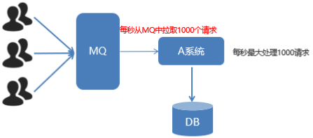

> Consumer限流机制
>
> 1. 确保ack机制为手动确认
>
> 2. listener-container配置属性perfetch
>
>    `perfetch = 1`表示消费端每次从mq拉取一条消息来消费,直到手动确认消费完毕后,才会继续拉去下一条消息

## TTL

​		TTL(Time To Live),消息过期时间设置.

> 管控台设置队列TTL

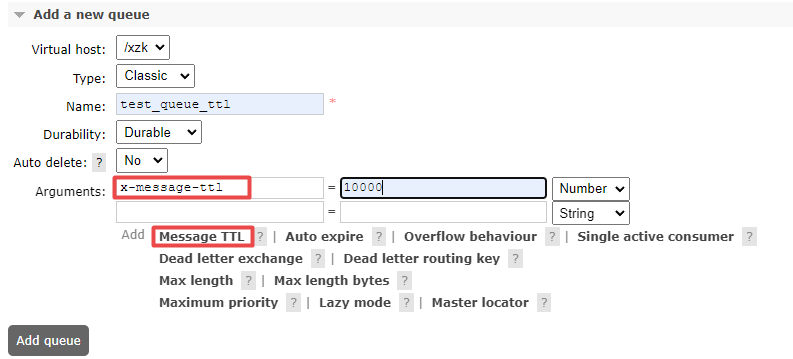

> 代码实现

```xml
    <rabbit:queue id="test_queue_ttl" name="test_queue_ttl" auto-declare="true">
        <rabbit:queue-arguments>
            <entry key="x-message-ttl" value="15000" value-type="java.lang.Integer"></entry>
        </rabbit:queue-arguments>
    </rabbit:queue>
    <rabbit:topic-exchange name="test_ttl_exchange" auto-declare="true">
        <rabbit:bindings>
            <rabbit:binding pattern="ttl.#" queue="test_queue_ttl"></rabbit:binding>
        </rabbit:bindings>
    </rabbit:topic-exchange>
```

```java
/**
     * TTL:过期时间
     * 1. 队列统一过期
     * 2. 消息单独过期
     * 如果设置了消息的过期时间,也设置了队列的过期时间,以时间短的为准.
     * 队列过期后,会将队列中所有消息全部移除
     * 消息过期后,只有消息在队列顶端,才会判断其是否过期(移除掉)
     */
    @Test
    public void testTTL(){
        for (int i = 0; i < 10; i++) {
            // 所有的消息的过期时间都是一样的
            rabbitTemplate.convertAndSend("test_ttl_exchange","ttl.hello","send message" + i);
        }
    }

    @Test
    public void testTTL2(){
        // 消息后处理对象,设置一些消息的参数信息
        MessagePostProcessor messagePostProcessor = new MessagePostProcessor() {
            @Override
            public Message postProcessMessage(Message message) throws AmqpException {
                // 1. 单独设置过期时间为5秒
                message.getMessageProperties().setExpiration("5000");
                // 2. 返回该消息
                return message;
            }
        };
        for (int i = 0; i < 10; i++) {
            if (i < 5) {
                rabbitTemplate.convertAndSend("test_ttl_exchange", "ttl.hello", "send message" + i, messagePostProcessor);
            }else {
                rabbitTemplate.convertAndSend("test_ttl_exchange","ttl.hello","send message" + i);
            }
        }
    }
```

## 死信队列DLX

​		死信队列(Dead Latter Exchange,DLX),死信交换机.档消息成为Dead Message后,可以重新发送到另一个交换机,这个交换机就是DLX.

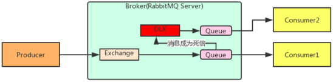

​		**消息成为死信的三种情况:**

1. 队列消息长度到达限制
2. 消费者拒接消费消息,basicNack/basicReject,并且不把消息重新放入原目标队列.requeue=false
3. 原队列存在消息过期设置,消息到达超时时间未被消费


​		**队列绑定死信交换机:**

​		给队列设置参数:  x-dead-letter-exchange 和 x-dead-letter-routing-key

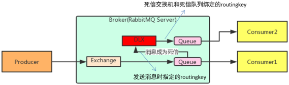

```xml
<!-- 声明正常队列test_queue_dlx和正常交换机test_exchange_dlx -->
    <rabbit:queue id="test_queue_dlx" name="test_queue_dlx" auto-declare="true">
        <rabbit:queue-arguments>
            <!-- 声明死信交换机名称 -->
            <entry key="x-dead-letter-exchange" value="exchange_dlx" value-type="java.lang.String"></entry>
            <!-- 声明发送给死信交换机的路由key -->
            <entry key="x-dead-letter-routing-key" value="dlx.test" value-type="java.lang.String"></entry>

            <!-- 声明队列的最大长度 -->
            <entry key="x-max-length" value="10" value-type="java.lang.Integer"></entry>

            <!-- 声明队列的过期时间 -->
            <entry key="x-message-ttl" value="10000" value-type="java.lang.Integer"></entry>
        </rabbit:queue-arguments>
    </rabbit:queue>
    <rabbit:topic-exchange name="test_exchange_dlx" auto-declare="true">
        <rabbit:bindings>
            <rabbit:binding pattern="test.dlx.#" queue="test_queue_dlx"></rabbit:binding>
        </rabbit:bindings>
    </rabbit:topic-exchange>

    <!-- 声明死信队列queue_dlx和死信交换机exchange_dlx -->
    <rabbit:queue id="queue_dlx" name="queue_dlx" auto-declare="true"></rabbit:queue>
    <rabbit:topic-exchange name="exchange_dlx" auto-declare="true">
        <rabbit:bindings>
            <rabbit:binding pattern="dlx.#" queue="queue_dlx"></rabbit:binding>
        </rabbit:bindings>
    </rabbit:topic-exchange>
```

```java
@Test
    public void testDLX(){
        // 测试超出长度限制的死信和TTL导致的死信
        for (int i = 0; i < 12; i++) {
            rabbitTemplate.convertAndSend("test_exchange_dlx","test.dlx.hello","send message" + i);
        }
    }
```

​		除了长度限制和TTL导致的死信,消费端拒绝消费也会导致死信.

消费端:

```java
<rabbit:listener-container connection-factory="connectionFactory" auto-declare="true" acknowledge="manual">
        <rabbit:listener ref="dlxListener" queue-names="test_queue_dlx"></rabbit:listener>
    </rabbit:listener-container>
```

```java
package com.xiaoma.rabbitmq.listener;

import com.rabbitmq.client.Channel;
import org.springframework.amqp.core.Message;
import org.springframework.amqp.rabbit.listener.api.ChannelAwareMessageListener;
import org.springframework.stereotype.Component;

@Component
public class DlxListener implements ChannelAwareMessageListener {
    @Override
    public void onMessage(Message message, Channel channel) throws Exception {
        long deliveryTag = message.getMessageProperties().getDeliveryTag();

        try {
            // 1.接收转换消息
            System.out.println(new String(message.getBody()));
            // 2.处理业务逻辑
            System.out.println("处理业务逻辑...");
            // 模拟出现异常
            if (new String(message.getBody()).endsWith("0")){// 模拟接收到send message0、send message10...就出现异常
                int i = 1 / 0;
            }
            // 3.手动签收
            channel.basicAck(deliveryTag,true);
        } catch (Exception e) {
            e.printStackTrace();
            // 4.拒绝签收
            /**
             * deliveryTag: the tag from the received
             * multiple: true表示拒绝所有消息包括delivery tag的消息; false表示仅拒绝delivery tag的消息
             * requeue: 如果被拒绝的消息应该重新排队而不是丢弃,则为 true
             */
            channel.basicNack(deliveryTag,true,false);
        }
    }
}
```

注意:`channel.basicNack(deliveryTag,true,false);`第三个参数要设置为false,表示不重新入队.

```java
@Test
    public void testDLXReject(){
        // 测试超出长度限制的死信和TTL导致的死信
        for (int i = 0; i < 2; i++) {
            rabbitTemplate.convertAndSend("test_exchange_dlx","test.dlx.hello","send message" + i);
        }
    }
```

## 延迟队列

​		延迟队列,即消息进入队列后不会立即被消费,只有到达指定的时候后,才会被消费.

> 需求:
>
> 1. 下单后,30分钟未支付,取消订单,回滚库存
> 2. 新用户注册成功7天后,发送短信问候
>
> 实现方式:
>
> 1. 定时器
> 2. 延迟队列
>
> 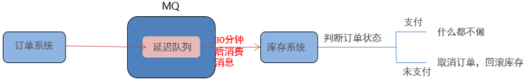
>
> 很可惜,在RabbitMQ中并未提供延迟队列功能,但是可以使用 `TTL+死信队列` 组合实现延迟队列的效果.
>
> 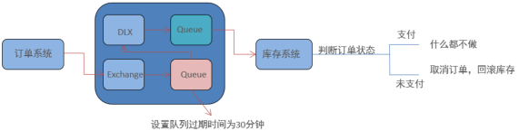

生产端:

```xml
    <rabbit:queue id="queue_order" name="queue_order" auto-declare="true">
        <rabbit:queue-arguments>
            <entry key="x-dead-letter-exchange" value="exchange_order_dlx" value-type="java.lang.String"></entry>
            <entry key="x-dead-letter-routing-key" value="dlx.order.cancel" value-type="java.lang.String"></entry>
            <entry key="x-message-ttl" value="15000" value-type="java.lang.Integer"></entry>
        </rabbit:queue-arguments>
    </rabbit:queue>
    <rabbit:topic-exchange name="exchange_order" auto-declare="true">
        <rabbit:bindings>
            <rabbit:binding pattern="order.#" queue="queue_order"></rabbit:binding>
        </rabbit:bindings>
    </rabbit:topic-exchange>

    <rabbit:queue id="queue_order_dlx" name="queue_order_dlx" auto-declare="true"></rabbit:queue>
    <rabbit:topic-exchange name="exchange_order_dlx" auto-declare="true">
        <rabbit:bindings>
            <rabbit:binding pattern="dlx.order.#" queue="queue_order_dlx"></rabbit:binding>
        </rabbit:bindings>
    </rabbit:topic-exchange>
```

```java
    @Test
    public void testDelay() throws InterruptedException {
        SimpleDateFormat simpleDateFormat = new SimpleDateFormat("yyyy-MM-dd hh:mm:ss");
        String msg = "[\"id\":1,\"time\":"+ simpleDateFormat.format(new Date()) +"]";
        rabbitTemplate.convertAndSend("exchange_order","order.msg",msg);
        for (int i = 15; i > 0; i--) {
            System.out.println(simpleDateFormat.format(new Date()));
            Thread.sleep(1000);
        }
    }
```

消费端:

```xml
    <rabbit:listener-container connection-factory="connectionFactory" auto-declare="true" acknowledge="manual">
        <rabbit:listener ref="delayListener" queue-names="queue_order_dlx"></rabbit:listener>
    </rabbit:listener-container>
```

```java
package com.xiaoma.rabbitmq.listener;

import com.rabbitmq.client.Channel;
import org.springframework.amqp.core.Message;
import org.springframework.amqp.rabbit.listener.api.ChannelAwareMessageListener;
import org.springframework.stereotype.Component;

import java.text.SimpleDateFormat;
import java.util.Date;

@Component
public class DelayListener implements ChannelAwareMessageListener {
    @Override
    public void onMessage(Message message, Channel channel) throws Exception {
        long deliveryTag = message.getMessageProperties().getDeliveryTag();

        try {
            // 1.接收转换消息
            System.out.println(new String(message.getBody()));
            // 2.处理业务逻辑
            System.out.println(new SimpleDateFormat("yyyy-MM-dd hh:mm:ss").format(new Date()));
            System.out.println("根据订单id查询其状态...");
            System.out.println("判断状态是否为支付成功");
            // 3.手动签收
            channel.basicAck(deliveryTag,true);
        } catch (Exception e) {
            e.printStackTrace();
            // 4.拒绝签收,不重回队列
            System.out.println("取消订单,回滚库存...");
            channel.basicNack(deliveryTag,true,false);
        }
    }
}
```

