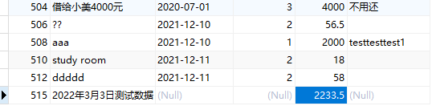
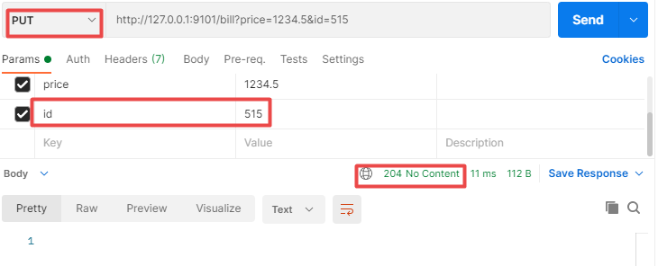
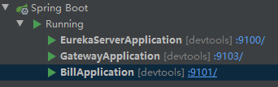
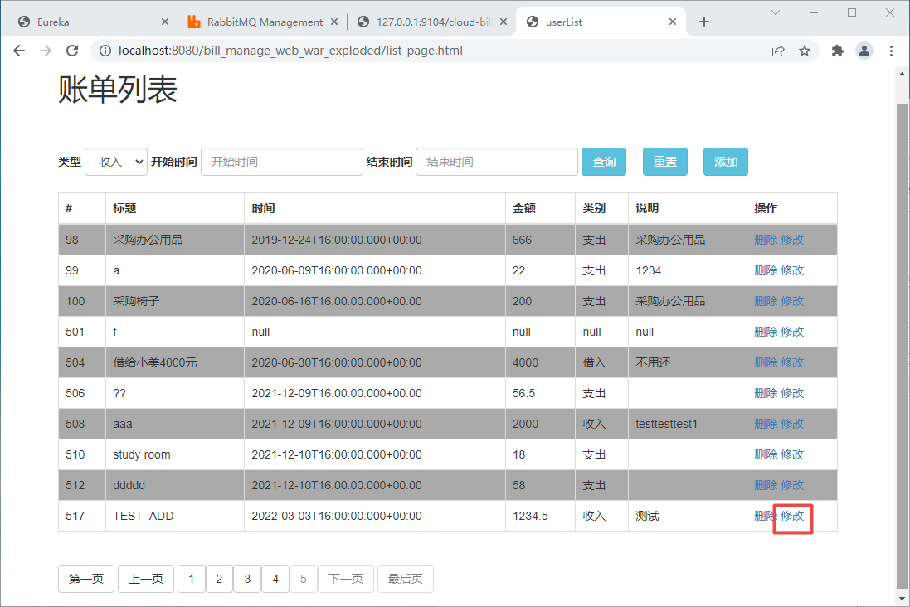

# Spring Cloud账单管理后端项目

## 项目搭建与准备

1. 准备数据库

   在Mysql8中创建数据库bill-manager,执行以下SQL脚本

```sql
/*
Navicat MySQL Data Transfer

Source Server         : link_mysql5.7_localhost
Source Server Version : 50728
Source Host           : localhost:3306
Source Database       : bill-manager

Target Server Type    : MYSQL
Target Server Version : 50728
File Encoding         : 65001

Date: 2021-12-11 12:08:18
*/

SET FOREIGN_KEY_CHECKS=0;

-- ----------------------------
-- Table structure for `bill_`
-- ----------------------------
DROP TABLE IF EXISTS `bill_`;
CREATE TABLE `bill_` (
  `id_` bigint(20) NOT NULL AUTO_INCREMENT,
  `title_` varchar(100) DEFAULT NULL,
  `bill_time_` date DEFAULT NULL,
  `type_id_` bigint(20) DEFAULT NULL,
  `price_` double(10,2) DEFAULT NULL,
  `explain_` varchar(100) DEFAULT NULL,
  PRIMARY KEY (`id_`),
  KEY `fk_type_bill` (`type_id_`),
  CONSTRAINT `fk_type_bill` FOREIGN KEY (`type_id_`) REFERENCES `bill_type_` (`id_`)
) ENGINE=InnoDB AUTO_INCREMENT=513 DEFAULT CHARSET=utf8;

-- ----------------------------
-- Records of bill_
-- ----------------------------
INSERT INTO `bill_` VALUES ('1', '???', '2021-12-10', '1', '1.23', 'abcd');
INSERT INTO `bill_` VALUES ('2', '饭补', '2017-06-27', '1', '2.23', 'b');
INSERT INTO `bill_` VALUES ('3', '出差费', '2017-06-28', '2', '33.00', 'c');
INSERT INTO `bill_` VALUES ('4', '奖金', '2017-06-29', '2', '44.00', 'd');
INSERT INTO `bill_` VALUES ('20', '1', '2018-10-18', '2', '1.00', null);
INSERT INTO `bill_` VALUES ('21', '采购办公用品2222', '2019-05-29', '3', '666.00', '888');
INSERT INTO `bill_` VALUES ('23', 'as', null, null, null, null);
INSERT INTO `bill_` VALUES ('24', 'f', null, null, null, null);
INSERT INTO `bill_` VALUES ('25', 'asdf', null, null, null, null);
INSERT INTO `bill_` VALUES ('26', 'as', null, null, null, null);
INSERT INTO `bill_` VALUES ('27', 'f', null, null, null, null);
INSERT INTO `bill_` VALUES ('28', 'asdf', null, null, null, null);
INSERT INTO `bill_` VALUES ('29', 'as', null, null, null, null);
INSERT INTO `bill_` VALUES ('30', 'df', null, null, null, null);
INSERT INTO `bill_` VALUES ('31', 'as', null, null, null, null);
INSERT INTO `bill_` VALUES ('32', 'r', null, null, null, null);
INSERT INTO `bill_` VALUES ('33', 'w', null, null, null, null);
INSERT INTO `bill_` VALUES ('34', 'a', null, null, null, null);
INSERT INTO `bill_` VALUES ('35', 'df', null, null, null, null);
INSERT INTO `bill_` VALUES ('36', 'aw', null, null, null, null);
INSERT INTO `bill_` VALUES ('37', 'er', null, null, null, null);
INSERT INTO `bill_` VALUES ('38', 'as', null, null, null, null);
INSERT INTO `bill_` VALUES ('39', 'df', null, null, null, null);
INSERT INTO `bill_` VALUES ('40', 'asd', null, null, null, null);
INSERT INTO `bill_` VALUES ('41', 'f', null, null, null, null);
INSERT INTO `bill_` VALUES ('42', 'wae', null, null, null, null);
INSERT INTO `bill_` VALUES ('43', 'asd', null, null, null, null);
INSERT INTO `bill_` VALUES ('44', 'as', null, null, null, null);
INSERT INTO `bill_` VALUES ('45', 'df', null, null, null, null);
INSERT INTO `bill_` VALUES ('46', 'as', null, null, null, null);
INSERT INTO `bill_` VALUES ('47', 'f', null, null, null, null);
INSERT INTO `bill_` VALUES ('48', 'w', null, null, null, null);
INSERT INTO `bill_` VALUES ('49', 'r', null, null, null, null);
INSERT INTO `bill_` VALUES ('50', 'asd', null, null, null, null);
INSERT INTO `bill_` VALUES ('92', 'abcdefg', '2019-05-22', '3', '666.00', '1234');
INSERT INTO `bill_` VALUES ('93', '采购办公用品', '2019-05-22', '4', '666.00', '采购办公用品');
INSERT INTO `bill_` VALUES ('94', '采购办公用品', '2019-05-22', '4', '666.00', '采购办公用品');
INSERT INTO `bill_` VALUES ('95', '采购办公用品', '2019-05-22', '3', '555.00', '222');
INSERT INTO `bill_` VALUES ('96', '采购办公用品', '2019-05-22', '2', '666.00', '采购办公用品');
INSERT INTO `bill_` VALUES ('97', '采购办公用品', '2019-05-22', '2', '222.00', '1234');
INSERT INTO `bill_` VALUES ('98', '采购办公用品', '2019-12-25', '2', '666.00', '采购办公用品');
INSERT INTO `bill_` VALUES ('99', 'a', '2020-06-10', '2', '22.00', '1234');
INSERT INTO `bill_` VALUES ('100', '采购椅子', '2020-06-17', '2', '200.00', '采购办公用品');
INSERT INTO `bill_` VALUES ('501', 'f', null, null, null, null);
INSERT INTO `bill_` VALUES ('504', '借给小美4000元', '2020-07-01', '3', '4000.00', '不用还');
INSERT INTO `bill_` VALUES ('506', '??', '2021-12-10', '2', '56.50', '');
INSERT INTO `bill_` VALUES ('508', 'aaa', '2021-12-10', '1', '2000.00', 'testtesttest1');
INSERT INTO `bill_` VALUES ('510', 'study room', '2021-12-11', '2', '18.00', '');
INSERT INTO `bill_` VALUES ('512', 'ddddd', '2021-12-11', '2', '58.00', '');

-- ----------------------------
-- Table structure for `bill_type_`
-- ----------------------------
DROP TABLE IF EXISTS `bill_type_`;
CREATE TABLE `bill_type_` (
  `id_` bigint(20) NOT NULL AUTO_INCREMENT,
  `name_` varchar(100) DEFAULT NULL,
  PRIMARY KEY (`id_`)
) ENGINE=InnoDB AUTO_INCREMENT=5 DEFAULT CHARSET=utf8;

-- ----------------------------
-- Records of bill_type_
-- ----------------------------
INSERT INTO `bill_type_` VALUES ('1', '收入');
INSERT INTO `bill_type_` VALUES ('2', '支出');
INSERT INTO `bill_type_` VALUES ('3', '借入');
INSERT INTO `bill_type_` VALUES ('4', '借出');

```

2. 构建空项目bill_manage_springcloud.

   - jdk版本:jdk8

   - springcloud版本:2020.0.5

   - springboot版本:2.5.8

## v1.0 账单微服务

### common模块

​		common模块用于存放实体类,用于其他模块中引用.

#### pom.xml

```xml
<?xml version="1.0" encoding="UTF-8"?>
<project xmlns="http://maven.apache.org/POM/4.0.0"
         xmlns:xsi="http://www.w3.org/2001/XMLSchema-instance"
         xsi:schemaLocation="http://maven.apache.org/POM/4.0.0 http://maven.apache.org/xsd/maven-4.0.0.xsd">
    <modelVersion>4.0.0</modelVersion>

    <groupId>com.kkb</groupId>
    <artifactId>common</artifactId>
    <version>1.0-SNAPSHOT</version>

    <dependencies>
        <dependency>
            <groupId>org.projectlombok</groupId>
            <artifactId>lombok</artifactId>
            <version>1.18.20</version>
        </dependency>
        <dependency>
            <groupId>com.baomidou</groupId>
            <artifactId>mybatis-plus-boot-starter</artifactId>
            <version>3.3.2</version>
        </dependency>
    </dependencies>
    <build>
        <plugins>
            <plugin>
                <groupId>org.springframework.boot</groupId>
                <artifactId>spring-boot-maven-plugin</artifactId>
                <version>2.5.8</version>
                <configuration>
                    <excludes>
                        <exclude>
                            <groupId>org.projectlombok</groupId>
                            <artifactId>lombok</artifactId>
                        </exclude>
                    </excludes>
                </configuration>
            </plugin>
        </plugins>
    </build>
</project>
```

#### 实体类

**Bill.java**

```java
package com.kkb.pojo;

import com.baomidou.mybatisplus.annotation.IdType;
import com.baomidou.mybatisplus.annotation.TableField;
import com.baomidou.mybatisplus.annotation.TableId;
import com.baomidou.mybatisplus.annotation.TableName;
import lombok.Data;

import java.io.Serializable;
import java.util.Date;

@Data
@TableName("bill_")
public class Bill implements Serializable {
    private static final long serialVersionUID = -6644234497183379011L;

    @TableId(value = "id_",type = IdType.AUTO)
    private Long id;
    @TableField("title_")
    private String title;
    @TableField("bill_time_")
    private Date billTime;
    @TableField("type_id_")
    private Long typeId;
    @TableField("price_")
    private Double price;
    @TableField("explain_")
    private String explain;

    /**
     * 类别名称
     */
    @TableField(exist = false)
    private String typeName;
    /**
     * 开始时间
     */
    @TableField(exist = false)
    private Date date1;
    /**
     * 结束时间
     */
    @TableField(exist = false)
    private Date date2;
}
```

**BillType.java**

```java
package com.kkb.pojo;

import com.baomidou.mybatisplus.annotation.IdType;
import com.baomidou.mybatisplus.annotation.TableField;
import com.baomidou.mybatisplus.annotation.TableId;
import com.baomidou.mybatisplus.annotation.TableName;
import lombok.Data;

import java.io.Serializable;

@Data
@TableName("bill_type_")
public class BillType implements Serializable {
    private static final long serialVersionUID = 3219660710897932637L;

    @TableId(value = "id_",type = IdType.AUTO)
    private Long id;
    @TableField("name_")
    private String name;
}
```

### eureka-server模块

​		eureka-server模块用于服务注册与发现.

#### pom.xml

```xml
<?xml version="1.0" encoding="UTF-8"?>
<project xmlns="http://maven.apache.org/POM/4.0.0" xmlns:xsi="http://www.w3.org/2001/XMLSchema-instance"
         xsi:schemaLocation="http://maven.apache.org/POM/4.0.0 https://maven.apache.org/xsd/maven-4.0.0.xsd">
    <modelVersion>4.0.0</modelVersion>
    <parent>
        <groupId>org.springframework.boot</groupId>
        <artifactId>spring-boot-starter-parent</artifactId>
        <version>2.5.8</version>
        <relativePath/> <!-- lookup parent from repository -->
    </parent>
    <groupId>com.kkb</groupId>
    <artifactId>eureka-server</artifactId>
    <version>0.0.1-SNAPSHOT</version>
    <name>eureka-server</name>
    <description>Demo project for Spring Boot</description>
    <properties>
        <java.version>1.8</java.version>
        <spring-cloud.version>2020.0.5</spring-cloud.version>
    </properties>
    <dependencies>
        <dependency>
            <groupId>org.springframework.boot</groupId>
            <artifactId>spring-boot-starter-web</artifactId>
        </dependency>
        <dependency>
            <groupId>org.springframework.cloud</groupId>
            <artifactId>spring-cloud-starter-netflix-eureka-server</artifactId>
        </dependency>

        <dependency>
            <groupId>org.springframework.boot</groupId>
            <artifactId>spring-boot-devtools</artifactId>
            <scope>runtime</scope>
            <optional>true</optional>
        </dependency>
        <dependency>
            <groupId>org.springframework.boot</groupId>
            <artifactId>spring-boot-starter-test</artifactId>
            <scope>test</scope>
        </dependency>
    </dependencies>
    <dependencyManagement>
        <dependencies>
            <dependency>
                <groupId>org.springframework.cloud</groupId>
                <artifactId>spring-cloud-dependencies</artifactId>
                <version>${spring-cloud.version}</version>
                <type>pom</type>
                <scope>import</scope>
            </dependency>
        </dependencies>
    </dependencyManagement>

    <build>
        <plugins>
            <plugin>
                <groupId>org.springframework.boot</groupId>
                <artifactId>spring-boot-maven-plugin</artifactId>
            </plugin>
        </plugins>
    </build>

</project>
```

#### 启动类

```java
package com.kkb;

import org.springframework.boot.SpringApplication;
import org.springframework.boot.autoconfigure.SpringBootApplication;
import org.springframework.cloud.netflix.eureka.server.EnableEurekaServer;

@SpringBootApplication
@EnableEurekaServer
public class EurekaServerApplication {

    public static void main(String[] args) {
        SpringApplication.run(EurekaServerApplication.class, args);
    }

}
```

#### 配置文件

**application.yml**

```yaml
server:
  port: 9100

spring:
  application:
    name: cloud-eureka-server
eureka:
  client:
    service-url:
      defaultZone: http://127.0.0.1:9100/eureka
    fetch-registry: false
    register-with-eureka: false
```

### cloud-bill模块

​		cloud-bill模块是账单微服务.

#### pom.xml

```xml
<?xml version="1.0" encoding="UTF-8"?>
<project xmlns="http://maven.apache.org/POM/4.0.0" xmlns:xsi="http://www.w3.org/2001/XMLSchema-instance"
         xsi:schemaLocation="http://maven.apache.org/POM/4.0.0 https://maven.apache.org/xsd/maven-4.0.0.xsd">
    <modelVersion>4.0.0</modelVersion>
    <parent>
        <groupId>org.springframework.boot</groupId>
        <artifactId>spring-boot-starter-parent</artifactId>
        <version>2.5.8</version>
        <relativePath/> <!-- lookup parent from repository -->
    </parent>
    <groupId>com.kkb</groupId>
    <artifactId>cloud-bill</artifactId>
    <version>0.0.1-SNAPSHOT</version>
    <name>cloud-bill</name>
    <description>Demo project for Spring Boot</description>
    <properties>
        <java.version>1.8</java.version>
        <spring-cloud.version>2020.0.5</spring-cloud.version>
    </properties>
    <dependencies>
        <dependency>
            <groupId>org.springframework.boot</groupId>
            <artifactId>spring-boot-starter-thymeleaf</artifactId>
        </dependency>
        <dependency>
            <groupId>org.springframework.boot</groupId>
            <artifactId>spring-boot-starter-web</artifactId>
        </dependency>
        <dependency>
            <groupId>org.springframework.cloud</groupId>
            <artifactId>spring-cloud-starter-netflix-eureka-client</artifactId>
        </dependency>

        <dependency>
            <groupId>org.springframework.boot</groupId>
            <artifactId>spring-boot-devtools</artifactId>
            <scope>runtime</scope>
            <optional>true</optional>
        </dependency>
        <dependency>
            <groupId>org.springframework.boot</groupId>
            <artifactId>spring-boot-starter-test</artifactId>
            <scope>test</scope>
        </dependency>

        <dependency>
            <groupId>com.kkb</groupId>
            <artifactId>common</artifactId>
            <version>1.0-SNAPSHOT</version>
        </dependency>

        <dependency>
            <groupId>com.baomidou</groupId>
            <artifactId>mybatis-plus-boot-starter</artifactId>
            <version>3.3.2</version>
        </dependency>

        <dependency>
            <groupId>mysql</groupId>
            <artifactId>mysql-connector-java</artifactId>
            <version>8.0.25</version>
        </dependency>
    </dependencies>
    <dependencyManagement>
        <dependencies>
            <dependency>
                <groupId>org.springframework.cloud</groupId>
                <artifactId>spring-cloud-dependencies</artifactId>
                <version>${spring-cloud.version}</version>
                <type>pom</type>
                <scope>import</scope>
            </dependency>
        </dependencies>
    </dependencyManagement>

    <build>
        <plugins>
            <plugin>
                <groupId>org.springframework.boot</groupId>
                <artifactId>spring-boot-maven-plugin</artifactId>
            </plugin>
        </plugins>
    </build>

</project>
```

#### 启动类

```java
package com.kkb;

import org.springframework.boot.SpringApplication;
import org.springframework.boot.autoconfigure.SpringBootApplication;
import org.springframework.cloud.client.discovery.EnableDiscoveryClient;

@SpringBootApplication
@EnableDiscoveryClient
public class BillApplication {

    public static void main(String[] args) {
        SpringApplication.run(BillApplication.class, args);
    }

}
```

#### config

**MybatisPlusConfig.java**

```java
package com.kkb.config;

import com.baomidou.mybatisplus.extension.plugins.PaginationInterceptor;
import com.baomidou.mybatisplus.extension.plugins.pagination.optimize.JsqlParserCountOptimize;
import org.mybatis.spring.annotation.MapperScan;
import org.springframework.context.annotation.Bean;
import org.springframework.context.annotation.Configuration;

@Configuration
@MapperScan(basePackages = {"com.kkb.mapper"})
public class MybatisPlusConfig {

    @Bean
    public PaginationInterceptor paginationInterceptor(){
        return new PaginationInterceptor().setCountSqlParser(new JsqlParserCountOptimize(true));
    }
}
```

#### mapper

**BillMapper.java**

```java
package com.kkb.mapper;

import com.baomidou.mybatisplus.core.conditions.Wrapper;
import com.baomidou.mybatisplus.core.mapper.BaseMapper;
import com.baomidou.mybatisplus.core.metadata.IPage;
import com.baomidou.mybatisplus.core.toolkit.Constants;
import com.kkb.pojo.Bill;
import org.apache.ibatis.annotations.Param;


public interface BillMapper extends BaseMapper<Bill> {
    IPage<Bill> select(@Param("page") IPage<Bill> page, @Param(Constants.WRAPPER) Wrapper<Bill> wrapper);

    Bill findById(Long id);
}
```

**BillTypeMapper**

```java
package com.kkb.mapper;

import com.baomidou.mybatisplus.core.mapper.BaseMapper;
import com.kkb.pojo.BillType;

public interface BillTypeMapper extends BaseMapper<BillType> {
}
```

#### service

**BillService.java**

```java
package com.kkb.service;

import com.baomidou.mybatisplus.core.metadata.IPage;
import com.kkb.pojo.Bill;

public interface BillService {
    Bill selectById(Long id);

    int add(Bill bill);

    int update(Bill bill);

    int delete(Long id);

    IPage<Bill> getPage(Bill bill,int pageNum,int pageSize);
}
```

**BillServiceImpl.java**

```java
package com.kkb.service.impl;

import com.baomidou.mybatisplus.core.conditions.Wrapper;
import com.baomidou.mybatisplus.core.conditions.query.LambdaQueryWrapper;
import com.baomidou.mybatisplus.core.conditions.query.QueryWrapper;
import com.baomidou.mybatisplus.core.metadata.IPage;
import com.baomidou.mybatisplus.core.toolkit.Wrappers;
import com.baomidou.mybatisplus.extension.plugins.pagination.Page;
import com.kkb.mapper.BillMapper;
import com.kkb.pojo.Bill;
import com.kkb.service.BillService;
import org.springframework.stereotype.Service;

import javax.annotation.Resource;

@Service
public class BillServiceImpl implements BillService {
    @Resource
    private BillMapper billMapper;

    @Override
    public Bill selectById(Long id) {
        return billMapper.findById(id);
    }

    @Override
    public int add(Bill bill) {
        return billMapper.insert(bill);
    }

    @Override
    public int update(Bill bill) {
        return billMapper.updateById(bill);
    }

    @Override
    public int delete(Long id) {
        return billMapper.deleteById(id);
    }

    @Override
    public IPage<Bill> getPage(Bill bill, int pageNum, int pageSize) {
        IPage<Bill> page = new Page<Bill>(pageNum,pageSize);
        LambdaQueryWrapper<Bill> wrapper = new LambdaQueryWrapper<Bill>();
        if (bill.getTypeId() != null){
            wrapper.eq(Bill::getTypeId,bill.getTypeId());
        }
        if (bill.getDate1() != null){
            wrapper.gt(Bill::getBillTime,bill.getDate1());
        }
        if (bill.getDate2() != null){
            wrapper.lt(Bill::getBillTime,bill.getDate2());
        }
        
        return billMapper.select(page,wrapper);
    }
}

```

**BillTypeService.java**

```java
package com.kkb.service;

import com.kkb.pojo.BillType;

import java.util.List;

public interface BillTypeService {
    List<BillType> selectAll();
}
```

**BillTypeServiceImpl.java**

```java
package com.kkb.service.impl;

import com.kkb.mapper.BillTypeMapper;
import com.kkb.pojo.BillType;
import com.kkb.service.BillTypeService;
import org.springframework.stereotype.Service;

import javax.annotation.Resource;
import java.util.List;

@Service
public class BillTypeServiceImpl implements BillTypeService {
    @Resource
    private BillTypeMapper billTypeMapper;
    @Override
    public List<BillType> selectAll() {
        return billTypeMapper.selectList(null);
    }
}
```

#### controller

**BillController.java**

```java
package com.kkb.controller;

import com.baomidou.mybatisplus.core.metadata.IPage;
import com.kkb.pojo.Bill;
import com.kkb.service.BillService;
import org.springframework.http.HttpStatus;
import org.springframework.http.ResponseEntity;
import org.springframework.web.bind.annotation.*;

import javax.annotation.Resource;

@RestController
@RequestMapping("bill")
public class BillController {
    @Resource
    private BillService billService;

    @RequestMapping(path = {"{id}"},method = RequestMethod.GET)
    public ResponseEntity<Bill> getBillById(@PathVariable Long id){
        // 没有参数或格式错误,返回400
        if (id == null) {
            return ResponseEntity.badRequest().build();
        }
        try {
            Bill bill = billService.selectById(id);
            // 查询失败,返回404
            if (bill == null){
                return ResponseEntity.notFound().build();
            }
            // 查询成功,返回200
            return ResponseEntity.ok(bill);
        } catch (Exception e) {
            e.printStackTrace();
            // 出现异常,返回500
            return ResponseEntity.internalServerError().build();
        }
    }

    @RequestMapping(method = RequestMethod.POST)
    public ResponseEntity<Void> add(Bill bill){
        try {
            int add = billService.add(bill);
            // 添加成功,返回201
            if (add == 1){
                return ResponseEntity.status(HttpStatus.CREATED).build();
            }
        } catch (Exception e) {
            e.printStackTrace();
        }
        // 添加失败或异常,返回500
        return ResponseEntity.internalServerError().build();
    }

    @RequestMapping(path = {"{id}"},method = RequestMethod.DELETE)
    public ResponseEntity<Void> deleteById(@PathVariable Long id){
        // 没有参数或格式错误,返回400
        if (id == null) {
            return ResponseEntity.badRequest().build();
        }
        try {
            int delete = billService.delete(id);
            // 删除成功,返回204
            if (delete == 1){
                return ResponseEntity.noContent().build();
            }
        } catch (Exception e) {
            e.printStackTrace();
        }
        // 删除失败或出现异常,返回500
        return ResponseEntity.internalServerError().build();
    }

    @RequestMapping(method = RequestMethod.PUT)
    public ResponseEntity<Void> update(Bill bill){
        try {
            int update = billService.update(bill);
            // 更新成功,返回204
            if (update == 1){
                return ResponseEntity.noContent().build();
            }
        } catch (Exception e) {
            e.printStackTrace();
        }
        // 更新失败或出现异常,返回500
        return ResponseEntity.internalServerError().build();
    }

    @RequestMapping(path = {"page"},method = RequestMethod.GET)
    public ResponseEntity<IPage<Bill>> getPage(Bill bill,
                                               @RequestParam(defaultValue = "1") Integer pageNum,
                                               @RequestParam(defaultValue = "10") Integer pageSize){
        try {
            IPage<Bill> page = billService.getPage(bill, pageNum, pageSize);
            if (page.getRecords() != null && page.getRecords().size() > 0){
                // 查询成功,返回200
                return ResponseEntity.ok(page);
            }

        } catch (Exception e) {
            e.printStackTrace();
        }
        // 查询失败或出现异常,返回500
        return ResponseEntity.internalServerError().build();
    }
}
```

**BillTypeController.java**

```java
package com.kkb.controller;

import com.kkb.pojo.BillType;
import com.kkb.service.BillTypeService;
import org.springframework.http.ResponseEntity;
import org.springframework.web.bind.annotation.RequestMapping;
import org.springframework.web.bind.annotation.RequestMethod;
import org.springframework.web.bind.annotation.RestController;

import javax.annotation.Resource;
import java.util.List;

@RestController
@RequestMapping("billType")
public class BillTypeController {
    @Resource
    private BillTypeService billTypeService;

    @RequestMapping(path = "list", method = RequestMethod.GET)
    public ResponseEntity<List<BillType>> getBillTypeList(){
        try {
            List<BillType> billTypes = billTypeService.selectAll();
            // 未查询到数据,返回404
            if (billTypes == null || billTypes.size() == 0){
                return ResponseEntity.notFound().build();
            }
            // 查询到数据,返回200
            return ResponseEntity.ok(billTypes);
        } catch (Exception e) {
            e.printStackTrace();
            // 查询过程中出现异常,返回500
            return ResponseEntity.internalServerError().build();
        }
    }

}
```

#### resource资源文件

**application.yml**

```yaml
server:
  port: 9101
spring:
  application:
    name: cloud-bill-service
  datasource:
    driver-class-name: com.mysql.cj.jdbc.Driver
    url: jdbc:mysql://localhost:3306/bill-manager?useSSL=false&useUnicode=true&characterEncoding=UTF8&serverTimezone=GMT%2B8
    username: root
    password: root

logging:
  level:
    com.kkb: debug
mybatis-plus:
  type-aliases-package: com.kkb.pojo
  mapper-locations: classpath*:/mapper/**/*.xml
  configuration:
    map-underscore-to-camel-case: false
    lazy-loading-enabled: true
    aggressive-lazy-loading: false
eureka:
  client:
    service-url:
      defaultZone: http://127.0.0.1:9100/eureka
    register-with-eureka: true
    fetch-registry: true
```

**BillMapper.xml**

```xml
<?xml version="1.0" encoding="UTF-8" ?>
<!DOCTYPE mapper
        PUBLIC "-//mybatis.org//DTD Mapper 3.0//EN"
        "http://mybatis.org/dtd/mybatis-3-mapper.dtd">
<mapper namespace="com.kkb.mapper.BillMapper">
    <sql id="selectSql">
        select b.id_ as 'id'
        ,b.title_ as 'title'
        ,b.price_ as 'price'
        ,b.bill_time_ as 'billTime'
        ,b.explain_ as 'explain'
        ,b.type_id_ as 'typeId'
        ,t.name_ as 'typeName'
        from bill_ b
        left join bill_type_ t on b.type_id_=t.id_
    </sql>
    <select id="select" resultType="bill">
        <include refid="selectSql"></include>
        ${ew.customSqlSegment}
    </select>

    <select id="findById" resultType="bill">
        <include refid="selectSql"></include>
        where b.id_=#{id}
    </select>
</mapper>
```

### 测试

​		先启动EurekaServerApplication,再启动BillApplication.


​		查看注册中心控制台:http://127.0.0.1:9100/


​		postman测试账单微服务接口:

- 根据id查询


- 分页查询


- 新增




- 修改




- 删除


## v1.1 账单网关微服务

### gateway模块

​		gateway模块用于提供网关服务,实现了微服务容错与跨域问题.

#### pom.xml

```xml
<?xml version="1.0" encoding="UTF-8"?>
<project xmlns="http://maven.apache.org/POM/4.0.0" xmlns:xsi="http://www.w3.org/2001/XMLSchema-instance"
         xsi:schemaLocation="http://maven.apache.org/POM/4.0.0 https://maven.apache.org/xsd/maven-4.0.0.xsd">
    <modelVersion>4.0.0</modelVersion>
    <parent>
        <groupId>org.springframework.boot</groupId>
        <artifactId>spring-boot-starter-parent</artifactId>
        <version>2.5.8</version>
        <relativePath/> <!-- lookup parent from repository -->
    </parent>
    <groupId>com.kkb</groupId>
    <artifactId>gateway</artifactId>
    <version>0.0.1-SNAPSHOT</version>
    <name>gateway</name>
    <description>Demo project for Spring Boot</description>
    <properties>
        <java.version>1.8</java.version>
        <spring-cloud.version>2020.0.5</spring-cloud.version>
    </properties>
    <dependencies>
        <dependency>
            <groupId>org.springframework.cloud</groupId>
            <artifactId>spring-cloud-starter-gateway</artifactId>
        </dependency>
        <dependency>
            <groupId>org.springframework.cloud</groupId>
            <artifactId>spring-cloud-starter-netflix-eureka-client</artifactId>
        </dependency>
        <dependency>
            <groupId>org.springframework.cloud</groupId>
            <artifactId>spring-cloud-starter-circuitbreaker-reactor-resilience4j</artifactId>
        </dependency>

        <dependency>
            <groupId>org.projectlombok</groupId>
            <artifactId>lombok</artifactId>
            <version>1.18.20</version>
        </dependency>
        <dependency>
            <groupId>org.springframework.boot</groupId>
            <artifactId>spring-boot-devtools</artifactId>
            <scope>runtime</scope>
            <optional>true</optional>
        </dependency>
        <dependency>
            <groupId>org.springframework.boot</groupId>
            <artifactId>spring-boot-starter-test</artifactId>
            <scope>test</scope>
        </dependency>
        <dependency>
            <groupId>io.projectreactor</groupId>
            <artifactId>reactor-test</artifactId>
            <scope>test</scope>
        </dependency>
    </dependencies>
    <dependencyManagement>
        <dependencies>
            <dependency>
                <groupId>org.springframework.cloud</groupId>
                <artifactId>spring-cloud-dependencies</artifactId>
                <version>${spring-cloud.version}</version>
                <type>pom</type>
                <scope>import</scope>
            </dependency>
        </dependencies>
    </dependencyManagement>

    <build>
        <plugins>
            <plugin>
                <groupId>org.springframework.boot</groupId>
                <artifactId>spring-boot-maven-plugin</artifactId>
                <version>2.5.8</version>
                <configuration>
                    <excludes>
                        <exclude>
                            <groupId>org.projectlombok</groupId>
                            <artifactId>lombok</artifactId>
                        </exclude>
                    </excludes>
                </configuration>
            </plugin>
        </plugins>
    </build>

</project>
```

#### 启动类

```java
package com.kkb;

import org.springframework.boot.SpringApplication;
import org.springframework.boot.autoconfigure.SpringBootApplication;
import org.springframework.cloud.client.discovery.EnableDiscoveryClient;

@SpringBootApplication
@EnableDiscoveryClient
public class GatewayApplication {

    public static void main(String[] args) {
        SpringApplication.run(GatewayApplication.class, args);
    }

}
```

#### controller

**FallbackController.java**

```java
package com.kkb.controller;

import lombok.extern.slf4j.Slf4j;
import org.springframework.http.ResponseEntity;
import org.springframework.web.bind.annotation.GetMapping;
import org.springframework.web.bind.annotation.RestController;

@RestController
@Slf4j
public class FallbackController {
    @GetMapping("/fallbackA")
    public ResponseEntity fallbackA() {
        return ResponseEntity.ok("服务不可用，降级");
    }
}
```

#### resource资源文件

**application.yml**

```yml
server:
  port: 9103

eureka:
  client:
    service-url:
      defaultZone: http://127.0.0.1:9100/eureka
    fetch-registry: true
    register-with-eureka: true

spring:
  application:
    name: api-gateway
  cloud:
    gateway:
      globalcors:
        cors-configurations:
          '[/**]':
            allowed-origin-patterns: '*'
            allowed-headers: '*'
            allowed-credentials: true
            allowed-methods:
              - GET
              - POST
              - DELETE
              - PUT
              - OPTION

      routes:
        - id: service-bill
          uri: lb://cloud-bill-service  # uri: http://127.0.0.1:9101
          predicates:
            - Path=/api/bill/**
          filters:
            - name: CircuitBreaker
              args:
                name: backendA
                fallbackUri: forward:/fallbackA
        - id: service-billtype
          uri: lb://cloud-bill-service
          predicates:
            - Path=/api/billType/**
          filters:
            - name: CircuitBreaker
              args:
                name: backendA
                fallbackUri: forward:/fallbackA
      default-filters:
        - StripPrefix=1

resilience4j:
  circuitbreaker:
    configs:
      default:
        failureRateThreshold: 30 #失败请求百分比，超过这个比例，CircuitBreaker变为OPEN状态
        slidingWindowSize: 10 #滑动窗口的大小，配置COUNT_BASED,表示10个请求，配置TIME_BASED表示10秒
        minimumNumberOfCalls: 5 #最小请求个数，只有在滑动窗口内，请求个数达到这个个数，才会触发CircuitBreader对于断路器的判断
        slidingWindowType: TIME_BASED #滑动窗口的类型
        permittedNumberOfCallsInHalfOpenState: 3 #当CircuitBreaker处于HALF_OPEN状态的时候，允许通过的请求个数
        automaticTransitionFromOpenToHalfOpenEnabled: true #设置true，表示自动从OPEN变成HALF_OPEN，即使没有请求过来
        waitDurationInOpenState: 2s #从OPEN到HALF_OPEN状态需要等待的时间
        recordExceptions: #异常名单
          - java.lang.Exception
    instances:
      backendA:
        baseConfig: default
      backendB:
        failureRateThreshold: 50
        slowCallDurationThreshold: 2s #慢调用时间阈值，高于这个阈值的呼叫视为慢调用，并增加慢调用比例。
        slowCallRateThreshold: 30 #慢调用百分比阈值，断路器把调用时间大于slowCallDurationThreshold，视为慢调用，当慢调用比例大于阈值，断路器打开，并进行服务降级
        slidingWindowSize: 10
        slidingWindowType: TIME_BASED
        minimumNumberOfCalls: 2
        permittedNumberOfCallsInHalfOpenState: 2
        waitDurationInOpenState: 120s #从OPEN到HALF_OPEN状态需要等待的时间
```

#### 测试

​		先启动EurekaServerApplication,再启动GatewayApplication,最后启动BillApplication.



​		查看注册中心控制台:http://127.0.0.1:9100


​		postman测试账单网关微服务接口:

- 根据id查询

.png)

- 分页查询

.png)

- 新增

.png)

.png)

- 修改

.png)

.png)

- 删除

.png)


## v1.2 账单配置微服务

### config-server模块

​		config-server模块用于读取并加载git仓库中的配置信息,通过bus实现配置自动刷新.

#### pom.xml

```xml
<?xml version="1.0" encoding="UTF-8"?>
<project xmlns="http://maven.apache.org/POM/4.0.0" xmlns:xsi="http://www.w3.org/2001/XMLSchema-instance"
         xsi:schemaLocation="http://maven.apache.org/POM/4.0.0 https://maven.apache.org/xsd/maven-4.0.0.xsd">
    <modelVersion>4.0.0</modelVersion>
    <parent>
        <groupId>org.springframework.boot</groupId>
        <artifactId>spring-boot-starter-parent</artifactId>
        <version>2.5.8</version>
        <relativePath/> <!-- lookup parent from repository -->
    </parent>
    <groupId>com.kkb</groupId>
    <artifactId>config-server</artifactId>
    <version>0.0.1-SNAPSHOT</version>
    <name>config-server</name>
    <description>Demo project for Spring Boot</description>
    <properties>
        <java.version>1.8</java.version>
        <spring-cloud.version>2020.0.5</spring-cloud.version>
    </properties>
    <dependencies>
        <dependency>
            <groupId>org.springframework.boot</groupId>
            <artifactId>spring-boot-starter-actuator</artifactId>
        </dependency>
        <dependency>
            <groupId>org.springframework.cloud</groupId>
            <artifactId>spring-cloud-starter-bus-amqp</artifactId>
        </dependency>
        <dependency>
            <groupId>org.springframework.cloud</groupId>
            <artifactId>spring-cloud-config-server</artifactId>
        </dependency>
        <dependency>
            <groupId>org.springframework.cloud</groupId>
            <artifactId>spring-cloud-starter-bootstrap</artifactId>
            <version>3.0.3</version>
        </dependency>
        <dependency>
            <groupId>org.springframework.cloud</groupId>
            <artifactId>spring-cloud-starter-netflix-eureka-client</artifactId>
        </dependency>

        <dependency>
            <groupId>org.springframework.boot</groupId>
            <artifactId>spring-boot-devtools</artifactId>
            <scope>runtime</scope>
            <optional>true</optional>
        </dependency>
        <dependency>
            <groupId>org.projectlombok</groupId>
            <artifactId>lombok</artifactId>
            <optional>true</optional>
        </dependency>
        <dependency>
            <groupId>org.springframework.boot</groupId>
            <artifactId>spring-boot-starter-test</artifactId>
            <scope>test</scope>
        </dependency>
    </dependencies>
    <dependencyManagement>
        <dependencies>
            <dependency>
                <groupId>org.springframework.cloud</groupId>
                <artifactId>spring-cloud-dependencies</artifactId>
                <version>${spring-cloud.version}</version>
                <type>pom</type>
                <scope>import</scope>
            </dependency>
        </dependencies>
    </dependencyManagement>

    <build>
        <plugins>
            <plugin>
                <groupId>org.springframework.boot</groupId>
                <artifactId>spring-boot-maven-plugin</artifactId>
                <configuration>
                    <excludes>
                        <exclude>
                            <groupId>org.projectlombok</groupId>
                            <artifactId>lombok</artifactId>
                        </exclude>
                    </excludes>
                </configuration>
            </plugin>
        </plugins>
    </build>

</project>
```

#### 启动类

```java
package com.kkb;

import org.springframework.boot.SpringApplication;
import org.springframework.boot.autoconfigure.SpringBootApplication;
import org.springframework.cloud.client.discovery.EnableDiscoveryClient;
import org.springframework.cloud.config.server.EnableConfigServer;

@SpringBootApplication
@EnableConfigServer
@EnableDiscoveryClient
public class ConfigServerApplication {

    public static void main(String[] args) {
        SpringApplication.run(ConfigServerApplication.class, args);
    }

}
```

#### resource资源文件

**application.yml**

```yml
server:
  port: 9104
spring:
  # 在开发的计算机中安装的rabbitmq
  rabbitmq:
    host: 127.0.0.1
    port: 5672
    username: guest
    password: guest
  application:
    name: cloud-config
  cloud:
    config:
      name: cloud-config
      server:
        git:
          uri: https://gitee.com/xiaoma_2_1024016065/GiteeTest.git
          search-paths: '{application}'
          default-label: master
          force-pull: true
          basedir: bill-manage-springcloud
        # 属性重载
        overrides:
          test: myTest

eureka:
  client:
    service-url:
      defaultZone: http://127.0.0.1:9100/eureka
    register-with-eureka: true
    fetch-registry: true

management:
  endpoints:
    web:
      base-path: /actuator
      exposure:
        include: '*'
  endpoint:
    health:
      show-details: always

```

**bootstrap.yml**

```yml
# 对称性加密
encrypt:
  key: xiaomage
```

#### 将数据库密码进行对称加密

​		先启动EurekaServerApplication,再启动ConfigServerApplication.

1. 访问 http://127.0.0.1:9104/encrypt/status 查看加密是否启用.


2. 将数据库密码进行加密,记录下来密码后面需要写入git仓库中


### gitee配置

​		新建代码仓库GiteeTest,在master分支中创建一个cloud-bill-service目录,其下新建两个yml配置文件:cloud-bill-service-dev.yml和cloud-bill-service.yml

**cloud-bill-service.yml**

**cloud-bill-service-dev.yml**

```yaml
# 功能开关
enableThymeleafCache: true

# 数据库链接 & 密码
mysql:
  connection:
    url: jdbc:mysql://localhost:3306/bill-manager?characterEncoding=utf8&useSSL=false&serverTimezone=GMT%2B8&rewriteBatchedStatements=true
    password: '{cipher}70cd7a4a64f9f8b728244d7c690228a13f14df398ccc9dd094d0bc0d19e2a626'
```

### 改造cloud-bill模块

#### application.yml

增加的部分:

```yaml
spring:
  cloud:
    config:
      profile: dev
      label: master
  config:
    import: optional:configserver:http://127.0.0.1:9104
  thymeleaf:
    cache: ${enableThymeleafCache}
management:
  endpoints:
    web:
      exposure:
        exclude: bus-refresh
  endpoint:
    busrefresh: true
```

修改的部分:

```yaml
spring:
  datasource:
    driver-class-name: com.mysql.cj.jdbc.Driver
    #    url: jdbc:mysql://localhost:3306/bill-manager?useSSL=false&useUnicode=true&characterEncoding=UTF8&serverTimezone=GMT%2B8
    url: ${mysql.connection.url}
    username: root
    #    password: root
    password: ${mysql.connection.password}
```

#### BillController

在类上添加注解@RefreshScope,并在类中添加如下内容:

```java
    @Value("${enableThymeleafCache}")
    private boolean cacheFlag;

    @RequestMapping(path = {"cacheFlag"},method = RequestMethod.GET)
    public ResponseEntity<Boolean> getCacheFlag(){
        return ResponseEntity.ok(cacheFlag);
```

### 测试

​		依次启动EurekaServerApplication、ConfigServerApplication、GatewayApplication和BillApplication.


​		查看注册中心控制台:http://127.0.0.1:9100/


​		postman测试账单微服务接口:

测试配置自动刷新:


​		启动后访问 http://127.0.0.1:9103/api/bill/cacheFlag ,返回true,与gitee中的配置是对应的.我们修改gitee仓库中的enableThymeleafCache改为false,并发起post请求 http://127.0.0.1:9104/actuator/busrefresh 


​		再次访问 http://127.0.0.1:9103/api/bill/cacheFlag


​		可以看到这次返回的是false,证明了bus组件实现了配置自动刷新.

# 账单管理前端项目

​		创建一个JavaWeb项目bill-manage-web,在web根目录下创建css文件夹存放bootstrap.css,创建js文件夹存放jQuery和My97DatePicker的资源文件.


​		根目录下新建三个html文件:

**add.html**

```html
<!DOCTYPE html>
<html lang="en">
<head>
    <meta charset="UTF-8"/>
    <title>user</title>
    <link rel="stylesheet" href="css/bootstrap.css"/>
    <script type="text/javascript" src="js/My97DatePicker/WdatePicker.js"></script>
    <script type="text/javascript" src="js/My97DatePicker/lang/zh-cn.js"></script>
    <script type="text/javascript" src="js/jquery/jquery-1.10.2.min.js"></script>
    <script type="text/javascript">
        $(function () {
            $.ajax({
                url: "http://127.0.0.1:9103/api/billType/list",
                type: "GET",
                data: null,
                dataType: "JSON",
                success: function (dat) {
                    for (let i = 0; i < dat.length; i++) {
                        let id = dat[i].id;
                        let name = dat[i].name;
                        let option = "<option value='" + id + "'>" + name +"</option>";
                        $("select[name='typeId']").append(option);
                    }
                }
            });

            $("#btn_back").click(function () {
                location.assign("list-page.html")
            });

            $("form").submit(function () {
                $.ajax({
                    url: "http://127.0.0.1:9103/api/bill",
                    type: "POST",
                    data: $("form").serialize(),
                    dataType: "text",
                    success: function () {
                        console.log("新增成功")
                        // 新增成功后跳转至账单列表页面
                        location.assign("list-page.html")
                    }
                })
            });
        })
    </script>
</head>
<body class="container">
    <br/>
    <h1>添加账单</h1>
    <br/><br/>
    <div class="with:80%">
        <form class="form-horizontal" action="javascript:void(0);" method="post">
            <div class="form-group">
                <label for="typeId" class="col-sm-2 control-label">类型</label>
                <div class="col-sm-10">
                    <select name="typeId" id="typeId" class="form-control">
                    </select>
                </div>
            </div>
            <div class="form-group">
                <label for="title" class="col-sm-2 control-label" >标题</label>
                <div class="col-sm-10">
                    <input type="text" class="form-control" name="title" id="title" placeholder="标题"/>
                </div>
            </div>
            <div class="form-group">
                <label for="billTime" class="col-sm-2 control-label">日期</label>
                <div class="col-sm-10">
                    <input type="text" class="form-control" name="billTime" id="billTime" placeholder="日期" onclick="WdatePicker()"/>
                </div>
            </div>
            <div class="form-group">
                <label for="price" class="col-sm-2 control-label">金额</label>
                <div class="col-sm-10">
                    <input type="text" class="form-control" name="price" id="price" placeholder="金额"/>
                </div>
            </div>
            <div class="form-group">
                <label for="explain" class="col-sm-2 control-label">说明</label>
                <div class="col-sm-10">
                    <input type="text" class="form-control" name="explain" id="explain" placeholder="说明"/>
                </div>
            </div>

            <div class="form-group">
                <div class="col-sm-offset-2 col-sm-10">
                    <input type="submit" value="保存" class="btn btn-info" />
                    &nbsp; &nbsp; &nbsp;
                    <input type="reset" value="重置" class="btn btn-info" />
                    &nbsp; &nbsp; &nbsp;
                    <input type="button" value="返回账单列表" class="btn btn-info" id="btn_back"/>
                </div>

            </div>
        </form>
    </div>
</body>
</html>
```

**list-page.html**

```html
<!DOCTYPE html>
<html lang="en">
<head>
    <meta charset="UTF-8"/>
    <title>userList</title>
    <link rel="stylesheet" href="css/bootstrap.css"/>
    <script type="text/javascript" src="js/My97DatePicker/WdatePicker.js"></script>
    <script type="text/javascript" src="js/My97DatePicker/lang/zh-cn.js"></script>
    <script type="text/javascript" src="js/jquery/jquery-1.10.2.min.js"></script>
    <script type="text/javascript">
        $(function () {
            // 回显账单类型列表
            getBillTypes();

            // 回显账单列表页面
            refreshBillPage();

            // 给表单绑定单击事件
            $("#qf").submit(function(){
                console.log("查询数据...")
                refreshBillPage();
            });

            // 给添加按钮绑定单机事件
            $("#btn_add").click(function () {
                location.assign("add.html")
            });
        });

        // 回显账单类型列表
        function getBillTypes() {
            $.ajax({
                url: "http://127.0.0.1:9103/api/billType/list",
                type: "GET",
                data: null,
                dataType: "JSON",
                success: function (dat) {
                    for (let i = 0; i < dat.length; i++) {
                        let id = dat[i].id;
                        let name = dat[i].name;
                        let option = "<option value='" + id + "'>" + name +"</option>";
                        $("select[name='typeId']").append(option);
                    }
                }
            });
        }

        // 刷新账单页面
        function refreshBillPage() {
            $.ajax({
                url: "http://127.0.0.1:9103/api/bill/page",
                type: "GET",
                data: $("#qf").serialize(),
                dataType: "JSON",
                success: function (dat) {
                    console.log(dat);
                    let page = dat;
                    // 获取页码数据
                    getPagination(page.pages,page.current);
                    // 获取每页显示记录数
                    $(":hidden[name='pageSize']").val(page.size);
                    // 获取账单列表
                    let records = page.records;
                    $("tbody").html("")
                    for (let i = 0; i < records.length; i++) {
                        let tr = "<tr>\n" +
                            "                    <td>" + records[i].id +"</td>\n" +
                            "                    <td>" + records[i].title +"</td>\n" +
                            "                    <td>" + records[i].billTime +"</td>\n" +
                            "                    <td>" + records[i].price +"</td>\n" +
                            "                    <td>" + records[i].typeName +"</td>\n" +
                            "                    <td>" + records[i].explain +"</td>\n" +
                            "                    <td>\n" +
                            "                        <a href=\"javascript:void(0);\" class=\"btn_delete\">删除</a>\n" +
                            "                        <a href=\"javascript:void(0);\" class=\"btn_update\"'>修改</a>\n" +
                            "                    </td>\n" +
                            "                </tr>";
                        $("tbody").append(tr);
                    }
                    $("tbody>tr:even").css("background-color","#AAA");
                    // 给按钮绑定单击事件
                    bindClick(page);
                }
            });
        }

        // 回显分页信息
        function getPagination(pages,current) {
            if (pages > 0) {
                $(".pagination").html("<li><button class=\"btn btn-default\" id=\"first\">第一页</button></li>\n" +
                    "        <li><button class=\"btn btn-default\" id=\"prev\">上一页</button></li>\n" +
                    "        <li id=\"anchor\"><button class=\"btn btn-default\" id=\"next\">下一页</button></li>\n" +
                    "        <li><button class=\"btn btn-default\" id=\"last\">最后页</button></li>")
                for (let i = 1; i < pages + 1; i++) {
                    let pn = "<li><button class='btn btn-default' name='pn'>" + i + "</button></li>"
                    $("#anchor").before(pn)
                }
                $("button[name='pn']:eq(" + (current-1) +")").attr("disabled",true)
            }
            // 首页,上一页,下一页,尾页的状态
            let hasNextPage = pages > current;
            if (!hasNextPage){
                $("button[id='next'],button[id='last']").attr("disabled",true)
            }
            let hasPreviousPage = current > 1;
            if (!hasPreviousPage){
                $("button[id='prev'],button[id='first']").attr("disabled",true)
            }
        }

        // 绑定单击事件
        function bindClick(page){
            // 给删除按钮绑定单击事件
            $(".btn_delete").click(function(){
                let id = $(this).parent().prev().prev().prev().prev().prev().prev().text();
                console.log("delete id=" + id)
                $.ajax({
                    url: "http://127.0.0.1:9103/api/bill/" + id,
                    type: "POST",
                    data: "_method=DELETE",
                    dataType: "JSON",
                    success: function () {
                        // 删除成功则刷新页面
                        location.reload();
                    }
                })
            });

            // 给更新按钮绑定单击事件
            $(".btn_update").click(function(){
                let id = $(this).parent().prev().prev().prev().prev().prev().prev().text();
                console.log("update id=" + id)
                location.assign("update.html?id=" + id)
            });

            // 给页码按钮绑定单击事件
            $("button[name='pn']").click(function () {
                $(":hidden[name='pageNum']").val($(this).text());
                refreshBillPage();
            });

            // 给上一页按钮绑定单机事件
            $("#prev").click(function() {
                $(":hidden[name='pageNum']").val(page.current - 1);
                refreshBillPage();
            });
            // 给下一页按钮绑定单机事件
            $("#next").click(function() {
                $(":hidden[name='pageNum']").val(page.current + 1);
                refreshBillPage();
            });

            // 给首页按钮绑定单机事件
            $("#first").click(function () {
                $(":hidden[name='pageNum']").val(1);
                refreshBillPage();
            });
            // 给尾页按钮绑定单机事件
            $("#last").click(function () {
                $(":hidden[name='pageNum']").val(page.pages);
                refreshBillPage();
            });
        }

    </script>
</head>
<body class="container">
    <br/>
    <h1>账单列表</h1>
    <br/><br/>
    <div class="with:80%">
        <form class="form-inline" id="qf" action="javascript:void(0);">
            <input type="hidden" name="pageNum" value="1">
            <input type="hidden" name="pageSize" value="10">
            <div class="form-group">
                <label for="typeId" class="control-label">类型</label>
                <select name="typeId" id="typeId" class="form-control">
                    <option value="">全部</option>
                </select>
            </div>
            <div class="form-group">
                <label for="date1" class="control-label">开始时间</label>
                <input type="text" class="form-control" name="date1" id="date1" placeholder="开始时间" onclick="WdatePicker()"/>
            </div>
            <div class="form-group">
                <label for="date2" class="control-label">结束时间</label>
                <input type="text" class="form-control" name="date2" id="date2" placeholder="结束时间" onclick="WdatePicker()"/>
            </div>
            <div class="form-group">
                <input type="submit" value="查询" class="btn btn-info" />
                &nbsp; &nbsp;
                <input type="reset" value="重置" class="btn btn-info" />
                &nbsp; &nbsp;
                <a href="javascript:void(0);" id="btn_add" class="btn btn-info">添加</a>
            </div>
        </form>
    </div>
    <br/>

    <div class="with:80%">
        <table class="table table-striped table-bordered">
            <thead>
                <tr>
                    <th>#</th>
                    <th>标题</th>
                    <th>时间</th>
                    <th>金额</th>
                    <th>类别</th>
                    <th>说明</th>
                    <th>操作</th>
                </tr>
            </thead>
            <tbody>
            </tbody>
        </table>
    </div>

    <ul class="pagination">
    </ul>

</body>
</html>
```

**update.html**

```html
<!DOCTYPE html>
<html lang="en">
<head>
    <meta charset="UTF-8"/>
    <title>user</title>
    <link rel="stylesheet" href="css/bootstrap.css"/>
    <script type="text/javascript" src="js/My97DatePicker/WdatePicker.js"></script>
    <script type="text/javascript" src="js/My97DatePicker/lang/zh-cn.js"></script>
    <script type="text/javascript" src="js/jquery/jquery-1.10.2.min.js"></script>
    <script type="text/javascript">
        $(function () {
            $.ajax({
                url: "http://127.0.0.1:9103/api/billType/list",
                type: "GET",
                data: null,
                dataType: "JSON",
                success: function (dat) {
                    for (let i = 0; i < dat.length; i++) {
                        let id = dat[i].id;
                        let name = dat[i].name;
                        let option = "<option value='" + id + "'>" + name +"</option>";
                        $("select[name='typeId']").append(option);
                    }
                }
            });

            let strings = location.search.substr(1).split('&');
            for (let i = 0; i < strings.length; i++) {
                if (strings[i].startsWith("id=")){
                    window.id = strings[i].substr(3);
                }
            }

            $.ajax({
                url: "http://127.0.0.1:9103/api/bill/" + window.id,
                type: "GET",
                data: null,
                dataType: "JSON",
                success: function (dat) {
                    console.log(dat)
                    // 回显数据
                    // 1.id
                    $(":hidden[name='id']").val(dat.id);
                    // 2.类型
                    $("select[name='typeId']>option[value='" + dat.typeId + "']").attr("selected",true);
                    // 3.标题
                    $("#title").val(dat.title);
                    // 4.日期
                    $("#billTime").val(dat.billTime);
                    // 5.金额
                    $("#price").val(dat.price);
                    // 6.说明
                    $("#explain").val(dat.explain);
                }
            });

            $("#btn_back").click(function () {
                location.assign("list-page.html")
            });

            $("form").submit(function () {
                $.ajax({
                    url: "http://127.0.0.1:9103/api/bill",
                    type: "POST",
                    data: $("form").serialize(),//_method=PUT
                    dataType: "JSON",
                    success: function () {
                        // 更新成功之后重新加载页面
                        location.reload();
                    }

                })
            })
        })
    </script>
</head>
<body class="container">
    <br/>
    <h1>修改账单</h1>
    <br/><br/>
    <div class="with:80%">
        <form class="form-horizontal" action="javascript:void(0);" method="post">
            <input type="hidden" name="id">
            <input type="hidden" name="_method" value="PUT">
            <div class="form-group">
                <label for="typeId" class="col-sm-2 control-label">类型</label>
                <div class="col-sm-10">
                    <select name="typeId" id="typeId" class="form-control">
                    </select>
                </div>
            </div>
            <div class="form-group">
                <label for="title" class="col-sm-2 control-label" >标题</label>
                <div class="col-sm-10">
                    <input type="text" class="form-control" name="title" id="title" placeholder="标题"/>
                </div>
            </div>
            <div class="form-group">
                <label for="billTime" class="col-sm-2 control-label">日期</label>
                <div class="col-sm-10">
                    <input type="text" class="form-control" name="billTime" id="billTime" placeholder="日期" onclick="WdatePicker()"/>
                </div>
            </div>
            <div class="form-group">
                <label for="price" class="col-sm-2 control-label">金额</label>
                <div class="col-sm-10">
                    <input type="text" class="form-control" name="price" id="price" placeholder="金额"/>
                </div>
            </div>
            <div class="form-group">
                <label for="explain" class="col-sm-2 control-label">说明</label>
                <div class="col-sm-10">
                    <input type="text" class="form-control" name="explain" id="explain" placeholder="说明"/>
                </div>
            </div>

            <div class="form-group">
                <div class="col-sm-offset-2 col-sm-10">
                    <input type="submit" value="保存" class="btn btn-info" />
                    &nbsp; &nbsp; &nbsp;
                    <input type="reset" value="重置" class="btn btn-info" />
                    &nbsp; &nbsp; &nbsp;
                    <input type="button" value="返回账单列表" class="btn btn-info" id="btn_back"/>
                </div>
            </div>
        </form>
    </div>
</body>
</html>
```

​		项目部署到Tomcat8:


# 前后端联调

​		账单微服务中的application.yml中添加如下配置:

```yaml
spring:
  mvc:
    format:
      date: yyyy-MM-dd
    hiddenmethod:
      filter:
        enabled: true
```

​		启动前端项目:


​		启动后端项目:


​		访问账单列表页面:http://localhost:8080/bill_manage_web_war_exploded/list-page.html


## 测试多条件分页查询

收入类型的账单:


支出类型的账单:


支出类型2021年以来的账单:


## 测试添加账单


## 测试修改账单



数据回显


修改标题、金额和说明:


## 测试删除账单


