# 环境和准备

## 源码地址

码云:https://gitee.com/lxsong77/spring-cloud-samples

## 环境

- JDK8
- Spring Boot 2.4.9
- Spring Cloud 2020.3

- Spring Cloud Alibaba 2021.1

## Spring Boot和Spring Cloud

**Spring Boot是简化Spring应用、初始搭建、以及开发工程的的套餐式框架**。生活中的套餐:


Spring Boot改变下面3方面内容

- 配置文件复杂
- 依赖管理混乱

- 配置集成复杂

## Spring Cloud 简介

​		Spring Cloud 是Spring Boot风格封装优秀公司的成熟框架,形成易懂、易部署、易维护的分布式系统开发工具包,如**医疗工具包**(纱布,绷带,镊子,创可贴)

​		Spring Cloud这个开发工具包中都有什么呢?

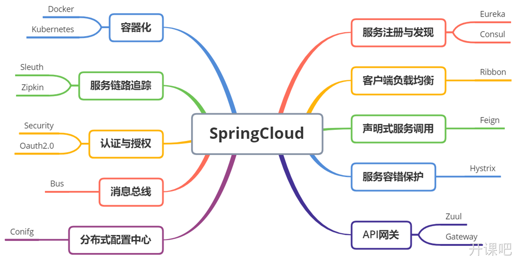

# 微服务简介

## 系统架构演变

​		随着互联网的发展,网站应用的规模不断扩大.需求的激增,带来的是技术上的压力.系统架构也因此也不断的演进、升级、迭代.从单一应用,到垂直拆分,到分布式服务,到SOA,以及现在火热的微服务架构,还有在Google带领下来势汹涌的Service Mesh.我们到底是该乘坐微服务的船只驶向远方,还是偏安一隅得过且过?

​		其实生活不止眼前的苟且,还有诗和远方.所以我们今天就回顾历史,看一看系统架构演变的历程;把握现在,学习现在最火的技术架构;展望未来,争取成为一名优秀的Java工程师.

### 集中式架构

​		当网站流量很小时,只需一个应用,将所有功能都部署在一起,以减少部署节点和成本.此时,用于简化增删改查工作量的数据访问框架(ORM)是影响项目开发的关键. 

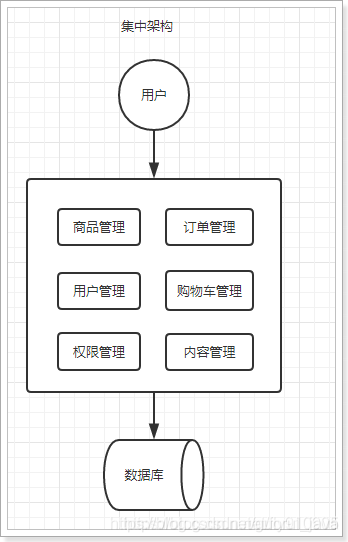

​		如图所示,这个系统采用了三层架构:表现层、业务逻辑层、数据访问层,三层架构解决了应用程序中代码间调用复杂、代码职责不清的问题.但是只是将应用在逻辑上分成了三层,并不是物理上的分层,通过编译、打包、部署后,最终还是在同一台机器的同一个进程中运行, 这种功能集中、代码中心化、一个发布包、部署后运行在同一个进程的应用程序,我们通常称之为单体架构应用.

单体应用的优点?

- 易于开发
- 易于测试
- 易于部署

存在的问题:

- 代码耦合,开发维护困难
- 无法针对不同模块进行针对性优化
- 无法水平扩展
- 单点容错率低,并发能力差
- 技术选型成本高 - 单体应用会让采用新框架和语言极其困难.举例来说,你有两百万行使用A框架的代码,如果要使用B框架重写代码,无论时间还是成本都将非常高昂,即便新框架更好,这也就成为使用新技术的阻碍.
- 交付周期长 - 一般采用release train的方式,需要所有的功能都准备好了才能发布.

### 垂直拆分

​		当访问量逐渐增大,单一应用无法满足需求,此时为了应对更高的并发和业务需求,我们根据业务功能对系统进行拆分.

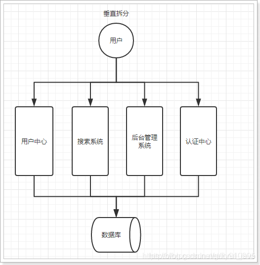

优点:

- 系统拆分实现了流量分担,解决了并发问题

- 可以针对不同模块进行优化
- 方便水平扩展,负载均衡,容错率提高

缺点:

- 系统间相互独立,会有很多重复开发工作,影响开发效率

### 分布式服务

​		当垂直应用越来越多,应用之间交互不可避免,将核心业务抽取出来,作为独立的服务,逐渐形成稳定的服务中心,使前端应用能更快速的响应多变的市场需求.此时,用于提高业务复用及整合的分布式调用是关键.

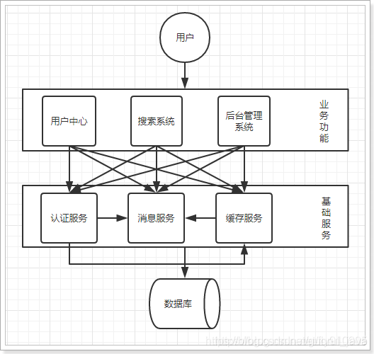

优点:

- 将基础服务进行了抽取,系统间相互调用,提高了代码复用和开发效率

缺点:

- 系统间耦合度变高,调用关系错综复杂,难以维护

### 服务治理SOA

​		**SOA**

- SOA最早的出现是为了解决企业不同系统之间整合的问题,提出服务重用和消息总线.

- SOA中存在大量的编排,通常通过消息总线来承载业务逻辑,并构建出重量级中心化的中间件.

- SOA有个很大的问题在于总线,按照这个思想,这些系统总会在某个环节上走向集中,所以去中心化做的很不彻底

  **微服务**

- 目标:帮助企业更快的响应变化
- 宗旨:去中心化


​		当服务越来越多,容量的评估,小服务资源的浪费等问题逐渐显现,此时需增加一个调度中心基于访问压力实时管理集群容量,提高集群利用率.此时,用于提高机器利用率的资源调度和治理中心(SOA)是关键.

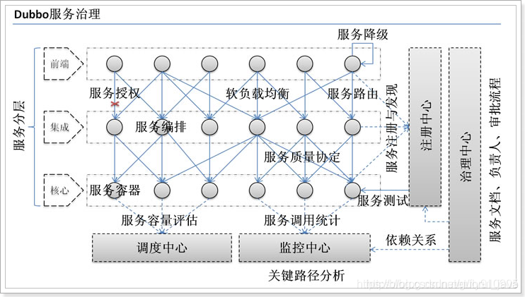

以前出现了什么问题?

- 服务越来越多,需要管理每个服务的地址
- 调用关系错综复杂,难以理清依赖关系
- 服务过多,服务状态难以管理,无法根据服务情况动态管理

服务治理要做什么?

- 服务注册中心,实现服务自动注册和发现,无需人为记录服务地址
- 服务自动订阅,服务列表自动推送,服务调用透明化,无需关心依赖关系
- 动态监控服务状态监控报告,人为控制服务状态

缺点:

- 服务间会有依赖关系,一旦某个环节出错会影响较大
- 服务关系复杂,运维、测试部署困难,不符合DevOps思想

## 微服务架构

```
	In short, the microservice architectural style is an approach to developing a single application as a suite of small services, each running in its own process and communicating with lightweight mechanisms, often an HTTP resource API. These services are built around business capabilities and independently deployable by fully automated deployment machinery. There is a bare minimum of centralized management of these services, which may be written in different programming languages and use different data storage technologies.
```

-- [James Lewis and Martin Fowler (2014)](https://martinfowler.com/articles/microservices.html)

​		前面说的SOA,英文翻译过来是面向服务.微服务,似乎也是服务,都是对系统进行拆分.因此两者非常容易混淆,但其实缺有一些差别.

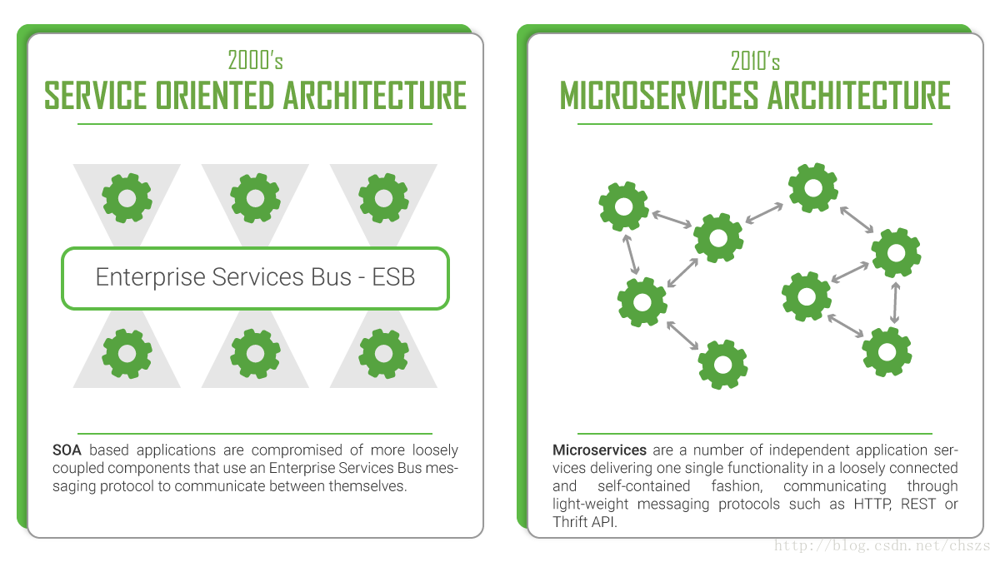

| SOA                                       | 微服务架构                                   |
| ----------------------------------------- | -------------------------------------------- |
| 应用程序服务的可重用性的最大化            | **专注于解耦**                               |
| 系统性的改变需要修改整体                  | 系统性的改变是创建一个新的服务               |
| DevOps和持续交付正在变得流行,但还不是主流 | 强烈关注DevOps和持续交付                     |
| **专注于业务功能重用**                    | 更重视"上下文边界"的概念                     |
| 通信使用企业服务总线ESB                   | 对于通信而言,使用较少精细和简单的消息系统    |
| 支持多种消息协议                          | **使用轻量级协议,例如HTTP,REST或Thrift API** |
| 对部署到它的所有服务使用通用平台          | 应用程序服务器不是真的被使用,通常使用云平台  |
| 容器(如Docker)的使用不太受欢迎            | 容器在微服务方面效果很好                     |
| SOA服务共享数据存储                       | 每个微服务可以有一个独立的数据存储           |
| 共同的治理和标准                          | 轻松的治理,更加关注团队协作和选择自由        |

### 微服务的特点

- 单一职责:微服务中每一个服务都对应唯一的业务能力,做到单一职责
- 微:微服务的服务拆分粒度很小,例如一个用户管理就可以作为一个服务.每个服务虽小,但"五脏俱全".
- 面向服务:面向服务是说每个服务都要对外暴露服务接口API.并不关心服务的技术实现,做到与平台和语言无关,也不限定用什么技术实现,只要提供Rest的接口即可.
- 自治:自治是说服务间互相独立,互不干扰
  - 团队独立:每个服务都是一个独立的开发团队,人数不能过多。
  - 技术独立:因为是面向服务,提供Rest接口,使用什么技术没有别人干涉
  - 前后端分离:采用前后端分离开发,提供统一Rest接口,后端不用再为PC、移动段开发不同接口
  - 数据库分离:每个服务都使用自己的数据源
  - 部署独立:服务间虽然有调用,但要做到服务重启不影响其它服务.有利于持续集成和持续交付.每个服务都是独立的组件,可复用,可替换,降低耦合,易维护.

微服务架构图:

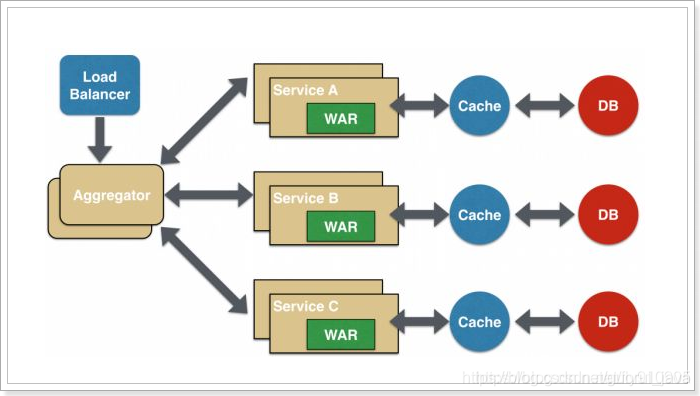

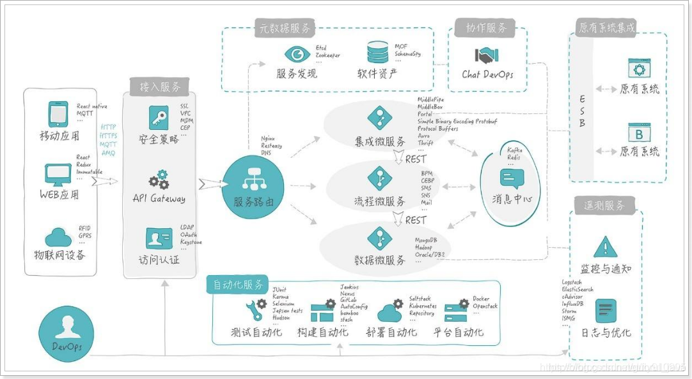

### 微服务的设计原则

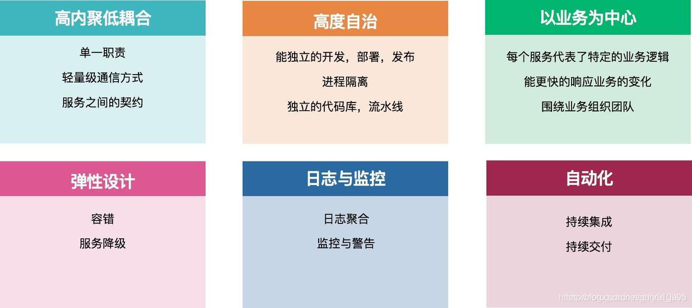

### 高内聚低耦合

- 紧密关联的事物应该放在一起,每个服务是针对一个单一职责的业务能力的封装,专注做好一件事情(每次只有一个更改它的理由).如下图:有四个服务a、b、c、d,但是每个服务职责不单一,a可能在做b的事情,b又在做c的事情,c又同时在做a的事情,通过重新调整,将相关的事物放在一起后,可以减少不必要的服务.
- 轻量级的通信方式
  - 同步RESTful(GET/PUT/POST…),基于http,能让服务间的通信变得标准化并且无状态,关于RESTful API的成熟度,可参考Richardson为REST定义的成熟度模型
  - 异步(消息队列/发布订阅)
- 避免在服务与服务之间共享数据库

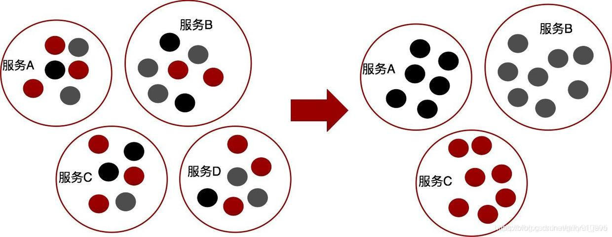

### 高度自治

- 独立部署运行和扩展
  - 每个服务能够独立被部署并运行在一个进程内
  - 这种运行和部署方式能够赋予系统灵活的代码组织方式和发布节奏,使得快速交付和应对变化成为可能.
- 独立开发和演进
  - 技术选型灵活,不受遗留系统技术栈的约束.
  - 合适的业务问题可以选择合适的技术栈,可以独立的演进
  - 服务与服务之间采取与语言无关的API进行集成
- 独立的团队和自治
  - 团队对服务的整个生命周期负责,工作在独立的上下文中, 谁开发,谁维护.

### 以业务为中心

- 每个服务代表了特定的业务逻辑
- 有明显的边界上下文
- 围绕业务组织团队
- 能快速的响应业务的变化
- 隔离实现细节,让业务领域可以被重用

弹性设计

- 设计可容错的系统
  - 拥抱失败,为已知的错误而设计
  - 依赖的服务挂掉
  - 网络连接问题
- 设计具有自我保护能力的系统
  - 服务隔离
  - 服务降级
  - 限制使用资源
  - 防止级联错误

### Netflix

​		Netfilix 提供了一个比较好的解决方案,具体的应对措施包括:网络超时/限制请求的次数/断路器模式/提供回滚等.

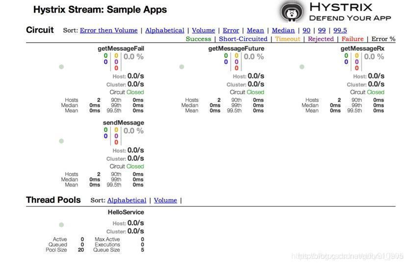


​		Hystrix记录那些超过预设定的极限值的调用.它实现了circuit break模式,从而避免了无休止的等待无响应的服务.如果一个服务的错误率超过预设值,Hystrix将中断服务,并且在一段时间内所有对该服务的请求会立刻失效.Hystrix可以为请求失败定义一个fallback操作,例如读取缓存或者返回默认值.

### 日志与监控

​		当产品环境出错时,需要快速的定位问题,检测可能发生的意外和故障.而日志与监控是快速定位和预防的不二选择,在微服务架构中更是至关重要.

- 高度可观察,我们需要对正在发生的事情有一个整体的视角.
- 聚合你的日志,聚合你的数据,从而当你遇到问题时,可以深入分析原因.
- 当需要重现令人讨厌的问题,或仅仅查看你的系统在生产环境如何交互时,关联标识可以帮助你跟踪系统间的调用。

​		监控主要包括服务可用状态、请求流量、调用链、错误计数,结构化的日志、服务依赖关系可视化等内容,以便发现问题及时修复,实时调整系统负载,必要时进行服务降级,过载保护等等,从而让系统和环境提供高效高质量的服务.

​		比如商业解决方案`splunk`,`sumologic`,以及开源产品ELK他们都可以用于日志的收集,聚合,展现,并提供搜索功能,基于一定条件,触发邮件警告.

​		`Spring boot admin`也可以用于服务可用性的监控, `hystrix`除了提供熔断器机制外,它还收集了一些请求的基本信息(比如请求响应时间,访问计算,错误统计等),并提供现成的dashboard将信息可视化.

​		关于性能监控和调用链追踪,考虑使用dynatrace和zipkin/Sleuth.


### 自动化

在微服务架构下,面临如下挑战:

- 分布式系统
- 多服务,多实例
- 手动测试,部署,发布太消耗时间
- 反馈周期太长

​		传统的手工运维方式必然要被淘汰,微服务的实施是有一定的先决条件:那就是自动化,当服务规模化后需要更多**自动化**和**标准化**的手段来提升效能和降低成本.

- 自动化测试必不可少,因为对比单块系统,确保我们大量的服务正常工作是一个更复杂的过程.
- 调用一个统一的命令行,以相同的方式把系统部署到各个环境.
- 考虑使用环境定义来帮助你明确不同环境间的差异,但同时保持使用统一的方式进行部署的能力.
- 考虑创建自定义镜像来加快部署,并且拥抱全自动化创建不可变服务器的实践.

​		自动化一切可以自动化的,降低部署和发布的难度,比如: 在持续集成和持续交付中,自动化编译,测试,安全扫描,打包,集成测试,部署.随着服务越来越多,在发布过程中,需要进一步自动化蓝绿部署(做到老版本到新版本的平滑过渡),还可以使用pipeline as code的实践,用代码来描述你的流水线.关于部署有很多选择,可以使用虚拟机,容器docker,或者流行的无服务架构lambda(AWS Lambda 也有一些明显的局限,它并不适合被用来部署长期运行的服务,请求需要在 300 秒内完成,当然你可以通过hack的方式延迟时间).

​		然后,可以采用基础设施及代码的实践,比如亚马逊的`cloudformation`,还有`terrform`,通过代码来描述计算和网络等基础设施,可以快速为一个全新的服务,构架它所需要的环境,**保持各环境的一致性**.

### 微服务的优点

1. 每个微服务都很小,这样能聚焦一个指定的业务功能或业务需求.微服务架构模式给采用单体式编码方式很难实现的功能提供了模块化的解决方案,由此,单个服务很容易开发、理解和维护.

2. 微服务能够被小团队单独开发,这个小团队是2到5人的开发人员组成.

3. 微服务是松耦合的,是有功能意义的服务,无论是在开发阶段或部署阶段都是独立的,可以加快部署速度.UI团队可以采用AB测试,快速的部署变化.微服务架构模式使得持续化部署成为可能.

4. 微服务能使用不同的语言开发.

5. 微服务易于被一个开发人员理解,修改和维护,这样小团队能够更关注自己的工作成果.无需通过合作才能体现价值.

6. 微服务允许你利用融合最新技术.

7. 微服务只是业务逻辑的代码,不会和HTML,CSS 或其他界面组件混合.

### 微服务的缺点

1. 微服务架构可能带来过多的操作(服务拆分)

2. 需要DevOps技巧.

3. 可能双倍的努力.

4. 分布式系统可能复杂难以管理.开发者需要在RPC或者消息传递之间选择并完成进程间通讯机制.更甚于,他们必须写代码来处理消息传递中速度过慢或者不可用等局部失效问题.当然这并不是什么难事,但相对于单体式应用中通过语言层级的方法或者进程调用,微服务下这种技术显得更复杂一些.

5. 因为分布部署跟踪问题难.

6. 当服务数量增加,管理复杂性增加

7. 分区的数据库架构.商业交易中同时给多个业务分主体更新消息很普遍.这种交易对于单体式应用来说很容易,因为只有一个数据库.在微服务架构应用中,需要更新不同服务所使用的不同的数据库.使用分布式交易并不一定是好的选择,不仅仅是因为CAP理论,还因为今天高扩展性的NoSQL数据库和消息传递中间件并不支持这一需求.最终你不得不使用一个最终一致性的方法,从而对开发者提出了更高的要求和挑战.

## 认识RPC

​		RPC,即 Remote Procedure Call(远程过程调用),是一个计算机通信协议.该协议允许运行于一台计算机的程序调用另一台计算机的子程序,而程序员无需额外地为这个交互作用编程.说得通俗一点就是:A计算机提供一个服务,B计算机可以像调用本地服务那样调用A计算机的服务.

​		通过上面的概念,我们可以知道,实现RPC主要是做到两点:

- 实现远程调用其他计算机的服务

  要实现远程调用,肯定是通过网络传输数据.A程序提供服务,B程序通过网络将请求参数传递给A,A本地执行后得到结果,再将结果返回给B程序.这里需要关注的有两点:

  1. 采用何种网络通讯协议?

     现在比较流行的RPC框架,都会采用TCP作为底层传输协议

  2. 数据传输的格式怎样?

     两个程序进行通讯,必须约定好数据传输格式.就好比两个人聊天,要用同一种语言,否则无法沟通.所以,我们必须定义好请求和响应的格式.另外,数据在网路中传输需要进行序列化,所以还需要约定统一的序列化的方式.

- 像调用本地服务一样调用远程服务

  如果仅仅是远程调用,还不算是RPC,因为RPC强调的是过程调用,调用的过程对用户而言是应该是透明的,用户不应该关心调用的细节,可以像调用本地服务一样调用远程服务.所以RPC一定要对调用的过程进行封装.

RPC调用流程图:

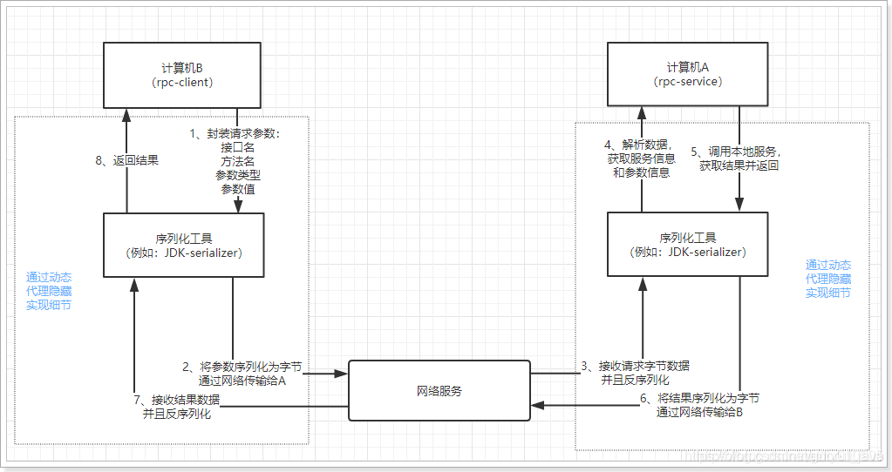

# Spring Cloud微服务框架

​		作为一个微服务框架,比如Spring Cloud,应该具备一些什么功能呢?微服务框架的功能主要体现在以下几个方面:

- 注册中心:服务提供者和消费者,能够从注册中心注册和得到服务信息.
- 配置中心:在微服务架构中设计服务较多需要对于配置文件统一管理.

- 服务链路追踪:对于服务之间的负载调用,要能通过链路追踪,得到具体参与者,调用链路出现问题能够快速定位.
- 负载均衡:服务调用服务会采用一定的负载均衡策略,来保证服务的高可用.

- 服务容错:通过熔断、降级服务容错策略,对系统进行有效的保护,降级是在服务或依赖的服务异常时返回保底数据,熔断是指依赖服务多次失效,则熔断器打开,不再尝试调用,直接返回降级信息.熔断后,定期探测依赖服务可用性,若恢复则恢复调用.
- 服务网关:用户请求过载时进行限流、排队、过载保护、黑白名单、异常用户过滤拦截等都可以通过服务网关实现.

- 服务发布与回滚:蓝绿部署、灰度、AB Test等发布策略,可快速回滚应用.
- 服务动态伸缩、容器化:根据服务负载情况,可快速手动或自动进行节点增加和减少.

## Spring Cloud简介

​		Spring Cloud是Spring提供的微服务框架.它利用Spring Boot的开发特性简化了微服务开发的复杂性,如服务发现注册、配置中心、消息总线、负载均衡、断路器、数据监控等,这些工作都可以借助Spring Boot的开发风格做到一键启动和部署.

​		Spring Cloud的目标是通过一系列组件,帮助开发者迅速构件一个分布式系统,Spring Cloud 是通过包装其它公司产品来实现的,比如Spring Cloud整合了开源的Netflix很多产品.Spring Cloud提供了微服务治理的诸多组件,例如服务注册和发现、配置中心、熔断器、智能路由、微代理、控制总线、全局锁、分布式会话等.

​		Spring Cloud组件非常多,涉及微服务开发的诸多场景,本节主要介绍Spring Cloud以及最为基础的Spring Cloud 五大组件,后续在进行详细的学习.

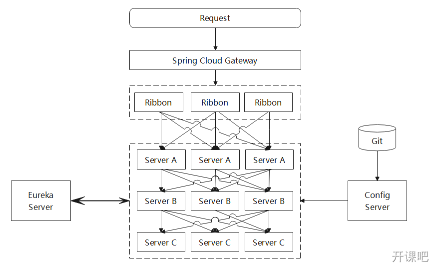

​		Spring Cloud实现微服务的治理功能产品很多,下面简单介绍下Spring Cloud各个产品的作用,以及采用的原则.

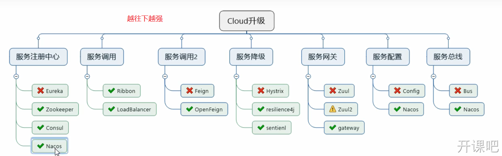

## Spring Cloud版本

Spring Cloud 和Spring Boot版本对应关系如下:

| Spring Cloud                                                 | Spring Boot                           |
| ------------------------------------------------------------ | ------------------------------------- |
| [2020.0.x](https://github.com/spring-cloud/spring-cloud-release/wiki/Spring-Cloud-2020.0-Release-Notes) aka Ilford | 2.4.x, 2.5.x (Starting with 2020.0.3) |
| [Hoxton](https://github.com/spring-cloud/spring-cloud-release/wiki/Spring-Cloud-Hoxton-Release-Notes) | 2.2.x, 2.3.x (Starting with SR5)      |
| [Greenwich](https://github.com/spring-projects/spring-cloud/wiki/Spring-Cloud-Greenwich-Release-Notes) | 2.1.x                                 |
| [Finchley](https://github.com/spring-projects/spring-cloud/wiki/Spring-Cloud-Finchley-Release-Notes) | 2.0.x                                 |
| [Edgware](https://github.com/spring-projects/spring-cloud/wiki/Spring-Cloud-Edgware-Release-Notes) | 1.5.x                                 |
| [Dalston](https://github.com/spring-projects/spring-cloud/wiki/Spring-Cloud-Dalston-Release-Notes) | 1.5.x                                 |

官网对版本进行如下解释

```
Spring Cloud Dalston, Edgware, Finchley, and Greenwich have all reached end of life status and are no longer supported.
```

Spring Cloud Dalston、Edgware、Finchley 和 Greenwich 都已达到生命周期终止状态,不再受支持.


因此课程采用的Spring Cloud,Spring Boot版本:

- Spring Boot 2.4.9
- Spring Cloud 2020.0.3

- Spring Cloud Alibaba 2021.1

# 微服务工程入门

​		模拟一个微服务调用的场景,有两个微服务,一个订单微服务,一个支付微服务,订单微服务通过RestTemplate调用支付微服务,完成支付功能.

- 支付微服务工程:服务提供者

- 订单微服务工程:服务使用者

## 公共工程

​		使用maven创建公共工程"03_cloud_common"工程下,统一管理案例使用的实体类和工具类.

1. pom.xml

```xml
<?xml version="1.0" encoding="UTF-8"?>
<project xmlns="http://maven.apache.org/POM/4.0.0"
         xmlns:xsi="http://www.w3.org/2001/XMLSchema-instance"
         xsi:schemaLocation="http://maven.apache.org/POM/4.0.0 http://maven.apache.org/xsd/maven-4.0.0.xsd">
    <modelVersion>4.0.0</modelVersion>

    <groupId>com.lxs.demo</groupId>
    <artifactId>03_cloud_common</artifactId>
    <version>1.0-SNAPSHOT</version>

    <dependencies>
        <dependency>
            <groupId>org.projectlombok</groupId>
            <artifactId>lombok</artifactId>
            <version>1.18.20</version>
        </dependency>
    </dependencies>
</project>
```

2. Payment

   订单和支付工程都使用了Payment实体类代码如下.

```java
package com.lxs.entity;

import lombok.AllArgsConstructor;
import lombok.Data;
import lombok.NoArgsConstructor;

@Data
@NoArgsConstructor
@AllArgsConstructor
public class Payment {

    /**
     * 订单编号
     */
    private Integer id;
    
    /**
     * 支付状态
     */
    private String message;

}
```

## 支付工程

​		使用Spring Initializr,创建支付微服务工程01_cloud_payment,模拟支付.

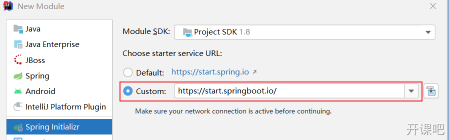

​		注意:默认https://start.spring.io,经常连不上,可以使用Custom:https://start.springboot.io创建.

1. 选择依赖

- Spring Boot 2.4.8
- Spring Boot DevTools

- Lombok
- Spring Web

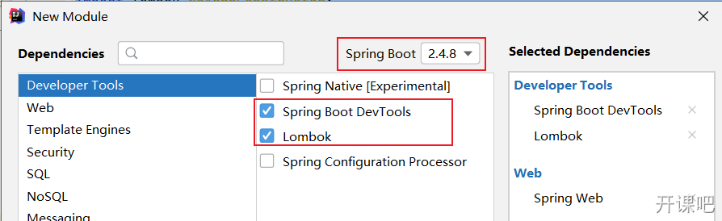

pom.xml

```xml
<?xml version="1.0" encoding="UTF-8"?>
<project xmlns="http://maven.apache.org/POM/4.0.0" xmlns:xsi="http://www.w3.org/2001/XMLSchema-instance"
         xsi:schemaLocation="http://maven.apache.org/POM/4.0.0 https://maven.apache.org/xsd/maven-4.0.0.xsd">
    <modelVersion>4.0.0</modelVersion>
    <parent>
        <groupId>org.springframework.boot</groupId>
        <artifactId>spring-boot-starter-parent</artifactId>
        <version>2.4.8</version>
        <relativePath/> <!-- lookup parent from repository -->
    </parent>
    <groupId>com.lxs.demo</groupId>
    <artifactId>01_cloud_payment</artifactId>
    <version>0.0.1-SNAPSHOT</version>
    <name>01_cloud_payment</name>
    <description>Demo project for Spring Boot</description>
    <properties>
        <java.version>1.8</java.version>
    </properties>
    <dependencies>
        <dependency>
            <groupId>org.springframework.boot</groupId>
            <artifactId>spring-boot-starter-web</artifactId>
        </dependency>

        <dependency>
            <groupId>org.springframework.boot</groupId>
            <artifactId>spring-boot-devtools</artifactId>
            <scope>runtime</scope>
            <optional>true</optional>
        </dependency>
        <dependency>
            <groupId>org.projectlombok</groupId>
            <artifactId>lombok</artifactId>
            <optional>true</optional>
        </dependency>
        <dependency>
            <groupId>org.springframework.boot</groupId>
            <artifactId>spring-boot-starter-test</artifactId>
            <scope>test</scope>
        </dependency>

        <dependency>
            <groupId>com.lxs.demo</groupId>
            <artifactId>03_cloud_common</artifactId>
            <version>1.0-SNAPSHOT</version>
        </dependency>
    </dependencies>

    <build>
        <plugins>
            <plugin>
                <groupId>org.springframework.boot</groupId>
                <artifactId>spring-boot-maven-plugin</artifactId>
                <configuration>
                    <excludes>
                        <exclude>
                            <groupId>org.projectlombok</groupId>
                            <artifactId>lombok</artifactId>
                        </exclude>
                    </excludes>
                </configuration>
            </plugin>
        </plugins>
    </build>

</project>
```

2. 启动器

```java
package com.lxs.demo;

import org.springframework.boot.SpringApplication;
import org.springframework.boot.autoconfigure.SpringBootApplication;

@SpringBootApplication
public class PaymentApplication {

    public static void main(String[] args) {
        SpringApplication.run(PaymentApplication.class, args);
    }

}
```

3. application.yml

```yaml
server:
  port: 9001
```

4. PaymentController

在PaymentController中模拟实现支付功能.

```java
package com.lxs.demo.controller;

import com.lxs.entity.Payment;
import org.springframework.http.ResponseEntity;
import org.springframework.web.bind.annotation.GetMapping;
import org.springframework.web.bind.annotation.PathVariable;
import org.springframework.web.bind.annotation.RequestMapping;
import org.springframework.web.bind.annotation.RestController;

import java.util.HashMap;

@RestController
@RequestMapping("/payment")
public class PaymentController {

    @GetMapping("/{id}")
    public ResponseEntity<Payment> payment(@PathVariable("id") Integer id) {
        Payment payment = new Payment(id, "支付成功");
        return ResponseEntity.ok(payment);
    }

}
```

5. 启动测试

启动项目访问http://localhost:9001/payment/456.

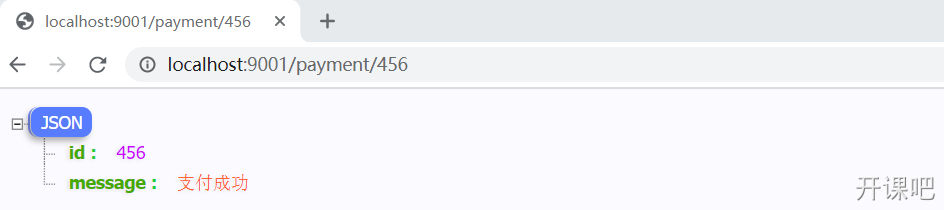

## 订单工程

1. 选择依赖

- Spring Boot 2.4.8
- Spring Boot DevTools

- Lombok
- Spring Web

pom.xml

```xml
<?xml version="1.0" encoding="UTF-8"?>
<project xmlns="http://maven.apache.org/POM/4.0.0" xmlns:xsi="http://www.w3.org/2001/XMLSchema-instance"
         xsi:schemaLocation="http://maven.apache.org/POM/4.0.0 https://maven.apache.org/xsd/maven-4.0.0.xsd">
    <modelVersion>4.0.0</modelVersion>
    <parent>
        <groupId>org.springframework.boot</groupId>
        <artifactId>spring-boot-starter-parent</artifactId>
        <version>2.4.8</version>
        <relativePath/> <!-- lookup parent from repository -->
    </parent>
    <groupId>com.lxs.demo</groupId>
    <artifactId>02_cloud_order</artifactId>
    <version>0.0.1-SNAPSHOT</version>
    <name>02_cloud_order</name>
    <description>Demo project for Spring Boot</description>
    <properties>
        <java.version>1.8</java.version>
    </properties>
    <dependencies>
        <dependency>
            <groupId>org.springframework.boot</groupId>
            <artifactId>spring-boot-starter-web</artifactId>
        </dependency>

        <dependency>
            <groupId>org.springframework.boot</groupId>
            <artifactId>spring-boot-devtools</artifactId>
            <scope>runtime</scope>
            <optional>true</optional>
        </dependency>
        <dependency>
            <groupId>org.projectlombok</groupId>
            <artifactId>lombok</artifactId>
            <optional>true</optional>
        </dependency>
        <dependency>
            <groupId>org.springframework.boot</groupId>
            <artifactId>spring-boot-starter-test</artifactId>
            <scope>test</scope>
        </dependency>
        <dependency>
            <groupId>com.lxs.demo</groupId>
            <artifactId>03_cloud_common</artifactId>
            <version>1.0-SNAPSHOT</version>
        </dependency>
    </dependencies>

    <build>
        <plugins>
            <plugin>
                <groupId>org.springframework.boot</groupId>
                <artifactId>spring-boot-maven-plugin</artifactId>
                <configuration>
                    <excludes>
                        <exclude>
                            <groupId>org.projectlombok</groupId>
                            <artifactId>lombok</artifactId>
                        </exclude>
                    </excludes>
                </configuration>
            </plugin>
        </plugins>
    </build>

</project>
```

2. 启动器

```java
@SpringBootApplication
public class OrderApplication {

    public static void main(String[] args) {
        SpringApplication.run(OrderApplication.class, args);
    }

    @Bean
    public RestTemplate restTemplate() {
        return new RestTemplate();
    }

}
```

​		Spring提供了一个RestTemplate模板工具类,对基于Http的客户端进行了封装,并且实现了对象与json的序列化和反序列化,非常方便.RestTemplate并没有限定Http的客户端类型,而是进行了抽象,目前常用的3种都有支持:

- HttpClient
- OkHttp

- JDK原生的URLConnection(默认的)

3. application.yml

```yaml
server:
  port: 9002
```

4. OrderController

```java
@RestController
@RequestMapping("/order")
public class OrderController {

    @Autowired
    private RestTemplate restTemplate;

    @GetMapping("/payment/{id}")
    public ResponseEntity<Payment> getPaymentById(@PathVariable("id") Integer id) {
        String url = "http://localhost:9001/payment/" + id;
        Payment payment = restTemplate.getForObject(url, Payment.class);
        return ResponseEntity.ok(payment);
    }

}
```

5. 启动并测试

启动项目访问http://localhost:9002/order/payment/123

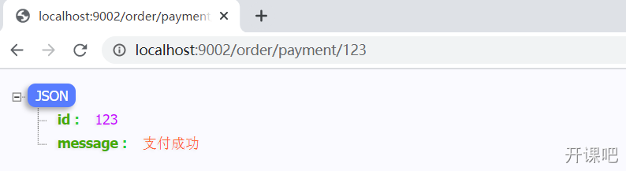

## 小结和思考

简单回顾一下,刚才我们写了什么:

- payment-service:对外提供了支付的接口
- order-service:通过RestTemplate访问 [http://locahost:9091/order/{id}](http://locahost:9091/user/{id}) 接口,调用支付服务

存在什么问题?

- 在order中,我们把url地址硬编码到了代码中,不方便后期维护
- order需要记忆payment-service的地址,如果出现变更,可能得不到通知,地址将失效

- order不清楚payment-service的状态,服务宕机也不知道
- payment-service只有1台服务,不具备高可用性

- 即便payment-service形成集群,order还需自己实现负载均衡

其实上面说的问题,概括一下就是分布式服务必然要面临的服务治理的问题:

- 服务管理
  - 如何自动注册和发现
  - 如何实现状态监管
  - 如何实现动态路由
- 服务如何实现负载均衡
- 服务如何解决容灾问题
- 服务如何实现统一配置

以上的问题,我们都将在SpringCloud中得到答案.

# 服务的注册与发现Eureka

​		"Eureka"来源于古希腊词汇,意为"发现了".在软件领域,Eureka是Netflix在线影片公司开源的一个服务注册和发现组件,和其他的Netflix公司的服务组件(例如负载均衡,熔断器,网关等)一起,被Spring Cloud社区整合为Spring Cloud Netflix模块.

## Eureka简介

​		和Zookeeper类似,Eureka是一个用于服务注册和发现的组件,最开始主要应用与亚马逊公司的云计算服务平台AWS,Eureka分为Eureka Server和Eureka Client,Eureka Server为Eureka服务注册中心,Eureka Client为Eureka客户端。

​		举个例子:Eureka好比滴滴网约车平台,没有滴滴时,人们出门叫车只能叫出租车.一些私家车想做出租却没有资格,被称为黑车.而很多人想要约车,但是无奈出租车太少,不方便.私家车很多却不敢拦,而且满大街的车,谁知道哪个才是愿意载人的.一个想要,一个愿意给,就是缺少引子,缺乏管理啊.此时滴滴这样的网约车平台出现了,所有想载客的私家车全部到滴滴注册,记录你的车型(服务类型),身份信息(联系方式).这样提供服务的私家车,在滴滴那里都能找到,一目了然.此时要叫车的人,只需要打开APP,输入你的目的地,选择车型(服务类型),滴滴自动安排一个符合需求的车到你面前,为你服务,完美!

​		Eureka相当于微服务架构中的"滴滴".负责微服务的注册和发现工作,它记录了服务和服务地址的映射关系.在分布式架构中,服务会注册到Eureka注册中心,当服务需要调用其它服务时,就从Eureka找到服务的地址,进行调用.Eureka在Spring Cloud中的作用是用来作为服务治理实现服务注册和发现.Eureka主要涉及到三大角色:服务提供者、服务消费者、注册中心.

​		服务注册是指,各个微服务在启动时,将自己的网络地址等信息注册到Eureka,服务提供者将自己的服务信息,如服务名、IP等告知服务注册中心.

​		服务发现是指当一个服务消费者需要调用另外一个服务时,服务消费者从Eureka查询服务提供者的地址,并通过该地址调用服务提供者的接口.一个服务既可以是服务消费者,也可以是服务发现者.

​		各个微服务与注册中心使用一定机制(例如心跳)通信.如果Eureka与某微服务长时间无法通信,Eureka会将该服务实例从服务注册中心中剔除,如果剔除掉这个服务实例过了一段时间,此服务恢复心跳,那么服务注册中心将该实例重新纳入到服务列表中.

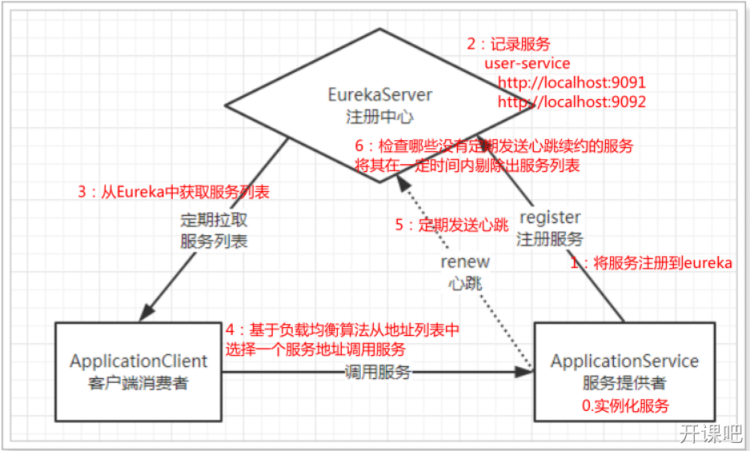

​		注意:Eureka2.x已经停更,解决方案推荐使用Nacos作为替换方案.

## Eureka入门

​		本节介绍Eureka的基本使用,创建Eureka Server,然后将上面支付微服务和订单微服务注册到Eureka Server中.Eureka基本机构主要包括以下3个角色:

- Eureka Server:服务注册中心,提供服务注册和发现功能.
- Provider Service:服务提供者,案例中就是支付微服务.

- Consumer Service:服务消费者,案例中就是订单微服务.

### EurekaServer

1. 选择依赖

   - Spring Boot 2.4.8

   - Spring Boot DevTools

   - Lombok
   - Eureka Server

   pom.xml

   ```xml
   <?xml version="1.0" encoding="UTF-8"?>
   <project xmlns="http://maven.apache.org/POM/4.0.0" xmlns:xsi="http://www.w3.org/2001/XMLSchema-instance"
            xsi:schemaLocation="http://maven.apache.org/POM/4.0.0 https://maven.apache.org/xsd/maven-4.0.0.xsd">
       <modelVersion>4.0.0</modelVersion>
       <parent>
           <groupId>org.springframework.boot</groupId>
           <artifactId>spring-boot-starter-parent</artifactId>
           <version>2.4.8</version>
           <relativePath/> <!-- lookup parent from repository -->
       </parent>
       <groupId>com.lxs.demo</groupId>
       <artifactId>04_cloud_eureka</artifactId>
       <version>0.0.1-SNAPSHOT</version>
       <name>04_cloud_eureka</name>
       <description>Demo project for Spring Boot</description>
       <properties>
           <java.version>1.8</java.version>
           <spring-cloud.version>2020.0.3</spring-cloud.version>
       </properties>
       <dependencies>
           <dependency>
               <groupId>org.springframework.cloud</groupId>
               <artifactId>spring-cloud-starter-netflix-eureka-server</artifactId>
           </dependency>
   
           <dependency>
               <groupId>org.springframework.boot</groupId>
               <artifactId>spring-boot-devtools</artifactId>
               <scope>runtime</scope>
               <optional>true</optional>
           </dependency>
           <dependency>
               <groupId>org.projectlombok</groupId>
               <artifactId>lombok</artifactId>
               <optional>true</optional>
           </dependency>
           <dependency>
               <groupId>org.springframework.boot</groupId>
               <artifactId>spring-boot-starter-test</artifactId>
               <scope>test</scope>
           </dependency>
       </dependencies>
       <dependencyManagement>
           <dependencies>
               <dependency>
                   <groupId>org.springframework.cloud</groupId>
                   <artifactId>spring-cloud-dependencies</artifactId>
                   <version>${spring-cloud.version}</version>
                   <type>pom</type>
                   <scope>import</scope>
               </dependency>
           </dependencies>
       </dependencyManagement>
   
       <build>
           <plugins>
               <plugin>
                   <groupId>org.springframework.boot</groupId>
                   <artifactId>spring-boot-maven-plugin</artifactId>
                   <configuration>
                       <excludes>
                           <exclude>
                               <groupId>org.projectlombok</groupId>
                               <artifactId>lombok</artifactId>
                           </exclude>
                       </excludes>
                   </configuration>
               </plugin>
           </plugins>
       </build>
   
   </project>
   ```

2. 启动器

   ```java
   @SpringBootApplication
   @EnableEurekaServer
   public class EurekaApplication {
   
       public static void main(String[] args) {
           SpringApplication.run(EurekaApplication.class, args);
       }
   
   }
   ```

   注:@EnableEurekaServer,声明当前应用为Eureka Server

3. application.yml

   ```yaml
   server:
     port: 9004
   spring:
     application:
       name: eureka-server
   eureka:
     client:
       service-url:
         # eureka 服务地址,如果是集群的话,需要指定其它集群eureka地址
         defaultZone: http://127.0.0.1:9004/eureka
       # 不注册自己
       register-with-eureka: false
       # 不拉取服务
       fetch-registry: false
   ```

4. 启动并测试

   启动应用访问http://localhost:9004/

   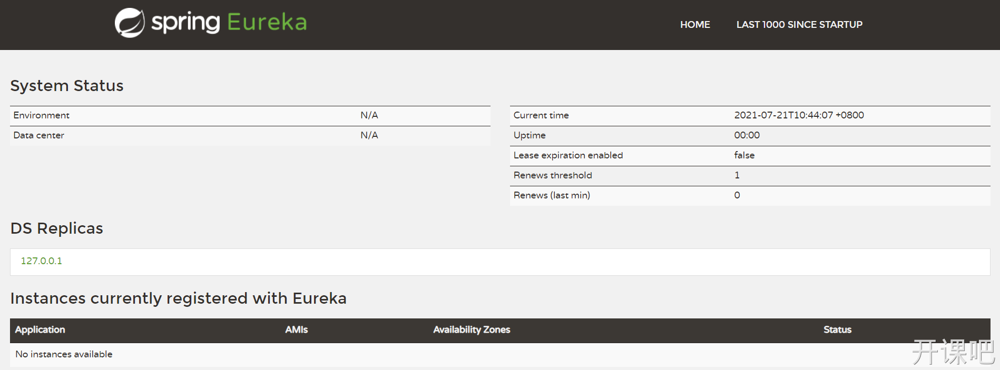

### 服务提供者

​		改造支付服务作为服务提供者,提供支付服务,注册到Eureka Server.

1. 添加依赖

   ```xml
       <properties>
           <java.version>1.8</java.version>
           <spring-cloud.version>2020.0.3</spring-cloud.version>
       </properties>
       <dependencies>
           <dependency>
               <groupId>org.springframework.cloud</groupId>
               <artifactId>spring-cloud-starter-netflix-eureka-client</artifactId>
           </dependency>
       </dependencies>
   
       <dependencyManagement>
           <dependencies>
               <dependency>
                   <groupId>org.springframework.cloud</groupId>
                   <artifactId>spring-cloud-dependencies</artifactId>
                   <version>${spring-cloud.version}</version>
                   <type>pom</type>
                   <scope>import</scope>
               </dependency>
           </dependencies>
       </dependencyManagement>      
   ```

2. application.yml

   ```yaml
   server:
     port: 9001
   spring:
     application:
       name: cloud-payment-service
   eureka:
     client:
       service-url:
         defaultZone: http://127.0.0.1:9004/eureka
       fetch-registry: true
       register-with-eureka: true
   ```

   注意:

   - 这里我们添加了spring.application.name属性来指定应用名称,将来会作为服务的id使用.
   - 可以不用指定register-with-eureka和fetch-registry,因为默认是true

3. 启动器

   ```java
   @SpringBootApplication
   @EnableDiscoveryClient
   public class PaymentApplication {
   
       public static void main(String[] args) {
           SpringApplication.run(PaymentApplication.class, args);
       }
   
   }
   ```

4. 启动并测试

   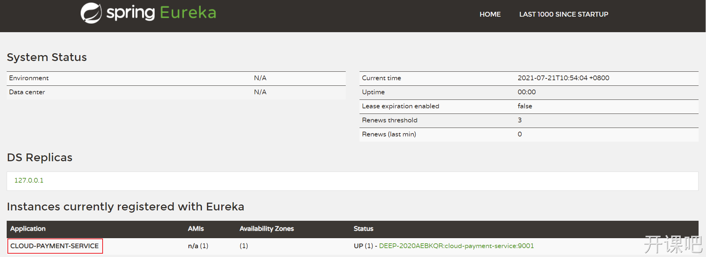

### 服务消费者

​		改造订单微服务,订单服务调用支付服务,订单微服务作为服务消费者.当然订单服务既可以作为消费者,也可以作为被其他服务调用,作为服务提供者,所以订单服务也可以注册到Eureka Server.

1. 添加依赖

   ```xml
       <properties>
           <java.version>1.8</java.version>
           <spring-cloud.version>2020.0.3</spring-cloud.version>
       </properties>
       <dependencies>
           <dependency>
               <groupId>org.springframework.cloud</groupId>
               <artifactId>spring-cloud-starter-netflix-eureka-client</artifactId>
           </dependency>
       </dependencies>
   
       <dependencyManagement>
           <dependencies>
               <dependency>
                   <groupId>org.springframework.cloud</groupId>
                   <artifactId>spring-cloud-dependencies</artifactId>
                   <version>${spring-cloud.version}</version>
                   <type>pom</type>
                   <scope>import</scope>
               </dependency>
           </dependencies>
       </dependencyManagement>      
   ```

2. application.yml

   ```yaml
   server:
     port: 9002
   spring:
     application:
       name: cloud-order-service
   eureka:
     client:
       service-url:
         defaultZone: http://127.0.0.1:9004/eureka
   ```

3. 启动器

   ```java
   @SpringBootApplication
   @EnableDiscoveryClient
   public class OrderApplication {
   
       public static void main(String[] args) {
           SpringApplication.run(OrderApplication.class, args);
       }
   
       @Bean
       public RestTemplate restTemplate() {
           return new RestTemplate();
       }
   
   }
   ```

4. OrderController

   ```java
   @RestController
   @RequestMapping("/order")
   public class OrderController {
   
       @Autowired
       private RestTemplate restTemplate;
   
       @Autowired
       private DiscoveryClient discoveryClient;
   
       @GetMapping("/payment/{id}")
       public ResponseEntity<Payment> getPaymentById(@PathVariable("id") Integer id) {
           String url = "http://localhost:9001/payment/" + id;
   
           List<ServiceInstance> serviceInstances = discoveryClient.getInstances("cloud-payment-service");
           ServiceInstance serviceInstance = serviceInstances.get(0);
           url = "http://" + serviceInstance.getHost() + ":" + serviceInstance.getPort() + "/payment/" + id;
   
   
           Payment payment = restTemplate.getForObject(url, Payment.class);
           return ResponseEntity.ok(payment);
       }
   
   }
   ```

5. 启动并测试

   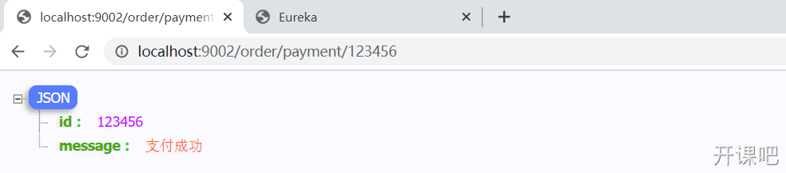

## 源码解析

### Eureka的一些概念

1. Register --- 服务注册

   当Eureka Client向Eureka Server注册时,Eureka Client提供自身的元数据,比如IP地址、端口、运行状况指标的URL,主页地址等信息.

2. Renew --- 服务续约

   Eureka Client在默认情况下会每隔30秒发送一次心跳来进行服务续约,通过服务续约来告知Eureka Server该Eureka Client依然可用,正常情况下,如果Eureka Server在90秒内没有收到Eureka Client的心跳,Eureka Server会将Eureka Client实例从注册列表中删除.注意:官网建议不要更改服务续约的间隔时间.

3. Fetch Registries --- 获取服务注册列表信息

   Eureka Client从Eureka Server获取服务注册表信息,并将其缓存到本地.Eureka Client 会使用服务注册列表信息查找其他服务的信息,从而进行远程调用,该注册列表信息定时(每隔30秒)更新一次,每次返回的注册列表信息可能与Eureka Client的缓存信息不同,Erueka Client会重新获取整个注册表信息.Eureka Server缓存了所有的服务注册表信息,并且进行了压缩.Eureka Client和Eureka Server可以使用json和xml的数据格式进行通信,默认Eureka Client使用JSON格式方式来获取服务器注册列表信息.

4. Cancel --- 服务下线

   Eureka Client在程序关闭时可以向Eureka Server发送下线请求,发送请求后,该客户端的实例信息将从Eureka Server的服务注册列表信息中删除.该下线请求不会自动完成,需要在程序关闭时调用以下代码:

   ```java
   DiscoveryManager.getInstance().shutdownComponent();
   ```

5. Eviction --- 服务剔除

   在默认情况下,Eureka Client连续90秒没有向Eureka Server发送服务续约(心跳)时,Eureka Server会将该服务实例从服务列表中删除,即服务剔除.

### Register服务注册

**Eureka Client端源码**

​		Eureka Client向Eureka Server提交自己的服务信息,包括IP、端口、ServiceId等信息.如果Eureka Client没有配置ServiceId,则默认为配置文件中的配置的服务名,即${spring.application.name}的值.

1. DiscoveryClient初始化方法initScheduledTasks方法

   该方法主要开启了获取服务注册列表的信息,如果需要向Eureka Server注册,则开启注册,同时开启了定时任务向Eureka Server服务续约,代码如下:

   ```java
       /**
        * Initializes all scheduled tasks.
        */
       private void initScheduledTasks() {
           if (clientConfig.shouldFetchRegistry()) {
   			...//省略了任务调度获取注册列表的代码。
           }
   
           if (clientConfig.shouldRegisterWithEureka()) {
   			...
               // Heartbeat timer
               heartbeatTask = new TimedSupervisorTask(
                       "heartbeat",
                       scheduler,
                       heartbeatExecutor,
                       renewalIntervalInSecs,
                       TimeUnit.SECONDS,
                       expBackOffBound,
                       new HeartbeatThread()
               );
               scheduler.schedule(
                       heartbeatTask,
                       renewalIntervalInSecs, TimeUnit.SECONDS);
   
               // InstanceInfo replicator
               instanceInfoReplicator = new InstanceInfoReplicator(
                       this,
                       instanceInfo,
                       clientConfig.getInstanceInfoReplicationIntervalSeconds(),
                       2); // burstSize
               ...
           }
       }
   
   ```

2. instanceInfoReplicator类

   initScheduledTasks方法中,定时任务调用instanceInfoReplicator类,instanceInfoReplicator类继承Runable接口,run方法代码如下:

   ```java
       public void run() {
           try {
               discoveryClient.refreshInstanceInfo();
   
               Long dirtyTimestamp = instanceInfo.isDirtyWithTime();
               if (dirtyTimestamp != null) {
                   discoveryClient.register();
                   instanceInfo.unsetIsDirty(dirtyTimestamp);
               }
           } catch (Throwable t) {
               logger.warn("There was a problem with the instance info replicator", t);
           } finally {
               Future next = scheduler.schedule(this, replicationIntervalSeconds, TimeUnit.SECONDS);
               scheduledPeriodicRef.set(next);
           }
       }
   ```

3. DiscoveryClient的register方法

   在com.netflix.discovery包下的DiscoveryClient类中有一个register()方法,该方法通过Http请求向Eureka Server注册,代码如下:

   ```java
       boolean register() throws Throwable {
           logger.info(PREFIX + "{}: registering service...", appPathIdentifier);
           EurekaHttpResponse<Void> httpResponse;
           try {
               httpResponse = eurekaTransport.registrationClient.register(instanceInfo);
           } catch (Exception e) {
               logger.warn(PREFIX + "{} - registration failed {}", appPathIdentifier, e.getMessage(), e);
               throw e;
           }
           if (logger.isInfoEnabled()) {
               logger.info(PREFIX + "{} - registration status: {}", appPathIdentifier, httpResponse.getStatusCode());
           }
           return httpResponse.getStatusCode() == Status.NO_CONTENT.getStatusCode();
       }
   ```

**Eureka Server端源码**

1. ApplicationResource类

   ApplicationResource类的addInstance方法,接收Eureka Client客户端注册请求,完成注册,代码如下:

   ```java
       /**
        * Registers information about a particular instance for an
        * {@link com.netflix.discovery.shared.Application}.
        *
        * @param info
        *            {@link InstanceInfo} information of the instance.
        * @param isReplication
        *            a header parameter containing information whether this is
        *            replicated from other nodes.
        */
       @POST
       @Consumes({"application/json", "application/xml"})
       public Response addInstance(InstanceInfo info,
                                   @HeaderParam(PeerEurekaNode.HEADER_REPLICATION) String isReplication) {
           ...
           registry.register(info, "true".equals(isReplication));
           return Response.status(204).build();  // 204 to be backwards compatible
       }
   ```

2. PeerAwareInstanceRegistryImpl类

   上面addInstance方法调用PeerAwareInstanceRegistryImpl类的register方法进行注册,代码如下:

   ```java
       @Override
       public void register(final InstanceInfo info, final boolean isReplication) {
           int leaseDuration = Lease.DEFAULT_DURATION_IN_SECS;
           if (info.getLeaseInfo() != null && info.getLeaseInfo().getDurationInSecs() > 0) {
               leaseDuration = info.getLeaseInfo().getDurationInSecs();
           }
           super.register(info, leaseDuration, isReplication);
           //高可用,多节点同步数据
           replicateToPeers(Action.Register, info.getAppName(), info.getId(), info, null, isReplication);
       }
   ```

### Renew服务续约

​		服务续约和服务注册非常类似,通过前文中的分析可以知道,服务注册在Eureka Client程序启动后开启,并且同时开启服务续约定时任务.

**Eureka Client端源码**

​		在DiscoveryClient类下又renew()方法,完成续约,代码如下:

```java
    /**
     * Renew with the eureka service by making the appropriate REST call
     */
    boolean renew() {
        EurekaHttpResponse<InstanceInfo> httpResponse;
        try {
            httpResponse = eurekaTransport.registrationClient.sendHeartBeat(instanceInfo.getAppName(), instanceInfo.getId(), instanceInfo, null);
            logger.debug(PREFIX + "{} - Heartbeat status: {}", appPathIdentifier, httpResponse.getStatusCode());
            if (httpResponse.getStatusCode() == Status.NOT_FOUND.getStatusCode()) {
                REREGISTER_COUNTER.increment();
                logger.info(PREFIX + "{} - Re-registering apps/{}", appPathIdentifier, instanceInfo.getAppName());
                long timestamp = instanceInfo.setIsDirtyWithTime();
                boolean success = register();
                if (success) {
                    instanceInfo.unsetIsDirty(timestamp);
                }
                return success;
            }
            return httpResponse.getStatusCode() == Status.OK.getStatusCode();
        } catch (Throwable e) {
            logger.error(PREFIX + "{} - was unable to send heartbeat!", appPathIdentifier, e);
            return false;
        }
    }
```

**Eureka Server端源码**

​		在com.netflix.eureka.InstanceResource类下,接口方法renewLease(),它是一个RESTful API接口.完成服务器断续,代码如下:

```java
@PUT
public Response renewLease(
        @HeaderParam(PeerEurekaNode.HEADER_REPLICATION) String isReplication,
        @QueryParam("overriddenstatus") String overriddenStatus,
        @QueryParam("status") String status,
        @QueryParam("lastDirtyTimestamp") String lastDirtyTimestamp) {
    ...
    boolean isSuccess = registry.renew(app.getName(), id, isFromReplicaNode);
	...
}
```
​		此外,服务续约的两个参数是可以配置的,即Eureka Client发送续约心跳间隔时间参数和Eureka Server多长时间内没有收到心跳将实例剔除的时间参数,默认情况下这两个参数分别是30秒和90秒.

```yaml
eureka:
  instance:
  	# 心跳间隔时间
    lease-renewal-interval-in-seconds: 30
    # 没收到心跳多长时间剔除
    lease-expiration-duration-in-seconds: 90
```

## Eureka的自我保护

​		当有一个新的Eureka Server出现时,他尝试从相邻的Peer节点获取所有服务实例注册信息.如果从相邻的Peer节点获取信息时出现了故障,Eureka Server会尝试其他的Peer节点.如果Eureka Server能够成功获取所有的服务实例信息,则根据配置信息设置服务续约的阈值.在任何时间,如果Eureka Server接收到的服务续约低于为该值配置的百分比(默认为15分钟内低于85%),则服务器开启自我保护模式,即不再剔除注册列表的信息.

​		这样做的好处在于,如果Eureka Server自身的网络问题而导致Eureka Client无法续约,Eureka Client的注册列表信息不再被删除,也就是Eureka Client还可以被其他服务消费.自我保护开启后,效果如下图所示:

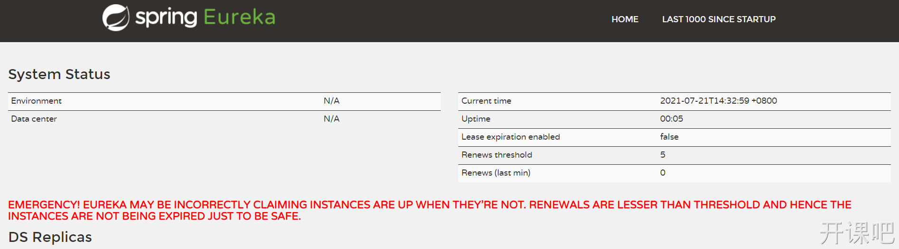

​		在默认情况下,Eureka Server的自我保护模式是开启的,生产环境下这很有效,保证了大多数服务依然可用,但是这给我们的开发带来了麻烦, 因此开发阶段我们都会关闭自我保护模式.

```yaml
eureka:
  server:
    enable-self-preservation: false # 关闭自我保护模式(缺省为打开)
    eviction-interval-timer-in-ms: 1000 # 扫描失效服务的间隔时间(缺省为60*1000ms)
```

## Eureka集群

​		Eureka Server不但需要接收服务的心跳,用来检测服务是否可用,而且每个服务会定期会去Eureka申请服务列表的信息,当服务实例很多时,Eureka中的负载就会很大,所以必须实现Eureka服务注册中心的高可用,一般的做法是将Eureka Server集群化.

1. 配置文件

   更改Eureka Server的配置文件 application.yml,在改配置文件中,采用多profile格式.

   ```yaml
   ---
   spring:
     config:
       activate:
         on-profile: peer1
   server:
     port: 9003
   eureka:
     instance:
       hostname: peer1
     client:
       service-url:
         defaultZone: http://peer2:9004/eureka,http://peer3:9005/eureka
   ---
   spring:
     config:
       activate:
         on-profile: peer2
   server:
     port: 9004
   eureka:
     instance:
       hostname: peer2
     client:
       service-url:
         defaultZone: http://peer1:9003/eureka,http://peer3:9005/eureka
   ---
   spring:
     config:
       activate:
         on-profile: peer3
   server:
     port: 9005
   eureka:
     instance:
       hostname: peer3
     client:
       service-url:
         defaultZone: http://peer1:9003/eureka,http://peer2:9004/eureka     
   ```

   注:

   - 在yaml单一配置文件中,可用连续三个连字号`---`区分多个文件。
   - Spring Boot2.4.x使用`spring.config.activate.on-profile`代替原来的`spring.profiles`

2. 域名解析

   因为本地搭建Eureka Server集群,所以需要修改本地的host文件.

   ```
   127.0.0.1 peer1
   127.0.0.1 peer2
   127.0.0.1 peer3
   ```

3. 启动并测试

   通过mvn package编译后,使用java -jar方式启动,并通过--spring.profiles.active指定配置文件,本案例中需要启动2个Eureka Server实例,他们的配置文件分别是peer1和peer2,命令如下:

   ```shell
   java -jar 04_cloud_eureka-0.0.1-SNAPSHOT.jar --spring.profiles.active=peer1
   java -jar 04_cloud_eureka-0.0.1-SNAPSHOT.jar --spring.profiles.active=peer2
   ```

   启动支付服务,支付微服务仅向9004的Eureka Server注册,代码如下:

   ```yaml
   eureka:
     client:
       service-url:
         defaultZone: http://peer1:9004/eureka
   ```

   此时,支付服务并没有向9003注册,访问Eureka Server的节点的peer1管控台界面,可见9004的注册列表信息已经,同步到了9003节点.

   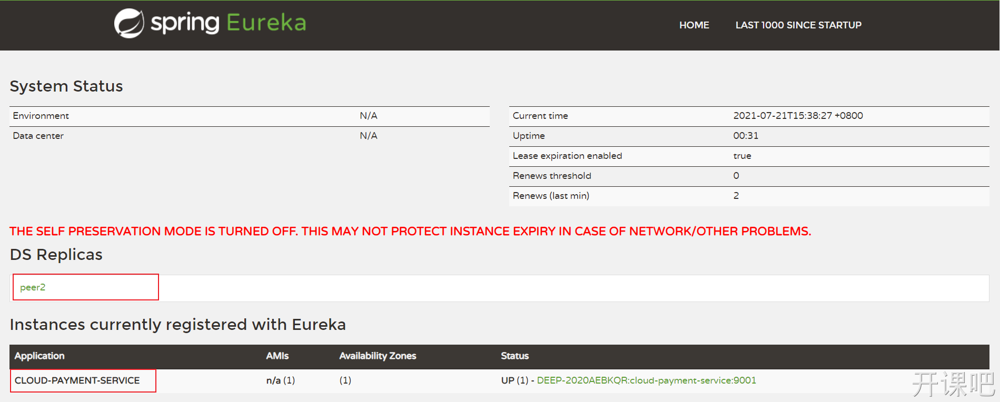

   这样确实实现了服务注册的高可用,但通常我们还要实现服务发现的高可用.例如支付微服务是向9004注册与发现的,如果9004出现宕机,在9003的注册列表中是存在支付微服务的,但是它仅仅是从9004拉取服务列表的,所以就获取不到.因此,我们通常如下配置:

   ```yaml
   eureka:
     client:
       service-url:
         defaultZone: http://peer1:9003/eureka,http://peer2:9004/eureka,http://peer3:9005/eureka
   ```

# 服务调用

## RestTemplate简介

​		RestTemplate是Spring Resources中一个访问第三方RESTful API接口的网络请求框架.RestTemplate的设计原则和其他的Spring Template(例如JdbcTemplate)类似,都是为了执行复杂任务提供了一个具有默认行为的简单方法.

​		RestTemplate是用来消费REST服务的,所以RestTemplate的主要方法都与REST的HTTP协议的一些方法紧密相连,例如HEAD、GET、POST、PUT、DELETE、OPTIONS等方法,这些方法在RestTemplate类对应的方法为headForHeaders()、getForObject()、postForObject()、put()、delete()等.

​		举例说明,在订单服务通过RestTemplate的getForObject方法调用支付服务,并且将调用结果反序列化成Payment对象,代码如下:

```java
    @GetMapping("/payment/{id}")
    public ResponseEntity<Payment> getPaymentById(@PathVariable("id") Integer id) {
        String url = "http://localhost:9001/payment/" + id;

        List<ServiceInstance> serviceInstances = discoveryClient.getInstances("cloud-payment-service");
        ServiceInstance serviceInstance = serviceInstances.get(0);
        url = "http://" + serviceInstance.getHost() + ":" + serviceInstance.getPort() + "/payment/" + id;


        Payment payment = restTemplate.getForObject(url, Payment.class);
        return ResponseEntity.ok(payment);
    }
```

​		RestTemplate支持常见的Http协议请求方法,例如post, get, put,delete等,所以用RestTemplate很容易构建RESTfule API.上述案例结果返回json对象,使用jackson框架完成.

## LoadBalancer负载均衡

​		负载均衡是指将负载分摊到多个执行单元上,常见的负载均衡有两种方式.一种独立进程单元,通过负载均衡策略,将请求转发到不同的执行单元上,例如Nginx.另一种是将负载均衡逻辑以代码的形式封装到服务消费者的客户端上,服务消费者客户端维护了一份服务提供者的信息列表,有了信息表,通过负载均衡策略将请求分摊给多个服务提供者,从而达到负载均衡的目的.

​		SpringCloud原有的客户端负载均衡方案Ribbon已经被废弃,取而代之的是SpringCloud LoadBalancer,LoadBalancer是Spring Cloud Commons的一个子项目,他属于上述的第二种方式,是将负载均衡逻辑封装到客户端中,并且运行在客户端的进程里.

​		在Spring Cloud构件微服务系统中,LoadBalancer作为服务消费者的负载均衡器,有两种使用方式,一种是和RestTemplate相结合,另一种是和Feign相结合,Feign已经默认集成了LoadBalance.

### LoadBalancer整合RestTemplate

在支付微服务工程中进行如下更改:

1. 配置文件

   在application.yml配置文件中,使用spel指定端口,表示:存在port参数使用port参数,不存在使用默认9001端口.启动支付服务时,可以通过指定-Dport=9000,指定支付服务使用不同端口启动.

   ```yaml
   server:
     port: ${port:9001}
   ```

2. PaymentController

   在提供支付服务时,把端口打印出来,方便查看测试效果.

   ```java
   @RestController
   @RequestMapping("/payment")
   public class PaymentController {
   
       @Value("${server.port}")
       private String serverPort;
   
       @GetMapping("/{id}")
       public ResponseEntity<Payment> payment(@PathVariable("id") Integer id) {
           Payment payment = new Payment(id, "支付成功,服务端口=" + serverPort);
           return ResponseEntity.ok(payment);
       }
   
   }
   ```

3. OrderApplication

   在产生RestTemplate实例时,使用@LoadBalanced注解,开启负载均衡

       @Bean
       @LoadBalanced
       public RestTemplate restTemplate() {
           return new RestTemplate();
       }

4. OrderController

   在OrderController中,使用serviceId调用支付服务,此时LoadBalancer负载均衡生效,从多个服务提供者节点轮询选择一个使用.

   ```java
       @GetMapping("/payment/{id}")
       public ResponseEntity<Payment> getPaymentById(@PathVariable("id") Integer id) {
   
           String url = "http://cloud-payment-service/payment/" + id;
           Payment payment = restTemplate.getForObject(url, Payment.class);
   
           return ResponseEntity.ok(payment);
       }
   ```

5. 启动并测试

   启动两个支付微服务工程,端口分别是9000和9001

   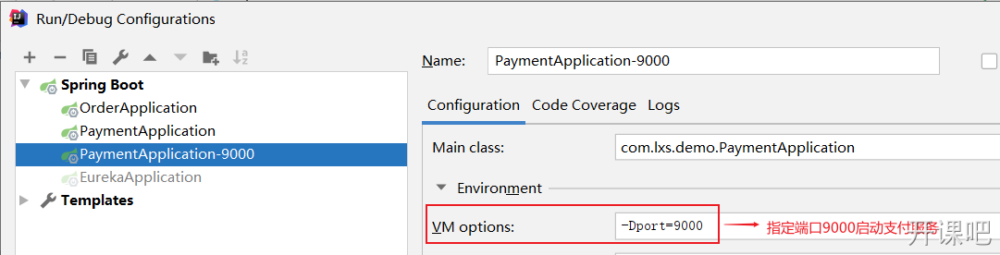

   另一个支付节点,不指定-Dport,使用默认9001端口启动,这时准备了2个支付微服务节点.

   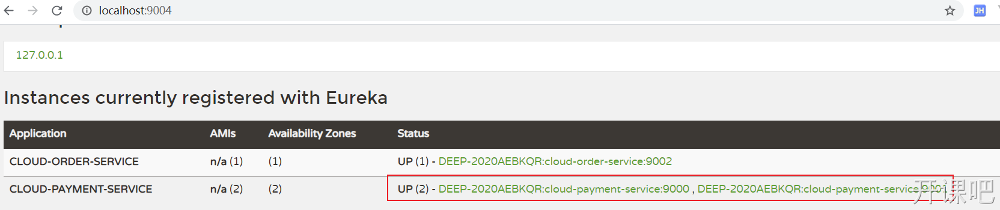

   接下来在浏览器多次访问http://localhost:9002/order/payment/123456时,负载均衡器起了作用,结果9000,9001轮流出现.

   支付成功,服务端口=9000

   支付成功,服务端口=9001

   ### LoadBalancer简介

   ​		负载均衡的核心类为LoadBalancerClient,LoadBalancerClient可以获取负载均衡的服务提供者实例信息.在OrderController增加演示代码如下:

   ```java
       @Autowired
       private LoadBalancerClient loadBalancerClient;
   
       @GetMapping("/test-load-balancer")
       public String testLoadBalancer() {
           ServiceInstance instance = loadBalancerClient.choose("cloud-payment-service");
           return instance.getHost() + ":" + instance.getPort();
       }
   ```

   ​		重启工程,浏览器访问http://localhost:9002/order/test-load-balancer,发现浏览器轮流显示如下内容:

   >  localhost:9000
   >
   > localhost:9001

   ### LoadBalancer源码解析

   #### 类的调用顺序

   ​		当使用有@LoadBalanced注解的RestTemplate时,设计的类的调用关系如图所示:

   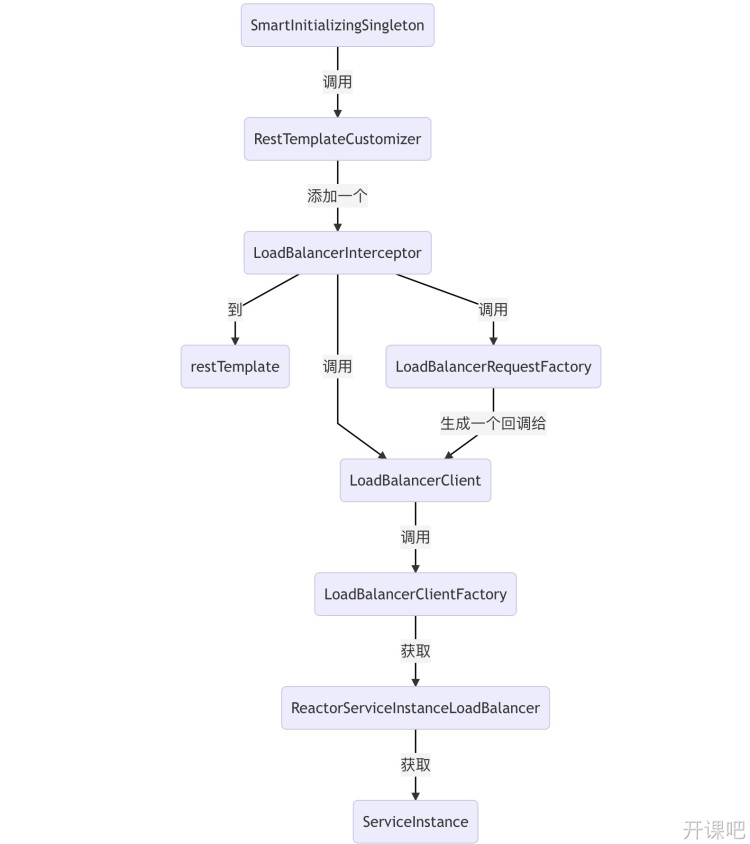

关键类解析

- LoadBalancerRequestFactory: 一个工厂,包装一个为HttpRequest对象,回调对象LoadBalancerRequest.
- LoadBalancerClient:用于根据 serviceId 选取一个 ServiceInstance, 执行LoadBalancerRequestFactory 获得的那个回调.

- LoadBalancerInterceptor:RestTemplate 的拦截器, 拦截后调用 LoadBalancerClient 修改 HttpRequest 对象(主要是 url), 且传入调用 LoadBalancerRequestFactory 生成的回调给 LoadBalancerClient.
- RestTemplateCustomizer:为 restTemplate 加上一个拦截器(也可以干点别的, 默认就这一个用处) .

- SmartInitializingSingleton:容器初始化是,调用 RestTemplateCustomizer 为容器中所有加了.@LoadBalanced 的 RestTemplate 加上一个拦截器.
- ReactiveLoadBalancer:定义了 choose 方法, 即如何选取一个 ServiceInstance, 如轮播, 随机

### 源码解析

1. LoadBalancerInterceptor

   RestTemplate 的拦截器,拦截后调用 LoadBalancerClient 修改 HttpRequest 对象(主要是 url),且传入调用 LoadBalancerRequestFactory 生成的回调给 LoadBalancerClient.

   ```java
   	@Override
   	public ClientHttpResponse intercept(final HttpRequest request, final byte[] body,
   			final ClientHttpRequestExecution execution) throws IOException {
   		final URI originalUri = request.getURI();
   		String serviceName = originalUri.getHost();
   		Assert.state(serviceName != null, "Request URI does not contain a valid hostname: " + originalUri);
   		return this.loadBalancer.execute(serviceName, this.requestFactory.createRequest(request, body, execution));
   	}
   ```

2. BlockingLoadBalancerClient

   用于根据 serviceId 选取一个 ServiceInstance, 执行从 LoadBalancerRequestFactory 获得的那个回调,发送HTTP请求,远程调用RESTful API.

   ```java
   @Override
   public <T> T execute(String serviceId, LoadBalancerRequest<T> request) throws IOException {
   	String hint = getHint(serviceId);
   	LoadBalancerRequestAdapter<T, DefaultRequestContext> lbRequest = new LoadBalancerRequestAdapter<>(request,
   			new DefaultRequestContext(request, hint));
   	Set<LoadBalancerLifecycle> supportedLifecycleProcessors = getSupportedLifecycleProcessors(serviceId);
   	supportedLifecycleProcessors.forEach(lifecycle -> lifecycle.onStart(lbRequest));
   	ServiceInstance serviceInstance = choose(serviceId, lbRequest);
   	if (serviceInstance == null) {
   		supportedLifecycleProcessors.forEach(lifecycle -> lifecycle.onComplete(
   				new CompletionContext<>(CompletionContext.Status.DISCARD, lbRequest, new EmptyResponse())));
   		throw new IllegalStateException("No instances available for " + serviceId);
   	}
   	return execute(serviceId, serviceInstance, lbRequest);
   }
   ```
   choose方法,调用RoundRobinLoadBalancer的choose方法,以轮播方式获取一个serviceInstance.

   ```java
   	@Override
   	public <T> ServiceInstance choose(String serviceId, Request<T> request) {
   		ReactiveLoadBalancer<ServiceInstance> loadBalancer = loadBalancerClientFactory.getInstance(serviceId);
   		if (loadBalancer == null) {
   			return null;
   		}
   		Response<ServiceInstance> loadBalancerResponse = Mono.from(loadBalancer.choose(request)).block();
   		if (loadBalancerResponse == null) {
   			return null;
   		}
   		return loadBalancerResponse.getServer();
   	}
   ```

3. RoundRobinLoadBalancer

   RoundRobinLoadBalancer的choose方法,以轮播方式获取一个serviceInstance.

   ```java
   	public Mono<Response<ServiceInstance>> choose(Request request) {
   		ServiceInstanceListSupplier supplier = serviceInstanceListSupplierProvider
   				.getIfAvailable(NoopServiceInstanceListSupplier::new);
   		return supplier.get(request).next()
   				.map(serviceInstances -> processInstanceResponse(supplier, serviceInstances));
   	}
   ```

## Spring Cloud OpenFeign

​		Feign是一个声明式的HTTP客户端组件,它旨在是编写Http客户端变得更加容易.OpenFeign添加了对于Spring MVC注解的支持,同时集成了Spring Cloud LoadBalancer和Spring Cloud CircuitBreaker,在使用Feign时,提供负载均衡和熔断降级的功能.

### 入门案例

1. 添加依赖

   ```xml
           <dependency>
               <groupId>org.springframework.cloud</groupId>
               <artifactId>spring-cloud-starter-openfeign</artifactId>
           </dependency>
   ```

2. 开启Feign功能

   使用@EnableFeignClients开启Feign功能

   ```java
   @SpringBootApplication
   @EnableDiscoveryClient
   @EnableFeignClients
   public class OrderApplication {
   
       public static void main(String[] args) {
           SpringApplication.run(OrderApplication.class, args);
       }
   
       @Bean
       @LoadBalanced
       public RestTemplate restTemplate() {
           return new RestTemplate();
       }
   
   }
   ```

3. 创建Feign客户端

   在注解@FeignClient注解中,"cloud-payment-service"是服务名,使用这个名字来从Eureka服务列表中得到相应的服务,来创建LoadBalancer客户端,也可以使用url属性,指定服务的URL.

   ```java
   @FeignClient(value = "cloud-payment-service")
   public interface PaymentClient {
   
       @GetMapping("/payment/{id}")
       public Payment payment(@PathVariable("id") Integer id);
   }
   ```

4. OrderController

   在OrderController中使用FeignClient访问支付服务,代码如下:

   ```java
       @Autowired
       private PaymentClient paymentClient;
   
       @GetMapping("/feign/payment/{id}")
       public ResponseEntity<Payment> getPaymentByFeign(@PathVariable("id") Integer id) {
           Payment payment = paymentClient.payment(id);
   
           return ResponseEntity.ok(payment);
       }
   ```

5. 启动并测试

   分别启动支付服务9000端口,9001端口,订单服务,访问http://localhost:9002/order/feign/payment/123,执行效果如图所示:

   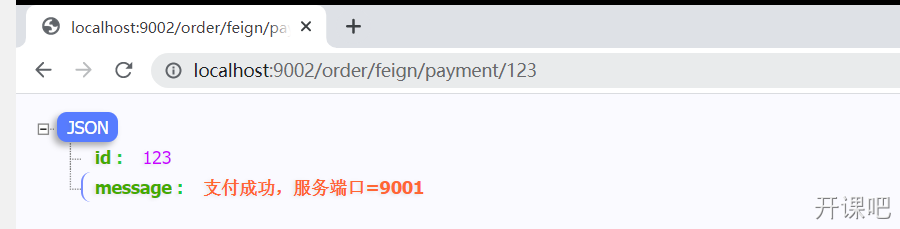

​		多次执行发现9000、9001顺序显示.因此得知Feign集成了负载均衡LoadBalancer组件.

### 超时设置

​		通过分析上述案例的执行现象,得到结论OpenFeign集成了负载均衡组件LoadBalancer,OpenFeign提供了2个超时参数.

- connectTimeout: 防止由于服务器处理时间长而阻塞调用者

- readTimeout: 从连接建立时开始应用,在返回响应时间过长时触发

  

  对于所有的FeignClient配置,可以使用"default"假名.

```yaml
feign:
  client:
    config:
      default:
        connectTimeout: 5000 #防止由于服务器处理时间长而阻塞调用者
        readTimeout: 5000 #从连接建立时开始应用,在返回响应时间过长时触发
```

 		如果只对于具体FeignClient配置,可以把default换成具体的FeignClient的名字.

```yaml
feign:
  client:
    config:
      cloud-paymen-servcie:
        connectTimeout: 5000 #防止由于服务器处理时间长而阻塞调用者
        readTimeout: 5000 #从连接建立时开始应用，在返回响应时间过长时触发
```

### 集成熔断器

​		Feign可以集成Spring Cloud CircuitBreaker熔断器,集成后Feign将使用断路器包装所有方法.

1. 添加依赖

   ```xml
       <dependency>
         <groupId>org.springframework.cloud</groupId>
         <artifactId>spring-cloud-starter-circuitbreaker-resilience4j</artifactId>
       </dependency>
   ```

2. 开启Feign的熔断器支持

   ```yaml
   feign:
     circuitbreaker:
       enabled: true
   ```

3. Feign熔断降级类

   Spring Cloud CircuitBreaker支持降级概念,当熔断器打开,或者调用是出现错误,则执行降级方法.@FeignClient的fallback属性指定服务降级类,服务降级类需要在spring容器中注册.

   ```java
   package com.lxs.demo.client;
   
   import com.lxs.entity.Payment;
   import org.springframework.cloud.openfeign.FallbackFactory;
   import org.springframework.cloud.openfeign.FeignClient;
   import org.springframework.http.ResponseEntity;
   import org.springframework.stereotype.Component;
   import org.springframework.web.bind.annotation.GetMapping;
   import org.springframework.web.bind.annotation.PathVariable;
   
   @FeignClient(name = "cloud-payment-service", fallback = PaymentClient.Fallback.class)
   public interface PaymentClient {
   
       @GetMapping("/payment/{id}")
       public Payment payment(@PathVariable("id") Integer id);
   
       @Component
       static class Fallback implements PaymentClient {
   
           @Override
           public Payment payment(Integer id) {
               Payment payment = new Payment(id, "熔断降级方法返回");
               return payment;
           }
       }
   
   }
   ```

   如果想要获得熔断降级的异常信息,比如打印异常日志,则可以使用fallbackFactory属性指定.

   ```java
   package com.lxs.demo.client;
   
   import com.lxs.entity.Payment;
   import org.springframework.cloud.openfeign.FallbackFactory;
   import org.springframework.cloud.openfeign.FeignClient;
   import org.springframework.http.ResponseEntity;
   import org.springframework.stereotype.Component;
   import org.springframework.web.bind.annotation.GetMapping;
   import org.springframework.web.bind.annotation.PathVariable;
   
   //@FeignClient(name = "cloud-payment-service", fallback = PaymentClient.Fallback.class)
   @FeignClient(value = "cloud-payment-service", fallbackFactory = PaymentClient.FallBackFactory.class)
   public interface PaymentClient {
   
       @GetMapping("/payment/{id}")
       public Payment payment(@PathVariable("id") Integer id);
   
       @Component
       static class Fallback implements PaymentClient {
   
           @Override
           public Payment payment(Integer id) {
               Payment payment = new Payment(id, "熔断降级方法返回");
               return payment;
           }
       }
   
       @Component
       static class FallBackFactory implements FallbackFactory<Fallback> {
   
           @Override
           public Fallback create(Throwable cause) {
               cause.printStackTrace();
               return new Fallback();
           }
       }
   
   }
   ```

4. 启动并测试

   启动订单服务和Eureka,此时因为没有服务提供者支付服务,执行时发生异常,熔断降级方法执行

   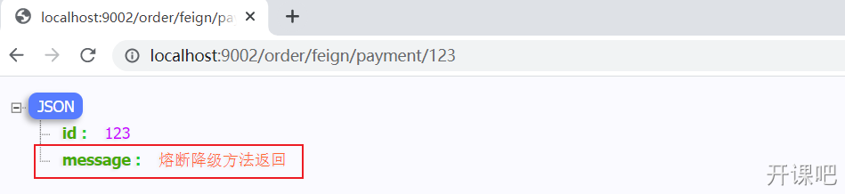

### 请求和响应压缩

​		配置如下:


 ```yaml
feign:
  compression:
    request:
      enabled: true # 请求压缩
      mime-types: text/xml,application/xml,application/json # 压缩的类型
      min-request-size: 2048 # 请求最小压缩的阈值
    response:
      enabled: true #响应压缩
      useGzipDecoder: true #使用gzip解码器解码响应数据
 ```

### Feign日志

​		可以配置打开Feign日志,显示Feign调用的详细信息,比如请求和响应的headers、body和metadata.

1. 设置日志级别

   Feign Logging只响应debug级别.

   ```yaml
   logging:
     level:
       com.lxs: debug
   ```

2. 配置FeignLoggerLevel

   在配置类中配置Logger.Level,告诉配置类Feign需要打印的内容.

   ```java
   @Configuration
   public class FooConfiguration {
       @Bean
       Logger.Level feignLoggerLevel() {
           return Logger.Level.FULL;
       }
   }
   ```

   Logger.Level取值:

   - NONE:无日志记录(默认)

   - BASIC:只记录请求方法和 URL 以及响应状态码和执行时间

   - HEADERS:记录基本信息以及请求和响应标头

   - FULL:记录请求和响应的标头、正文和元数据

### 源码解析

1. 自动配置

   FeignAutoConfiguration,启用了两个配置类:FeignClientProperties和FeignHttpClientProperties.

   ```java
   @Configuration(proxyBeanMethods = false)
   @ConditionalOnClass(Feign.class)
   @EnableConfigurationProperties({ FeignClientProperties.class,
       FeignHttpClientProperties.class })
   @Import(DefaultGzipDecoderConfiguration.class)
   public class FeignAutoConfiguration {
     。。。
   }
   ```

   ```java
   @ConfigurationProperties("feign.client")
   public class FeignClientProperties {
     private boolean defaultToProperties = true;
     private Map<String, FeignClientConfiguration> config = new HashMap<>();
     private String defaultConfig = "default";
   }
   ```

   `defaultToProperties`就是说默认配置文件的优先级更高,config是一个map,默认的key是default,对所有的feign客户端都生效,可以单独指定一个feign客户端的名字对其做配置.

   再看下FeignHttpClientProperties:

   ```java
   @ConfigurationProperties(prefix = "feign.httpclient")
   public class FeignHttpClientProperties {
   }
   ```

   回到FeignAutoConfiguration,configurations是注入系统中所有的FeignClientSpecification,这个类代表的是一个feign客户端,里面有名字和配置类,每一个feign客户端都会有一个与之对应的FeignClientSpecification。

   ```java
   @Autowired(required = false)
   private List<FeignClientSpecification> configurations = new ArrayList<>();
   
     @Bean
     public FeignContext feignContext() {
       FeignContext context = new FeignContext();
       context.setConfigurations(this.configurations);
       return context;
     }
   ```

   当执行FeignContext的setConfigurations的时候,实际上就是把所有的feign客户端配置类实例保存到configurations成员map中,key是client的名字,value是client本身.

   ```java
   private Map<String, C> configurations = new ConcurrentHashMap<>();
   public void setConfigurations(List<C> configurations) {
     for (C client : configurations) {
       this.configurations.put(client.getName(), client);
     }
   }
   ```

   这个类还有一个非常核心的方法createContext().

   ```java
   protected AnnotationConfigApplicationContext createContext(String name) {
       AnnotationConfigApplicationContext context = new AnnotationConfigApplicationContext();
       //判断configurations是否包含那个client
       if (this.configurations.containsKey(name)) {
         //如果包含,拿到client的所有的配置类,注册到spring容器
         for (Class<?> configuration : this.configurations.get(name)
             .getConfiguration()) {
           context.register(configuration);
         }
       }
       //注册default配置,每一个feign客户端的context中都会有默认配置
       for (Map.Entry<String, C> entry : this.configurations.entrySet()) {
         if (entry.getKey().startsWith("default.")) {
           for (Class<?> configuration : entry.getValue().getConfiguration()) {
             context.register(configuration);
           }
         }
       }
       //然后注册PropertyPlaceholderAutoConfiguration和defaultConfigType
       context.register(PropertyPlaceholderAutoConfiguration.class,
           this.defaultConfigType);
       // 然后注册了个PropertySource,名字是feign,
       // 里面是有一个kv,key是feign.client.name,value是name,就是feign客户端的名字
       context.getEnvironment().getPropertySources().addFirst(new MapPropertySource(
           this.propertySourceName,
           Collections.<String, Object>singletonMap(this.propertyName, name)));
       if (this.parent != null) {
         // 这里设置了当前context的父context
         context.setParent(this.parent);
         context.setClassLoader(this.parent.getClassLoader());
       }
       //设置context的名字是FeignContext-feign客户端的名字
       context.setDisplayName(generateDisplayName(name));
       context.refresh();
       return context;
     }
   ```

   ​		也就是说每一个feign客户端都有一个AnnotationConfigApplicationContext,这个context里面注册了这个feign客户端的自己的配置类、全局默认的配置类、FeignClientsConfiguration这个配置类、用于占位符解析的配置类,添加了环境变量feign.client.name = feign客户端的名字,设置了父类Context和本Context的名字.

   ​		FeignContext构造函数中传递了FeignClientsConfiguration配置类,这个类定义了对于Web解析的组件,源码如下:

   ```java
   public class FeignContext extends NamedContextFactory<FeignClientSpecification> {
   
   	public FeignContext() {
   		super(FeignClientsConfiguration.class, "feign", "feign.client.name");
   	}
   }
   ```

   ```java
   @Configuration
   public class FeignClientsConfiguration {
   
     //这是响应解码器
     @Bean
     @ConditionalOnMissingBean
     public Decoder feignDecoder() {
       return new OptionalDecoder(new ResponseEntityDecoder(new SpringDecoder(this.messageConverters)));
     }
     //这是请求编码器
     @Bean
     @ConditionalOnMissingBean
     public Encoder feignEncoder() {
       return new SpringEncoder(this.messageConverters);
     }
     //这是解析注解用的Contract
     @Bean
     @ConditionalOnMissingBean
     public Contract feignContract(ConversionService feignConversionService) {
       return new SpringMvcContract(this.parameterProcessors, feignConversionService);
     }
     //ConversionService
     @Bean
     public FormattingConversionService feignConversionService() {
       FormattingConversionService conversionService = new DefaultFormattingConversionService();
       for (FeignFormatterRegistrar feignFormatterRegistrar : feignFormatterRegistrars) {
         feignFormatterRegistrar.registerFormatters(conversionService);
       }
       return conversionService;
     }
     // 这是创建HystrixFeign.builder,
     // 只有没有Feign.Builder并且启用了hystrix才会创建
     @Configuration
     @ConditionalOnClass({ HystrixCommand.class, HystrixFeign.class })
     protected static class HystrixFeignConfiguration {
       @Bean
       @Scope("prototype")
       @ConditionalOnMissingBean
       @ConditionalOnProperty(name = "feign.hystrix.enabled")
       public Feign.Builder feignHystrixBuilder() {
         return HystrixFeign.builder();
       }
     }
     // 永远不重试
     @Bean
     @ConditionalOnMissingBean
     public Retryer feignRetryer() {
       return Retryer.NEVER_RETRY;
     }
     。。。
   }
   ```

2. 注册FeignClient

   首先从@EnableFeignClient注解开始

   ```java
   @Retention(RetentionPolicy.RUNTIME)
   @Target(ElementType.TYPE)
   @Documented
   @Import(FeignClientsRegistrar.class)
   public @interface EnableFeignClients {
   }
   ```

   @Import中FeignClientsRegistrar完成注册,这里面主要就干了2件事,注册默认的配置和注册feign客户端,当然在注册客户端的同时也会注册客户端上的自定义的配置类.先看下registerDefaultConfiguration:

   ```java
   class FeignClientsRegistrar
       implements ImportBeanDefinitionRegistrar, ResourceLoaderAware, EnvironmentAware {
     @Override
     public void registerBeanDefinitions(AnnotationMetadata metadata,
         BeanDefinitionRegistry registry)
       // 注册默认的配置
       registerDefaultConfiguration(metadata, registry);
       // 注册feign客户端
       registerFeignClients(metadata, registry);
     }
   }
   ```

   注册feign客户端本身registerFeignClient.

   ```java
   private void registerFeignClient(BeanDefinitionRegistry registry,
       AnnotationMetadata annotationMetadata, Map<String, Object> attributes) {
     String className = annotationMetadata.getClassName();
     //实际注册到Spring容器的类型是FeignClientFactoryBean
     BeanDefinitionBuilder definition = BeanDefinitionBuilder
         .genericBeanDefinition(FeignClientFactoryBean.class);
     validate(attributes);
     definition.addPropertyValue("url", getUrl(attributes));
     definition.addPropertyValue("path", getPath(attributes));
     String name = getName(attributes);
     //设置name
     definition.addPropertyValue("name", name);
     String contextId = getContextId(attributes);
     //设置contextId
     definition.addPropertyValue("contextId", contextId);
     //设置类型是接口类型
     definition.addPropertyValue("type", className);
     definition.addPropertyValue("decode404", attributes.get("decode404"));
     definition.addPropertyValue("fallback", attributes.get("fallback"));
     definition.addPropertyValue("fallbackFactory", attributes.get("fallbackFactory"));
     definition.setAutowireMode(AbstractBeanDefinition.AUTOWIRE_BY_TYPE);
     
     String alias = contextId + "FeignClient";
     AbstractBeanDefinition beanDefinition = definition.getBeanDefinition();
     beanDefinition.setAttribute(FactoryBean.OBJECT_TYPE_ATTRIBUTE, className);
     // has a default, won't be null
     boolean primary = (Boolean) attributes.get("primary");
     //primary默认是true,这里设置了primary
     beanDefinition.setPrimary(primary);
     // 设置alias
     String qualifier = getQualifier(attributes);
     if (StringUtils.hasText(qualifier)) {
       alias = qualifier;
     }
     BeanDefinitionHolder holder = new BeanDefinitionHolder(beanDefinition, className,
         new String[] { alias });
     // 注册bean到Spring容器
     BeanDefinitionReaderUtils.registerBeanDefinition(holder, registry);
   }
   ```

3. 注入FeignClient

   容器启动的时候,首先是走@EnableFeignClients去注册默认的配置类、注册FeignClient和FeignClient的配置类,然后走@FeignAutoConfiguration,创建FeignContext,把配置类都放进去.当@Autowired注入feign客户端的时候,实际注入的是FactoryBean的getObject()返回的那个类.

   ```java
   class FeignClientFactoryBean
       implements FactoryBean<Object>, InitializingBean, ApplicationContextAware {
         @Override
     public Object getObject() throws Exception {
       return getTarget();
     }
     <T> T getTarget() {
       //先去拿到FeignContext
       FeignContext context = this.applicationContext.getBean(FeignContext.class);
       //构造builder
       Feign.Builder builder = feign(context);
       //如果没有配置url,走负载均衡
       if (!StringUtils.hasText(this.url)) {
         if (!this.name.startsWith("http")) {
           this.url = "http://" + this.name;
         }
         else {
           this.url = this.name;
         }
         this.url += cleanPath();
         return (T) loadBalance(builder, context,
             new HardCodedTarget<>(this.type, this.name, this.url));
       }
       if (StringUtils.hasText(this.url) && !this.url.startsWith("http")) {
         this.url = "http://" + this.url;
       }
       String url = this.url + cleanPath();
       //获取一个Client,默认是没有设置的
       Client client = getOptional(context, Client.class);
       if (client != null) {
         if (client instanceof LoadBalancerFeignClient) {
           // not load balancing because we have a url,
           // but ribbon is on the classpath, so unwrap
           client = ((LoadBalancerFeignClient) client).getDelegate();
         }
         if (client instanceof FeignBlockingLoadBalancerClient) {
           // not load balancing because we have a url,
           // but Spring Cloud LoadBalancer is on the classpath, so unwrap
           client = ((FeignBlockingLoadBalancerClient) client).getDelegate();
         }
         builder.client(client);
       }
       //创建target,这里面就是feign自己去创建动态代理了
       Targeter targeter = get(context, Targeter.class);
       return (T) targeter.target(this, builder, context,
           new HardCodedTarget<>(this.type, this.name, url));
     }
   }
   ```

   FeignContext在FeignAutoConfiguration里面已经注册到容器了,看下是如何构造那个builder的.

   ```java
   protected Feign.Builder feign(FeignContext context) {
     FeignLoggerFactory loggerFactory = get(context, FeignLoggerFactory.class);
     Logger logger = loggerFactory.create(this.type);
     // @formatter:off
     //拿到Feign.Builder
     Feign.Builder builder = get(context, Feign.Builder.class)
         // required values
         .logger(logger)
         //encoder
         .encoder(get(context, Encoder.class))
         //decoder
         .decoder(get(context, Decoder.class))
         //contract
         .contract(get(context, Contract.class));
     // @formatter:on
     configureFeign(context, builder);
     return builder;
   }
   ```

   这个其实就是拿到feign客户端的name对应的那个ApplicationContext.因此,最终就是从这个Context中去拿Type,如果这个Context不存在就去创建,前面已经分析过了,创建的时候回去注册很多配置类,其中有一个FeignClientsConfiguration,这里会创建默认的encoder、decoder一大堆.

4. 总结

   - @EnableFeignClients会做bean扫描,向Spring容器注册全局默认配置、FeignClient、FeignClient配置,其中FeignClient不是普通的Bean,而是一个FeignClientFactoryBean.

   - FeignAutoConfiguration向Spring容器注册了FeignContext,FeignContext里面包含了所有的FeignClient,每一个FeignClient都关联了一个ApplicationContext,这个ApplicationContext中就包含了encoder、decoder、contract那些核心组件,SpringMvcContract就是用来解析web相关注解的.

   - 当@Autowired注入FeignClient接口的时候,实际注入的是FeignClientFactoryBean的getObject()返回的bean,在getObject()里面调用了buidler.target()返回了FeignClient实例.

   - 如果在子线程中调用feign接口,需要注意子线程中是无法获取HttpServletRequest的,此时就算是feign接口配置了拦截器,在拦截器里面一样是无法读取到http header的,对于某些使用拦截器统一设置http header的情况尤其要注意,feign说白了就是个http util,仅此而已.

# 微服务容错Resilience4j

## 微服务容错简介

​		在高并发访问下,比如天猫双11,流量持续不断的涌入,服务之间的相互调用频率突然增加,引发系统负载过高,这时系统所依赖的服务的稳定性对系统的影响非常大,而且还有很多不确定因素引起雪崩,如网络连接中断,服务宕机等.一般微服务容错组件提供了限流、隔离、降级、熔断等手段,可以有效保护我们的微服务系统.

### 隔离

​		微服务系统A调用B,而B调用C,这时如果C出现故障,则此时调用B的大量线程资源阻塞,慢慢的B的线程数量持续增加直到CPU耗尽到100%,整体微服务不可用,这时就需要对不可用的服务进行隔离.

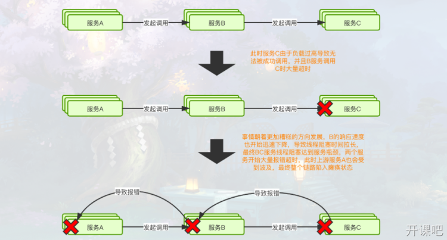

#### 线程池隔离

​		线程池隔离就是通过Java的线程池进行隔离,B服务调用C服务给予固定的线程数量比如12个线程,如果此时C服务宕机了就算大量的请求过来,调用C服务的接口只会占用12个线程不会占用其他工作线程资源,因此B服务就不会出现级联故障.

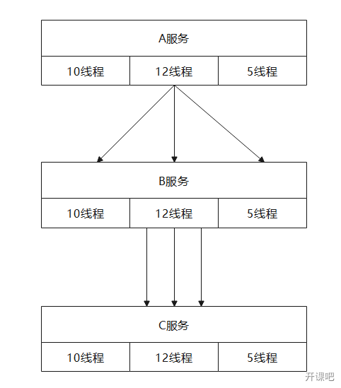

#### 信号量隔离

​		隔离信号量隔离是使用Semaphore来实现的,当拿不到信号量的时候直接拒接因此不会出现超时占用其他工作线程的情况.

```java
Semaphore semaphore = new Semaphore(10,true);  
//获取信号量  
semaphore.acquire();  
//do something here  
//释放信号量  
semaphore.release();  
```

#### 线程池隔离和信号量隔离的区别

​		线程池隔离针对不同的资源分别创建不同的线程池,不同服务调用都发生在不同的线程池中,在线程池排队、超时等阻塞情况时可以快速失败.线程池隔离的好处是隔离度比较高,可以针对某个资源的线程池去进行处理而不影响其它资源,但是代价就是线程上下文切换的 overhead 比较大,特别是对低延时的调用有比较大的影响.而信号量隔离非常轻量级,仅限制对某个资源调用的并发数,而不是显式地去创建线程池,所以 overhead 比较小,但是效果不错,也支持超时失败.

| 类别         | 线程池隔离                              | 信号量隔离             |
| ------------ | --------------------------------------- | ---------------------- |
| 线程         | 与调用线程不同,使用的是线程池创建的线程 | 与调用线程相同         |
| 开销         | 排队,切换,调度等开销                    | 无线程切换性能更高     |
| 是否支持异步 | 支持                                    | 不支持                 |
| 是否支持超时 | 支持超时                                | 支持超时               |
| 并发支持     | 支持通过线程池大小控制                  | 支持通过最大信号量控制 |

### 熔断

​		当下游的服务因为某种原因突然变得不可用或响应过慢,上游服务为了保证自己整体服务的可用性,不再继续调用目标服务,直接返回,快速释放资源.如果目标服务情况好转则恢复调用.

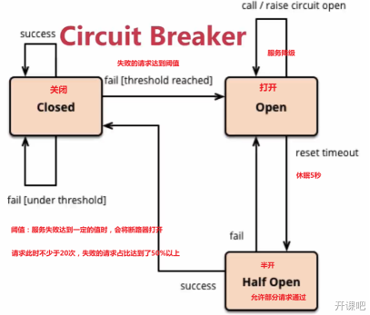

​		熔断器模型的状态机有3个状态:

- Closed:关闭状态(断路器关闭),所有请求都正常访问.
- Open:打开状态(断路器打开),所有请求都会被降级.熔断器会对请求情况计数,当一定时间内失败请求百分比达到阈值,则触发熔断,断路器会完全打开.

- Half Open:半开状态,不是永久的,断路器打开后会进入休眠时间.随后断路器会自动进入半开状态.此时会释放部分请求通过,若这些请求都是健康的,则会关闭断路器,否则继续保持打开,再次进行休眠计时.

### 降级

​		降级是指当自身服务压力增大时,系统将某些不重要的业务或接口的功能降低,可以只提供部分功能,也可以完全停止所有不重要的功能.比如下线非核心服务以保证核心服务的稳定、降低实时性、降低数据一致性,降级的思想是丢车保帅.

​		举个例子:比如目前很多人想要下订单,但是我的服务器除了处理下订单业务之外,还有一些其他的服务在运行,比如搜索、定时任务、支付、商品详情、日志等等服务,然而这些不重要的服务占用了JVM的不少内存和CPU资源,为了应对很多人要下订单的需求,设计了一个动态开关,把这些不重要的服务直接在最外层拒绝掉.这样就有更多的资源来处理下订单服务(下订单速度更快了)

### 限流

​		限流,就是限制最大流量.系统能提供的最大并发有限,同时来的请求又太多,就需要限流,比如商城秒杀业务,瞬时大量请求涌入,服务器服务不过来,就只好排队限流了,就跟去景点排队买票和去银行办理业务排队等号道理相同.

#### 漏桶算法

​		漏桶算法的思路:一个固定容量的漏桶,按照常量固定速率流出水滴.如果桶是空的,则不需流出水滴.可以以任意速率流入水滴到漏桶.如果流入水滴超出了桶的容量,即溢出了(被丢弃),而漏桶容量是不变的.

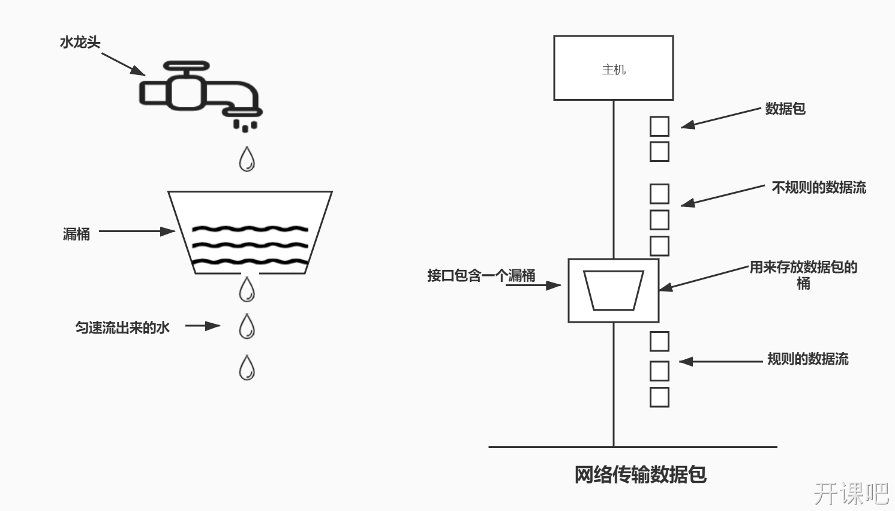

#### 令牌桶算法

​		令牌桶算法:假设限制2r/s,则按照500毫秒的固定速率往桶中添加令牌.桶中最多存放b个令牌,当桶满时,新添加的令牌被丢弃或拒绝.当一个n个字节大小的数据包到达,将从桶中删除n个令牌,接着数据包被发送到网络上.如果桶中的令牌不足n个,则不会删除令牌,且该数据包将被限流(要么丢弃,要么缓冲区等待).

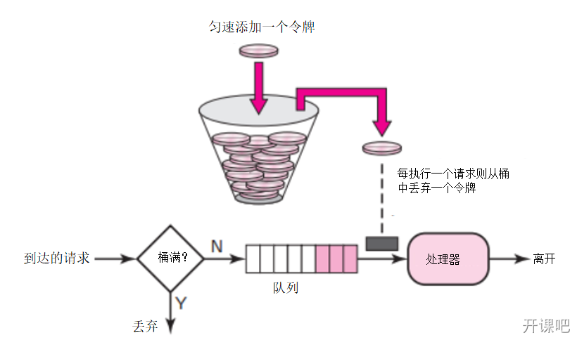

​		令牌桶限流服务器端可以根据实际服务性能和时间段改变生成令牌的速度和水桶的容量. 一旦需要提高速率,则按需提高放入桶中的令牌的速率.

​		生成令牌的速度是恒定的,而请求去拿令牌是没有速度限制的.这意味着当面对瞬时大流量,该算法可以在短时间内请求拿到大量令牌,而且拿令牌的过程并不是消耗很大.

#### 固定时间窗口算法

​		在固定的时间窗口内,可以允许固定数量的请求进入.超过数量就拒绝或者排队,等下一个时间段进入.这种实现计数器限流方式由于是在一个时间间隔内进行限制,如果用户在上个时间间隔结束前请求(但没有超过限制),同时在当前时间间隔刚开始请求(同样没超过限制),在各自的时间间隔内,这些请求都是正常的,但是将间隔临界的一段时间内的请求就会超过系统限制,可能导致系统被压垮.

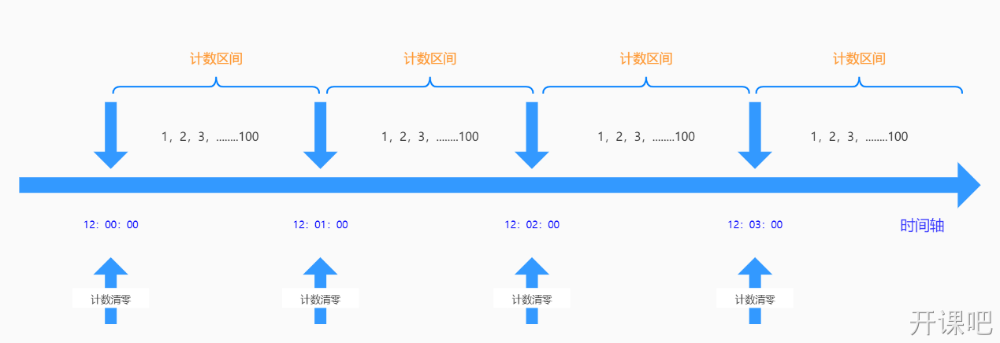

​		由于计数器算法存在时间临界点缺陷,因此在时间临界点左右的极短时间段内容易遭到攻击.比如设定每分钟最多可以请求100次某个接口,如12:00:00-12:00:59时间段内没有数据请求,而12:00:59-12:01:00时间段内突然并发100次请求,而紧接着跨入下一个计数周期,计数器清零,在12:01:00-12:01:01内又有100次请求,那么也就是说在时间临界点左右可能同时有2倍的阀值进行请求,从而造成后台处理请求过载的情况,导致系统运营能力不足,甚至导致系统崩溃.

#### 滑动时间窗口算法

​		滑动窗口算法是把固定时间片进行划分,并且随着时间移动,移动方式为开始时间点变为时间列表中的第二时间点,结束时间点增加一个时间点,不断重复,通过这种方式可以巧妙的避开计数器的临界点的问题.

​		滑动窗口算法可以有效的规避计数器算法中时间临界点的问题,但是仍然存在时间片段的概念.同时滑动窗口算法计数运算也相对固定时间窗口算法比较耗时.

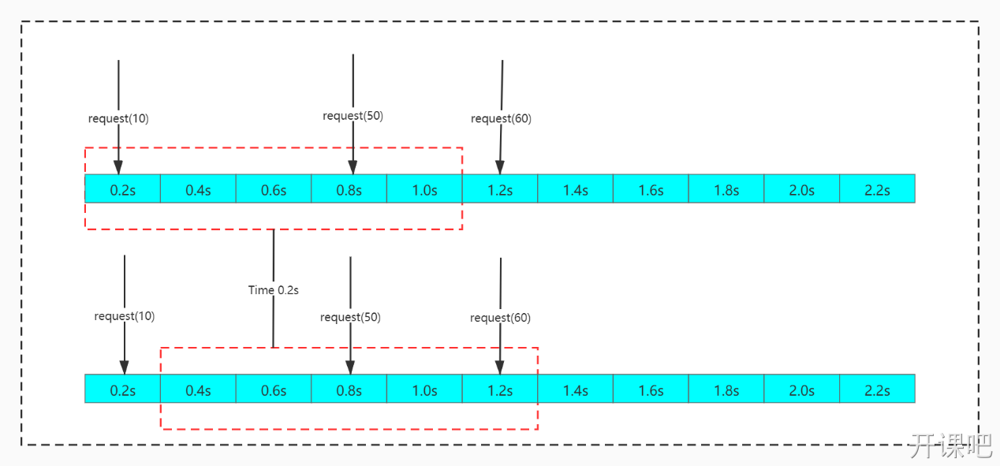

## Resilience4j

### Resilience4j简介

​		Netflix的Hystrix微服务容错库已经停止更新,官方推荐使用Resilience4j代替Hystrix,或者使用Spring Cloud Alibaba的Sentinel组件.

​		Resilience4j是受到Netflix Hystrix的启发,为Java8和函数式编程所设计的轻量级容错框架.整个框架只是使用了Varr的库,不需要引入其他的外部依赖.与此相比,Netflix Hystrix对Archaius具有编译依赖,而Archaius需要更多的外部依赖,例如Guava和Apache Commons Configuration.

​		Resilience4j提供了提供了一组高阶函数(装饰器),包括断路器,限流器,重试机制,隔离机制.你可以使用其中的一个或多个装饰器对函数式接口,lambda表达式或方法引用进行装饰.这么做的优点是你可以选择所需要的装饰器进行装饰.

​		在使用Resilience4j的过程中,不需要引入所有的依赖,只引入需要的依赖即可.

**核心模块**

- resilience4j-circuitbreaker: 熔断
- resilience4j-ratelimiter: 限流

- resilience4j-bulkhead: 隔离
- resilience4j-retry: 自动重试

- resilience4j-cache: 结果缓存
- resilience4j-timelimiter: 超时处理

### Resilience4j和Hystrix异同

- Hystrix使用HystrixCommand来调用外部的系统,而R4j提供了一些高阶函数,例如断路器、限流器、隔离机制等,这些函数作为装饰器对函数式接口、lambda表达式、函数引用进行装饰.此外,R4j库还提供了失败重试和缓存调用结果的装饰器.你可以在函数式接口、lambda表达式、函数引用上叠加地使用一个或多个装饰器,这意味着隔离机制、限流器、重试机制等能够进行组合使用.这么做的优点在于,你可以根据需要选择特定的装饰器.任何被装饰的方法都可以同步或异步执行,异步执行可以采用 CompletableFuture 或RxJava。
- 当有很多超过规定响应时间的请求时,在远程系统没有响应和引发异常之前,断路器将会开启.

- 当Hystrix处于半开状态时,Hystrix根据只执行一次请求的结果来决定是否关闭断路器.而R4j允许执行可配置次数的请求,将请求的结果和配置的阈值进行比较来决定是否关闭断路器.
- R4j提供了自定义的Reactor和Rx Java操作符对断路器、隔离机制、限流器中任何的反应式类型进行装饰.

- Hystrix和R4j都发出一个事件流,系统可以对发出的事件进行监听,得到相关的执行结果和延迟的时间统计数据都是十分有用的.

### Resilience4j最佳实践

​		下面分三方面讲解Resilence4j对于微服务容错的处理,分别为熔断,隔离,限流.

#### 断路器(CircuitBreaker)

1. CircuitBreaker简介

   断路器通过有限状态机实现,有三个普通状态:关闭(CLOSED)、开启(OPEN)、半开(HALF_OPEN),还有两个特殊状态:禁用(DISABLED)、强制开启(FORCED_OPEN)

   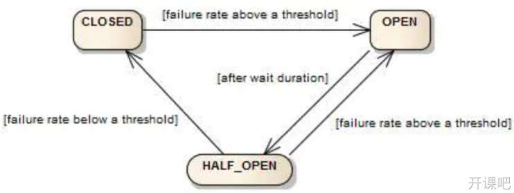

   当熔断器关闭时,所有的请求都会通过熔断器.如果失败率超过设定的阈值,熔断器就会从关闭状态转换到打开状态,这时所有的请求都会被拒绝.当经过一段时间后,熔断器会从打开状态转换到半开状态,这时仅有一定数量的请求会被放入,并重新计算失败率,如果失败率超过阈值,则变为打开状态,如果失败率低于阈值,则变为关闭状态.

   断路器使用滑动窗口来存储和统计调用的结果.你可以选择基于调用数量的滑动窗口或者基于时间的滑动窗口.基于访问数量的滑动窗口统计了最近N次调用的返回结果,基于时间的滑动窗口统计了最近N秒的调用返回结果.

   除此以外,熔断器还会有两种特殊状态:DISABLED(始终允许访问)和FORCED_OPEN(始终拒绝访问).这两个状态不会生成熔断器事件(除状态装换外),并且不会记录事件的成功或者失败.退出这两个状态的唯一方法是触发状态转换或者重置熔断器.

2. 添加依赖

   ```xml
           <dependency>
               <groupId>org.springframework.cloud</groupId>
               <artifactId>spring-cloud-starter-circuitbreaker-resilience4j</artifactId>
           </dependency>
   ```

3. CircuitBreaker配置

   断路器配置属性,如下表所示:

   | **配置属性**                                  | **默认值**                                                   | **描述**                                                     |
   | --------------------------------------------- | ------------------------------------------------------------ | ------------------------------------------------------------ |
   | failureRateThreshold                          | 50                                                           | 以百分比配置失败率阈值。当失败率等于或大于阈值时，断路器状态并关闭变为开启，并进行服务降级。 |
   | slowCallRateThreshold                         | 100                                                          | 以百分比的方式配置，断路器把调用时间大于slowCallDurationThreshold的调用视为慢调用，当慢调用比例大于等于阈值时，断路器开启，并进行服务降级。 |
   | slowCallDurationThreshold                     | 60000 [ms]                                                   | 配置调用时间的阈值，高于该阈值的呼叫视为慢调用，并增加慢调用比例。 |
   | permittedNumberOfCallsInHalfOpenState         | 10                                                           | 断路器在半开状态下允许通过的调用次数。                       |
   | maxWaitDurationInHalfOpenState                | 0                                                            | 断路器在半开状态下的最长等待时间，超过该配置值的话，断路器会从半开状态恢复为开启状态。配置是0时表示断路器会一直处于半开状态，直到所有允许通过的访问结束。 |
   | slidingWindowType                             | COUNT_BASED                                                  | 配置滑动窗口的类型，当断路器关闭时，将调用的结果记录在滑动窗口中。滑动窗口的类型可以是count-based或time-based。如果滑动窗口类型是COUNT_BASED，将会统计记录最近slidingWindowSize次调用的结果。如果是TIME_BASED，将会统计记录最近slidingWindowSize秒的调用结果。 |
   | slidingWindowSize                             | 100                                                          | 配置滑动窗口的大小。                                         |
   | minimumNumberOfCalls                          | 100                                                          | 断路器计算失败率或慢调用率之前所需的最小调用数（每个滑动窗口周期）。例如，如果minimumNumberOfCalls为10，则必须至少记录10个调用，然后才能计算失败率。如果只记录了9次调用，即使所有9次调用都失败，断路器也不会开启。 |
   | waitDurationInOpenState                       | 60000 [ms]                                                   | 断路器从开启过渡到半开应等待的时间。                         |
   | automaticTransition FromOpenToHalfOpenEnabled | false                                                        | 如果设置为true，则意味着断路器将自动从开启状态过渡到半开状态，并且不需要调用来触发转换。创建一个线程来监视断路器的所有实例，以便在WaitDurationInOpenstate之后将它们转换为半开状态。但是，如果设置为false，则只有在发出调用时才会转换到半开，即使在waitDurationInOpenState之后也是如此。这里的优点是没有线程监视所有断路器的状态。 |
   | recordExceptions                              | empty                                                        | 记录为失败并因此增加失败率的异常列表。 除非通过ignoreExceptions显式忽略，否则与列表中某个匹配或继承的异常都将被视为失败。 如果指定异常列表，则所有其他异常均视为成功，除非它们被ignoreExceptions显式忽略。 |
   | ignoreExceptions                              | empty                                                        | 被忽略且既不算失败也不算成功的异常列表。 任何与列表之一匹配或继承的异常都不会被视为失败或成功，即使异常是recordExceptions的一部分。 |
   | recordException                               | throwable -> true· By default all exceptions are recored as failures. | 一个自定义断言，用于评估异常是否应记录为失败。 如果异常应计为失败，则断言必须返回true。如果出断言返回false，应算作成功，除非ignoreExceptions显式忽略异常。 |
   | ignoreException                               | throwable -> false By default no exception is ignored.       | 自定义断言来判断一个异常是否应该被忽略，如果应忽略异常，则谓词必须返回true。 如果异常应算作失败，则断言必须返回false。 |

   参考上面的配置属性,在订单项目中配置断路器.

   ```yaml
   resilience4j:
     circuitbreaker:
       configs:
         default:
           failureRateThreshold: 30 #失败请求百分比，超过这个比例，CircuitBreaker变为OPEN状态
           slidingWindowSize: 10 #滑动窗口的大小，配置COUNT_BASED,表示10个请求，配置TIME_BASED表示10秒
           minimumNumberOfCalls: 5 #最小请求个数，只有在滑动窗口内，请求个数达到这个个数，才会触发CircuitBreader对于断路器的判断
           slidingWindowType: TIME_BASED #滑动窗口的类型
           permittedNumberOfCallsInHalfOpenState: 3 #当CircuitBreaker处于HALF_OPEN状态的时候，允许通过的请求个数
           automaticTransitionFromOpenToHalfOpenEnabled: true #设置true，表示自动从OPEN变成HALF_OPEN，即使没有请求过来
           waitDurationInOpenState: 2s #从OPEN到HALF_OPEN状态需要等待的时间
           recordExceptions: #异常名单
             - java.lang.Exception
       instances:
         backendA:
           baseConfig: default #熔断器backendA，继承默认配置default
         backendB:
           failureRateThreshold: 50
           slowCallDurationThreshold: 2s #慢调用时间阈值，高于这个阈值的呼叫视为慢调用，并增加慢调用比例。
           slowCallRateThreshold: 30 #慢调用百分比阈值，断路器把调用时间大于slowCallDurationThreshold，视为慢调用，当慢调用比例大于阈值，断路器打开，并进行服务降级
           slidingWindowSize: 10
           slidingWindowType: TIME_BASED
           minimumNumberOfCalls: 2
           permittedNumberOfCallsInHalfOpenState: 2
           waitDurationInOpenState: 2s #从OPEN到HALF_OPEN状态需要等待的时间
   ```

   上面配置了2个断路器"backendA"和"backendB",其中backendA断路器配置基于default配置,"backendB"断路器配置了慢调用比例熔断,"backendA"熔断器配置了异常比例熔断.

4. OrderController

   修改OrderController代码,以测试异常比例熔断和慢调用比例熔断效果

   ```java
       @GetMapping("/payment/{id}")
       @CircuitBreaker(name = "backendD", fallbackMethod = "fallback")
       public ResponseEntity<Payment> getPaymentById(@PathVariable("id") Integer id) throws InterruptedException, ExecutionException {
           log.info("now i enter the method!!!");
   
           Thread.sleep(10000L); //阻塞10秒,用于测试慢调用比例熔断
   
           String url = "http://cloud-payment-service/payment/" + id;
           Payment payment = restTemplate.getForObject(url, Payment.class);
   
           log.info("now i exist the method!!!");
   
           return ResponseEntity.ok(payment);
       }
   
       public ResponseEntity<Payment> fallback(Integer id, Throwable e) {
           e.printStackTrace();
           Payment payment = new Payment();
           payment.setId(id);
           payment.setMessage("fallback...");
           return new ResponseEntity<>(payment, HttpStatus.BAD_REQUEST);
       }
   ```

   注意: name="backendA"和name="backendD"效果相同,当找不到配置的backendD熔断器,使用默认熔断器配置,即为"default".

5. 启动并测试

   分别启动Eureka,支付服务,订单服务.

   使用JMeter并发测试,创建线程组.

   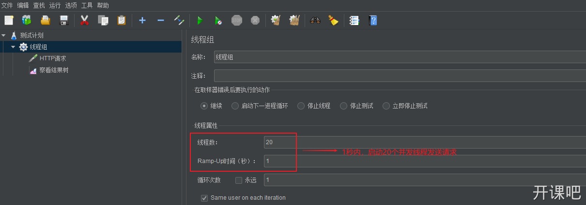

   创建HTTP请求、查看结果数,HTTP请求配置.

   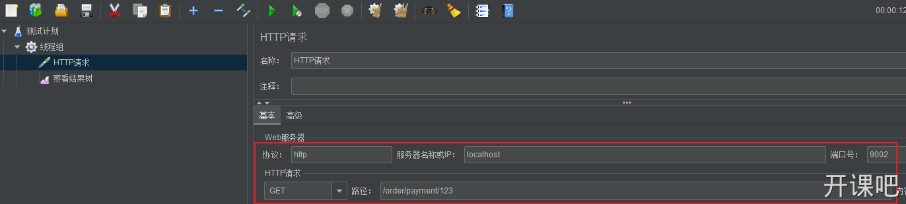

   正常执行效果如图所示:

   

   此时关闭支付微服务,这时订单服务无法调用,所有请求报错,这时第一次并发发送20次请求,触发异常比例熔断,断路器进入打开状态,2s后(waitDurationInOpenState: 2s),断路器自动进入半开状态(automaticTransitionFromOpenToHalfOpenEnabled: true),再次发送请求断路器处于半开状态,允许3次请求通过(permittedNumberOfCallsInHalfOpenState: 3),注意此时控制台打印3次日志信息,说明半开状态,进入了3次请求调用,接着断路器继续进入打开状态.

   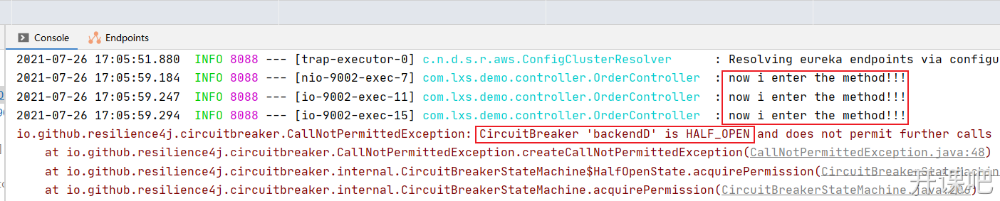

   注意name="backendA"和name="backendD",效果相同.

   接下来测试慢比例调用熔断,修改OrderController代码,使用"backendB"熔断器,因为backendB熔断器配置了慢比例调用熔断,然后启动Eureka,订单微服务和支付微服务.第一次发送并发发送了20个请求,触发了慢比例熔断,但是因为没有配置(automaticTransitionFromOpenToHalfOpenEnabled: true),无法自动从打开状态转为半开状态,需要浏览器中执行一次请求,这时断路器才能从打开状态进入半开状态,接下来进入半开状态,根据配置,允许2次请求在半开状态通过(permittedNumberOfCallsInHalfOpenState: 2),第二次调用效果如图所示:

   

#### 隔离(Buikhead)

​		Resilience4j提供了两种隔离的实现方式,可以限制并发执行的数量.

- SemaphoreBulkhead使用了信号量
- FixedThreadPoolBulkhead使用了有界队列和固定大小线程池


1. 添加依赖

   ```xml
           <dependency>
               <groupId>io.github.resilience4j</groupId>
               <artifactId>resilience4j-bulkhead</artifactId>
               <version>1.7.0</version>
           </dependency>
   ```

2. 信号量隔离

   SemaphoreBulkhead使用了信号量,配置属性,如下表所示:

   | **配置属性**       | **默认值** | **描述**                                                     |
   | ------------------ | ---------- | ------------------------------------------------------------ |
   | maxConcurrentCalls | 25         | 隔离允许线程并发执行的最大数量                               |
   | maxWaitDuration    | 0          | 当达到并发调用数量时，新的线程执行时将被阻塞，这个属性表示最长的等待时间。 |

   在订单工程application.yml配置如下:

   ```yaml
   resilience4j:
     bulkhead:
       configs:
         default:
           maxConcurrentCalls: 5 # 隔离允许并发线程执行的最大数量
           maxWaitDuration: 20ms # 当达到并发调用数量时,新的线程的阻塞时间
       instances:
         backendA:
           baseConfig: default
         backendB:
           maxWaitDuration: 10ms
           maxConcurrentCalls: 20
   ```

   修改OrderController代码如下:

   ```java
       @GetMapping("/payment/{id}")
       @Bulkhead(name = "backendA", fallbackMethod = "fallback", type = Bulkhead.Type.SEMAPHORE)
       public ResponseEntity<Payment> getPaymentById(@PathVariable("id") Integer id) throws InterruptedException, ExecutionException {
           log.info("now i enter the method!!!");
   
           Thread.sleep(10000L); //阻塞10秒,用于测试慢调用比例熔断
   
           String url = "http://cloud-payment-service/payment/" + id;
           Payment payment = restTemplate.getForObject(url, Payment.class);
   
           log.info("now i exist the method!!!");
   
           return ResponseEntity.ok(payment);
       }
   ```

   注意type默认为Bulkhead.Type.SEMAPHORE,表示信号量隔离.

   执行并测试,可以看到因为并发线程数为5(maxConcurrentCalls: 5),只有5个线程进入执行,其他请求降直接降级.

   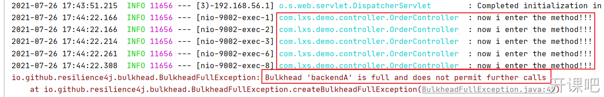

3. 线程池隔离

   FixedThreadPoolBulkhead配置如下表所示:

   | 配置名称           | 默认值                                         | 含义                                                         |
   | ------------------ | ---------------------------------------------- | ------------------------------------------------------------ |
   | maxThreadPoolSize  | Runtime.getRuntime().availableProcessors()     | 配置最大线程池大小                                           |
   | coreThreadPoolSize | Runtime.getRuntime().availableProcessors() - 1 | 配置核心线程池大小                                           |
   | queueCapacity      | 100                                            | 配置队列的容量                                               |
   | keepAliveDuration  | 20ms                                           | 当线程数大于核心时,这是多余空闲线程在终止前等待新任务的最长时间 |

   支付工程的application.yml配置如下:

   ```yaml
   resilience4j:
     thread-pool-bulkhead:
       configs:
         default:
           maxThreadPoolSize: 4 # 最大线程池大小
           coreThreadPoolSize: 2 # 核心线程池大小
           queueCapacity: 2 # 队列容量
       instances:
         backendA:
           baseConfig: default
         backendB:
           maxThreadPoolSize: 1
           coreThreadPoolSize: 1
           queueCapacity: 1
   ```

   增加OrderService,注意:FixedThreadPoolBulkhead只对CompletableFuture方法有效,所以我们必创建返回CompletableFuture类型的方法.

   ```java
   @Service
   @Slf4j
   public class OrderService {
   
       @Bulkhead(name = "backendA", type = Bulkhead.Type.THREADPOOL)
       public CompletableFuture<Payment> getPaymet() throws InterruptedException {
           log.info("now i enter the method!!!");
           Thread.sleep(10000L);
           log.info("now i exist the method!!!");
           return CompletableFuture.supplyAsync(() -> new Payment(123, "线程池隔离回退。。。"));
       }
   
   }
   ```

   修改OrderController代码如下:

   ```java
       @Autowired
       private OrderService orderService;
   
   	@GetMapping("/payment/{id}")
       public ResponseEntity<Payment> getPaymentById(@PathVariable("id") Integer id) throws InterruptedException, ExecutionException {
           return ResponseEntity.ok(orderService.getPaymet().get());
       }
   ```

   我们分析一下配置的线程池隔离,4个请求进入线程执行(maxThreadPoolSize: 4 ),2个请求(queueCapacity: 2)进入有界队列等待,等待10秒后有线程执行结束,队列中的线程开始执行.

   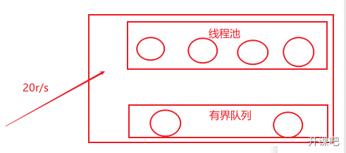

   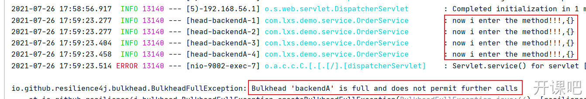

#### 限流(RateLimiter)

1. 添加依赖

   ```xml
       <dependency>
         <groupId>io.github.resilience4j</groupId>
         <artifactId>resilience4j-ratelimiter</artifactId>
         <version>1.7.0</version>
       </dependency>
   ```

2. 配置文件

   R4的限流模块RateLimter基于滑动窗口,和令牌桶限流算法,配置如下表所示:

   | **属性**           | **默认值** | **描述**                                                     |
   | ------------------ | ---------- | ------------------------------------------------------------ |
   | timeoutDuration    | 5秒        | 线程等待权限的默认等待时间                                   |
   | limitRefreshPeriod | 500纳秒    | 限流器每隔limitRefreshPeriod刷新一次,将允许处理的最大请求数量重置为limitForPeriod. |
   | limitForPeriod     | 50         | 在一次刷新周期内,允许执行的最大请求数                        |

   在订单工程的application.yml中配置如下:

   ```yaml
   resilience4j:
     ratelimiter:
       configs:
         default:
           timeoutDuration: 5 # 线程等待权限的默认等待时间
           limitRefreshPeriod: 1s # 限流器每隔1s刷新一次,将允许处理的最大请求重置为2
           limitForPeriod: 2 #在一个刷新周期内,允许执行的最大请求数
       instances:
         backendA:
           baseConfig: default
         backendB:
           timeoutDuration: 5
           limitRefreshPeriod: 1s
           limitForPeriod: 5
   ```

   修改OrderController代码如下:

   ```java
       @GetMapping("/payment/{id}")
       @RateLimiter(name = "backendA", fallbackMethod = "fallback")
       public ResponseEntity<Payment> getPaymentById(@PathVariable("id") Integer id) throws InterruptedException, ExecutionException {
           log.info("now i enter the method!!!");
   
           Thread.sleep(10000L); //阻塞10秒,用于测试慢调用比例熔断
   
           String url = "http://cloud-payment-service/payment/" + id;
           Payment payment = restTemplate.getForObject(url, Payment.class);
   
           log.info("now i exist the method!!!");
   
           return ResponseEntity.ok(payment);
       }
   ```

3. 启动并测试

   因为在一个刷新周期1s(limitRefreshPeriod: 1s)允许执行的最大请求数为2(limitForPeriod: 2),等待令牌时间5s(timeoutDuration: 5),并发发送20个请求后,只有2个请求拿到令牌执行,另外2个请求等5秒后拿到令牌,其他16个请求直接降级.

   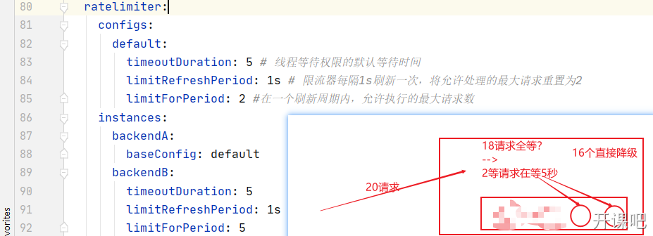

   执行效果如下图:

   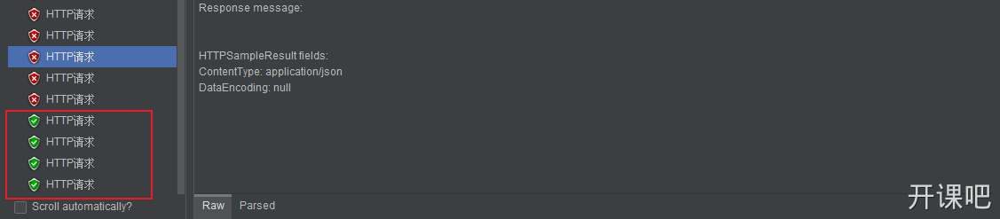

# 微服务网关Spring Cloud Gateway

​		之前我们介绍了通过Spring Cloud LoadBalancer实现了微服务之间的调用和负载均衡,以及使用Spring Cloud OpenFeign声明式调用,那我们的各种微服务又要如何提供给外部应用调用呢?

​		当然,因为是REST API接口,外部客户端直接调用各个微服务是没有问题的.但出于种种原因,这并不是一个好的选择.让客户端直接与各个微服务通讯,会存在以下几个问题.

- 客户端会多次请求不同的微服务,增加了客户端的复杂性.
- 存在跨域请求,在一定场景下处理会变得相对比较复杂.

- 实现认证复杂,每个微服务都需要独立认证.
- 难以重构,项目迭代可能导致微服务重新划分.如果客户端直接与微服务通讯,那么重构将会很难实施.

- 如果某些微服务使用了防火墙、浏览器不友好的协议,直接访问会有一定困难.


​		面对类似上面的问题,我们要如何解决呢?答案就是:**服务网关**!在微服务系统中微服务资源一般不直接暴露给我外部客户端访问,这样做的好处是将内部服务隐藏起来,从而解决上述问题.

​		网关有很多重要的意义,具体体现在下面几个方面:

- 网关可以做一些身份认证、权限管理、防止非法请求操作服务等,对服务起一定保护作用.
- 网关将所有微服务统一管理,对外统一暴露,外界系统不需要知道微服务架构个服务相互调用的复杂性,同时也避免了内部服务一些敏感信息泄露问题.

- 易于监控.可在微服务网关收集监控数据并将其推送到外部系统进行分析.
- 客户端只跟服务网关打交道,减少了客户端与各个微服务之间的交互次数.

- 多渠道支持,可以根据不同客户端(WEB端、移动端、桌面端...)提供不同的API服务网关.
- 网关可以用来做流量监控.在高并发下,对服务限流、降级.

- 网关把服务从内部分离出来,方便测试.

​		微服务网关能够实现路由、负载均衡等多种功能,类似Nginx反向代理的功能.在微服务架构中,后端服务往往不直接开放给调用端,而是通过一个API网关根据请求的URL,路由到相应的服务.当添加API网关后,在第三方调用端和服务提供方之间就创建了一面墙,在API网关中进行权限控制,同时API网关将请求以负载均衡的方式发送给后端服务.

## Spring Cloud Gateway入门

### 简介

​		Spring Cloud Gateway 是 Spring Cloud 的一个全新项目,该项目是基于 Spring 5.0,Spring Boot 2.0 和 Project Reactor 等技术开发的网关,它旨在为微服务架构提供一种简单有效的统一的 API 路由管理方式.

​		Spring Cloud Gateway 作为 Spring Cloud 生态系统中的网关,目标是替代 Zuul,在Spring Cloud 2.0以上版本中,没有对新版本的Zuul 2.0以上最新高性能版本进行集成,仍然还是使用的Zuul 2.0之前的非Reactor模式的老版本.而为了提升网关的性能,Spring Cloud Gateway是基于WebFlux框架实现的,而WebFlux框架底层则使用了高性能的Reactor模式通信框架Netty.

​		Spring Cloud Gateway 的目标,不仅提供统一的路由方式,并且基于 Filter 链的方式提供了网关基本的功能,例如:安全,监控/指标和限流.

​		注意:Spring Cloud Gateway 底层使用了高性能的通信框架Netty.

### 特征

​		Spring Cloud官方,对Spring Cloud Gateway 特征介绍如下:

- 基于 Spring Framework 5,Project Reactor 和 Spring Boot 2.0
- 集成 Spring Cloud DiscoveryClient

- Predicates 和 Filters 作用于特定路由,易于编写的 Predicates 和 Filters
- 具备一些网关的高级功能:动态路由、限流、路径重写

- 集成Spring Cloud DiscoveryClient
- 集成熔断器CircuitBreaker

​		从以上的特征来说,和Zuul的特征差别不大.Spring Cloud Gateway和Zuul主要的区别,还是在底层的通信框架上.

​		简单说明一下上下文的三个术语:

**Filter(过滤器):**

​		和Zuul的过滤器在概念上类似,可以使用它拦截和修改请求,并且对下游的响应,进行二次处理.过滤器为org.springframework.cloud.gateway.filter.GatewayFilter类的实例.

**Route(路由):**

​		网关配置的基本组成模块,和Zuul的路由配置模块类似.一个Route模块由一个 ID,一个目标 URI,一组断言和一组过滤器定义.如果断言为真,则路由匹配,目标URI会被访问.

**Predicate(断言):**

​		这是一个 Java 8 的 Predicate,可以使用它来匹配来自 HTTP 请求的任何内容,例如 headers 或参数.断言的输入类型是一个 ServerWebExchange.

### 入门案例

创建微服务网关工程05_cloud_gateway.

1. 添加依赖

   添加依赖Eureka Discovery Client,Spring Cloud Gateway.

   pom.xml

   ```xml
   <?xml version="1.0" encoding="UTF-8"?>
   <project xmlns="http://maven.apache.org/POM/4.0.0" xmlns:xsi="http://www.w3.org/2001/XMLSchema-instance"
            xsi:schemaLocation="http://maven.apache.org/POM/4.0.0 https://maven.apache.org/xsd/maven-4.0.0.xsd">
       <modelVersion>4.0.0</modelVersion>
       <parent>
           <groupId>org.springframework.boot</groupId>
           <artifactId>spring-boot-starter-parent</artifactId>
           <version>2.4.9</version>
           <relativePath/> <!-- lookup parent from repository -->
       </parent>
       <groupId>com.lxs.demo</groupId>
       <artifactId>05_cloud_gateway</artifactId>
       <version>0.0.1-SNAPSHOT</version>
       <name>05_cloud_gateway</name>
       <description>Demo project for Spring Boot</description>
       <properties>
           <java.version>1.8</java.version>
           <spring-cloud.version>2020.0.3</spring-cloud.version>
       </properties>
       <dependencies>
           <dependency>
               <groupId>org.springframework.cloud</groupId>
               <artifactId>spring-cloud-starter-gateway</artifactId>
           </dependency>
           <dependency>
               <groupId>org.springframework.cloud</groupId>
               <artifactId>spring-cloud-starter-netflix-eureka-client</artifactId>
           </dependency>
   
           <dependency>
               <groupId>org.springframework.boot</groupId>
               <artifactId>spring-boot-devtools</artifactId>
               <scope>runtime</scope>
               <optional>true</optional>
           </dependency>
           <dependency>
               <groupId>org.projectlombok</groupId>
               <artifactId>lombok</artifactId>
               <optional>true</optional>
           </dependency>
           <dependency>
               <groupId>org.springframework.boot</groupId>
               <artifactId>spring-boot-starter-test</artifactId>
               <scope>test</scope>
           </dependency>
       </dependencies>
       <dependencyManagement>
           <dependencies>
               <dependency>
                   <groupId>org.springframework.cloud</groupId>
                   <artifactId>spring-cloud-dependencies</artifactId>
                   <version>${spring-cloud.version}</version>
                   <type>pom</type>
                   <scope>import</scope>
               </dependency>
           </dependencies>
       </dependencyManagement>
   
       <build>
           <plugins>
               <plugin>
                   <groupId>org.springframework.boot</groupId>
                   <artifactId>spring-boot-maven-plugin</artifactId>
                   <configuration>
                       <excludes>
                           <exclude>
                               <groupId>org.projectlombok</groupId>
                               <artifactId>lombok</artifactId>
                           </exclude>
                       </excludes>
                   </configuration>
               </plugin>
           </plugins>
       </build>
   
   </project>
   ```

2. 启动器

   ```java
   package com.lxs.demo;
   
   import org.springframework.boot.SpringApplication;
   import org.springframework.boot.autoconfigure.SpringBootApplication;
   import org.springframework.cloud.client.circuitbreaker.EnableCircuitBreaker;
   import org.springframework.cloud.client.discovery.EnableDiscoveryClient;
   import org.springframework.cloud.gateway.route.RouteLocator;
   import org.springframework.cloud.gateway.route.builder.RouteLocatorBuilder;
   import org.springframework.context.annotation.Bean;
   
   @SpringBootApplication
   @EnableDiscoveryClient
   public class GatewayApplication {
   
       public static void main(String[] args) {
           SpringApplication.run(GatewayApplication.class, args);
       }
   
   }
   ```

3. application.yml

   ```yaml
   server:
     port: 9005
   spring:
     application:
       name: api-gateway
     cloud:
       gateway:
         routes:
           - id: url-proxy-1
             uri: https://blog.csdn.net
             predicates:
               - Path=/csdn      
   eureka:
     client:
       service-url:
         defaultZone: http://127.0.0.1:9004/eureka
   ```

4. 启动并测试

   启动Eureka Server和网关微服务访问http://localhost:9005/csdn,发现路由到了https://blog.csdn.net.

### 处理流程

​		客户端向 Spring Cloud Gateway 发出请求,然后在 Gateway Handler Mapping 中找到与请求相匹配的路由,将其发送到 Gateway Web Handler.Handler 再通过指定的过滤器链来将请求发送到我们实际的服务执行业务逻辑,然后返回.过滤器之间用虚线分开是因为过滤器可能会在发送代理请求之前("pre")或之后("post")执行业务逻辑.

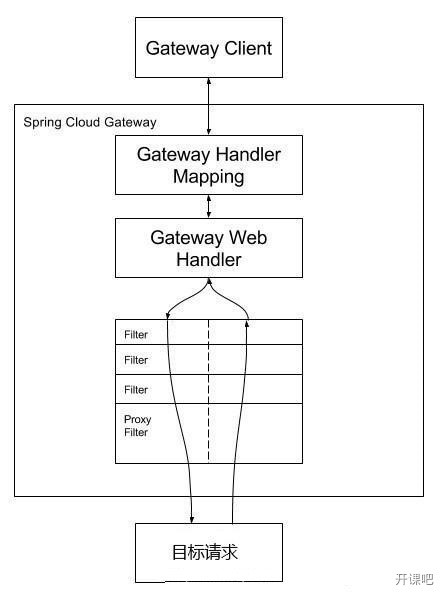

## 路由配置方式

​		路由是网关配置的基本组成模块,和Zuul的路由配置模块类似.一个Route模块由一个 ID,一个目标 URL,一组断言和一组过滤器定义.如果断言为真,则路由匹配,目标URI会被访问.

### 基础路由配置方式

​		如果请求的目标地址是单个的URI资源路径,配置文件实例如下:

```yaml
spring:
  application:
    name: api-gateway
  cloud:
    gateway:
      routes:
        - id: service1
          uri: https://blog.csdn.net
          predicates:
            - Path=/csdn
```

​		各字段含义如下:

- id: 我们自定义的路由 ID,保持唯一
- uri: 目标服务地址

- predicates: 路由条件,Predicate 接受一个输入参数,返回一个布尔值结果.该接口包含多种默认方法来将 Predicate 组合成其他复杂的逻辑(比如与或非).

​		上面这段配置的意思是,配置了一个 id 为 service1的URI代理规则,路由的规则为,当访问地址http://localhost:8080/csdn/1.jsp时,会路由到上游地址https://blog.csdn.net/1.jsp.

### 基于代码的路由配置方式

​		转发功能同样可以通过代码来实现,我们可以在启动类 GateWayApplication 中添加方法 customRouteLocator() 来定制转发规则.

```java
@SpringBootApplication
@EnableDiscoveryClient
public class GatewayApplication {

    public static void main(String[] args) {
        SpringApplication.run(GatewayApplication.class, args);
    }

    @Bean
    public RouteLocator customRouteLocator(RouteLocatorBuilder builder) {
        return builder.routes()
                .route("path_route", r -> r.path("/csdn")
                        .uri("https://blog.csdn.net"))
                .build();
    }
}
```

### 和注册中心相结合的路由配置方式

​		在uri的schema协议部分为lb:,后面跟serviceId,表示从微服务注册中心(如Eureka)订阅服务,并且通过负载均衡进行服务的路由.

```yaml
server:
  port: 9005
spring:
  application:
    name: api-gateway
  cloud:
    gateway:
      routes:
        - id: service1
          uri: https://blog.csdn.net
          predicates:
            - Path=/csdn
        - id: service2
#          uri: http://127.0.0.1:9001
          uri: lb://cloud-payment-service
          predicates:
            - Path=/payment/**
eureka:
  client:
    service-url:
      defaultZone: http://127.0.0.1:9004/eureka
```

​		注册中心相结合的路由配置方式,与单个URI的路由配置,区别其实很小,仅仅在于URI的schema协议不同.单个URI的地址的schema协议,一般为http或者https协议.启动多个支付微服务,会发现端口9000和9001轮流出现.

## 路由匹配规则

​		Spring Cloud Gateway的主要功能之一是转发请求,转发规则的定义主要包含三个部分:

| 定义      | 描述                                                         |
| --------- | ------------------------------------------------------------ |
| Route     | 路由是网关的基本单元,由ID、URI、一组Predicate、一组Filter组成,根据Predicate进行匹配转发. |
| Predicate | 路由转发的判断条件,目前Spring Cloud Gateway支持多种方式,常见如:Path、Query、Method、Header等,写法必须遵循 key=vlue的形式. |
| Filter    | 过滤器是路由转发请求时所经过的过滤逻辑,可用于修改请求、响应内容. |

​		Spring Cloud Gateway 的功能很强大,我们仅仅通过 Predicates 的设计就可以看出来,前面我们只是使用了 predicates 进行了简单的条件匹配,其实 Spring Cloud Gataway 帮我们内置了很多 Predicates 功能.

​		Spring Cloud Gateway 是通过 Spring WebFlux 的 HandlerMapping 做为底层支持来匹配到转发路由,Spring Cloud Gateway 内置了很多 Predicates 工厂,这些 Predicates 工厂通过不同的 HTTP 请求参数来匹配,多个 Predicates 工厂可以组合使用.

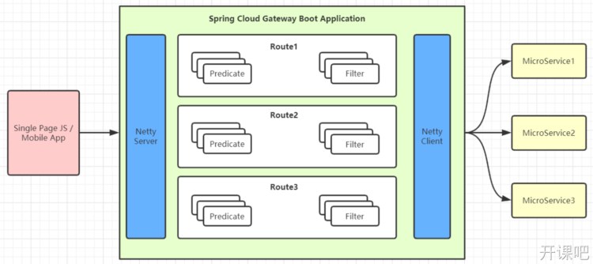

### Predicate断言条件

​		Predicate 来源于 Java 8,是 Java 8 中引入的一个函数,Predicate 接受一个输入参数,返回一个布尔值结果.该接口包含多种默认方法来将 Predicate 组合成其他复杂的逻辑.可以用于接口请求参数校验、判断新老数据是否有变化需要进行更新操作.

​		在 Spring Cloud Gateway 中 Spring 利用 Predicate 的特性实现了各种路由匹配规则,有通过 Header、请求参数等不同的条件来进行作为条件匹配到对应的路由.网上有一张图总结了 Spring Cloud 内置的几种 Predicate 的实现,如下图所示:

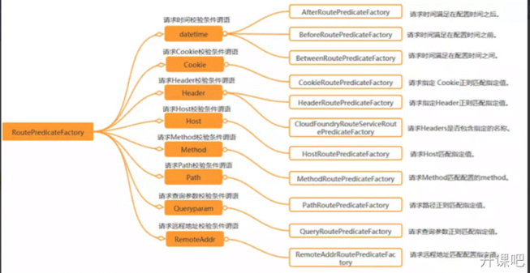

​		说白了 Predicate 就是为了实现一组匹配规则,方便让请求过来找到对应的 Route 进行处理,接下来我们接下 Spring Cloud GateWay 内置几种 Predicate 的使用.转发规则(predicates),假设转发uri都设定为[http://localhost:](http://localhost:9023/)9001,常见Predicate如下表所示:

| 规则    | 实例                                                         | 说明                                                         |
| ------- | ------------------------------------------------------------ | ------------------------------------------------------------ |
| Path    | - Path=/gate/,/rule/                                         | 当请求的路径为gate、rule开头的时,转发到http://localhost:9001服务器上 |
| Before  | - Before=2017-01-20T17:42:47.789-07:00[America/Denver]       | 在某个时间之前的请求才会被转发到 http://localhost:9001服务器上 |
| After   | - After=2017-01-20T17:42:47.789-07:00[America/Denver]        | 在某个时间之后的请求才会被转发                               |
| Between | - Between=2017-01-20T17:42:47.789-07:00[America/Denver],2017-01-21T17:42:47.789-07:00[America/Denver] | 在某个时间段之间的才会被转发                                 |
| Cookie  | - Cookie=chocolate, ch.p                                     | 名为chocolate的表单或者满足正则ch.p的表单才会被匹配到进行请求转发 |
| Header  | - Header=X-Request-Id, \d+                                   | 携带参数X-Request-Id或者满足\d+的请求头才会匹配              |
| Host    | - Host=www.hd123.com                                         | 当主机名为www.hd123.com的时候直接转发到http://localhost:9001服务器上 |
| Method  | - Method=GET                                                 | 只有GET方法才会匹配转发请求,还可以限定POST、PUT等请求方式    |

1. **通过请求参数匹配**

   Query Route Predicate 支持传入两个参数,一个是属性名一个为属性值,属性值可以是正则表达式.

   ```yaml
   spring:
     cloud:
       gateway:
         routes:
           - id: service3
             uri: https://www.baidu.com
             order: 0
             predicates:
               - Query=smile
   ```

   这样配置,只要请求中包含 smile 属性的参数即可匹配路由.使用 curl 测试,命令行输入:curl localhost:9005?smile=x&id=2,经过测试发现只要请求汇总带有 smile 参数即会匹配路由,不带 smile 参数则不会匹配.

   还可以将 Query 的值以键值对的方式进行配置,这样在请求过来时会对属性值和正则进行匹配,匹配上才会走路由.

   ```yaml
   spring:
     cloud:
       gateway:
         routes:
           - id: service3
             uri: https://www.baidu.com
             order: 0
             predicates:
               - Query=keep, pu.
   ```

   这样只要当请求中包含 keep 属性并且参数值是以 pu 开头的长度为三位的字符串才会进行匹配和路由.

   使用 curl 测试,命令行输入:curl localhost:8080?keep=pub,测试可以返回页面代码,将 keep 的属性值改为 pubx 再次访问就会报 404,证明路由需要匹配正则表达式才会进行路由.

2. **通过Header匹配**

   Header Route Predicate 和 Query Route Predicate 一样,也是接收 2 个参数,一个 header 中属性名称和一个正则表达式,这个属性值和正则表达式匹配则执行.

   ```yaml
   spring:
     cloud:
       gateway:
         routes:        
           - id: service4
             uri: https://www.baidu.com
             order: 0
             predicates:
               - Header=X-Request-Id, \d+
   ```

   使用 curl 测试,命令行输入:curl [http://localhost:](http://localhost:8080/)9005 -H "X-Request-Id:88",则返回页面代码证明匹配成功.将参数-H "X-Request-Id:88"改为-H "X-Request-Id:spring",再次执行时返回404证明没有匹配.

3. **通过Cookie匹配**

   Cookie Route Predicate 可以接收两个参数,一个是 Cookie name,一个是正则表达式,路由规则会通过获取对应的 Cookie name 值和正则表达式去匹配,如果匹配上就会执行路由,如果没有匹配上则不执行.

   ```yaml
   spring:
     cloud:
       gateway:
         routes:        
           - id: service5
             uri: https://www.baidu.com
             predicates:
               - Cookie=sessionId, test
   ```

   使用 curl 测试,命令行输入:curl [http://localhost:](http://localhost:8080/)9005 --cookie "sessionId=test",则会返回页面代码,如果去掉--cookie "sessionId=test",后台汇报 404 错误.

4. **通过Host匹配**

   Host Route Predicate 接收一组参数,一组匹配的域名列表,这个模板是一个 ant 分隔的模板,用`.`号作为分隔符.它通过参数中的主机地址作为匹配规则.

   ```yaml
   spring:
     cloud:
       gateway:
         routes:    
           - id: service6
             uri: https://www.baidu.com
             predicates:
               - Host=**.baidu.com      
   ```

   使用 curl 测试,命令行输入:curl [http://localhost:](http://localhost:8080/)9005 -H "Host: www.baidu.com"或者curl [http://localhost:8080](http://localhost:8080/) -H "Host: md.baidu.com",经测试以上两种 host 均可匹配到 host_route 路由,去掉 host 参数则会报 404 错误.

5. **通过请求方式匹配**

   可以通过是 POST、GET、PUT、DELETE 等不同的请求方式来进行路由.

   ```yaml
   spring:
     cloud:
       gateway:
         routes:    
           - id: service7
             uri: https://www.baidu.com
             predicates:
               - Method=PUT
   ```

   使用 curl 测试,命令行输入:curl -X PUT [http://localhost:](http://localhost:8080/)9005,测试返回页面代码,证明匹配到路由,以其他方式,返回 404 没有找到,证明没有匹配上路由.

6. **通过请求路径匹配**

   Path RoutePredicate 接收一个匹配路径的参数来判断是否路由.

   ```yaml
   spring:
     cloud:
       gateway:
         routes:    
           - id: service8
             uri: http://127.0.0.1:9001
             predicates:
               - Path=/payment/{segment}
   ```

   如果请求路径符合要求,则此路由将匹配, curl 测试,命令行输入:curl [http://localhost:9005/payment/1](http://localhost:8080/foo/1),可以正常获取到页面返回值,curl [http://localhost:9005/payment2/1](http://localhost:8080/foo/1),报404,证明路由是通过指定路由来匹配.

7. **组合匹配**

   ```yaml
   spring:
     cloud:
       gateway:
         routes:    
           - id: service9
             uri: https://www.baidu.com
             order: 0
             predicates:
               - Host=**.foo.org
               - Path=/headers
               - Method=GET
               - Header=X-Request-Id, \d+
               - Query=foo, ba.
               - Query=baz
               - Cookie=chocolate, ch.p
   ```

   各种 Predicates 同时存在于同一个路由时,请求必须同时满足所有的条件才被这个路由匹配.一个请求满足多个路由的断言条件时,请求只会被首个成功匹配的路由转发.

### 过滤器规则

1. **PrefixPath**

   对所有的请求路径添加前缀

   ```yaml
   spring:
     cloud:
       gateway:
         routes:    
           - id: service10
             uri: http://127.0.0.1:9001
             predicates:
               - Path=/{segment}
             filters:
               - PrefixPath=/payment
   ```

   访问/123请求被发送到http://127.0.0.1:9001/payment/123

2. **StripPrefix**

   跳过指定的路径

   ```yaml
   spring:
     cloud:
       gateway:
         routes:    
           - id: service11
             uri: http://127.0.0.1:9001
             predicates:
               - Path=/api/{segment}
             filters:
               - StripPrefix=1
               - PrefixPath=/payment
   ```

   此时访问http://localhost:9005/api/123,首先StripPrefix过滤器去掉一个/api,然后PrefixPath过滤器加上一个/payment,能够正确访问到支付微服务.

3. **RewritePath**

   ```yaml
   spring:
     cloud:
       gateway:
         routes:        
           - id: service12
             uri: http://127.0.0.1:9001
             predicates:
               - Path=/api/payment/**
             filters:
               - RewritePath=/api/(?<segment>.*), /$\{segment}
   ```

   请求http://localhost:9005/api/payment/123路径,RewritePath过滤器将路径重写为[http://localhost:9005/payment/123](http://localhost:9005/api/payment/123),能够正确访问支付微服务.

4. **SetPath**

   ```yaml
   spring:
     cloud:
       gateway:
         routes:           
           - id: service13
             uri: http://127.0.0.1:9001
             predicates:
               - Path=/api/payment/{segment}
             filters:
               - SetPath=/payment/{segment}
   ```

   请求http://localhost:9005/api/payment/123路径,SetPath过滤器将路径设置为[http://localhost:9005/payment/123](http://localhost:9005/api/payment/123),能够正确访问支付微服务.

5. **RemoveRequestHeader**

   去掉某个请求头信息

   ```yaml
   spring:
     cloud:
       gateway:
         routes:
           - id: removerequestheader_route
             uri: https://example.org
             filters:
             - RemoveRequestHeader=X-Request-Foo
   ```

   去掉请求头X-Request-Foo.

6. **RemoveResponseHeader**

   去掉某个响应头信息.

   ```yaml
   spring:
     cloud:
       gateway:
         routes:
           - id: removerequestheader_route
             uri: https://example.org
             filters:
             - RemoveResponseHeader=X-Request-Foo
   ```

7. **RemoveRequestParameter**

   去掉某个请求参数信息.

   ```yaml
   spring:
     cloud:
       gateway:
         routes:
           - id: removerequestparameter_route
             uri: https://example.org
             filters:
             - RemoveRequestParameter=red
   ```

8. **SetRequestHeader**

   设置请求头信息.

   ```yaml
   spring:
     cloud:
       gateway:
         routes:
           - id: setrequestheader_route
             uri: https://example.org
             filters:
             - SetRequestHeader=X-Request-Red, Blue
   ```

9. **default-filters**

   对所有的请求添加过滤器.

   ```yaml
   spring:
     cloud:
       gateway:
         routes:        
           - id: service14
             uri: http://127.0.0.1:9001
             predicates:
               - Path=/9001/{segment}
           - id: service15
             uri: http://127.0.0.1:9000
             predicates:
               - Path=/9000/{segment}
         default-filters:
         	- StripPrefix=1
           - PrefixPath=/payment
   ```

## 自定义过滤器

### 过滤器执行次序

​		Spring-Cloud-Gateway 基于过滤器实现,同 zuul 类似,有pre和post两种方式的 filter,分别处理前置逻辑和后置逻辑.客户端的请求先经过pre类型的 filter,然后将请求转发到具体的业务服务,收到业务服务的响应之后,再经过post类型的 filter 处理,最后返回响应到客户端.

​		过滤器执行流程如下,order 越大,优先级越低.

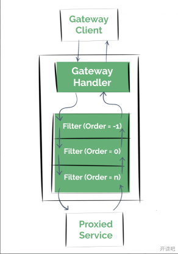

​		过滤器分为全局过滤器和局部过滤器.

- 全局过滤器: 对所有路由生效.
- 局部过滤器: 对指定的路由生效.

### 全局过滤器

​		实现 GlobalFilter 和 Ordered,重写相关方法,加入到spring容器管理即可,无需配置,全局过滤器对所有的路由都有效,代码如下:

```java
//@Configuration
public class FilterConfig
{

    @Bean
    public GlobalFilter a()
    {
        return new AFilter();
    }

    @Bean
    public GlobalFilter b()
    {
        return new BFilter();
    }

    @Bean
    public GlobalFilter c()
    {
        return new CFilter();
    }

    @Bean
    public GlobalFilter myAuthFilter()
    {
        return new MyAuthFilter();
    }


    @Slf4j
    static class AFilter implements GlobalFilter, Ordered
    {

        @Override
        public Mono<Void> filter(ServerWebExchange exchange, GatewayFilterChain chain)
        {
            log.info("AFilter前置逻辑");
            return chain.filter(exchange).then(Mono.fromRunnable(() ->
            {
                log.info("AFilter后置逻辑");
            }));
        }

        //   值越小，优先级越高
        @Override
        public int getOrder()
        {
            return HIGHEST_PRECEDENCE + 100;
        }
    }

    @Slf4j
    static class BFilter implements GlobalFilter, Ordered
    {
        @Override
        public Mono<Void> filter(ServerWebExchange exchange, GatewayFilterChain chain)
        {
            log.info("BFilter前置逻辑");
            return chain.filter(exchange).then(Mono.fromRunnable(() ->
            {
                log.info("BFilter后置逻辑");
            }));
        }

        @Override
        public int getOrder()
        {
            return HIGHEST_PRECEDENCE + 200;
        }
    }

    @Slf4j
    static class CFilter implements GlobalFilter, Ordered
    {

        @Override
        public Mono<Void> filter(ServerWebExchange exchange, GatewayFilterChain chain)
        {
            log.info("CFilter前置逻辑");
            return chain.filter(exchange).then(Mono.fromRunnable(() ->
            {
                log.info("CFilter后置逻辑");
            }));
        }

        @Override
        public int getOrder()
        {
            return HIGHEST_PRECEDENCE + 300;
        }
    }


    @Slf4j
    static class MyAuthFilter implements GlobalFilter, Ordered {

        @Override
        public Mono<Void> filter(ServerWebExchange exchange, GatewayFilterChain chain) {
            log.info("MyAuthFilter权限过滤器");
            String token = exchange.getRequest().getHeaders().getFirst("token");
            if (StringUtils.isBlank(token)) {
                exchange.getResponse().setStatusCode(HttpStatus.UNAUTHORIZED);
                return exchange.getResponse().setComplete();
            }

            return chain.filter(exchange);
        }

        @Override
        public int getOrder() {
            return HIGHEST_PRECEDENCE + 400;
        }
    }

}
```

​		定义了4个全局过滤器,顺序为A>B>C>MyAuthFilter,其中全局过滤器MyAuthFilter中判断令牌是否存在,如果令牌不存在,则返回401状态码,表示没有权限访问,使用Postman执行请求:

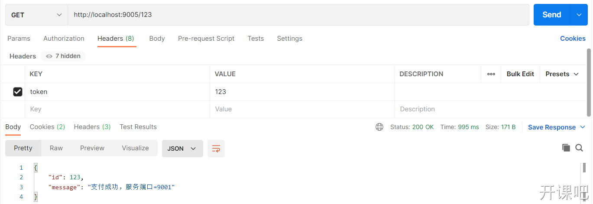

### 局部过滤器

定义局部过滤器步骤如下:

1. 需要实现GatewayFilter,Ordered,实现相关的方法
2. 包装GatewayFilter,产生GatewayFilterFactory
3. GatewayFilterFactory加入到过滤器工厂,并且注册到spring容器中.
4. 在配置文件中进行配置,如果不配置则不启用此过滤器规则

接下来定义局部过滤器,对于请求头user-id校验,如果不存在user-id请求头,直接返回状态码406.

```java
@Component
public class UserIdCheckGatewayFilterFactory extends AbstractGatewayFilterFactory<Object>
{
    @Override
    public GatewayFilter apply(Object config)
    {
        return new UserIdCheckGateWayFilter();
    }

    @Slf4j
    static class UserIdCheckGateWayFilter implements GatewayFilter, Ordered
    {
        @Override
        public Mono<Void> filter(ServerWebExchange exchange, GatewayFilterChain chain)
        {
            String url = exchange.getRequest().getPath().pathWithinApplication().value();
            log.info("请求URL:" + url);
            log.info("method:" + exchange.getRequest().getMethod());
            //获取header
            String userId = exchange.getRequest().getHeaders().getFirst("user-id");
            log.info("userId：" + userId);

            if (StringUtils.isBlank(userId))
            {
                log.info("*****头部验证不通过，请在头部输入  user-id");
                //终止请求，直接回应
                exchange.getResponse().setStatusCode(HttpStatus.NOT_ACCEPTABLE);
                return exchange.getResponse().setComplete();
            }
            return chain.filter(exchange);
        }

        //   值越小，优先级越高
        @Override
        public int getOrder()
        {
            return HIGHEST_PRECEDENCE;
        }
    }

}
```

application.yml

```yaml
spring:
  cloud:
    gateway:
      routes:        
        - id: service14
          uri: http://127.0.0.1:9001
          predicates:
            - Path=/{segment}
      default-filters:
        - PrefixPath=/payment
        - UserIdCheck
```

## 高级特性

### 熔断降级

​		在分布式系统中,网关作为流量的入口,因此会有大量的请求进入网关,向其他服务发起调用,其他服务不可避免的会出现调用失败(超时、异常),失败时不能让请求堆积在网关上,需要快速失败并返回给客户端,想要实现这个要求,就必须在网关上做熔断、降级操作.

​		为什么在网关上请求失败需要快速返回给客户端?因为当一个客户端请求发生故障的时候,这个请求会一直堆积在网关上,当然只有一个这种请求,网关肯定没有问题(如果一个请求就能造成整个系统瘫痪,那这个系统可以下架了),但是网关上堆积多了就会给网关乃至整个服务都造成巨大的压力,甚至整个服务宕掉.因此要对一些服务和页面进行有策略的降级,以此缓解服务器资源的的压力,以保证核心业务的正常运行,同时也保持了客户和大部分客户的得到正确的相应,所以需要网关上请求失败需要快速返回给客户端.

​		CircuitBreaker过滤器使用Spring Cloud CircuitBreaker API 将网关路由包装在断路器中.Spring Cloud CircuitBreaker 支持多个可与 Spring Cloud Gateway 一起使用熔断器库,比如Spring Cloud 支持开箱即用的 Resilience4J.

​		要启用Spring Cloud CircuitBreaker过滤器,步骤如下:

1. 添加依赖

   ```xml
           <dependency>
               <groupId>org.springframework.cloud</groupId>
               <artifactId>spring-cloud-starter-circuitbreaker-reactor-resilience4j</artifactId>
           </dependency>
   ```

2. application.yml

   ```yaml
   server:
     port: 9005
   spring:
     application:
       name: api-gateway
     cloud:
       gateway:
         routes:
           - id: service14
             uri: http://127.0.0.1:9001
             predicates:
               - Path=/payment/{segment}
             filters:
               - name: CircuitBreaker
                 args:
                   name: backendA
                   fallbackUri: forward:/fallbackA
   
   eureka:
     client:
       service-url:
         defaultZone: http://127.0.0.1:9004/eureka
   
   resilience4j:
     circuitbreaker:
       configs:
         default:
           failureRateThreshold: 30 #失败请求百分比,超过这个比例,CircuitBreaker变为OPEN状态
           slidingWindowSize: 10 #滑动窗口的大小,配置COUNT_BASED,表示10个请求,配置TIME_BASED表示10秒
           minimumNumberOfCalls: 5 #最小请求个数,只有在滑动窗口内,请求个数达到这个个数,才会触发CircuitBreader对于断路器的判断
           slidingWindowType: TIME_BASED #滑动窗口的类型
           permittedNumberOfCallsInHalfOpenState: 3 #当CircuitBreaker处于HALF_OPEN状态的时候,允许通过的请求个数
           automaticTransitionFromOpenToHalfOpenEnabled: true #设置true,表示自动从OPEN变成HALF_OPEN，即使没有请求过来
           waitDurationInOpenState: 2s #从OPEN到HALF_OPEN状态需要等待的时间
           recordExceptions: #异常名单
             - java.lang.Exception
       instances:
         backendA:
           baseConfig: default
         backendB:
           failureRateThreshold: 50
           slowCallDurationThreshold: 2s #慢调用时间阈值,高于这个阈值的呼叫视为慢调用,并增加慢调用比例。
           slowCallRateThreshold: 30 #慢调用百分比阈值,断路器把调用时间大于slowCallDurationThreshold，视为慢调用，当慢调用比例大于阈值,断路器打开,并进行服务降级
           slidingWindowSize: 10
           slidingWindowType: TIME_BASED
           minimumNumberOfCalls: 2
           permittedNumberOfCallsInHalfOpenState: 2
           waitDurationInOpenState: 120s #从OPEN到HALF_OPEN状态需要等待的时间
   ```

3. 全局过滤器

   创建一个全局过滤器,打印熔断器状态.

   ```java
   @Component
   @Slf4j
   public class CircuitBreakerLogFilter implements GlobalFilter, Ordered {
   
       @Autowired
       private CircuitBreakerRegistry circuitBreakerRegistry;
   
       @Override
       public Mono<Void> filter(ServerWebExchange exchange, GatewayFilterChain chain) {
           String url = exchange.getRequest().getPath().pathWithinApplication().value();
           log.info("url : {} status : {}", url, circuitBreakerRegistry.circuitBreaker("backendA").getState().toString());
           return chain.filter(exchange);
       }
   
       @Override
       public int getOrder() {
           return HIGHEST_PRECEDENCE;
       }
   }
   ```

4. 降级方法

   ```java
   @RestController
   @Slf4j
   public class FallbackController {
   
       @GetMapping("/fallbackA")
       public ResponseEntity fallbackA() {
           return ResponseEntity.ok("服务不可用，降级");
       }
   }
   ```

5. 启动与测试

   使用JMeter工具同时1秒内并发发送20次请求,触发断路器backendA熔断条件,断路器打开,之后2秒后熔断器自动进入进入半开状态(automaticTransitionFromOpenToHalfOpenEnabled: true,waitDurationInOpenState: 2s).

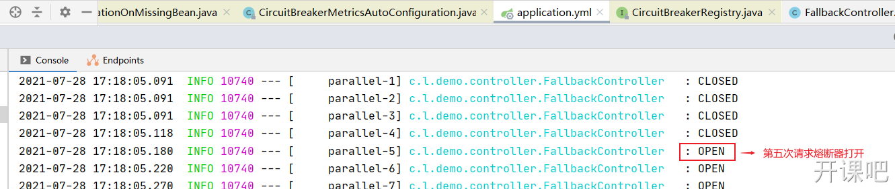

​		接下来2秒后再次请求熔断器处于半开状态,接下来启动支付微服务,服务能够正常访问熔断器关闭.

### 统一跨域请求

1. 跨域简介

   ​		跨域请求就是指:当前发起请求的域与该请求指向的资源所在的域不一样.这里的域指的是这样的一个概念:我们认为若协议 + 域名 + 端口号均相同,那么就是同域.

   ​		举个例子:假如一个域名为aaa.cn的网站,它发起一个资源路径为aaa.cn/books/getBookInfo的 Ajax 请求,那么这个请求是同域的,因为资源路径的协议、域名以及端口号与当前域一致(例子中协议名默认为http,端口号默认为80).但是,如果发起一个资源路径为bbb.com/pay/purchase的 Ajax 请求,那么这个请求就是跨域请求,因为域不一致,与此同时由于安全问题,这种请求会受到同源策略限制.

   ​		演示一下,创建index.html,发送ajax测试跨域.

   ```html
   <!DOCTYPE html>
   <html lang="en">
   <head>
       <meta charset="UTF-8">
       <title>Title</title>
       <script type="text/javascript" src="./js/jquery/jquery-1.10.2.min.js"></script>
       <script>
           function sendAjax() {
               $.ajax({
                   method: 'GET',
                   url: "http://127.0.0.1:9001/payment/123",
                   contentType: 'application/json; charset=UTF-8',
                   success: function(o) {
                       alert(o.id);
                       alert(o.message);
                   }
               });
           }
       </script>
   </head>
   <body>
       <button onclick="sendAjax();" >send ajax</button>
   </body>
   </html>
   ```

   通过上述index.html,发送请求,因为浏览器同源策略,就会出现跨域访问问题.

   虽然在安全层面上同源限制是必要的,但有时同源策略会对我们的合理用途造成影响,为了避免开发的应用受到限制,有多种方式可以绕开同源策略,常用的做法JSONP, CORS.可以使用@CrossOrigin,代码如下:

   ```java
   @RestController
   @RequestMapping("/payment")
   @CrossOrigin
   public class PaymentController {
   
       @Value("${server.port}")
       private String serverPort;
   
       @GetMapping("/{id}")
       public ResponseEntity<Payment> payment(@PathVariable("id") Integer id) {
           Payment payment = new Payment(id, "支付成功，服务端口=" + serverPort);
           return ResponseEntity.ok(payment);
       }
   
   }
   ```

2. 跨域配置

   现在请求经过gatway网关时,可以通过网关统一配置跨域访问,代码如下:

   ```yaml
   spring:
     cloud:
       gateway:
         globalcors:
           cors-configurations:
             '[/**]':
               max-age: 3600
               allowed-origin-patterns: "*" # spring boot2.4配置
   #            allowed-origins: "*"
               allowed-headers: "*"
               allow-credentials: true
               allowed-methods:
                 - GET
                 - POST
                 - DELETE
                 - PUT
                 - OPTION
   ```

# 微服务配置中心Spring Cloud Config

​		配置文件想必大家都不陌生.在Spring Boot项目中,默认会提供一个application.properties或者application.yml文件,我们可以把一些全局性的配置或者需要动态维护的配置写入改文件,比如数据库连接,功能开关,限流阈值,服务地址等.为了解决不同环境下服务连接配置等信息的差异,Spring Boot还提供了基于spring.profiles.active={profile}的机制来实现不同的环境的切换.

​		随着单体架构向微服务架构的演进,各个应用自己独立维护本地配置文件的方式开始显露出它的不足之处.主要有下面几点:

- 配置的动态更新: 在实际应用会有动态更新位置的需求,比如修改服务连接地址、限流配置等.在传统模式下,需要手动修改配置文件并且重启应用才能生效,这种方式效率太低,重启也会导致服务暂时不可用.
- 配置多节点维护: 在微服务架构中某些核心服务为了保证高性能会部署上百个节点,如果在每个节点中都维护一个配置文件,一旦配置文件中的某个属性需要修改,可想而知,工作量是巨大的.

- 不同部署环境下配置的管理: 前面提到通过profile机制来管理不同环境下的配置,这种方式对于日常维护来说也比较繁琐.

​		统一配置管理就是弥补上述不足的方法,简单说,最简便的方法是把各个应用系统中的某些配置放在一个第三方中间件上进行统一维护.然后,对于统一配置中心上的数据的变更需要推送到相应的服务节点实现动态更新,所以微服务架构中,配置中心也是一个核心组件,而Spring Cloud Config就是一个配置中心组件,并且可以Git、SVN、本地文件等作为存储.

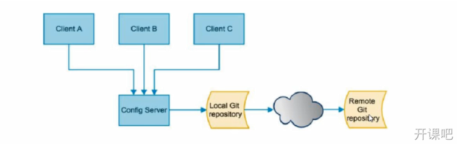

## Spring Cloud Config实践

### 配置中心服务端

​		创建06_cloud_config配置中心服务端工程,同时使用默认git作为存储方式.

1. 添加依赖

   pom.xml

   ```xml
   <?xml version="1.0" encoding="UTF-8"?>
   <project xmlns="http://maven.apache.org/POM/4.0.0" xmlns:xsi="http://www.w3.org/2001/XMLSchema-instance"
            xsi:schemaLocation="http://maven.apache.org/POM/4.0.0 https://maven.apache.org/xsd/maven-4.0.0.xsd">
       <modelVersion>4.0.0</modelVersion>
       <parent>
           <groupId>org.springframework.boot</groupId>
           <artifactId>spring-boot-starter-parent</artifactId>
           <version>2.4.9</version>
           <relativePath/> <!-- lookup parent from repository -->
       </parent>
       <groupId>com.lxs.demo</groupId>
       <artifactId>06_cloud_config</artifactId>
       <version>0.0.1-SNAPSHOT</version>
       <name>06_cloud_config</name>
       <description>Demo project for Spring Boot</description>
       <properties>
           <java.version>1.8</java.version>
           <spring-cloud.version>2020.0.3</spring-cloud.version>
       </properties>
       <dependencies>
           <dependency>
               <groupId>org.springframework.cloud</groupId>
               <artifactId>spring-cloud-config-server</artifactId>
           </dependency>
   
           <dependency>
               <groupId>org.springframework.boot</groupId>
               <artifactId>spring-boot-devtools</artifactId>
               <scope>runtime</scope>
               <optional>true</optional>
           </dependency>
           <dependency>
               <groupId>org.projectlombok</groupId>
               <artifactId>lombok</artifactId>
               <optional>true</optional>
           </dependency>
           <dependency>
               <groupId>org.springframework.boot</groupId>
               <artifactId>spring-boot-starter-test</artifactId>
               <scope>test</scope>
           </dependency>
       </dependencies>
       <dependencyManagement>
           <dependencies>
               <dependency>
                   <groupId>org.springframework.cloud</groupId>
                   <artifactId>spring-cloud-dependencies</artifactId>
                   <version>${spring-cloud.version}</version>
                   <type>pom</type>
                   <scope>import</scope>
               </dependency>
           </dependencies>
       </dependencyManagement>
   
       <build>
           <plugins>
               <plugin>
                   <groupId>org.springframework.boot</groupId>
                   <artifactId>spring-boot-maven-plugin</artifactId>
                   <configuration>
                       <excludes>
                           <exclude>
                               <groupId>org.projectlombok</groupId>
                               <artifactId>lombok</artifactId>
                           </exclude>
                       </excludes>
                   </configuration>
               </plugin>
           </plugins>
       </build>
   
   </project>
   ```

2. 启动器

   在启动器中使用@EnableConfigServer启用ConfigServer.

   ```java
   @SpringBootApplication
   @EnableConfigServer
   public class ConfigApplication {
   
       public static void main(String[] args) {
           SpringApplication.run(ConfigApplication.class, args);
       }
   
   }
   ```

3. application.yml

   ```yaml
   server:
     port: 9006
   spring:
     application:
       name: cloud-config
     cloud:
       config:
         server:
           git:
             uri: https://gitee.com/lxsong77/my-config.git
             search-paths: config
             default-label: master
   
   eureka:
     client:
       service-url:
         defaultZone: http://127.0.0.1:9004/eureka
   
   ```

   Config Server默认存储配置的方式是git,如果git仓库是公开仓库,username和password属性可以省略不配置,具体配置属性解释如下:

   - spring.cloud.config.server.git.uri: 配置文件所在的git仓库
   - spring.cloud.config.server.git.search-paths: 配置文件所在目录

   - spring.cloud.config.server.git.default-label: 配置文件分支

4. 配置仓库

   在git仓库https://gitee.com/lxsong77/my-config.git中,创建config目录,在config目录中创建app-dev.yml配置文件.

   ```yaml
   key1: v1
   key2: v2
   key3: v3
   ```

5. 启动并测试

   Spring Cloud Config 有它的一套访问规则,我们通过这套规则在浏览器上直接访问就可以.

   ```
   /{application}-{profile}.yml
   /{label}/{application}-{profile}.yml
   ```

   - {application} 就是应用名称,对应到配置文件上来,就是配置文件的名称部分,例如我上面创建的配置文件.
   - {profile} 就是配置文件的版本,我们的项目有开发版本、测试环境版本、生产环境版本,对应到配置文件上来就是以 application-{profile}.yml 加以区分,例如application-dev.yml、application-test.yml、application-prod.yml.

   - {label} 表示 git 分支,默认是 master 分支,如果项目是以分支做区分也是可以的,那就可以通过不同的 label 来控制访问不同的配置文件了.

   - git仓库配置文件缓存本地目录c:\Users\Administrator\AppData\Local\Temp\config-repo-4882682414831344447,可以通过basedir属性改变.

   浏览器访问[http://localhost:9006/app-dev.yml](http://localhost:9006/application-dev.yml),效果如图所示:

   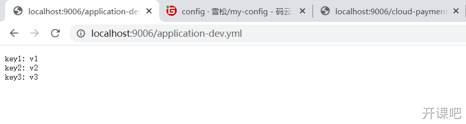

### 配置中心客户端

​		改造支付微服务工程,作为配置中心客户端,从上述Config Server中获取application.yml的配置.

1. 添加依赖

   ```xml
           <dependency>
               <groupId>org.springframework.cloud</groupId>
               <artifactId>spring-cloud-starter-config</artifactId>
           </dependency>
   ```

2. application.yml

   ```yaml
   spring:
     application:
       name: cloud-payment-service
     cloud:
       config:
         uri: http://localhost:9006
         profile: default
         label: master
     config:
       import: optional:configserver:http://localhost:9006
   ```

   - spring.config.import=optional:configserver:http://localhost:9006,指定Spring Boot项目从Config Server导入配置
   - spring.cloud.config.url: Config Server地址,默认localhost:8888

   - spring.cloud.config.profile: 为git配置文件的后缀
   - spring.cloud.config.label: 为访问git的分支

   案例中的配置服务名为cloud-payment-service(spring.application.name=cloud-payment-service),那么我们访问的就是https://gitee.com/lxsong77/my-config.git这个git仓库下config目录下的application.yml(所有服务重用)、cloud-payment-service.yml、cloud-payment-service-default.yml,这三个配置文件的内容,在这三个文件具有相同配置的情况下,后面的配置会覆盖前面的配置,git仓库中配置文件结构如图所示:

   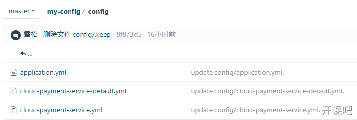

   application.yml

   ```yaml
   key1: v1
   key2: v2
   key3: v3
   ```

   cloud-payment-service.yml

   ```yaml
   key2: value2
   ```

   cloud-payment-service-default.yml

   ```yaml
   key3: value3
   ```

   此时启动Config Server访问http://localhost:9006/cloud-payment-service-default.yml,根据上面的分析,得到的结果是application.yml、cloud-payment-service.yml、cloud-payment-service-default.yml,这三个文件的内容的整合,如果有相同的配置项,后面的文件覆盖前面的文件,效果如图所示:

   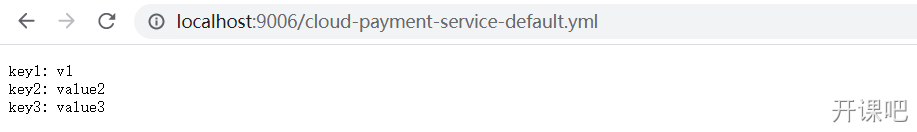

3. PaymentController

   ```java
   @RequestMapping("/payment")
   @Slf4j
   public class PaymentController {
   
       @Value("${server.port}")
       private String serverPort;
   
       @Value("${key1}")
       private String key1;
   
       @Value("${key2}")
       private String key2;
   
       @Value("${key3}")
       private String key3;
   
   
   
       @RequestMapping("/{id}")
       public ResponseEntity<Payment> payment(@PathVariable("id") Integer id) {
           log.info("key1={}, key2={}, key3={}", key1, key2, key3);
           Payment payment = new Payment(id, "支付成功，服务端口=" + serverPort);
           return ResponseEntity.ok(payment);
       }
   
   }
   ```

4. 启动并测试

   分别启动Erueka,Config Server和支付服务,访问http://localhost:9000/payment/123,控制台打印配置项内容`key1=v1, key2=value2, key3=value3`

### 本地存储配置数据

​		虽然git存储配置数据非常方便,但是在项目开发阶段,使用git存储还是很不方便,Spring Cloud Config支持多种配置存储方式,比如默认的git,还有本地文件存储、JDBC、Redis等存储方式,这里介绍下本地文件存储,其他存储方式,参考官方文档.

1. application.yml

   ```yaml
   spring:
     profiles:
       active: native
     cloud:
       config:
         server:
           native:
             search-locations: classpath:/config_repo
   ```

   - spring.profiles.active=native: 表示使用本地配置存储
   - spring.cloud.config.server.native.searchLocations: 指定配置文件所在路径,可以使用相对路径比如classpath

2. 本地配置文件

   在项目classpath下添加配置文件结构如图所示:

   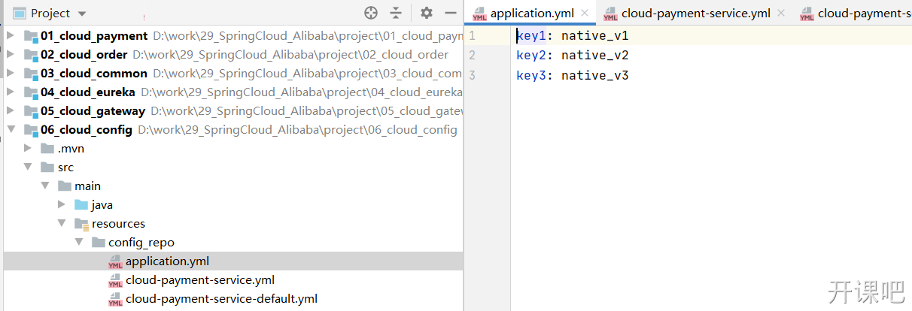

   分别启动Erueka、Config Server和支付服务,访问http://localhost:9000/payment/123,控制台打印配置项内容为本地配置文件的内容.

## 配置自动刷新

​		Spring Cloud Config在项目启动时自动加载配置内容这一机制,导致了他的一个缺陷,配置不能自动刷新,在上述案例中,修改git仓库中的key1的值"key1=v11",发现支付服务得到的配置项key1的值还是旧的配置内容,新的内容不会自动刷新过来,在微服务架构中,动辄上百个节点如果都需要重启,这个问题非常麻烦.

​		我们可以使用Spring Cloud Bus和Spring Boot Actuator实现自动刷新,实现原理如图所示:

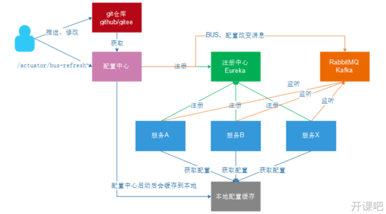

### 启动RabbitMQ

​		Spring Cloud Bus需要发送消息给消息队列,支持Kafka和RabbitMQ,这里我们使用RabbitMQ,启动我们之前准备好的RabbitMQ服务器(192.168.56.110),如图所示:

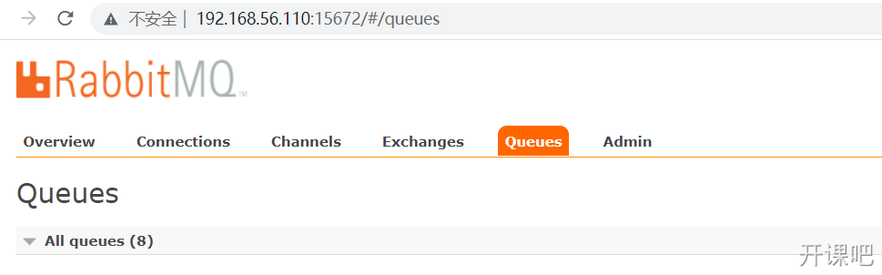

### 配置中心服务端

1. 添加依赖

   添加spring-cloud-starter-bus-amqp和spring-boot-starter-actuator依赖

   ```xml
           <dependency>
               <groupId>org.springframework.cloud</groupId>
               <artifactId>spring-cloud-starter-bus-amqp</artifactId>
           </dependency>
   
           <dependency>
               <groupId>org.springframework.boot</groupId>
               <artifactId>spring-boot-starter-actuator</artifactId>
           </dependency>
   
   ```

2. application.yml

   在application.yml中配置连接RabbitMQ,同时配置暴露/actuator/bus-refresh端点.

   ```yaml
   spring:
     rabbitmq:
       host: 192.168.56.110
       port: 5672
       username: guest
       password: guest
   management:
     endpoints:
       web:
         exposure:
           include: bus-refresh
     endpoint:
       bus-refresh:
         enabled: true
   ```

### 配置中心客户端

1. 添加依赖

   ```xml
           <dependency>
               <groupId>org.springframework.cloud</groupId>
               <artifactId>spring-cloud-starter-bus-amqp</artifactId>
           </dependency>
   ```

2. application.yml

   在application.yml中配置连接RabbitMQ.

   ```yaml
   spring:
     application:
       name: cloud-payment-service
     rabbitmq:
       host: 192.168.56.110
       port: 5672
       username: guest
       password: guest
   ```

3. PaymentController

   使用@RefreshScope注解刷新更改的配置.

   ```java
   @RequestMapping("/payment")
   @Slf4j
   @RefreshScope
   public class PaymentController {
   
       @Value("${server.port}")
       private String serverPort;
   
       @Value("${key1}")
       private String key1;
   
       @Value("${key2}")
       private String key2;
   
       @Value("${key3}")
       private String key3;
   
   
   
       @RequestMapping("/{id}")
       public ResponseEntity<Payment> payment(@PathVariable("id") Integer id) {
           log.info("key1={}, key2={}, key3={}", key1, key2, key3);
           Payment payment = new Payment(id, "支付成功，服务端口=" + serverPort);
           return ResponseEntity.ok(payment);
       }
   
   }
   ```

### 启动并测试

​		启动Eureka、Config Server、支付微服务(Config Client),修改git仓库中的配置项内容后,使用Postman发送**POST**请求给/actuator/busrefresh(注意是是POST类型),再次访问支付服务,发现配置项已经自动刷新.

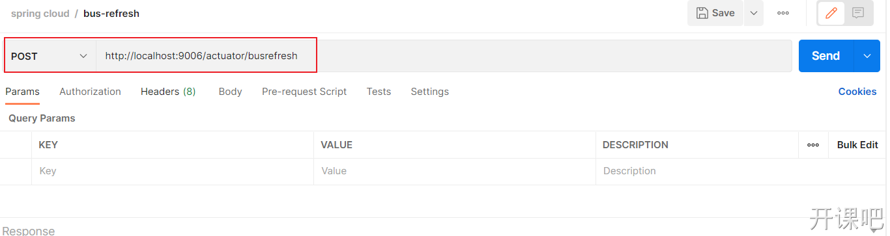

# 微服务链路追踪Spring Cloud sleuth

​		微服务架构是一个分布式架构,它按业务划分服务单元,一个分布式系统往往有很多个服务单元.由于服务单元数量众多,业务的复杂性,如果出现了错误和异常,很难去定位.主要体现在,一个请求可能需要调用很多个服务,而内部服务的调用复杂性,决定了问题难以定位.所以微服务架构中,必须实现分布式链路追踪,去跟进一个请求到底有哪些服务参与,参与的顺序又是怎样的,从而达到每个请求的步骤清晰可见,出了问题,很快定位.

​		举个例子,在微服务系统中,一个来自用户的请求,请求先达到前端A(如前端界面),然后通过远程调用,到达系统的中间件B、C(如负载均衡、网关等),最后达到后端服务D、E,后端经过一系列的业务逻辑计算最后将数据返回给用户.对于这样一个请求,经历了这么多个服务,怎么样将它的请求过程的数据记录下来呢?这就需要用到服务链路追踪.

​		Google开源的 Dapper链路追踪组件,并在2010年发表了论文《Dapper, a Large-Scale Distributed Systems Tracing Infrastructure》,这篇文章是业内实现链路追踪的标杆和理论基础,具有非常大的参考价值.
​		目前,链路追踪组件有Google的Dapper,Twitter 的Zipkin,以及阿里的Eagleeye(鹰眼)等,它们都是非常优秀的链路追踪开源组件.

## 基本术语

​		Spring Cloud Sleuth采用的是Google的开源项目Dapper的专业术语.

- Span: 基本工作单元,发送一个远程调度任务就会产生一个Span,Span有一个64位ID唯一标识的,Trace是用另一个64位ID唯一标识的,Span还有其他数据信息,比如摘要、时间戳事件、Span的ID、以及进度ID.
- Trace：一系列Span组成的一个树状结构.请求一个微服务系统的API接口,这个API接口,需要调用多个微服务,调用每个微服务都会产生一个新的Span,所有由这个请求产生的Span组成了这个Trace.

- Annotation: 用来及时记录一个事件的,一些核心注解用来定义一个请求的开始和结束.这些注解包括以下:

- - cs - Client Sent 	---客户端发送一个请求,这个注解描述了这个Span的开始
  - sr - Server Received    ---服务端获得请求并准备开始处理它,如果将其sr减去cs时间戳便可得到网络传输的时间.

- - ss - Server Sent(服务端发送响应)    ---该注解表明请求处理的完成(当请求返回客户端),如果ss的时间戳减去sr时间戳,就可以得到服务器请求的时间.
  - cr - Client Received(客户端接收响应)    ---此时Span的结束,如果cr的时间戳减去cs时间戳便可以得到整个请求所消耗的时间.

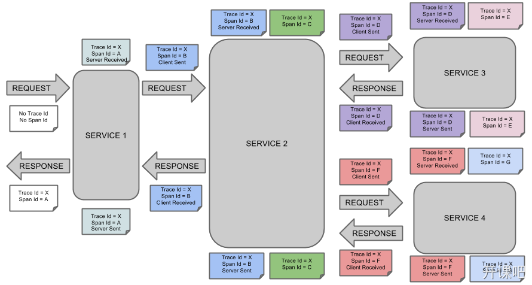

## 案例实战

​		本文主要讲述如何在Spring Cloud Sleuth中集成Zipkin.在Spring Cloud Sleuth中集成Zipkin非常的简单,只需要引入相应的依赖和做相关的配置即可.

### Zipkin-Server

​		准备Zipkin-Server.

1. 下载Zipkin-Server

   下载地址: https://archiva-maven-storage-prod.oss-cn-beijing.aliyuncs.com/repository/central/io/zipkin/zipkin-server/2.23.2/zipkin-server-2.23.2-exec.jar

2. 启动Zipkin-Server

   ```shell
   java -jar zipkin-server-2.23.2-exec.jar
   ```

### Zipkin-Client

​		改造支付微服务项目,和订单微服务项目作为Zipkin客户端,需要将链路数据上传给Zipkin Server,具体步骤如下:

1. 添加依赖

   在支付为服务和订单微服务项目的pom.xml中添加如下依赖:

   ```xml
           <dependency>
               <groupId>org.springframework.cloud</groupId>
               <artifactId>spring-cloud-sleuth-zipkin</artifactId>
           </dependency>
           <dependency>
               <groupId>org.springframework.cloud</groupId>
               <artifactId>spring-cloud-starter-sleuth</artifactId>
           </dependency>
   ```

2. application.yml

   在支付和订单项目的配置文件application.yml配置Spring Cloud Sleuth链路追踪.

   ```yaml
   spring:
     application:
       name: cloud-payment-service
     zipkin:
       base-url: http://192.168.220.12:9411
       sender:
         type: web
     sleuth:
       sampler:
         probability: 1
   ```

   - spring.zipkin.base-url: 指定Zipkin的服务端,用于发送链路报告
   - spirng.zipkin.sender.type: web表示使用http发送数据

   - spring.sleuth.sampler.probability: 采样率,值为[0,1]之间,这里表示100%采样报告

### 启动并测试

​		分别启动Zipkin-Server、Eureka、支付服务、订单服务,然后请求几次订单业务,这时链路报告会通过web方式发送给ZipkinServer,ZipkinServer收集的链路数据.

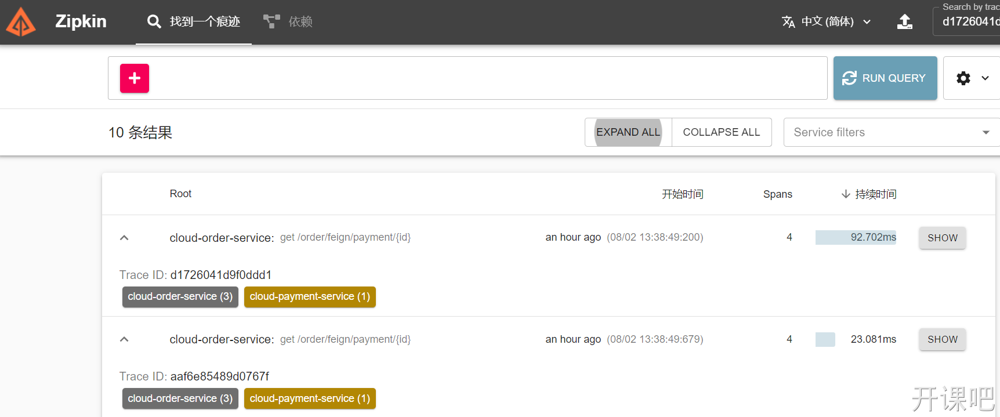

### 使用RabbitMQ传输链路数据

​		在上述案例中最终收集的数据是通过HTTP上传给Zipkin-Server的,在Spring Cloud Sleuth中支持消息组件传输链路数据,本节使用RabbitMQ传输链路数据,步骤如下:

1. 安装RabbitMQ

   使用Docker安装RabbitMQ命令如下:

   ```shell
   docker pull rabbitmq:management
   
   docker run -d -p 5672:5672 -p 15672:15672 --name rabbitmq rabbitmq:management
   ```

2. Zipkin-Server

   启动Zipkin-Server时,指定从RabbitMQ获得链路消息数据.

   ```shell
   RABBIT_ADDRESSES=localhost java -jar zipkin-server-2.23.2-exec.jar 
   
   #或者下面命令
   java -jar zipkin-server-2.23.2-exec.jar --zipkin.collector.rabbitmq.addresses=localhost
   ```

   注意这里使用localhost,故此需要把 zipkin-server-2.23.2-exec.jar 上传到docker所在的虚拟机.

3. Zipkin-Client

   在Zipkin-Client中添加依赖.

   ```xml
           <dependency>
               <groupId>org.springframework.amqp</groupId>
               <artifactId>spring-rabbit</artifactId>
           </dependency>
   ```

   在支付微服务,和订单微服务中修改配置,将链路数据发送给RabbitMQ.

   ```yaml
   spring:
     zipkin:
       rabbitmq:
         addresses: 192.168.220.12:5672
   #    base-url: http://192.168.220.12:9411
       sender:
         type: rabbit
     sleuth:
       sampler:
         probability: 1
   ```

   因为发送链路数据的方式type=rabbit,故此需要配置spring.zipkin.rabbitmq,同时base-url就不需要了.

4. 启动并测试

   重启Zipkin-Server和Zipkin-Client,发现链路数据经由RabbitMQ发送给Zipkin-Server.

### 使用ElasticSearch存储链路数据

​		在上面案例中,Zipkin Server将链路数据存储在内存中,一旦程序重启,之前的链路数据全部丢失,那么怎么将链路数据存储起来呢?Zipkin支持将链路数据存储在MySql、Elasticsearch和Cassandra数据库中,本节讲解使用Elasticsearch存储.

1. 安装Elasticsearch和Kibana

   使用docker安装Elasticsearch和Kibana.

   ```shell
   docker pull elasticsearch:7.13.4
   
   # 创建自定义的网络(用于连接到连接到同一网络的其他服务(例如Kibana))
   docker network create somenetwork 
   
   #运行Elasticsearch
   docker run -d --name elasticsearch --net somenetwork -p 9200:9200 -p 9300:9300 -e "discovery.type=single-node" elasticsearch:7.13.4
       
   docker pull kibana:7.3.4
   # 运行 Kibana
   docker run -d --name kibana --net somenetwork -p 5601:5601 kibana:7.13.4
   ```

2. Zipkin-Server

   启动Zipkin Server时,指定使用ES存储数据.

   ```shell
   RABBIT_ADDRESSES=localhost STORAGE_TYPE=elasticsearch ES_HOSTS=http://localhost:9200 java -jar zipkin-server-2.23.2-exec.jar 
   
   #或者
   java -jar zipkin-server-2.23.2-exec.jar --zipkin.collector.rabbitmq.addresses=localhost  --STORAGE_TYPE=elasticsearch --ES_HOSTS=http://localhost:9200
   ```

3. 启动并测试

   重启Zipkin-Server,可以看到链路追踪数据,已经存入Elasticsearch中,同时再次重启Zipkin-Server,数据依然存在.

   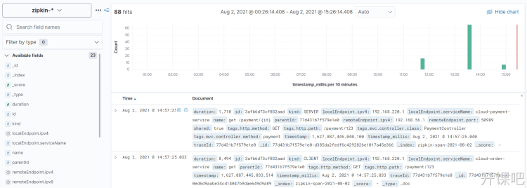