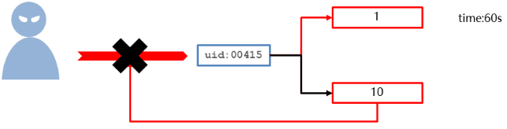
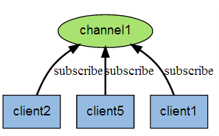
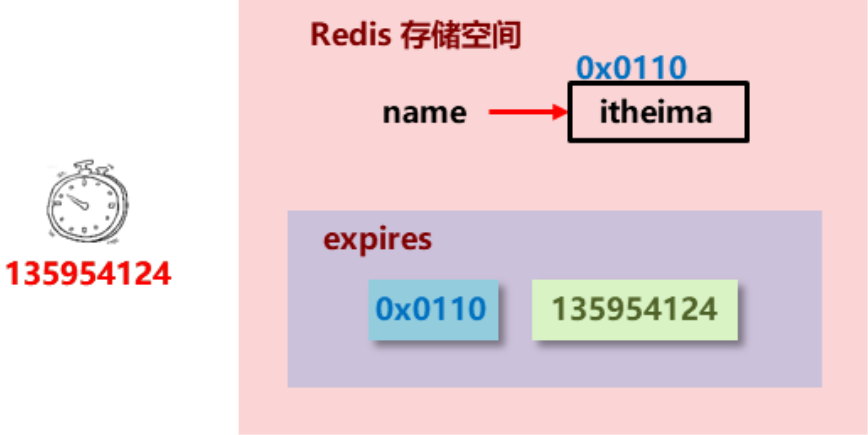
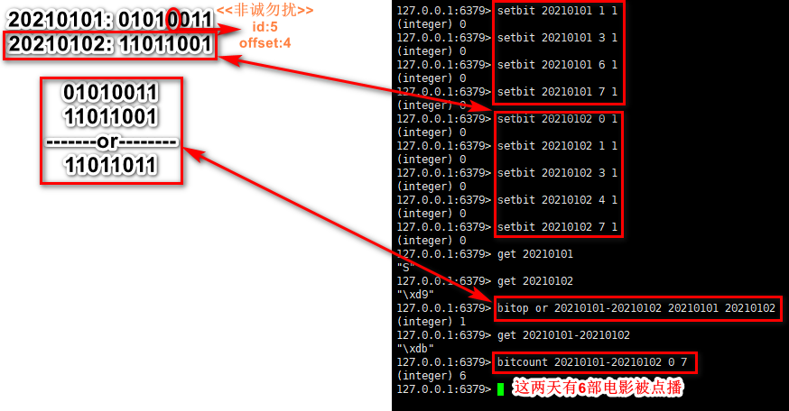
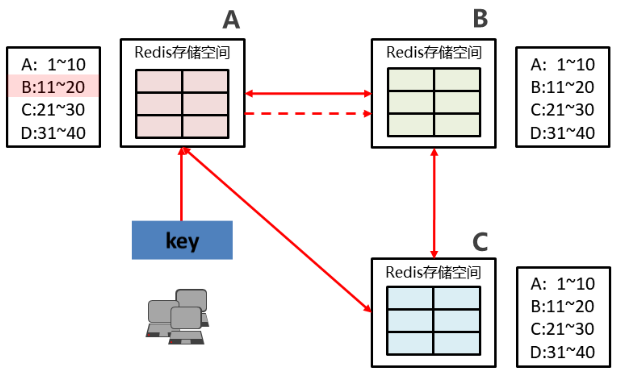
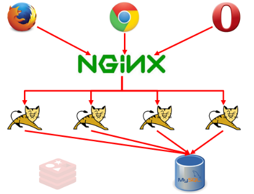

# Redis

[TOC]


## NoSQL的产生

### 产生背景

​		中国被世界黑的最惨的一天

​		2007年10月30日,北京奥运会门票面向境内公众第二阶段预售正式启动.上午一开始,公众提交申请空前踊跃.上午9时至10时,官方票务网站的浏览量达到了800万次,票务呼叫中心热线从9时至10时的呼入量超过了380万人次.由于瞬间访问数量过大,技术系统应对不畅,造成很多申购者无法及时提交申请,为此北京奥组委票务中心对广大公众未能及时、便捷地实现奥运门票预订表示歉意.

​		还有一个神奇的网站12306,可以称作一个总是在"崩溃中"的神奇网站.

### 现象分析

问题现象:

- 海量用户
- 高并发


罪魁祸首--关系型数据库:

- 性能瓶颈:磁盘IO性能低下
- 扩展瓶颈:数据关系复杂,扩展性差,不便于大规模集群


解决思路:

- 降低磁盘IO次数,越低越好		==> 内存存储
- 去除数据间关系,越简单越好	==> 不存储关系,仅存储数据

## NoSQL简介

​		NoSQL(Non-relational SQL/Not Only SQL),泛指非关系型的数据库,作为关系型数据库的补充,能有效解决了海量用户以及高并发的场景下性能低下与扩展性差的问题.

### NoSQL的优势

- 可扩容,可伸缩
- 大数据量下高性能
- 灵活的数据模型
- 高可用

### 常见的NoSQL产品

| 分类     | 键值数据库                                                   | 列族数据库                        | 文档数据库                               | 图形数据库                          |
| -------- | ------------------------------------------------------------ | --------------------------------- | ---------------------------------------- | ----------------------------------- |
| 相关产品 | Redis、Memcached、Riak                                       | Bigtable、HBase、Cassandra        | MongoDB、CouchDB                         | Neo4j、InfoGrid                     |
| 应用场景 | 内容缓存,如会话、配置文件、参数等;频繁读写、拥有简单数据模型的应用 | 分布式数据存储与管理              | Web应用,存储面向文档或类似半结构化的数据 | 社交网络、推荐系统,专注构建关系图谱 |
| 数据模型 | <key,value>键值对,通过散列表来实现                           | 以列族式存储,将同一列数据存在一起 | <key,value>,value是JSON结构的文档        | 图结构                              |
| 优点     | 扩展性好,灵活性好,大量操作时性能高                           | 可扩展性强,查找速度快,复杂性低    | 数据结构灵活,可以根据value建立索引       | 支持复杂的图形算法                  |
| 缺点     | 数据无结构化,通常只能被当做字符串或者二进制数据,只能通过键来查询值 | 功能局限,不支持事务的强一致性     | 缺乏统一查询语法                         | 复杂性高,只能支持一定的数据规模     |


## Redis简介

​		Redis(Remote Dictionary Server)是用C语言开发的一个开源的高性能的键值对数据库.

### Redis的特征

1. 数据间没有必然的关联关系
2. 内部采用单线程机制进行工作
3. 高性能.官方提供测试数据,50个并发执行100000 个请求,读的速度是110000 次/s,写的速度是81000次/s.
4. 多数据类型支持
5. 持久化支持.可以进行数据灾难恢复

### Redis的应用

- 为热点数据加速查询(主要场景),如热点商品、热点新闻、热点资讯、推广类等高访问量信息等
- 任务队列,如秒杀、抢购、购票排队等
-  即时信息查询,如各种排行榜、各类网站访问统计、公交到站信息、在线人数信息(聊天室、网站)、设备信号等
-  时效性信息控制,如验证码控制、投票控制等
-  分布式数据共享,如分布式集群架构中的 session 分离
- 消息队列
- 分布式锁

## Redis的基本操作

### Redis的安装

​		从[官网](https://redis.io/)获取redis源代码的链接,如:https://download.redis.io/releases/redis-6.2.6.tar.gz,进入Linux系统的终端进行下载:

```shell
$ cd /usr/tmp
$ wget https://download.redis.io/releases/redis-6.2.6.tar.gz
$ tar xzf redis-6.2.6.tar.gz
```

​		编译Redis(将.c文件编译为.o文件).Redis是C语言开发的,安装redis需要先去官网下载源码进行编译,编译需要依赖于GCC编译环境,安装命令如下(使用root用户进行操作).

​		源码是官方configure过的,但官方configure时生成的文件有时间戳信息,make只能发生在configure之后,如果Linux系统的时间不对会产生错误.

```shell
$ yum install gcc-c++
$ cd redis-6.2.6/
$ make
```

​		安装Redis,并将默认的Redis配置文件拷贝至安装包的bin文件夹中.

```shell
$ make PREFIX=/usr/local/redis install
$ cp redis.conf /usr/local/redis/bin/
```


​		安装完成后,在/usr/local/redis/bin下有几个可执行文件:

- redis-benchmark		====性能测试工具
- redis-check-aof		   ====AOF文件修复工具
- redis-check-dump	  ====RDB文件检查工具(快照持久化文件)
- redis-cli						====命令行客户端
- redis-server				====服务器启动命令

### Redis服务的启动与关闭

#### 服务端的启动

##### 前端模式启动

​		直接运行bin/redis-server将使用前端模式启动,前端模式启动的缺点是启动完成后,不能再进行其他操作,如果按Ctrl+C会停止redis-server程序,不推荐此方法启动.


##### 后端模式启动

​		修改redis.conf配置文件,设置:daemonize yes(6.2.6版本中该配置在257行),然后就可以使用后端模式启动,启动时需要指定配置文件,启动后可以通过`ps -ef | grep -i redis`查看redis服务.

```shell
$ ./redis-server redis.conf
```


#### 服务端的关闭

##### 强制关闭

​		强制关闭redis进程可能会导致数据丢失.语法:`kill -9 pid`


##### 正常关闭

```shell
$ ./redis-cli shutdown
```

### 命令行访问redis服务

​		在bin文件夹下运行redis-cli即可连接redis服务端,默认IP地址为127.0.0.1,默认端口号为6369.如果想要连接指定的ip地址以及端口号,则需要按照`redis-cli -h ip地址 -p 端口号`进行连接.

```shell
[root@xiaomage bin]# ./redis-cli
127.0.0.1:6379> 
```

​		命令行模式工具的使用:

- **功能性命令**(以基本的get和set为例):

```shell
127.0.0.1:6379> set name 李四
OK
127.0.0.1:6379> get name
"\xe6\x9d\x8e\xe5\x9b\x9b"
127.0.0.1:6379> set name lisi
OK
127.0.0.1:6379> get name
"lisi"
```

- **清除屏幕信息**

```shell
127.0.0.1:6379> clear
```

- **帮助信息查阅**

```shell
127.0.0.1:6379> help set

  SET key value [EX seconds|PX milliseconds|EXAT timestamp|PXAT milliseconds-timestamp|KEEPTTL] [NX|XX] [GET]
  summary: Set the string value of a key
  since: 1.0.0
  group: string

127.0.0.1:6379> help get

  GET key
  summary: Get the value of a key
  since: 1.0.0
  group: string

127.0.0.1:6379> help @string

  APPEND key value
  summary: Append a value to a key
  since: 2.0.0

  BITCOUNT key [start end]
  summary: Count set bits in a string
  since: 2.6.0

  BITFIELD key [GET type offset] [SET type offset value] [INCRBY type offset increment] [OVERFLOW WRAP|SAT|FAIL]
  summary: Perform arbitrary bitfield integer operations on strings
  since: 3.2.0

  BITOP operation destkey key [key ...]
  summary: Perform bitwise operations between strings
  since: 2.6.0

  BITPOS key bit [start] [end]
  summary: Find first bit set or clear in a string
  since: 2.8.7

  DECR key
  summary: Decrement the integer value of a key by one
  since: 1.0.0

  DECRBY key decrement
  summary: Decrement the integer value of a key by the given number
  since: 1.0.0

  GET key
  summary: Get the value of a key
  since: 1.0.0

  GETBIT key offset
  summary: Returns the bit value at offset in the string value stored at key
  since: 2.2.0

  GETDEL key
  summary: Get the value of a key and delete the key
  since: 6.2.0

  GETEX key [EX seconds|PX milliseconds|EXAT timestamp|PXAT milliseconds-timestamp|PERSIST]
  summary: Get the value of a key and optionally set its expiration
  since: 6.2.0

  GETRANGE key start end
  summary: Get a substring of the string stored at a key
  since: 2.4.0

  GETSET key value
  summary: Set the string value of a key and return its old value
  since: 1.0.0

  INCR key
  summary: Increment the integer value of a key by one
  since: 1.0.0

  INCRBY key increment
  summary: Increment the integer value of a key by the given amount
  since: 1.0.0

  INCRBYFLOAT key increment
  summary: Increment the float value of a key by the given amount
  since: 2.6.0

  MGET key [key ...]
  summary: Get the values of all the given keys
  since: 1.0.0

  MSET key value [key value ...]
  summary: Set multiple keys to multiple values
  since: 1.0.1

  MSETNX key value [key value ...]
  summary: Set multiple keys to multiple values, only if none of the keys exist
  since: 1.0.1

  PSETEX key milliseconds value
  summary: Set the value and expiration in milliseconds of a key
  since: 2.6.0

  SET key value [EX seconds|PX milliseconds|EXAT timestamp|PXAT milliseconds-timestamp|KEEPTTL] [NX|XX] [GET]
  summary: Set the string value of a key
  since: 1.0.0

  SETBIT key offset value
  summary: Sets or clears the bit at offset in the string value stored at key
  since: 2.2.0

  SETEX key seconds value
  summary: Set the value and expiration of a key
  since: 2.0.0

  SETNX key value
  summary: Set the value of a key, only if the key does not exist
  since: 1.0.0

  SETRANGE key offset value
  summary: Overwrite part of a string at key starting at the specified offset
  since: 2.2.0

  STRALGO LCS algo-specific-argument [algo-specific-argument ...]
  summary: Run algorithms (currently LCS) against strings
  since: 6.0.0

  STRLEN key
  summary: Get the length of the value stored in a key
  since: 2.2.0
```

​		可以输入help跟一个空格之后按Tab键切换命令或命令组.

- **退出指令**

```shell
127.0.0.1:6379> quit
```

​		或者:

```shell
127.0.0.1:6379> exit
```

## Redis数据结构

​		Redis自身是一个Map,其中所有的数据都是采用key-value的形式存储.数据类型指的是存储的数据的类型,也就是value部分的类型,key部分永远都是字符串.

| Redis      | Java       |
| ---------- | ---------- |
| string     | String     |
| hash       | HashMap    |
| list       | LinkedList |
| set        | HashSet    |
| sorted_set | TreeSet    |

### string

- 存储需求:单个数据,最简单的数据存储类型,也是最常用的数据存储类型
- 存储结构:一个存储空间保存一个数据
- 存储内容:通常使用字符串,如果字符串以数字的形式展示,可以作为数字操作使用


**注意事项:**

- 数据操作是否成功的反馈与数据正常操作之间的差异

  - 表示运行结果是否成功

    (integer) 0	->false失败

    (integer) 1	->true成功

  - 表示运行结果值

    (integer) 3	->3个

    (integer) 1	->1个

- 数据未获取到

  (nil),等同于null

- 数据最大存储量

  512MB

- 数值计算最大范围(java中long类型数据的最大值2^63-1)

  9223372036854775807

#### 操作命令

- 添加/修改数据

```shell
set key value
```

- 获取数据

```shell
get key
```

- 删除数据

```shell
del key
```

- 添加/修改多个数据

思考:单数据操作与多数据操作的选择之惑?

​		多数据操作的性能优于单数据操作,但是如果数据量太大,执行时间太长的话,可能还得分批或分类进行操作,以免其他占用过多的CPU资源.

```
mset key value [key value ...]
```

- 获取多个数据

```shell
mget key [key ...]
```

- 获取数据字符个数

```shell
strlen key
```

- 追加字符串到原始字符串后部(如果原始信息存在就追加,否则新建)

```shell
append key value
```

- 设置数值数据增加指定值

```shell
incr key
incrby key increment
incrbyfloat key increment
```

- 设置数值数据减少指定值

```shell
decr key
decrby key increment
```

- 设置数据具有指定的生命周期

```shell
setex key seconds value
psetex key milliseconds value
```

#### 应用场景

**业务场景:**

​		大型企业级应用中,分表操作是基本操作,使用多张表存储同类型数据,但是对应的主键 id 必须保证统一性,不能重复.Oracle 数据库具有sequence设定,可以解决该问题,但是 MySQL数据库并不具有类似的机制,那么如何解决?

**分析:**

- string在redis内部存储默认就是一个字符串,当遇到增减类操作incr,decr时会转成数值型进行计算.
- redis中所有的操作都是原子性的,采用单线程处理所有业务,命令是一个一个执行的,因此无需考虑并发带来的影响.

**注意:**按数值进行操作的数据,如果原始数据不能转成数值,或超越了redis数值上限范围,将报错.

**Tips 1:**

- redis用于控制数据库主键id,为数据库表主键提供生成策略,保障数据库表的主键唯一性
- 此方案适用于所有数据库,且支持数据库集群


**业务场景:**

​		"最强女生"启动海选投票,只能通过微信投票,每个微信号每 4 小时只能投1票.
​		电商商家开启热门商品推荐,热门商品不能一直处于热门期,每种商品热门期维持3天,3天后自动取消热门.
​		新闻网站会出现热点新闻,热点新闻最大的特征是时效性,如何自动控制热点新闻的时效性.

**Tips 2:**

- redis控制数据的生命周期,通过数据是否失效控制业务行为,适用于所有具有时效性限定控制的操作.


**业务场景:**

​		主页高频访问信息显示控制,例如新浪微博大V主页显示粉丝数与微博数量

**解决方案:**

- 以用户主键和属性值作为key,后台设定定时刷新策略即可

  key的设置约定:

| 表名  | 主键名 | 主键值    | 字段名 | key命名                   |
| ----- | ------ | --------- | ------ | ------------------------- |
| order | id     | 29437595  | name   | `order:id:29437595:name`  |
| equip | id     | 390472345 | type   | `equip:id:390472345:type` |
| news  | id     | 202004150 | title  | `news:id:202004150:title` |

```shell
127.0.0.1:6379> set vbuser:id:18808:fans 1220108
OK
127.0.0.1:6379> set vbuser:id:18808:blogs 616
OK
127.0.0.1:6379> set vbuser:id:18808:focus 183
OK
```

- 以json格式存储大V用户信息,定时刷新(也可以使用hash类型,一般用于常改动的场景,而json格式存储字符串常用于只读的场景)

**Tips 3:**

- redis应用于各种结构型和非结构型高热度数据访问加速.

### hash

`vbuser:id:18808`:`{"id":18808,"fans":1220108,"blogs":616,"focus":183}`

- 数据存储需求:对一系列存储的数据进行编组,方便管理,典型应用存储对象信息
- 存储结构:一个存储空间保存多个键值对数据
- hash类型:底层使用哈希表结构实现数据存储
- hash存储结构优化:
  - 如果field数量较少,存储结构优化为类数组结构
  - 如果field数量较多,存储结构使用HashMap结构


​		**注意事项:**

- hash类型下的value只能存储字符串,不允许存储其他数据类型,不存在嵌套现象.如果数据未获取到,对应的值为nil.
- 每个hash可以存储2^32-1个键值对(42亿多).
- hash类型十分贴近对象的数据存储形式,并且可以灵活添加和删除对象属性.但hash设计初衷不是为了存储大量对象而设计的,切记不可滥用,更不可以将hash作为对象列表使用.
- hgetall操作可以获取全部属性,如果内部field过多,遍历整体数据效率就会很低,有可能成为数据访问瓶颈

#### 操作命令

- 添加/修改数据

```shell
hset key field value [field value ...]
hmset key field value [field value ...]
hsetnx key field value
```

- 获取数据

```shell
hget key field
hmget key field [field ...]
```

- 删除数据

```shell
hdel key field [field ...]
```

- 获取哈希表中字段的数量

```shell
hlen key
```

- 获取哈希表中是否存在指定的字段

```shell
hexists key field
```

- 获取哈希表中所有的字段名或字段值

```shell
hkeys key
hvals key
```

- 设置指定字段的数值增加指定值

```shell
hincrby key field increment
hincrbyfloat key field increment
```

#### 应用场景

**业务场景:**

​		电商网站购物车设计与实现


**业务分析:**

- 仅分析购物车的redis存储模型

  添加、浏览、更改数量、删除、清空

- 购物车与数据库间持久化同步(不讨论)

- 购物车与订单间关系(不讨论)

  提交购物车:读取数据生成订单

  商家临时价格调整:隶属于订单级别

- 未登录用户购物车信息存储(不讨论)

  cookie存储

**解决方案:**

- **以客户id作为key,每位客户创建一个hash存储结构存储对应的购物车信息**
- 将商品编号作为field,购买数量作为value进行存储
- 添加商品:追加全新的field与value
- 浏览:遍历hash
- 更改数量:自增/自减,设置value值
- 删除商品:删除field
- 清空:删除key

思考:当前设计是否加速了购物车的呈现?

​		当前仅仅是将数据存储到了redis中,并没有起到加速的作用,商品信息还需要二次查询数据库.

- 每条购物车中的商品记录保存成两条field
- field1专用于保存购买数量
- field2专用于保存购物车中显示的信息,包含文字描述,图片地址,所属商家信息等

```shell
hset u1001 g1001:nums 4 g1001:info {...} g2211:nums 1 g2211:info {....}
```

​		这样的话商品信息会有冗余==>将商品信息存入独立hash中

```shell
hsetnx g1001 name sanzhisongshu
hsetnx g1001 desc xxx
hsetnx g1001 picurl xxxx
```

**Tips 4:**

- redis应用于购物车数据存储设计


**业务场景:**

​		双11活动日,销售手机充值卡的商家对移动、联通、电信的30元、50元、100元商品推出抢购活动,每种商品抢购上限1000张.

**解决方案:**

- 以商家id作为key
- 将参与抢购的商品id作为field
- 将参与抢购的商品数量作为对应的value
- 抢购时使用降值的方式控制产品数量(实际业务中还有超卖等实际问题,这里不做讨论)

**Tips 5:**

- redis 应用于抢购,限购类、限量发放优惠卷、激活码等业务的数据存储设计.

### list

- 数据存储需求:存储多个数据,并对数据进入存储空间的顺序进行区分
- 存储结构:一个存储空间保存多个数据,且通过数据可以体现进入顺序
- list类型:保存多个数据,底层使用**双向链表**存储结构实现


**注意事项:**

- list中保存的数据都是string类型的,数据总容量是有限的,最多2^32-1个元素
- list具有索引的概念,但是操作数据时常常以队列的形式进行入队出队操作,或以栈的形式进行入栈出栈操作
- 获取全部数据操作结束索引设置为-1
- list可以对数据进行分页操作,通常第一页的信息来自于list,第二页及更多的信息通过数据库的形式加载

#### 操作命令

- 添加/修改数据

```shell
lpush key value [value ...]
rpush key value [value ...]
```

- 获取数据

```shell
lrange key start stop
lindex key index
llen key
```

- 获取并移除数据

```shell
lpop key
rpop key
```

- 规定时间内获取并移除数据

```shell
blpop key [key ...] timeout
brpop key [key ...] timeout
brpoplpush source destination timeout
```

- 移除指定数据

```shell
lrem key count value
```

#### 应用场景

**业务场景:**

​		微信朋友圈点赞,要求按照点赞顺序显示点赞好友信息(rpush).如果取消点赞(lrem),移除对应好友信息.


**Tips 6:**

- redis应用于具有操作先后顺序的数据控制


**业务场景:**

​		twitter、新浪微博、腾讯微博中个人用户的关注列表需要按照用户的关注顺序进行展示,粉丝列表需要将最近关注的粉丝列在前面.

​		新闻、资讯类网站如何将最新的新闻或资讯按照发生的时间顺序展示?

​		企业运营过程中,系统将产生出大量的运营数据,如何保障多台服务器操作日志的统一顺序输出?

**解决方案:**

- 依赖list的数据具有顺序的特征对信息进行管理
- 使用队列模型解决多路信息汇总合并的问题
- 使用栈模型解决最新消息的问题

**Tips 7:**

- redis应用于最新消息展示

### set

- 数据存储需求:存储大量的数据,在查询方面提供更高的效率
- 存储结构:能够保存大量的数据,高效的内部存储机制,便于查询
- set类型:与hash存储结构完全相同,仅存储键,不存储值(nil),并且值是不允许重复的


​		**注意事项:**

- set类型不允许数据重复,如果添加的数据在set中已经存在,将只保留一份
- set虽然与hash的存储结构相同,但是无法启用hash中存储值的空间

#### 操作命令

- 添加数据

```shell
sadd key member [member ...]
```

- 获取全部数据

```shell
smembers key
```

- 删除数据

```shell
srem key member [member ...]
```

- 获取集合数据总量

```shell
scard key
```

- 判断集合中是否包含指定数据

```shell
sismember key member
```

- 随机获取集合中指定数量的数据

```shell
srandmember key [count]
```

- 随机获取集合中的某个数据并将该数据移出集合

```shell
spop key [count]
```

- 求多个集合的交、并、差集

```shell
sinter key [key ...]
sunion key [key ...]
sdiff key [key ...]
```

- 求多个集合的交、并、差集并存储到指定集合中

```shell
sinterstore destination key [key ...]
sunionstore destination key [key ...]
sdiffstore destination key [key ...]
```

- 将指定数据从原始集合中移动到目标集合中

```shell
smove source destination member
```

#### 应用场景

**业务场景:**

​		每位用户首次使用今日头条时会设置3项爱好的内容,但是后期为了增加用户的活跃度、兴趣点,必须让用户对其他信息类别逐渐产生兴趣,增加客户留存度,如何实现?

**业务分析:**

- 系统分析出各个分类的最新或最热点信息条目并组织成set集合
- 随机挑选其中部分信息
- 配合用户关注信息分类中的热点信息组织成展示的全信息集合

**Tips 8:**

- redis应用于随机推荐类信息检索,例如热点歌单推荐,热点新闻推荐,热卖旅游线路,应用APP推荐,大V推荐等


**业务场景:**

​		脉脉为了促进用户间的交流,保障业务成单率的提升,需要让每位用户拥有大量的好友,事实上职场新人不具有更多的职场好友,如何快速为用户积累更多的好友?
​		新浪微博为了增加用户热度,提高用户留存性,需要微博用户在关注更多的人,以此获得更多的信息或热门话题,如何提高用户关注他人的总量?
​		QQ新用户入网年龄越来越低,这些用户的朋友圈交际圈非常小,往往集中在一所学校甚至一个班级中,如何帮助用户快速积累好友用户带来更多的活跃度?
​		微信公众号是微信信息流通的渠道之一,增加用户关注的公众号成为提高用户活跃度的一种方式,如何帮助用户积累更多关注的公众号?
​		美团外卖为了提升成单量,必须帮助用户挖掘美食需求,如何推荐给用户最适合自己的美食?

**Tips 9:**

- redis应用于同类信息的关联搜索,二度关联搜索,深度关联搜索
- 显示共同关注(一度)
- 显示共同好友(一度)
- 由用户A出发,获取到好友B的好友信息列表(一度)
- 由用户A出发,获取到好友B的购物清单列表(二度)
- 由用户A出发,获取到好友B的游戏充值列表(二度)


**业务场景:**

​		集团公司共具有12000名员工,内部OA系统中具有700多个角色,3000多个业务操作,23000多种数据,每位员工具有一个或多个角色,如何快速进行业务操作的权限校验?


**解决方案:**

- 依赖set集合数据不重复的特征完成数据过滤与快速查询
- 根据用户id获取用户所有角色
- 根据用户所有角色获取用户所有操作权限放入set集合

思考:redis提供基础数据还是提供校验结果?==>提倡只提供基础数据,实现数据与业务的解耦

**Tips 10:**

- redis应用于同类型不重复数据的合并、取交集操作


**业务场景:**

​		公司对旗下新的网站做推广,统计网站的PV(访问量),UV(独立访客),IP(独立IP)

- PV:网站被访问次数,可通过刷新页面提高访问量
- UV:网站被不同用户访问的次数,可通过cookie统计访问量,相同用户切换IP地址,UV不变
- IP:网站被不同IP地址访问的总次数,可通过IP地址统计访问量,相同IP不同用户访问,IP不变

**解决方案:**

- 利用set集合的数据去重特性,记录各种访问数据
- 建立string类型数据,利用incr统计日访问量(PV)
- 建立set模型,记录不同cookie数据(UV)
- 建立set模型,记录不同IP数量

**Tips 11:**

- redis应用于同类型数据的快速去重


**业务场景:**
​		资讯类信息类网站追求高访问量,但是由于其信息的价值,往往容易被不法分子利用,通过爬虫技术,快速获取信息,个别特种行业网站信息通过爬虫获取分析后,可以转换成商业机密进行出售.例如第三方火车票、机票、酒店刷票代购软件,电商刷评论、刷好评.同时爬虫带来的伪流量也会给经营者带来错觉,产生错误的决策,有效避免网站被爬虫反复爬取成为每个网站都要考虑的基本问题.在基于技术层面区分出爬虫用户后,需要将此类用户进行有效的屏蔽,这就是**黑名单**的典型应用.
​		ps:不是说爬虫一定做摧毁性的工作,有些小型网站需要爬虫为其带来一些流量.
​		对于安全性更高的应用访问,仅仅靠黑名单是不能解决安全问题的,此时需要设定可访问的用户群体,依赖**白名单**做更为苛刻的访问验证.

**解决方案:**

- 基于经营战略设定问题用户发现、鉴别规则
- 周期性更新满足规则的用户黑名单,加入set集合
- 用户行为信息达到后与黑名单进行比对,确认行为去向
- 黑名单过滤IP地址:应用于开放游客访问权限的信息源
- 黑名单过滤设备信息:应用于限定访问设备的信息源
- 黑名单过滤用户:应用于基于访问权限的信息源

**Tips 12:**

- redis应用于基于黑名单与白名单设定的服务控制

### sorted_set

- 数据存储需求:数据排序有利于数据的有效展示,需要提供一种可以根据自身特征进行排序的方式
- 存储结构:新的存储模型,可以保存可排序的数据
- sorted_set类型:在set的存储结构基础上添加可排序字段


​		**注意事项:**

- score保存的数据存储空间是64位,如果是整数范围是-9007199254740992~9007199254740992
- score保存的数据也可以是一个双精度的double值,基于双精度浮点数的特征,可能会丢失精度,使用时候要慎重
- sorted_set底层存储还是基于set结构的,因此数据不能重复,如果重复添加相同的数据,score值将被反复**覆盖**,保留最后一次修改的结果

#### 操作命令

- 添加数据

```shell
zadd key score member [score member ...]
```

- 获取全部数据

```shell
zrange key start stop [withscores]
zrevrange key start stop [withscores]
```

- 删除数据

```shell
zrem key menmber [member ...]
```

- 按条件获取数据

  > min和max用于限定搜索条件的查询
  >
  > start和stop用于限定查询范围,作用于索引,表示开始索引和结束索引
  >
  > offset和count用于限定查询范围,作用于查询结果,表示开始位置和数据总量

```shell
zrange key start stop
zrevrange key start stop
zrangebyscore key min max [limit offset count] [withscores]
zrevrangebyscore key max min
```

- 条件删除数据

```shell
zremrangebyrank key start stop
zremrangebyscore key min max
```

- 获取集合数据总量

```shell
scard key
zcount key min max
```

- 集合交、并操作

```shell
zinterstore destination numkeys key [key ...] [WEIGHTS weight] [AGGREGATE SUM|MIN|MAX]
zunionstore destination numkeys key [key ...] [WEIGHTS weight] [AGGREGATE SUM|MIN|MAX]
```

- 获取元素的分数

```shell
zscore key member
```

- 获取元素的排名(从0开始)

```shell
zrank key member
```

- 元素的分数加一个数值

```shell
zincrby key increment member
```

#### 应用场景

**业务场景:**

- 票选广东十大杰出青年,各类综艺选秀海选投票
- 各类资源网站TOP10(电影,歌曲,文档,电商,游戏等)
- 聊天室活跃度统计
- 游戏好友亲密度

**业务分析:**

- 为所有参与排名的资源建立排序依据

**Tips 13:**

- redis 应用于计数器组合排序功能对应的排名


**业务场景:**

​		基础服务+增值服务类网站会设定各位会员的试用,让用户充分体验会员优势.例如观影试用VIP、游戏VIP体验、云盘下载体验VIP、数据查看体验VIP.当VIP体验到期后,如果有效管理此类信息.即便对于正式VIP用户也存在对应的管理方式.
​		网站会定期开启投票、讨论，限时进行，逾期作废.如何有效管理此类过期信息.

**解决方案:**

- 对于基于时间线限定的任务处理,将处理时间记录为score值,利用排序功能区分处理的先后顺序
- 记录下一个要处理的时间,当到期后处理对应任务,移除redis中的记录,并记录下一个要处理的时间
- 当新任务加入时,判定并更新当前下一个要处理的任务时间
- 为提升sorted_set的性能,通常将任务根据特征存储成若干个sorted_set.例如1小时内、1天内、1周内、1月内、1季内、1年度等,操作时逐级提升,将即将操作的若干个任务纳入到1小时内处理的队列中
- 获取当前系统时间

```shell
time
```

**Tips 14:**

- redis应用于定时任务顺序管理或任务过期管理


**业务场景:**

​		当任务或者消息待处理,形成了任务队列或消息队列,对于高优先级的任务要保障对其优先处理,如何实现权重管理.

**解决方案:**

- 对于带有权重的任务,优先处理权重高的任务,采用score记录权重即可

多条件任务权重设定

​		如果权重条件过多时,需要对排序score值进行处理,保障score值能够兼容2条件或者多条件,例如外贸订单优先于国内订单,总裁订单优先于员工订单,经理订单优先于员工订单,总裁订单优于经理订单

- 因score长度受限,需要对数据进行截断处理,尤其是时间设置为小时或分钟级即可(折算后)
- 先设定订单类别,后设定订单发起角色类别,整体score长度必须是统一的,不足位补0.第一排序规则首先不得是0
  - 例如外贸101,国内102,经理004,员工008
  - 员工下的外贸单score值为101008(优先)
  - 经理下的国内单score值为102004

**Tips 15:**

- redis应用于即时任务/消息队列执行管理


### 数据类型实践案例

**业务场景:**

​		人工智能领域的语义识别与自动对话将是未来服务业机器人应答呼叫体系中的重要技术,百度自研用户评价语义识别服务,免费开放给企业试用,同时训练百度自己的模型.现对试用用户的使用行为进行限速,限制每个用户每分钟最多发起10次调用.


**解决方案:**

- 设计计数器,记录调用次数,用于控制业务执行次数.以用户id作为key,使用次数作为value.
- 在调用前获取次数,判断是否超过限定次数
  - 不超过次数的情况下,每次调用计数+1
  - 业务调用失败,计数-1
- 为计数器设置生命周期为指定周期,例如1秒/分钟,自动清空周期内使用次数



**解决方案改良:**

- 取消最大值的判断,利用incr操作最大值抛出异常的形式替代每次判断是否大于最大值
- 判断是否为nil
  - 如果是,设置为Long.MAX_VALUE-次数
  - 如果不是,计数加1
  - 业务调用失败,计数减1
- 遇到异常即操作超过上限,视为使用达到上限


**Tips 16:**

- redis应用于限时按次数结算的服务控制


**业务场景:**

​		使用微信的过程中,当微信接收消息后,会默认将最近接收的消息置顶,当多个好友及关注的订阅号同时发送消息时,该排序会不停的进行交替.同时还可以将重要的会话设置为置顶.一旦用户离线后,再次打开微信时,该消息按照什么样的顺序显示?

**业务分析:**


**解决方案:**

- 依赖list的数据具有顺序的特征对消息进行管理,将list结构作为栈使用
- 对置顶与普通会话分别创建独立的list分别管理
- 当某个list中接收到用户消息后,将消息发送方的id从list的一侧加入list(此处设定左侧)
- 多个相同id发出的消息反复入栈会出现问题,在入栈之前无论是否具有当前id对应的消息,**先删除对应id**
- 推送消息时先推送置顶会话list,再推送普通会话list,推送完成的list清除所有数据
- ***消息的数量,也就是微信用户对话数量采用计数器的思想另行记录,伴随list操作同步更新***

**Tips 17:**

- redis 应用于基于时间顺序的数据操作,而不关注具体时间

**解决方案列表:**

- Tips 1: redis用于控制数据库主键id,为数据库表主键提供生成策略,保障数据库表的主键唯一性
- Tips 2: redis控制数据的生命周期,通过数据是否失效控制业务行为,适用于所有具有时效性限定控制的操作
- Tips 3: redis应用于各种结构型和非结构型高热度数据访问加速
- Tips 4: redis应用于购物车数据存储设计
- Tips 5: redis 应用于抢购,限购类、限量发放优惠卷、激活码等业务的数据存储设计
- Tips 6: redis 应用于具有操作先后顺序的数据控制
- Tips 7: redis应用于最新消息展示
- Tips 8: redis应用于随机推荐类信息检索,例如热点歌单推荐,热点新闻推荐,热卖旅游线路,应用APP推荐,大V推荐等
- Tips 9: redis应用于同类信息的关联搜索,二度关联搜索,深度关联搜索
- Tips 10: redis应用于同类型不重复数据的合并、取交集操作
- Tips 11: redis应用于同类型数据的快速去重
- Tips 12: redis应用于基于黑名单与白名单设定的服务控制
- Tips 13: redis 应用于计数器组合排序功能对应的排名
- Tips 14: redis 应用于定时任务执行顺序管理或任务过期管理
- Tips 15: redis 应用于及时任务/消息队列执行管理
- Tips 16: redis 应用于按次结算的服务控制
- Tips 17: redis 应用于基于时间顺序的数据操作,而不关注具体时间

## Redis通用指令

### key通用指令

​		key是一个字符串,通过key获取redis中保存的数据.

​		思考:key应该设计哪些操作?

- 对于key自身状态的相关操作,例如:删除、判定存在、获取类型等
- 对于key有效性控制相关操作,例如:有效性设定、判定是否有效、有效状态的切换等
- 对于key快速查询操作,例如:按指定策略查询key
- ... ...


- 删除指定key

```shell
del key
```

- 判断key是否存在

```shell
exists key
```

- 获取key的类型

```shell
type key
```


- 为指定key设置有效期

```shell
expire key seconds
pexpire key milliseconds
expireat key timestamp
pexpireat key milliseconds-timestamp
```

- 获取key的有效时间

```shell
ttl key
pttl key
```

- 切换key从时效性转换为永久性

```shell
persist key
```

- 查询key

>`*`	匹配任意数量的任意符号
>
>`?`	配合一个任意符号
>
>`[]`	匹配一个指定符号

```shell
keys pattern
```


- 为key改名(newkey存在的话会覆盖原有数据,可以用renamenx)

```shell
renname key newkey
renamenx key newkey
```

- 其他key通用操作

```shell
help @generic
```

### 数据库通用指令

**思考:key的重复问题**

- key是由程序员定义的
- redis在使用过程中,伴随着操作数据量的增加,会出现大量的数据以及对应的key
- 数据不区分种类、类别混杂在一起,极易出现重复或冲突

**解决方案:**

- redis为每个服务器提供有16个数据库,编号从0到15
- 每个数据库之间的数据**相互独立**


- 切换数据库

```shell
select index
```

- 其他操作

```shell
quit
ping [message]
echo mege
```


- 数据移动

```shell
move key db
```

- 数据清除

```shell
flushdb
flushall
```

- 键值对个数

```shell
dbsize
```

## Redis的事务管理

​		redis事务就是一个命令执行的队列,将一系统预定义明亮包装成一个整体(一个队列).当执行时,一次性按照添加顺序依次执行,中间不会被打断或者干扰.

​		一个队列中,一次性、顺序性、排他性的执行一系列命令.


- 开启事务

  > 设定事务的开始位置,此指令执行后,后续的所有指令均加入到事务中

```shell
multi
```

- 执行事务

  > 设定事务的结束位置,同时执行事务.与multi成对出现,成对使用,组成了事务的边界
  >
  > 注意:加入事务的命令暂时进入到任务队列中，并没有立即执行,只有执行exec命令才开始执行

```shell
exec
```

- 取消事务

  > 终止当前事务的定义并销毁队列中的命令,发生在multi之后,exec之前

```shell
discard
```


**事务的注意事项:**

- 语法错误:

如果定义的事务中所包含的命令存在语法错误,整体事务中所有命令均不会执行,包括那些语法正确的命令

- 运行错误:

能够正确运行的命令会执行,运行错误的命令不会被执行.注意:已经执行完毕的命令对应的数据不会自动回滚,需要程序员在即在代码中实现回滚.

**手动进行事务回滚:**

- 记录操作过程中被影响的数据之前的状态
  - 单数据:string
  - 多数据:hash,list,set.zset
- 设置指令回复所有的被修改的项
  - 单数据:直接set(注意周边属性,例如时效)
  - 多数据:修改对应值或整体克隆复制

### 锁

**业务场景:**

​		天猫双11热卖过程中,对已经售罄的货物追加补货,4个业务员都有权限进行补货.补货的操作可能是一系列的操作,牵扯到多个连续操作,如何保障不会重复操作?

**业务分析:**

- 多个客户端有可能同时操作同一组数据,并且改数据一旦被操作修改后,将不适用于继续操作
- 在操作之前锁定要操作的数据,一旦发生变化,终止当前操作

**解决方案:**

- 对key添加监视锁,在执行exec前如果key发生了变化,终止事务执行

```shell
watch key [key ...]
```

- 取消对所有key的监视

```shell
unwatch
```


**Tips 18:**

- redis应用基于状态控制的批量任务执行

### 分布式锁

**业务场景:**

​		天猫双11热卖过程中,对已经售罄的货物追加补货,且补货完成.客户购买热情高涨,3秒内将所有商品购买完毕.本次补货已经将库存全部清空,如何避免最后一件商品不被多人同时购买?[超卖问题]

**业务分析:**

- 使用watch监控一个key有没有改变已经不能解决问题,此处要监控的是具体数据
- 虽然redis是单线程的,但是多个客户端对同一数据同时进行操作时,如何避免不被同时修改?

**解决方案:**

- 使用setnx设置一个公共锁

```shell
setnx lock-key value
```

利用setnx命令的返回值特征,有值则返回0(失败),无值则返回1(成功)

- 成功的拥有控制权,进行下一步的具体业务操作,操作完毕需要**通过del操作释放锁**
- 失败的不具有控制权,排队或等待

注意:上述解决方案是一种设计概念,依赖规范保障,具有风险性

**Tips 19:**

- redis应用基于分布式锁对应的场景控制


**业务场景:**

​		依赖分布式锁的机制,某个用户操作时对应客户端宕机,且此时已经获取到锁,如何解决?

**业务分析:**

- 由于锁操作由用户控制加锁解锁,必定会存在加锁后未解锁的风险
- 需要解锁操作不能仅依赖用户控制,系统级别要给出对应的保底处理方案

**解决方案:**

- 使用expire为锁key添加时间限定,到时不释放,放弃锁

```shell
expire lock-key second
pexpire lock-key milliseconds
```

> 由于操作通常都是微秒或毫秒级,因此该锁定时间不宜过大.具体时间需要业务测试后确认. 
>
> - 例如:持有锁的操作最长执行时间127ms,最短执行时间7ms.
> - 测试百万次最长执行时间对应命令的最大耗时,测试百万次网络延迟平均耗时
> - 锁时间设定推荐:最大耗时*120%+平均网络延迟*110%
> - 如果业务最大耗时<<网络平均延迟,通常为2个数量级,取其中单个耗时较长即可

### redisson

## Redis发布订阅模式

​		Redis发布订阅(pub/sub)是一种消息通信模式:发送者(pub)发送消息,订阅者(sub)接收消息.

​		Redis客户端可以订阅任意数量的频道.下面展示了频道channel1以及订阅这个频道的三个客户端之间的关系:



​		当有新消息通过publish命令发送给频道channel1时,这个消息就会被发送给订阅它的三个客户端:


## Redis持久化

**什么是持久化?**

​		利用永久性存储介质将数据进行保存,在特定的时间将保存的数据进行恢复的工作机制称为持久化.

**为什么要进行持久化?**

​		防止数据的意外丢失,确保数据安全性

**持久化过程保存什么?**

- 将当前数据状态进行保存,**快照**形式,存储数据结果,存储格式简单,关注点在**数据**==>**RDB**
- 将数据的操作过程进行保存,**日志**形式,存储操作过程,存储格式复杂,关注点在数据的操作**过程**==>**AOF**

### RDB

**RDB优缺点:**

优点:

- RDB是一个紧凑的二进制文件,存储效率高
- RDB内部存储的是redis在某个时间点的数据快照,非常适合用于数据备份,全量复制等场景
- RDB恢复数据的速度要比AOF快很多
- 应用:服务器中每x小时执行bgsave备份,并将RDB文件拷贝到远程机器中,用于灾难恢复

缺点:

- RDB方式无论是执行指令还是利用配置,无法做到实时持久化,具有较大的可能性丢失数据
- bgsave指令每次运行要执行fork操作创建紫禁城,要牺牲掉一些性能
- Redis的众多版本中未进行RDB文件格式的版本统一,有可能出现个版本服务之间数据格式无法兼容现象

**save指令启动RDB**

- save指令:手动执行一次保存操作,执行过程会阻塞当前Redis服务器,知道当前RDB过程完成为止,有可能会造成长时间阻塞,线上环境不建议使用

```shell
save
```

**save指令相关配置:**

- dbfilename dump.rdb

  说明:设置本地数据库文件名,默认值为dump.rdb

  经验:通常设置为dump-端口号.rdb

- dir

  说明:设置存储.rdb文件的路径

  经验:通常设置成存储空间较大的目录中,目录名称data

- rdbcompression yes

  说明:设置存储至本地数据库时是否压缩数据,默认为yes,采用LZF压缩

  经验:通常默认为开启状态,如果设置为no,可以节省CPU运行时间,但会使存储的文件变大(巨大)

- rdbchecksum yes

  说明:设置是否进行RDB文件格式校验,该校验过程在写文件和读文件过程均进行

  经验:通常默认为开启状态,如果设置为no,可以节约读写约10%时间消耗,但是存在一定的数据损坏风险

**bgsave指令启动RDB**

- bgsave指令:手动启动后台保存操作,但不是立即执行

  > 注意:bgsave命令是针对save阻塞问题做的优化.Redis内部所有涉及到RDB操作都采用bgsave的方式,save命令可以放弃使用.

```shell
bgsave
```


**bgsave指令相关配置:**

- dbfilename dump.rdb

- dir

- rdbcompression yes

- rdbchecksum yes

- stop-writes-on-bgsave-error yes

  说明:后台存储过程中如果出现错误现象,是否停止保存操作

  经验:通常默认为开启状态

**配置方式自动启动RDB**

**相关配置:**

- dbfilename dump.rdb
- dir
- rdbcompression yes
- rdbchecksum yes

- save second changes

  > 满足限定时间内key的变化数量达到指定数量即进行持久化
  >
  > 注意:
  >
  > - save配置要根据实际业务情况进行设置,频度过高或过低都会出现性能问题,结果可能是灾难性的
  > - save配置中对于second与changes设置通常具有互补对应关系,尽量不要设置成包含性关系
  > - **save配置启动后执行的是bgsave操作**
  >
  > 范例:
  >
  > save 900 1
  >
  > save 300 10
  >
  > save 60 10000

**RDB启动方式对比**

​		配置文件中配置启动条件自动启动RDB实际上是执行的bgsave,所以这里值分析save与bgsave.

|      方式      | save指令 | bgsave指令 |
| :------------: | :------: | :--------: |
|      读写      |   同步   |    异步    |
| 阻塞客户端指令 |    是    |     否     |
|  额外内存消耗  |    否    |     是     |
|   启动新进程   |    否    |     是     |

**RDB特殊启动形式**

- 全量复制(主从复制)
- 服务器运行过程中重启

```shell
debug reload
```

- 关闭服务器时指定保存数据

  > 默认情况下执行shutdown命令,自动执行bgsave(如果没有开启AOF持久化功能)

```shell
shutdown save
```

### AOF

**RDB存储的弊端**

- 存储数据量较大,效率较低

  基于快照思想,每次读写都是全部数据,当数据量巨大时,效率非常低

- 大数据量下的IO性能较低

- 基于fork创建子进程,内存产生额外消耗

- 宕机带来的数据丢失风险

**解决思路**

- 不写全数据,仅记录部分数据
- 降低区分数据是否改变的难度,该记录数据为记录操作过程
- 对所有操作均进行记录,排除丢失数据的风险

**AOF持久化**

​		AOF(append only file)持久化:以独立日志的方式记录每次写明亮,重启时再重新执行AOF文件中命令达到恢复数据的目的.与RDB相比可以简单描述为改记录数据为记录数据产生的过程.解决了数据持久化的实时性,是目前Redis持久化的主流方式.


**AOF写数据三种策略(appendfsync)**

- always(每次)

  每次写入操作均同步到AOF文件中,**数据零误差**,**性能较低**

- everysec(每秒)

  每秒将缓冲区中的指令同步到AOF文件中,**数据准确性较高**,**性能较高**

  在系统突然宕机的情况下丢失1秒内的数据

- no(系统控制)

  由操作系统控制每次同步到AOF文件的周期,整体过程**不可控**

**相关配置:**

- appendonly yes|no

  是否开启AOF持久化功能,默认为不开启状态

- appendfsync always|everysec|no

  AOF写数据策略

- appendfilename filename

  AOF持久化文件名,默认文件名未appendonly.aof,建议配置appendonly-端口号.aof

- dir

  AOF持久化文件保存路径,也是RDB持久化文件保存路径,共用这一个配置项

#### AOF重写

​		随着命令不断写入AOF,文件会越来越大,为了解决这个问题,Redis引入了AOF重写机制压缩文件体积.AOF文件重写是将Redis进程中的数据转化为写命令同步到新AOF文件的过程.简单说就是将对同一个数据的若干条命令执行结果转化成最终结果对应的指令进行记录.


**AOF重写的作用:**

- 降低磁盘占用量,提高磁盘利用率
- 提高持久化效率,降低持久化写时间,提高IO性能
- 降低数据恢复用时,提高数据恢复效率

**AOF重写规则:**

- 进程内已超时的数据不再写入文件

- 忽略无效指令,重写时使用进程内数据直接生成,这样新的AOF文件只保留最终数据的写入命令

- 对同一数据的多条命令合并为一条命令

  如`lpush list1 a`、`lpush list1 b`、`push list1 c` 可以转化为:`lpush list1 a b c`.为防止数据量过大造成客户端缓冲区溢出,对list、set、hash、zset等类型,每条指令最多写入64个元素.

##### 手动重写

```shell
bgrewriteaof
```


**非重写AOF执行流程:**


**重写AOF执行流程:**


##### 自动重写

相关配置:

- auto-aof-rewrite-min-size size
- auto-aof-rewrite-percentage percentage

> 自动重写触发对比参数(运行指令info persistence获取具体信息)
>
> - aof_current_size
> - aof_base_size
>
> 自动重写触发条件(只要满足其一就会触发)
>
> - aof_current_size>**auto-aof-rewrite-min-size**
> - (aof_current_size-aof_base_size)/aof_base_size>=**auto-aof-rewrite-percentage percentage**

### RDB与AOF的选择

|  持久化方式  |       RDB       |       AOF       |
| :----------: | :-------------: | :-------------: |
| 占用存储空间 | 小(数据级:压缩) | 大(指令级:重写) |
|   存储速度   |       慢        |       快        |
|   恢复速度   |       快        |       慢        |
|  数据安全性  |   会丢失数据    |  依据策略决定   |
|   资源消耗   |    高/重量级    |    低/轻量级    |
|  启动优先级  |       低        |       高        |

**如何选择?**

- 对数据非常敏感,建议使用默认的AOF持久化方案

  AOF持久化策略使用everysecond,每秒钟fsync一次,该策略redis仍可以保持很好的处理性能,当出现问题时,最多丢失0-1秒内的数据.

- 数据呈现阶段有效性,建议使用RDB持久化方案

  数据可以良好的做到阶段内无丢失(该阶段是开发者或运维人员手工维护的),且恢复速度较快,阶段点数据恢复通常采用RDB方案

- 综合对比

  > ​	RDB与AOF的选择实际上是在做一种权衡,每种都有利有弊
  >
  > - 如不能承受数分钟以内的数据丢失,对业务数据非常敏感,选用AOF
  > - 如能承受数分钟以内的数据丢失,且追求大数据集的恢复速度,选用RDB
  > - 灾难恢复选用RDB
  > - 双保险策略,同时开启 RDB 和 AOF,重启后,Redis优先使用 AOF 来恢复数据,降低丢失数据的量

### 持久化应用场景

- ~~Tips 1: redis用于控制数据库主键id,为数据库表主键提供生成策略,保障数据库表的主键唯一性~~
- ~~Tips 2: redis控制数据的生命周期,通过数据是否失效控制业务行为,适用于所有具有时效性限定控制的操作~~
- ~~Tips 3: redis应用于各种结构型和非结构型高热度数据访问加速~~
- Tips 4: redis应用于购物车数据存储设计
- Tips 5: redis 应用于抢购,限购类、限量发放优惠卷、激活码等业务的数据存储设计
- Tips 6: redis 应用于具有操作先后顺序的数据控制
- Tips 7: redis应用于最新消息展示
- Tips 8: redis应用于随机推荐类信息检索,例如热点歌单推荐,热点新闻推荐,热卖旅游线路,应用APP推荐,大V推荐等
- ~~Tips 9: redis应用于同类信息的关联搜索,二度关联搜索,深度关联搜索~~
- Tips 10: redis应用于同类型不重复数据的合并、取交集操作
- Tips 11: redis应用于同类型数据的快速去重
- Tips 12: redis应用于基于黑名单与白名单设定的服务控制
- Tips 13: redis 应用于计数器组合排序功能对应的排名
- Tips 14: redis 应用于定时任务执行顺序管理或任务过期管理
- ~~Tips 15: redis 应用于及时任务/消息队列执行管理~~
- ~~Tips 16: redis 应用于按次结算的服务控制~~
- Tips 17: redis 应用于基于时间顺序的数据操作,而不关注具体时间

## Redis删除策略

### 数据删除策略

**过期数据**

​		Redis是一种内存级数据库,所有数据均放在内存中,内存中的数据可以通过**TTL**指令获取其状态

- xx: **具有时效性的数据**
- -1:**永久有效的数据**
- -2:**已经过期的数据**或**被删除的数据**或**未定义的数据**

**思考:过期的数据真的删除了吗?**


时效性数据的存储结构:


​		数据删除策略的目标:在内存占用与CPU占用之间寻找一种平衡,顾此失彼都会造成整体Redis性能的下降,甚至引发服务器宕机或内存泄漏.

#### 定时删除

​		创建一个定时器,当key设置有过期时间,且过期时间到达时,由定时器任务立即执行对键的删除操作

>  优点:节约内存,到时就删除,快速释放到不必要的内存占用
>
> 缺点:CPU压力很大,无论CPU此时的负载量多高,均占用CPU,会影响redis服务器响应时间和指令吞吐量
>
> 总结:用处理器性能换区存储空间(拿时间换空间)



#### 惰性删除

​		数据到达过期时间,不做处理,下次访问该数据时再删除,返回不存在.

> 优点:节约CPU性能,发现必须删除的时候才删除
>
> 缺点:内存压力很大,出现长期占用内存的数据
>
> 总结:用存储空间换取处理器性能(拿时间换空间)


#### 定期删除

**思考:定时删除与定期删除两种方案都走极端,有没有折中方案?**

​		周期性轮询redis库中的时效性数据,采用随机抽取的策略,利用过期数据占比的方式控制删除频度,这就是定期删除.

> 特点1:CPU性能占用设置有峰值,检测频度可自定义设置
>
> 特点2:内存压力不是很大,长期占用内存的冷数据会被持续清理
>
> 总结:周期性抽查存储空间(随机抽查,重点抽查)

**源码(redis6.2.6)分析:**

```c
/* Try to expire a few timed out keys. The algorithm used is adaptive and
 * will use few CPU cycles if there are few expiring keys, otherwise
 * it will get more aggressive to avoid that too much memory is used by
 * keys that can be removed from the keyspace.
 *
 * Every expire cycle tests multiple databases: the next call will start
 * again from the next db. No more than CRON_DBS_PER_CALL databases are
 * tested at every iteration.
 *
 * The function can perform more or less work, depending on the "type"
 * argument. It can execute a "fast cycle" or a "slow cycle". The slow
 * cycle is the main way we collect expired cycles: this happens with
 * the "server.hz" frequency (usually 10 hertz).
 *
 * However the slow cycle can exit for timeout, since it used too much time.
 * For this reason the function is also invoked to perform a fast cycle
 * at every event loop cycle, in the beforeSleep() function. The fast cycle
 * will try to perform less work, but will do it much more often.
 *
 * The following are the details of the two expire cycles and their stop
 * conditions:
 *
 * If type is ACTIVE_EXPIRE_CYCLE_FAST the function will try to run a
 * "fast" expire cycle that takes no longer than ACTIVE_EXPIRE_CYCLE_FAST_DURATION
 * microseconds, and is not repeated again before the same amount of time.
 * The cycle will also refuse to run at all if the latest slow cycle did not
 * terminate because of a time limit condition.
 *
 * If type is ACTIVE_EXPIRE_CYCLE_SLOW, that normal expire cycle is
 * executed, where the time limit is a percentage of the REDIS_HZ period
 * as specified by the ACTIVE_EXPIRE_CYCLE_SLOW_TIME_PERC define. In the
 * fast cycle, the check of every database is interrupted once the number
 * of already expired keys in the database is estimated to be lower than
 * a given percentage, in order to avoid doing too much work to gain too
 * little memory.
 *
 * The configured expire "effort" will modify the baseline parameters in
 * order to do more work in both the fast and slow expire cycles.
 */

#define ACTIVE_EXPIRE_CYCLE_KEYS_PER_LOOP 20 /* Keys for each DB loop. */
#define ACTIVE_EXPIRE_CYCLE_FAST_DURATION 1000 /* Microseconds. */
#define ACTIVE_EXPIRE_CYCLE_SLOW_TIME_PERC 25 /* Max % of CPU to use. */
#define ACTIVE_EXPIRE_CYCLE_ACCEPTABLE_STALE 10 /* % of stale keys after which
                                                   we do extra efforts. */

void activeExpireCycle(int type) {
    /* Adjust the running parameters according to the configured expire
     * effort. The default effort is 1, and the maximum configurable effort
     * is 10. */
    unsigned long
    effort = server.active_expire_effort-1, /* Rescale from 0 to 9. */
    config_keys_per_loop = ACTIVE_EXPIRE_CYCLE_KEYS_PER_LOOP +
                           ACTIVE_EXPIRE_CYCLE_KEYS_PER_LOOP/4*effort,
    config_cycle_fast_duration = ACTIVE_EXPIRE_CYCLE_FAST_DURATION +
                                 ACTIVE_EXPIRE_CYCLE_FAST_DURATION/4*effort,
    config_cycle_slow_time_perc = ACTIVE_EXPIRE_CYCLE_SLOW_TIME_PERC +
                                  2*effort,
    config_cycle_acceptable_stale = ACTIVE_EXPIRE_CYCLE_ACCEPTABLE_STALE-
                                    effort;

    /* This function has some global state in order to continue the work
     * incrementally across calls. */
    static unsigned int current_db = 0; /* Next DB to test. */
    static int timelimit_exit = 0;      /* Time limit hit in previous call? */
    static long long last_fast_cycle = 0; /* When last fast cycle ran. */

    int j, iteration = 0;
    int dbs_per_call = CRON_DBS_PER_CALL;
    long long start = ustime(), timelimit, elapsed;

    /* When clients are paused the dataset should be static not just from the
     * POV of clients not being able to write, but also from the POV of
     * expires and evictions of keys not being performed. */
    if (checkClientPauseTimeoutAndReturnIfPaused()) return;

    if (type == ACTIVE_EXPIRE_CYCLE_FAST) {
        /* Don't start a fast cycle if the previous cycle did not exit
         * for time limit, unless the percentage of estimated stale keys is
         * too high. Also never repeat a fast cycle for the same period
         * as the fast cycle total duration itself. */
        if (!timelimit_exit &&
            server.stat_expired_stale_perc < config_cycle_acceptable_stale)
            return;

        if (start < last_fast_cycle + (long long)config_cycle_fast_duration*2)
            return;

        last_fast_cycle = start;
    }

    /* We usually should test CRON_DBS_PER_CALL per iteration, with
     * two exceptions:
     *
     * 1) Don't test more DBs than we have.
     * 2) If last time we hit the time limit, we want to scan all DBs
     * in this iteration, as there is work to do in some DB and we don't want
     * expired keys to use memory for too much time. */
    if (dbs_per_call > server.dbnum || timelimit_exit)
        dbs_per_call = server.dbnum;

    /* We can use at max 'config_cycle_slow_time_perc' percentage of CPU
     * time per iteration. Since this function gets called with a frequency of
     * server.hz times per second, the following is the max amount of
     * microseconds we can spend in this function. */
    timelimit = config_cycle_slow_time_perc*1000000/server.hz/100;
    timelimit_exit = 0;
    if (timelimit <= 0) timelimit = 1;

    if (type == ACTIVE_EXPIRE_CYCLE_FAST)
        timelimit = config_cycle_fast_duration; /* in microseconds. */

    /* Accumulate some global stats as we expire keys, to have some idea
     * about the number of keys that are already logically expired, but still
     * existing inside the database. */
    long total_sampled = 0;
    long total_expired = 0;

    for (j = 0; j < dbs_per_call && timelimit_exit == 0; j++) {
        /* Expired and checked in a single loop. */
        unsigned long expired, sampled;

        redisDb *db = server.db+(current_db % server.dbnum);

        /* Increment the DB now so we are sure if we run out of time
         * in the current DB we'll restart from the next. This allows to
         * distribute the time evenly across DBs. */
        current_db++;

        /* Continue to expire if at the end of the cycle there are still
         * a big percentage of keys to expire, compared to the number of keys
         * we scanned. The percentage, stored in config_cycle_acceptable_stale
         * is not fixed, but depends on the Redis configured "expire effort". */
        do {
            unsigned long num, slots;
            long long now, ttl_sum;
            int ttl_samples;
            iteration++;

            /* If there is nothing to expire try next DB ASAP. */
            if ((num = dictSize(db->expires)) == 0) {
                db->avg_ttl = 0;
                break;
            }
            slots = dictSlots(db->expires);
            now = mstime();

            /* When there are less than 1% filled slots, sampling the key
             * space is expensive, so stop here waiting for better times...
             * The dictionary will be resized asap. */
            if (slots > DICT_HT_INITIAL_SIZE &&
                (num*100/slots < 1)) break;

            /* The main collection cycle. Sample random keys among keys
             * with an expire set, checking for expired ones. */
            expired = 0;
            sampled = 0;
            ttl_sum = 0;
            ttl_samples = 0;

            if (num > config_keys_per_loop)
                num = config_keys_per_loop;

            /* Here we access the low level representation of the hash table
             * for speed concerns: this makes this code coupled with dict.c,
             * but it hardly changed in ten years.
             *
             * Note that certain places of the hash table may be empty,
             * so we want also a stop condition about the number of
             * buckets that we scanned. However scanning for free buckets
             * is very fast: we are in the cache line scanning a sequential
             * array of NULL pointers, so we can scan a lot more buckets
             * than keys in the same time. */
            long max_buckets = num*20;
            long checked_buckets = 0;

            while (sampled < num && checked_buckets < max_buckets) {
                for (int table = 0; table < 2; table++) {
                    if (table == 1 && !dictIsRehashing(db->expires)) break;

                    unsigned long idx = db->expires_cursor;
                    idx &= db->expires->ht[table].sizemask;
                    dictEntry *de = db->expires->ht[table].table[idx];
                    long long ttl;

                    /* Scan the current bucket of the current table. */
                    checked_buckets++;
                    while(de) {
                        /* Get the next entry now since this entry may get
                         * deleted. */
                        dictEntry *e = de;
                        de = de->next;

                        ttl = dictGetSignedIntegerVal(e)-now;
                        if (activeExpireCycleTryExpire(db,e,now)) expired++;
                        if (ttl > 0) {
                            /* We want the average TTL of keys yet
                             * not expired. */
                            ttl_sum += ttl;
                            ttl_samples++;
                        }
                        sampled++;
                    }
                }
                db->expires_cursor++;
            }
            total_expired += expired;
            total_sampled += sampled;

            /* Update the average TTL stats for this database. */
            if (ttl_samples) {
                long long avg_ttl = ttl_sum/ttl_samples;

                /* Do a simple running average with a few samples.
                 * We just use the current estimate with a weight of 2%
                 * and the previous estimate with a weight of 98%. */
                if (db->avg_ttl == 0) db->avg_ttl = avg_ttl;
                db->avg_ttl = (db->avg_ttl/50)*49 + (avg_ttl/50);
            }

            /* We can't block forever here even if there are many keys to
             * expire. So after a given amount of milliseconds return to the
             * caller waiting for the other active expire cycle. */
            if ((iteration & 0xf) == 0) { /* check once every 16 iterations. */
                elapsed = ustime()-start;
                if (elapsed > timelimit) {
                    timelimit_exit = 1;
                    server.stat_expired_time_cap_reached_count++;
                    break;
                }
            }
            /* We don't repeat the cycle for the current database if there are
             * an acceptable amount of stale keys (logically expired but yet
             * not reclaimed). */
        } while (sampled == 0 ||
                 (expired*100/sampled) > config_cycle_acceptable_stale);
    }

    elapsed = ustime()-start;
    server.stat_expire_cycle_time_used += elapsed;
    latencyAddSampleIfNeeded("expire-cycle",elapsed/1000);

    /* Update our estimate of keys existing but yet to be expired.
     * Running average with this sample accounting for 5%. */
    double current_perc;
    if (total_sampled) {
        current_perc = (double)total_expired/total_sampled;
    } else
        current_perc = 0;
    server.stat_expired_stale_perc = (current_perc*0.05)+
                                     (server.stat_expired_stale_perc*0.95);
}
```

#### 删除策略比较

| 删除策略 | 内存占用         | CPU占用                       | 特点              |
| -------- | ---------------- | ----------------------------- | ----------------- |
| 定时删除 | 节约内存,无占用  | 不分时段占用CPU资源,频度高    | 拿时间换空间      |
| 惰性删除 | 内存占用严重     | 延时执行,CPU利用率高          | 拿空间换时间      |
| 定期删除 | 内存定期随机删除 | 每秒话费固定的CPU资源维护内存 | 随机抽查,重点抽查 |

### 逐出算法

**思考:当新数据进入redis时,如果内存不存怎么办?**

​		Redis使用内存存储数据,在执行每一个命令前,会调用**freeMemoryIfNeeded()**检测内存是否充足.如果内存不满足新加入的最低存储要求,redis要删除一些数据为当前指令清理存储空间.清理数据的策略称为**逐出算法**.

注意:逐出数据的过程不是100%能够清理出足够的可使用的内存空间,如果不成功则反复执行.当对所有数据尝试完毕后,如果不能达到内存清理的要求,将出现错误信息.


数据逐出的相关配置:

- 最大可使用内存

  占用物理内存的比例,默认值为0,表示不限制.生产环境中根据需求设定,通常设置在50%以上.

```shell
maxmemory <bytes>
```

- 每次选取待删除数据的个数

  选取数据时并不会全库扫描,导致严重的性能消耗,降低读写性能.因此采用随机获取数据的方式作为待检测数据

```shell
maxmemory-samples 5
```

- 删除策略

  达到最大内存后,对挑选出来的数据进行删除的策略.默认策略是`noeviction`, 即不要删除任何东西,只在写操作时返回一个错误.

  > - 检测易失数据(可能会过期的数据集server.db[i].expires)
  >
  >   **volatile-lru**:挑选最近最少使用的数据淘汰
  >
  >   **volatile-lfu**:挑选最近使用次数最少的数据淘汰
  >
  >   **volatile-ttl**:挑选将要过期的数据淘汰
  >
  >   **volatile-random**:任意选择数据淘汰
  >
  > - 检测全库数据(所有数据集server.db[i].dict)
  >
  >   **allkeys-lru**:挑选最近最少使用的数据淘汰
  >
  >   **allkeys-lfu**:挑选最近使用次数最少的数据淘汰
  >
  >   **allkeys-random**:任意选择数据淘汰
  >
  > - 放弃数据驱逐
  >
  >   **no-envication**:禁止驱逐数据,会引发错误OOM

```shell
maxmemory-policy noeviction
```

配置依据:

- 使用INFO命令输出监控信息,查询缓存 hit 和 miss 的次数,根据业务需求调优Redis配置

## 服务器基本配置

**服务器端设定**

- 是否为守护进程模式运行

  > 守护进程模式可以在后台运行

```shell
daemonize yes|no
```

- 限定访问的主机地址

  > 如果没有bind,就是任意ip地址都可以访问.生产环境下,需要写自己应用服务器的IP地址

```shell
bind 127.0.0.1
```

- 设置服务器端口号

```shell
port 6379
```

- 设置数据库数量

```shell
databases 16
```

**日志配置**

- 定义日志级别

  > debug:记录大量日志信息,适用于开发、测试阶段
  >
  > verbose:较多日志信息
  >
  > notice:适量日志信息,使用于生产环境
  >
  > warning:仅有部分重要、关键信息才会被记录

```shell
loglevel debug|verbose|notice|warning
```

- 日志文件路径

  > 当指定为空字符串时,为标准输出,如果redis以守护进程模式运行,那么日志将会输出到/dev/null

```shell
logfile 端口号.log
```

- 是否记录到系统日志

  > 要想把日志记录到系统日志服务中，就把它改成yes

```shell
syslog-enabled
```

- 设置日通日志的ID

```shell
syslog-ident
```

- 指定系统日志设置

  > 必须是USER或者LOCAL0-LOCAL7之间的值

```shell
syslog-facility
```


**客户端配置**

- 设置同一时间最大客户端连接数,默认无限制.当客户端连接到达上限,Redis会关闭新的连接

```shell
maxclients 0
```

-  客户端闲置等待最大时长,达到最大值后关闭连接.如需关闭该功能,设置为 0

```shell
timeout 300
```

**多服务器快捷配置**

- 导入并加载指定配置文件信息

  > 可以将公共的配置放入到一个公共的配置文件中,然后通过子配置文件引入父配置文件中的内容!将配置按照模块分开!
  > 
  > 注意:"include"选项不会被来自admin或Redis sentinel的"CONFIG REWRITE"重写掉.如果多个文件对通选项做了设置.Redis总是使用最后一次的设置,因此你最好把"include"放在文件的开始处,以避免在运行时被后面的文件重写.如果相反,你希望使用"include"来覆盖这些配置选项,最好把它放在文件的结尾.

```shell
include /path/server-端口号.conf
```

## 高级数据类型

### Bitmaps

**业务场景:**


存储需求


#### 操作命令

- 获取指定key对应偏移量上的bit值

```shell
getbit key offset
```

- 设置指定key对应偏移量上的bit值,value只能是1或0

```shell
setbit key offset value
```

- 对指定key按位进行交、并、非、异或操作,并将结果保存到destKey中
  - and:交
  - or:并
  - not:非
  - xor:异或

```shell
bitop op destKey key [key ...]
```

- 统计指定key中1的数量

```shell
bitcount key [start end]
```

#### 应用场景

**业务场景:**

电影网站

- 统计每天某一部电影是否被点播(getbit)
- 统计每天有多少部被点播(bitcount)
- 统计每周/月/年有多少部电影被点播,哪部电影没有被点播(bitop or)

**业务分析:**



**Tips 21:**

- redis应用于信息状态统计

### HyperLogLog

**统计独立UV**

- 原始方案:set

  存储每个用户的id(字符串)

- 改进方案:Bitmaps

  存储每个用户状态(bit)

- 全新的方案:HyperLogLog

  - 用于进行基数统计,不是集合,不保存数据,只是记录数量而不是具体数据
  - 核心是基数估算算法,最终数值存在一定误差
  - 误差范围:基数估计的结果是一个带有0.81%标准错误的近似值
  - 耗空间极小,每个hyperloglog key占用了12k的内存用于标记基数
  - pfadd命令不是一次性分配12k内存使用,会随着基数的增加内存逐渐增加
  - pfmerge命令合并后占用的存储空间为12k,无论合并之前数据量多少

#### **基数**

- 基数是数据集去重后元素个数
- HyperLogLog是用来做基数统计的,运用了LogLog的算法

| 数据集          | 基数集      | 基数 |
| --------------- | ----------- | ---- |
| {1,3,5,7,5,7,8} | {1,3,5,7,8} | 5    |
| {1,1,1,1,1,7,1} | {1,7}       | 2    |

#### **LogLog算法**


#### 操作命令

- 添加数据

```shell
pfadd key element [element ...]
```

- 统计数据

```shell
pfcount key [key ...]
```

- 合并数据

```shell
pfmerge destkey sourcekey [sourcekey ...]
```

#### 应用场景

**Tips 22:**

- redis应用于独立信息统计

### GEO

**火热的生活服务类软件**

- 微信/陌陌
- 美团/饿了么
- 携程/马蜂窝
- 高德/百度
- ... ...


#### 操作命令

- 添加坐标点

```shell
geoadd key longitude latitude member [longitude latitude member ...]
```

- 获取坐标点

```shell
geoops key memeber [member ...]
```

- 计算坐标点距离

```shell
geodist key member [member ...] [unit]
```

- 根据坐标求范围内的数据

```shell
georadius key longitude latitude radis m|km|ft|mi [withcoord] [withdist] [withhash] [withcount]
```

- 根据点求范围内数据

```shell
georadiusbymember key member radius m|km|ft|mi [withcoord] [withdist] [withhash] [withcount]
```

- 获取指定点对应的坐标hash值

```shell
geohash key member [member ...]
```

#### 应用场景

**Tips 23:**

- redis应用于地理位置计算

## 主从复制

互联网"三高"架构

- 高并发

- 高性能

- 高可用

  > 4小时27分15秒+11分36秒+2分16秒=4小时41分7秒=866467秒
  >
  > 1年=365×24×60×60=31536000秒
  >
  > 可用性=(31536000-866467)/31536000×100%=97.252%
  >
  > 业界可用性目标5个9,及99.999%,即服务器年宕机时长低于315秒,约5.25分钟

**你的Redis是否高可用?**

**单机redis的风险与问题**

- 问题1:机器故障

  现象:硬盘故障、系统崩溃

  本质:数据丢失,很可能对业务造成灾难性打击

- 问题2:容量瓶颈

  现象:内存不足,从16G升级到64G,从64G升级到128G,无限升级内存

  本质:穷,硬件条件跟不上

- 结论:为了避免单点Redis服务器故障,准备**多台服务器**,互相连通.将数据复制多个副本保存在不同的服务器上,**连接在一起**,并保证数据是**同步**的.即使有其中一台服务器宕机,其他服务器依然可以继续提供服务,实现Redis的高可用,同时实现数据**冗余备份**.

**多台服务器连接方案**

- 提供数据方:master

  主服务器,主节点,主库

  主客户端

- 接收数据方:slave

  从服务器,从节点,从库

  从客户端

- 需要解决的问题:数据同步

- 核心工作:master的数据复制到slave


**主从复制**:将master中的数据即时、有效的复制到slave中

- 特征:一个master可以拥有多个slave,一个slave只对应一个master
- 职责:
  - master:
    - 写数据
    - 执行写操作,将出现变化的数据自动同步到slave
    - 读数据(可忽略)
  - slave:
    - 读数据
    - 写数据(禁止)
- 作用:
  - 读写分离:master写、slave读,提高服务器的读写负载能力
  - 负载均衡:基于主从结构,配合读写分离,由slave分担master负载,并根据需求的变化,改变slave的数量,通过多个从节点分担数据读取数据,大大提高了Redis服务器并发量与数据吞吐量
  - 故障恢复:当master出现问题时,由slave提供服务,实现快速的故障恢复
  - 数据冗余:实现数据热备份,是持久化之外的一种数据冗余方式
  - 高可用基石:基于主从复制,构建烧饼模式与集群,实现Redis的高可用方案

### 主从复制工作流程

主从复制过程大体上可以分为3个阶段

- 建立连接阶段(即准备阶段)
- 数据同步阶段
- 命令传播阶段


#### 建立连接阶段

​		建立连接阶段:建立slave到master的连接,使master能够识别slave,并保存slave端口号

- 步骤:
  1. 步骤1:设置master的地址和端口,保存master信息
  2. 步骤2:建立socket连接
  3. 步骤3:发送ping命令(定时器任务)
  4. 步骤4:身份验证
  5. 步骤5:发送slave端口信息.至此,主从连接成功!
- 状态:
  - slave:保存master的地址与端口
  - master:保存slave的端口
- 总体:主从之间创建了连接的socket


**主从连接(slave连接master)**

- 方式
  - 方式1:客户端发送命令

  ```shell
  slaveof <masterip> <masterport>
  ```

  - 方式2:启动服务器参数

  ```shell
  ./redis-server -slaveof <masterip> <masterport>
  ```

  - 方式3:配置文件

  ```shell
  slaveof <masterip> <masterport>
  ```

- 主、从库信息
  - master系统信息
    - slave_listening_port(多个)
  - slave系统信息
    - master_link_down_since_seconds
    - masterhost
    - masterport

**主从断开连接**

- 客户端发送命令

  slave断开连接后,不会删除已有数据,只是不再接受master发送的数据

```shell
slaveof no one
```

**授权访问**

- master客户端发送命令设置密码

```shell
requirepass <password>
```

- master配置文件设置密码

```shell
config set requirepass <password>
config get requirepass
```

- slave客户端发送命令设置密码

```shell
auth <password>
```

- slave配置文件设置密码

```shell
masterauth <password>
```

- slave启动服务器设置密码

```shell
./redis-server -a <password>
```

#### 数据同步阶段

​		数据同步阶段:在slave初次连接master后,复制master中的所有数据到slave;将slave的数据库更新成master当前的数据库状态.

- 步骤:
  1. 步骤1:请求同步数据
  2. 步骤2:创建RDB同步数据
  3. 步骤3:恢复RDB同步数据
  4. 步骤4:请求部分同步数据
  5. 步骤5:恢复部分同步数据.至此,数据同步工作完成!
- 状态:
  - slave:具有master端全部数据,包含RDB过程接收的数据
  - master:保存slave当前数据同步的位置
- 总体:主从之间完成了数据克隆


数据同步阶段说明:

- master

  - 如果master数据量巨大,数据同步阶段应避开流量高峰期,避免造成master阻塞,影响业务正常执行

  - 复制缓冲区大小设定不合理,会导致数据溢出.如进行全量复制周期太长,进行部分复制时发现数据已经存在丢失的情况,必须进行第二次全量复制,致使slave陷入死循环状态

    ```shell
    repl-backlog-size 1mb
    ```

  - master单机内存占用主机内存的比例不应过大,建议使用50%-70%的内存,留下30%-50%的内存用于执行bgsave命令和创建复制缓冲区

- slave

  - 为避免slave进行全量复制、部分复制时服务器响应阻塞或数据不同步,建议关闭此期间的对外服务

    ```shell
    slave-serve-stale-data yes|no
    ```

  - 数据同步阶段,master发送给slave信息可以理解master是slave的一个客户端,主动向slave发送命令

  - 多个slave同时对master请求数据同步,master发送的RDB文件增多,会对带宽造成巨大冲击,如果master带宽不足,因此数据同步需要根据业务需求,适量错峰

  - slave过多时,建议调整拓扑结构,由一主多从结构变为树状结构,中间的节点既是master,也是slave.注意使用树状结构时,由于层次深度,导致深度越高的slave与最顶层master间数据同步延迟较大,数据一致性变差,应谨慎选择

#### 命令传播阶段

​		命令传播阶段:当master数据库状态被修改后,导致主从服务器数据库状态不一致,此时需要让主从数据库同步到一致的状态,同步的动作称为命令传播.master将接收到的数据变更命令发送给slave,slave接收命令后执行命令.

##### 命令传播阶段的部分复制

- 命令传播阶段出现了断网现象
  - 网络闪断闪连		==>忽略
  - 短时间网络中断    ==>部分复制
  - 长时间网络中断    ==>全量复制
- 部分复制的三个核心要素
  - 服务器的运行id(run id)
  - 主服务器的复制积压缓冲区
  - 主从服务器的复制偏移量

###### 服务器运行ID(runid)

- 概念:服务器运行ID是每一台服务器每次运行的身份识别码,一台服务器多次运行可以生成多个运行id.
- 组成:运行id由40位字符组成,是一个随机的十六进制字符.例如:fdc9ff13b9bbaab28db42b3d50f852bb5e3fcdce
- 作用:运行id被用于在服务器间进行传输,识别身份.如果想两次操作均对同一台服务器进行,必须每次操作携带对应的运行id,用于对方识别
- 实现方式:运行id在每台服务器时自动生成的,master在首次连接slave时,会将自己的运行ID发送给slave,slave保存此ID,通过info server命令,可以查看节点的runid

###### 复制缓冲区

- 概念:复制缓冲区,又名复制积压缓冲区,是一个先进先出(FIFO)的队列,用于存储服务器执行过的命令,每次传播命令,master都会将传播的命令记录下来,并存储在复制缓冲区


- 工作原理:


- 由来:每台服务器启动时,如果开启有AOF或被链接成为master节点,即创建复制缓冲区
- 作用:用于保存master收到的所有指令(仅影响数据变更的指令,例如select,set)
- 数据来源:当master接收到主客户端的指令时,除了将指令执行,会将该指令存储到缓冲区中


##### 心跳机制

- 概念:进入命令传播阶段,master与slave间需要进行信息交换,使用心跳机制进行维护,实现双方连接保持在线.

- master心跳:

  - 指令:PING
  - 周期:由`repl-ping-slave-period`决定,默认10秒
  - 作用:判断slave是否在线
  - 查询:INFO replacation==>获取slave最后一次连接时间间隔,lag项维持在0或1视为正常

- slave心跳:

  - 指令:REPLCONF ACK {offset}
  - 周期:1秒
  - 作用:
    - 汇报slave自己的复制偏移量,获取最新的数据变更指令
    - 判断master是否在线

- 注意事项:
  - 当slave多数掉线,或延迟过高时,master为保障数据稳定性,将拒绝所有信息同步操作

    ```shell
    min-slaves-to-write 2
    min-slaves-max-lag 8
    ```

    slave数量少于2个,或者所有slave的延迟都大于等于8秒时,强制关闭master写功能,停止数据同步.

  - slave数据由slave发送**REPLCONF ACK**命令确认

  - slave延迟由slave发送**REPLCONF ACK**命令确认

#### 主从复制工作流程完整图解


### 主从复制常见问题

#### 频繁的全量复制

- 问题现象:

  伴随着系统的运行,master的数量会越来越大,一旦master重启,runid将发生变化,会导致全部的slave的全量复制操作.

- 内部优化调整方案:

  1. master内部创建master_replid变量,使用runid相同的策略生成,长度41位,并发送给所有slave

  2. 在master关闭时执行命令shutdown save,进行RDB持久化,将runid与offset保存到RDB文件中

     - repl-id repl-offset
     - 通过redis-check-rdb命令可以查看该信息

  3. master重启后加载RDB文件,恢复数据

     重启后,将RDB文件中保存的repl-id与repl-offset加载到内存中

     - master_repl_id=repl        master_repl_offset=repl-offset
     - 通过info命令可以查看该信息

- 作用:本机保存上次的runid,重启后恢复该值,使所有slave认为还是之前的master


- 问题现象:网络环境不佳,出现网络中断,slave不提供服务
- 问题原因:复制缓冲区过小,断网后slave的offset越界,触发全量复制
- 最终结果:slave反复进行全量复制
- 解决方案:修改复制缓冲区大小

```shell
repl-backlog-size
```

- 建议设置如下:
  - 测算从master到slave的重连平均时长second
  - 获取master平均每秒产生写命令数据总量write_size_per_second
  - 最优复制缓冲区空间 = 2 * second * write_size_per_second

#### 频繁的网络中断

- 问题现象:master的CPU占用过高或slave频繁断开连接
- 问题原因:
  - slave每1秒发送REPLCONF ACK命令到master
  - 当slave接到了慢查询时(keys * ，hgetall等),会大量占用CPU性能
  - master每1秒调用复制定时函数replicationCron(),比对slave发现长时间没有进行响应
- 最终结果:master各种资源(输出缓冲区、带宽、连接等)被严重占用
- 解决方案:通过设置合理的超时时间,确认是否释放slave

```shell
repl-timeout
```

​		该参数定义了超时时间的阈值(默认60秒),超出该值,释放slave.


- 问题现象:slave与master连接断开
- 问题原因:
  - master发送ping指令频度较低
  - master设定超时时间较短
  - ping指令在网络中存在丢包
- 解决方案:提高ping指令发送的频度

```shell
repl-ping-slave-period
```

​		超时时间repl-time的时间至少是ping指令频度的5到10倍,否则slave很容易判定超时.

#### 数据不一致

- 问题现象:多个slave获取相同数据不同步

- 问题原因:网络信息不同步,数据发送有延迟

- 解决方案:

  - 优化主从间的网络环境,通常放置在同一个机房部署,如使用阿里云等云服务器时要注意此现象
  - 监控主从节点延迟(通过offset)判断,如果slave延迟过大,暂时屏蔽程序对该slave的数据访问

  ```shell
  slave-serve-stale-data yes|no
  ```

  ​		开启后仅响应info、slaveof等少数命令(慎用,除非对数据一致性要求很高)
  
## 哨兵模式

**主机"宕机"**


**哨兵模式**

​		哨兵(sentinel)是一个分布式系统,用于对主从结构中的每台服务器进行监控,当出现故障时通过投票机制选择新的master并将所有slave连接到新的master.

​		注意:哨兵也是一台redis服务器,只是不提供数据服务;通常哨兵配置为单数.


**哨兵的作用**

- 监控

  不断的检查master和slave是否正常工作

  master存活检测、master与slave运行情况检测

- 通知(提醒)

  当被监控的服务器出现问题时,向其他(哨兵,客户端)发送通知

- 自动故障转移

  断开master与slave连接,选取一个slave作为master,将其他slave连接到新的master

### 启用哨兵模式

配置哨兵

- 配置一拖二的主从结构

- 配置三个哨兵(参看sentinel.conf)

- 启动哨兵

```shell
./redis-sentinel sentinel-端口号.conf
```

| 配置项                                                       | 范例                                             | 连接服务器口令                                               |
| ------------------------------------------------------------ | ------------------------------------------------ | ------------------------------------------------------------ |
| sentinel auth-pass <master-name> <password>                  | sentinel auth-pass mymaster itcast               | 连接服务器口令                                               |
| sentinel monitor <master-name> <ip> <redis-port> <quorum>    | sentinel monitor mymaster 192.168.194.131 6381 1 | 告诉Sentinel监视此主机,并且只有当至少<quorum>哨兵同意时才考虑将它处于O_DOWN状态 |
| sentinel down-after-milliseconds <master-name> <milliseconds> | sentinel down-after-milliseconds mymaster 30000  | 指定哨兵在监听Redis服务时,判定服务器挂掉的时间周期,默认30秒(30000),也是主从切换的启动条件之一 |
| sentinel parallel-syncs <master-name> <numreplicas>          | sentinel parallel-syncs mymaster 1               | 在故障转移期间,我们可以重新配置多少个副本以同时指向新的副本.如果使用副本提供查询,请使用较小的数字,以避免在与主服务器执行同步时,所有的副本将在几乎同一时间不可访问. |
| sentinel failover-timeout <master-name> <milliseconds>       | sentinel failover-timeout 180000                 | 故障转移超时时间,默认3分钟                                   |

1. 准备/usr/local/redis-sentinel-demo,存放可执行文件目录bin,配置文件目录conf,运行产生的数据文件目录data

```shell
[root@xiaomage redis-6.2.6]# make PREFIX=/usr/local/redis-sentinel-demo install
cd src && make install
make[1]: 进入目录“/usr/local/redis-6.2.6/src”

Hint: It's a good idea to run 'make test' ;)

    INSTALL redis-server
    INSTALL redis-benchmark
    INSTALL redis-cli
make[1]: 离开目录“/usr/local/redis-6.2.6/src”
[root@xiaomage redis-6.2.6]# cd /usr/local/redis-sentinel-demo/
[root@xiaomage redis-sentinel-demo]# ll
总用量 0
drwxr-xr-x. 2 root root 134 3月   1 13:22 bin
[root@xiaomage redis-sentinel-demo]# mkdir conf
[root@xiaomage redis-sentinel-demo]# mkdir data
[root@xiaomage redis-sentinel-demo]# ll
总用量 0
drwxr-xr-x. 2 root root 134 3月   1 13:22 bin
drwxr-xr-x. 2 root root   6 3月   1 13:26 conf
drwxr-xr-x. 2 root root   6 3月   1 13:26 data
[root@xiaomage redis-sentinel-demo]# cp /usr/local/redis-6.2.6/sentinel.conf ./conf/
[root@xiaomage redis-sentinel-demo]# cp /usr/local/redis-6.2.6/redis.conf ./conf/
[root@xiaomage redis-sentinel-demo]# cd conf/
[root@xiaomage conf]# ll
总用量 108
-rw-r--r--. 1 root root 93724 3月   1 13:28 redis.conf
-rw-r--r--. 1 root root 13768 3月   1 13:27 sentinel.conf
[root@xiaomage conf]#
```

2. 准备好配置文件

准备Redis主库的配置文件(redis-6379.conf)

```shell
port 6379
pidfile "/var/run/redis_6379.pid"
dbfilename "dump_6379.rdb"
dir /usr/local/redis-sentinel-demo/data
appendonly yes
appendfilename "appendonly_6379.aof"
# 除此以外用默认的配置
```

准备Redis从库的配置文件(redis-6380.conf,redis-6381.conf)

```shell
sed 's/6379/6380/g' redis-6379.conf > redis-6380.conf
sed 's/6379/6381/g' redis-6379.conf > redis-6381.conf
```

准备好三个哨兵配置文件(sentinel-26379.conf,sentinel-26380.conf,sentinel-26381.conf)

```shell
port 26379
pidfile /var/run/redis-sentinel-26379.pid
dir /usr/local/redis-sentinel-demo/data
sentinel monitor mymaster 127.0.0.1 6379 2
# 除此以外用默认的配置
```

```shell
sed 's/26379/26380/g' sentinel-26379.conf > sentinel-26380.conf
sed 's/26379/26381/g' sentinel-26379.conf > sentinel-26381.conf
```

3. 启动redis服务和哨兵

   启动1个主库

```shell
./redis-server ../conf/redis-6379.conf
```

​		启动2个从库

```shell
./redis-server ../conf/redis-6380.conf --slaveof 127.0.0.1 6379
```

```shell
./redis-server ../conf/redis-6381.conf --slaveof 127.0.0.1 6379
```

​		启动3个哨兵

```shell
./redis-sentinel ../conf/sentinel-26379.conf
```

```shell
./redis-sentinel ../conf/sentinel-26380.conf
```

```shell
./redis-sentinel ../conf/sentinel-26381.conf
```

4. 下线主库后上线原主库,观察哨兵日志信息

```shell
8324:X 01 Mar 2022 14:26:08.739 # oO0OoO0OoO0Oo Redis is starting oO0OoO0OoO0Oo
8324:X 01 Mar 2022 14:26:08.739 # Redis version=6.2.6, bits=64, commit=00000000, modified=0, pid=8324, just started
8324:X 01 Mar 2022 14:26:08.739 # Configuration loaded
8324:X 01 Mar 2022 14:26:08.740 * Increased maximum number of open files to 10032 (it was originally set to 1024).
8324:X 01 Mar 2022 14:26:08.740 * monotonic clock: POSIX clock_gettime
                _._                                                  
           _.-``__ ''-._                                             
      _.-``    `.  `_.  ''-._           Redis 6.2.6 (00000000/0) 64 bit
  .-`` .-```.  ```\/    _.,_ ''-._                                  
 (    '      ,       .-`  | `,    )     Running in sentinel mode
 |`-._`-...-` __...-.``-._|'` _.-'|     Port: 26379
 |    `-._   `._    /     _.-'    |     PID: 8324
  `-._    `-._  `-./  _.-'    _.-'                                   
 |`-._`-._    `-.__.-'    _.-'_.-'|                                  
 |    `-._`-._        _.-'_.-'    |           https://redis.io       
  `-._    `-._`-.__.-'_.-'    _.-'                                   
 |`-._`-._    `-.__.-'    _.-'_.-'|                                  
 |    `-._`-._        _.-'_.-'    |                                  
  `-._    `-._`-.__.-'_.-'    _.-'                                   
      `-._    `-.__.-'    _.-'                                       
          `-._        _.-'                                           
              `-.__.-'                                               

8324:X 01 Mar 2022 14:26:08.740 # WARNING: The TCP backlog setting of 511 cannot be enforced because /proc/sys/net/core/somaxconn is set to the lower value of 128.
8324:X 01 Mar 2022 14:26:08.741 # Sentinel ID is fb1bd2a14b07432329c145ba1db3da75639f5714
8324:X 01 Mar 2022 14:26:08.741 # +monitor master mymaster 127.0.0.1 6379 quorum 2
8324:X 01 Mar 2022 14:26:08.742 * +slave slave 127.0.0.1:7380 127.0.0.1 7380 @ mymaster 127.0.0.1 6379
8324:X 01 Mar 2022 14:26:08.744 * +slave slave 127.0.0.1:7381 127.0.0.1 7381 @ mymaster 127.0.0.1 6379
8324:X 01 Mar 2022 14:26:54.951 * +sentinel sentinel 939a725e5ffb1ca11f5866b5b328e5ca39c6ba07 127.0.0.1 26380 @ mymaster 127.0.0.1 6379
8324:X 01 Mar 2022 14:27:24.948 * +sentinel sentinel ec3bcc5c04e60532e5b4d2752231149c39776a1c 127.0.0.1 26381 @ mymaster 127.0.0.1 6379
8324:X 01 Mar 2022 14:28:20.750 # +sdown master mymaster 127.0.0.1 6379
8324:X 01 Mar 2022 14:28:20.835 # +odown master mymaster 127.0.0.1 6379 #quorum 2/2
8324:X 01 Mar 2022 14:28:20.835 # +new-epoch 1
8324:X 01 Mar 2022 14:28:20.835 # +try-failover master mymaster 127.0.0.1 6379
8324:X 01 Mar 2022 14:28:20.836 # +vote-for-leader fb1bd2a14b07432329c145ba1db3da75639f5714 1
8324:X 01 Mar 2022 14:28:20.839 # 939a725e5ffb1ca11f5866b5b328e5ca39c6ba07 voted for fb1bd2a14b07432329c145ba1db3da75639f5714 1
8324:X 01 Mar 2022 14:28:20.839 # ec3bcc5c04e60532e5b4d2752231149c39776a1c voted for fb1bd2a14b07432329c145ba1db3da75639f5714 1
8324:X 01 Mar 2022 14:28:20.890 # +elected-leader master mymaster 127.0.0.1 6379
8324:X 01 Mar 2022 14:28:20.890 # +failover-state-select-slave master mymaster 127.0.0.1 6379
8324:X 01 Mar 2022 14:28:20.959 # +selected-slave slave 127.0.0.1:7380 127.0.0.1 7380 @ mymaster 127.0.0.1 6379
8324:X 01 Mar 2022 14:28:20.959 * +failover-state-send-slaveof-noone slave 127.0.0.1:7380 127.0.0.1 7380 @ mymaster 127.0.0.1 6379
8324:X 01 Mar 2022 14:28:21.012 * +failover-state-wait-promotion slave 127.0.0.1:7380 127.0.0.1 7380 @ mymaster 127.0.0.1 6379
8324:X 01 Mar 2022 14:28:21.097 # +promoted-slave slave 127.0.0.1:7380 127.0.0.1 7380 @ mymaster 127.0.0.1 6379
8324:X 01 Mar 2022 14:28:21.097 # +failover-state-reconf-slaves master mymaster 127.0.0.1 6379
8324:X 01 Mar 2022 14:28:21.167 * +slave-reconf-sent slave 127.0.0.1:7381 127.0.0.1 7381 @ mymaster 127.0.0.1 6379
8324:X 01 Mar 2022 14:28:21.948 # -odown master mymaster 127.0.0.1 6379
8324:X 01 Mar 2022 14:28:22.175 * +slave-reconf-inprog slave 127.0.0.1:7381 127.0.0.1 7381 @ mymaster 127.0.0.1 6379
8324:X 01 Mar 2022 14:28:22.175 * +slave-reconf-done slave 127.0.0.1:7381 127.0.0.1 7381 @ mymaster 127.0.0.1 6379
8324:X 01 Mar 2022 14:28:22.278 # +failover-end master mymaster 127.0.0.1 6379
8324:X 01 Mar 2022 14:28:22.278 # +switch-master mymaster 127.0.0.1 6379 127.0.0.1 7380
8324:X 01 Mar 2022 14:28:22.278 * +slave slave 127.0.0.1:7381 127.0.0.1 7381 @ mymaster 127.0.0.1 7380
8324:X 01 Mar 2022 14:28:22.278 * +slave slave 127.0.0.1:6379 127.0.0.1 6379 @ mymaster 127.0.0.1 7380
8324:X 01 Mar 2022 14:28:52.283 # +sdown slave 127.0.0.1:6379 127.0.0.1 6379 @ mymaster 127.0.0.1 7380
8324:X 01 Mar 2022 14:31:55.675 # -sdown slave 127.0.0.1:6379 127.0.0.1 6379 @ mymaster 127.0.0.1 7380

```

### 哨兵工作原理

- 监控

  同步信息

- 通知

  保持联通

- 故障转移

  - 发现问题
  - 竞选负责人
  - 优选新master
  - 新master上任,其他slave切换master,原master作为slave故障恢复后连接

#### 监控阶段

- 用于同步各个节点的状态信息

  - 获取各个sentinel的状态(是否在线)
  - 获取master的状态
    - runid
    - role:master
    - master中的slave信息
  - 获取所有的slave的状态(根据master中的slave信息)
    - runid
    - role:slave
    - master_host、master_port
    - offset
    - ... ...


#### 通知阶段


#### 故障转移阶段

- 竞选负责人


- 服务器列表中挑选备选master
  - 剔除不在线的
  - 剔除响应慢的
  - 剔除与原master断开时间久的
  - 优先原则
    - 选优先级高的
    - 选offset大的
    - 选runid小的


- 发送指令(sentinel)
  - 向新的master发送slaveof no one
  - 向其他slave发送slaveof 新masterIP 新master端口号

## 集群

思考:业务发展过程中遇到的峰值瓶颈

- redis提供的服务OPS可以达到10万/秒,当前业务OPS已经达到20万/秒
- 内存单击容量达到256G,当前业务需求内存容量1T

解决方案:

- 使用集群的方式可以快速解决上述问题


**集群架构**

​		集群就是使用网络将若干台计算机联通起来,并提供统一的管理方式,使其对外呈现单机的服务效果.

​		作用:

- 分散单台服务器的访问压力,实现负载均衡
- 分散单台服务器的存储压力,实现可扩展性
- 降低单台服务器宕机带来的业务灾难


### Redis集群结构设计

**数据存储设计**

- 通过算法设计,计算出key应该保存的位置

- 将所有的存储空间计划切割成16384份,每台主机保存一部分

  每份代表的是一个存储空间,不是一个key的保存空间

- 将key按照计算出的结果放到对应的存储空间


- 增加可扩展性


**集群内部通讯设计**

- 各个数据库之间相互通信,保存各个库中槽的编号数据
- 一次命中,直接返回
- 一次未命中,告知具体位置



### Cluster集群结构搭建

1. 准备redis配置文件(redis-6379.conf,redis-6380.conf,redis-6381.conf,redis-6382.conf,redis-6383.conf,redis-6384.conf)

```shell
port 6379
pidfile "/var/run/redis_6379.pid"
dbfilename "dump_6379.rdb"
dir /usr/local/redis-sentinel-demo/data
appendonly yes
appendfilename "appendonly_6379.aof"
# 集群部分的配置
cluster-enabled yes
cluster-config-file nodes-6379.conf
cluster-node-timeout 15000
cluster-migration-barrier 1
# 除此以外用默认的配置
```

```shell
[root@xiaomage conf]# vim redis.conf
[root@xiaomage conf]# cat redis.conf | grep -v "#" | grep -v "^$" > redis-6379.conf
[root@xiaomage conf]# sed 's/6379/6380/g' redis-6379.conf > redis-6380.conf 
[root@xiaomage conf]# sed 's/6379/6381/g' redis-6379.conf > redis-6381.conf
[root@xiaomage conf]# sed 's/6379/6382/g' redis-6379.conf > redis-6382.conf
[root@xiaomage conf]# sed 's/6379/6383/g' redis-6379.conf > redis-6383.conf
[root@xiaomage conf]# sed 's/6379/6384/g' redis-6379.conf > redis-6384.conf
[root@xiaomage conf]# ll
总用量 116
-rw-r--r--. 1 root root  1819 3月   1 15:56 redis-6379.conf
-rw-r--r--. 1 root root  1819 3月   1 15:56 redis-6380.conf
-rw-r--r--. 1 root root  1819 3月   1 15:56 redis-6381.conf
-rw-r--r--. 1 root root  1819 3月   1 15:56 redis-6382.conf
-rw-r--r--. 1 root root  1819 3月   1 15:56 redis-6383.conf
-rw-r--r--. 1 root root  1819 3月   1 15:56 redis-6384.conf
-rw-r--r--. 1 root root 93759 3月   1 15:55 redis.conf

```

2. 启动redis服务

```shell
./redis-server ../conf/redis-6379.conf
```
```shell
./redis-server ../conf/redis-6380.conf
```
```shell
./redis-server ../conf/redis-6381.conf
```
```shell
./redis-server ../conf/redis-6382.conf
```
```shell
./redis-server ../conf/redis-6383.conf
```
```shell
./redis-server ../conf/redis-6384.conf
```


3. 搭建集群(在redis3版本的时候需要借助ruby脚本实现集群,之后可以使用自带的redis-cli实现集群功能)

   注意:linux服务器需要配置静态IP,否则IP改变集群就会失效

```shell
[root@xiaomage bin]# ./redis-cli --cluster create 127.0.0.1:6379 127.0.0.1:6380 127.0.0.1:6381 127.0.0.1:6382 127.0.0.1:6383 127.0.0.1:6384 --cluster-replicas 1
>>> Performing hash slots allocation on 6 nodes...
Master[0] -> Slots 0 - 5460
Master[1] -> Slots 5461 - 10922
Master[2] -> Slots 10923 - 16383
Adding replica 127.0.0.1:6383 to 127.0.0.1:6379
Adding replica 127.0.0.1:6384 to 127.0.0.1:6380
Adding replica 127.0.0.1:6382 to 127.0.0.1:6381
>>> Trying to optimize slaves allocation for anti-affinity
[WARNING] Some slaves are in the same host as their master
M: 8dea4dbae2e2fbec250e83d004e2aa5765c4f668 127.0.0.1:6379
   slots:[0-5460] (5461 slots) master
M: b07766e6ea54a2790f08930b1b15decf4eb74a51 127.0.0.1:6380
   slots:[5461-10922] (5462 slots) master
M: c534a5f308bdf006133d9e76ca1f0de13c70ef62 127.0.0.1:6381
   slots:[10923-16383] (5461 slots) master
S: e226d5bd798c235a6dabd5ed47979be65dd9bcd8 127.0.0.1:6382
   replicates b07766e6ea54a2790f08930b1b15decf4eb74a51
S: 9622e6448e900636b66182671f198c032578241a 127.0.0.1:6383
   replicates c534a5f308bdf006133d9e76ca1f0de13c70ef62
S: 592dce5ffe8b490bdbd5d9af5d660c44be0fc44d 127.0.0.1:6384
   replicates 8dea4dbae2e2fbec250e83d004e2aa5765c4f668
Can I set the above configuration? (type 'yes' to accept): yes
>>> Nodes configuration updated
>>> Assign a different config epoch to each node
>>> Sending CLUSTER MEET messages to join the cluster
Waiting for the cluster to join
.
>>> Performing Cluster Check (using node 127.0.0.1:6379)
M: 8dea4dbae2e2fbec250e83d004e2aa5765c4f668 127.0.0.1:6379
   slots:[0-5460] (5461 slots) master
   1 additional replica(s)
M: c534a5f308bdf006133d9e76ca1f0de13c70ef62 127.0.0.1:6381
   slots:[10923-16383] (5461 slots) master
   1 additional replica(s)
S: e226d5bd798c235a6dabd5ed47979be65dd9bcd8 127.0.0.1:6382
   slots: (0 slots) slave
   replicates b07766e6ea54a2790f08930b1b15decf4eb74a51
S: 9622e6448e900636b66182671f198c032578241a 127.0.0.1:6383
   slots: (0 slots) slave
   replicates c534a5f308bdf006133d9e76ca1f0de13c70ef62
M: b07766e6ea54a2790f08930b1b15decf4eb74a51 127.0.0.1:6380
   slots:[5461-10922] (5462 slots) master
   1 additional replica(s)
S: 592dce5ffe8b490bdbd5d9af5d660c44be0fc44d 127.0.0.1:6384
   slots: (0 slots) slave
   replicates 8dea4dbae2e2fbec250e83d004e2aa5765c4f668
[OK] All nodes agree about slots configuration.
>>> Check for open slots...
>>> Check slots coverage...
[OK] All 16384 slots covered.
[root@xiaomage bin]# ./redis-cli -c
127.0.0.1:6379> cluster nodes
c534a5f308bdf006133d9e76ca1f0de13c70ef62 127.0.0.1:6381@16381 master - 0 1646122089730 3 connected 10923-16383
e226d5bd798c235a6dabd5ed47979be65dd9bcd8 127.0.0.1:6382@16382 slave b07766e6ea54a2790f08930b1b15decf4eb74a51 0 1646122089000 2 connected
9622e6448e900636b66182671f198c032578241a 127.0.0.1:6383@16383 slave c534a5f308bdf006133d9e76ca1f0de13c70ef62 0 1646122087000 3 connected
8dea4dbae2e2fbec250e83d004e2aa5765c4f668 127.0.0.1:6379@16379 myself,master - 0 1646122086000 1 connected 0-5460
b07766e6ea54a2790f08930b1b15decf4eb74a51 127.0.0.1:6380@16380 master - 0 1646122087687 2 connected 5461-10922
592dce5ffe8b490bdbd5d9af5d660c44be0fc44d 127.0.0.1:6384@16384 slave 8dea4dbae2e2fbec250e83d004e2aa5765c4f668 0 1646122087000 1 connected
127.0.0.1:6379> set name itheima
-> Redirected to slot [5798] located at 127.0.0.1:6380
OK
127.0.0.1:6380> get name
"itheima"
127.0.0.1:6380>
```

#### cluster配置项

- 设置可以加入cluster,成为其中的节点

```shell
cluster-enabed yes|no
```

- cluster配置文件名,改文件属于自动生成,仅用于快速查找文件并查询文件内容

```shell
cluster-config-file <filename>
```

- 节点服务响应超时时间,用于判断该节点是否下线或切换为从节点

```shell
cluster-node-timeout <milliseconds>
```

- master连接的slave最小数量

```shell
cluster-migration-barrier <count>
```

#### cluster集群节点操作命令

- 查看集群节点信息

```shell
cluster nodes
```

- 进入一个从节点redis,切换其主节点

```shell
cluster replicate <master-id>
```

- 发现一个新节点,新增主节点

```shell
cluster meet ip:port
```

- 忽略一个没有slot的节点

```shell
cluster forget <id>
```

- 手动故障转移

```shell
cluster failover
```

## 企业级解决方案

### 缓存预热

**"宕机"**

服务器启动后快速宕机

**问题排查**

- 请求数量较高
- 主从之间数据吞吐量较大,数据同步操作频度较高

**解决方案**

前置准备工作:

1. 日常例行统计数据访问记录,统计访问频度较高的热点数据

2. 利用LRU数据删除策略,构建数据存留队列

   例如:storm与kafka配合

准备工作:

1. 将统计结果中的数据分类,根据级别,redis优先加载级别较高的热点数据
2. 利用分布式多服务器同时进行数据读取,提速数据加载过程
3. 热点数据主从同时预热

实施:

1. 使用脚本程序固定触发数据预热过程
2. 如果条件允许,使用CDN(内容分发网络),效果会更好

**总结**

​		缓存预热就是系统启动前,提前将相关的缓存数据直接加载到缓存系统.避免在用户请求的时候,先查询数据库,然后再将数据缓存的问题!用户直接查询事先被预热的缓存数据!

### 缓存雪崩

**数据库服务器崩溃**

1. 系统平稳运行过程中,忽然数据库连接量激增
2. 应用服务器无法及时处理请求
3. 大量408,500错误页面出现
4. 客户反复刷新页面获取数据
5. 数据库崩溃
6. 应用服务器崩溃
7. 重启应用服务器无效
8. Redis服务器崩溃
9. Redis集群崩溃
10. 重启数据库后再次被瞬间流量放倒

**问题排查**

1. 在一个<u>**较短的时间**</u>内,缓存中<u>**较多的key集中过期**</u>
2. 此周期内请求访问过期数据,redis未命中,redis向数据库获取数据
3. 数据库同时接收到大量的请求无法及时处理
4. Redis大量请求被积压,开始出现超时现象
5. 数据库流量激增,数据库崩溃
6. 重启后仍然面对缓存中无数据可用
7. Redis服务器资源被严重占用,Redis服务器崩溃
8. Redis集群呈现崩塌,集群瓦解
9. 应用服务器无法及时得到数据响应请求,来自客户端的请求数量越来越多,应用服务器崩溃
10. 应用服务器,redis,数据库全部重启,效果不理想

**问题分析**

- 短时间范围内
- 大量key集中过期

**解决方案(道)**

1. 更多的页面静态化处理

2. 构建多级缓存架构

   Nginx缓存+redis缓存+ehcache缓存

3. 检测Mysql严重耗时业务进行优化

   对数据库的瓶颈排查:例如超时查询、耗时较高事务等

4. 灾难预警机制

   监控redis服务器性能指标

   - CPU占用、CPU使用率
   - 内存容量
   - 查询平均响应时间
   - 线程数

5. 限流、降级

   短时间范围内牺牲一些客户体验,限制一部分请求访问,降低应用服务器压力,待业务高速运转后再逐步放开

**解决方案(术)**

1. LRU与LFU切换

2. 数据有效期策略调整

   - 根据业务数据有效期进行分类错峰,A类90分钟,B类80分钟,C类70分钟
   - 过期时间使用固定时间+随机值的形式,稀释集中到期的key的数量

3. 超热数据使用永久key

4. 定期维护(自动+人工)

   对即将过期数据做访问量分析,确定是否延时,配合访问量统计,做热点数据的延时

5. 加锁

   慎用

   **总结**

   ​		缓存雪崩就是瞬间过期数据量太大,导致对数据库服务器造成压力.如能够有效避免过期时间集中,可以有效解决雪崩现象的出现(约40%),配合其他策略一起使用,并监控服务器的运行数据,根据运行记录做快速调整.

   

### 缓存击穿

   **数据库服务器崩溃**

   1. 系统平稳运行过程中
   2. 数据库连接量瞬间激增
   3. Redis服务器无大量key过期
   4. Redis内存平稳,无波动
   5. Redis服务器CPU正常
   6. 数据库崩溃

   **问题排查**

   1. Redis中某个key过期,该key访问量巨大
   2. 多个数据请求从服务器直接压到Redis后,均未命中
   3. Redis在短时间内发起了大量对数据库中同一数据的访问

   **问题分析**

   - 单个key高热数据
   - key过期

   **解决方案(术)**

   1. 预先设定

      以电商为例,每个商家根据店铺等级,指定若干款主打商品,在购物节期间,加大此类信息key的过期时长

      注意:购物节不仅仅指当天,以及后续若干天,访问峰值呈现逐渐降低的趋势

   2. 现场调整

      监控访问量,对自然流量激增的数据延长过期时间或设置为永久性key

   3. 后台刷新数据

      启动定时任务,高峰期来临之前,刷新数据有效期,确保不丢失

   4. 二级缓存

      设置不同的失效时间,保障不会被**同时**淘汰就行

   5. 加锁

      分布式锁,防止被击穿,但是要注意也是性能瓶颈,慎重!

   **总结**

   ​		缓存击穿就是单个高热数据过期的瞬间，数据访问量较大，未命中redis后，发起了大量对同一数据的数据库访问，导致对数据库服务器造成压力。应对策略应该在业务数据分析与预防方面进行，配合运行监控测试与即时调整策略，毕竟单个key的过期监控难度较高，配合雪崩处理策略即可.

### 缓存穿透

   **数据库服务器崩溃**

   1. 系统平稳运行过程中
   2. 应用服务器流量随时间增量较大
   3. Redis服务器命中率随时间逐步降低
   4. Redis内存平稳,内存无压力
   5. Redis服务器CPU占用激增
   6. 数据库服务器压力激增
   7. 数据库崩溃

   **问题排查**

   - Redis中大面积出现未命中
   - 出现非正常URL访问

   **问题分析**

   - 获取的数据在数据库中也不存在,数据库查询未得到对应数据
   - Redis获取到null数据未进行持久化,直接返回
   - 下次此类数据到达重复上述过程
   - 出现黑客攻击服务器

   **解决方案(术)**

   1. 缓存null

      对查询结果为null的数据进行缓存(长期使用,定期清理),设定短时限,例如30-60秒,最高5分钟.

   2. 白名单策略

      - 提前预热各种分类数据id对应的bitmaps,id作为bitmaps的offset,相当于设置了白名单.当加载正常数据时,放行,加载异常数据时直接拦截(效率偏低)

      - 使用布隆过滤器(有关布隆过滤器的命中问题对当前状况可以忽略)

   3. 实施监控

      实时监控redis命中率(业务正常范围时,通常会有一个波动值) 与null数据的对比

      - 非活动时段波动:通常检测3-5倍,超过5倍纳入重点排查对象

      - 活动时段波动:通常检测10-50倍,超过50倍纳入重点排查对象

      根据倍数不同,启动不同的排查流程.然后使用黑名单进行防控(运营)

   4. key加密

      问题出现后,临时启动防灾业务key,对key进行业务层传输加密服务,设定校验程序,过来的key校验.

      例如每天随机分配60个加密串,挑选2到3个,混淆到页面数据id中,发现访问key不满足规则,驳回数据访问

   **总结**

   ​		缓存击穿访问了不存在的数据，跳过了合法数据的redis数据缓存阶段，每次访问数据库，导致对数据库服务器造成压力。通常此类数据的出现量是一个较低的值，当出现此类情况以毒攻毒，并及时报警。应对策略应该在临时预案防范方面多做文章。
   ​		无论是黑名单还是白名单，都是对整体系统的压力，警报解除后尽快移除。

### 性能指标监控

   **性能指标:Performance**

| Name                      | Description             |
| ------------------------- | ----------------------- |
| latency                   | Redis响应一个请求的时间 |
| instantaneous_ops_per_sec | 平均每秒处理请求总数    |
| hit rate(calculated)      | 缓存命中率(计算出来的)  |

   **内存指标:Memory**

| Name                    | Description                                 |
| ----------------------- | ------------------------------------------- |
| userd_memory            | 已使用内存                                  |
| mem_fragmentation_radio | 内存碎片率                                  |
| evicted_keys            | 由于内存限制被移除的key的数量               |
| blocked_clients         | 由于BLPOP,BRPOP或BRPOPLPUSH而被阻塞的客户端 |

   **基本活动指标:Basic activity**

| Name                       | Description                |
| -------------------------- | -------------------------- |
| connected_clients          | 客户端连接数               |
| connected_slaves           | slave数量                  |
| master_last_io_seconds_ago | 最近一次主从交互之后的秒数 |
| keyspace                   | 数据库中key值总数          |

   **持久化指标:Persistence**

| Name                        | Description                        |
| --------------------------- | ---------------------------------- |
| rdb_last_save_time          | 最后一次持久化保存到磁盘的时间戳   |
| rdb_changes_since_last_save | 自最后一次持久化以来数据库的更改数 |

   **错误指标:Error**

| Name                           | Description                           |
| ------------------------------ | ------------------------------------- |
| rejected_connections           | 由于达到maxclient限制而被拒绝的连接数 |
| keyspace_misses                | key值查找失败(没有命中)次数           |
| master_link_down_since_seconds | 主从断开的持续时间                    |

#### 监控方式

- 工具

   - Cloud Insight Redis
   - Prometheus
   - Redis-stat
   - Redis-faina
   - RedisLive
   - zabbix
   
- 命令

   - benchmark

      - 命令

        ```shell
        ./redis-benchmark [-h ] [-p ] [-c ] [-n <requests]> [-k]
        ```

      - 范例1

        ```shell
        ./redis-benchmark
        ```

        说明:50个连接,10000次请求对应的性能

      - 范例2

        ```shell
        ./redis-benchmark -c 100 -n 5000
        ```

        说明:100个连接,5000次请求对应的性能

   - redis-cli

      - monitor:打印服务器调试信息

         ```shell
         monitor
         ```

      - slowlog:Redis慢查询日志

         ```shell
         slowlog subcommand [argument]
         ```

         - get:获取慢查询日志

         - len:获取慢查询日志条目数

         - reset:重置慢查询日志

         相关配置:

         ```shell
         slowlog-log-slower-than 1000 #设置慢查询的时间下线,单位:微秒
         slowlog-max-len 100 #设置慢查询命令对应的日志显示长度,单位:命令数
         ```

## Redis编程(Java)

编程语言与redis


- Java语言连接redis服务
  - Jedis
  - SpringData Redis
  - Lettuce
-  C 、C++ 、C# 、Erlang、Lua 、Objective-C 、Perl 、PHP 、Python 、Ruby 、Scala
- 可视化连接redis客户端
  - Redis Desktop Manager
  - Redis Client
  - Redis Studio

### Jedis

创建maven项目,导入依赖

```xml
<dependency>    
	<groupId>redis.clients</groupId>    
	<artifactId>jedis</artifactId>    
	<version>4.1.0</version>
</dependency>
```

#### 单独redis服务

```java
public void testStandalone(){
    Jedis jedis = new Jedis("192.168.71.60",6379);
    jedis.set("name","standalone");
    String value = jedis.get("name");
    System.out.println(value);
}
```

#### 连接池

```java
public void testPool(){
    JedisPoolConfig jedisPoolConfig = new JedisPoolConfig();
    jedisPoolConfig.setMaxTotal(20);
    jedisPoolConfig.setMaxIdle(5);
    jedisPoolConfig.setMinIdle(3);
    JedisPool jedisPool = new JedisPool(jedisPoolConfig,"192.168.71.60",6379);
    Jedis jedis = jedisPool.getResource();
    jedis.set("name","pool");
    String value = jedis.get("name");
    System.out.println(value);
}
```

#### 集群

```java
public void testCluster(){
    Set<HostAndPort> set = new HashSet<>();
    set.add(new HostAndPort("192.168.71.60",7001));
    set.add(new HostAndPort("192.168.71.60",7002));
    set.add(new HostAndPort("192.168.71.60",7003));
    set.add(new HostAndPort("192.168.71.60",7004));
    set.add(new HostAndPort("192.168.71.60",7005));
    set.add(new HostAndPort("192.168.71.60",7006));
    JedisCluster jedisCluster = new JedisCluster(set);
    jedisCluster.set("name","cluster");
    String value = jedisCluster.get("name");
    System.out.println(value);
}
```

#### Jedis工具类

配置文件:jedis.properties

```properties
jedis.host=192.168.71.60
jedis.port=6379
jedis.maxTotal=30
jedis.maxIdle=10
```

工具类:JedisUtils.java

```java
public class JedisUtils {
    private static final JedisPool jedisPool;
    private static final JedisPoolConfig poolConfig;
    private static final String host;
    private static final int port;
    private static final int maxTotal;
    private static final int maxIdle;
    
    static {
        // 读取配置文件 获得参数值
        ResourceBundle rb = ResourceBundle.getBundle("jedis");
        host = rb.getString("jedis.host");
        port = Integer.parseInt(rb.getString("jedis.port"));
        maxTotal = Integer.parseInt(rb.getString("jedis.maxTotal"));
        maxIdle = Integer.parseInt(rb.getString("jedis.maxIdle"));
        poolConfig = new JedisPoolConfig();
        poolConfig.setMaxTotal(maxTotal);
        poolConfig.setMaxIdle(maxIdle);
        jedisPool = new JedisPool(poolConfig,host,port);
    }

    public static Jedis getJedis(){
        Jedis jedis = jedisPool.getResource();
        return jedis;
    }
}
```

### SpringData Redis

SpringData Redis操作各种Redis类型

- opsForValue:String值
- opsForList:列表List
- opsForHash:哈希表Hash
- opsForSet:集合Set
- opsForZSet:有序集合Sorted Set
- ... 


1. 创建springboot项目,添加依赖


```xml
<parent>
    <groupId>org.springframework.boot</groupId>
    <artifactId>spring-boot-starter-parent</artifactId>
    <version>2.5.8</version>
</parent>

<dependencies>
    <dependency>
        <groupId>org.springframework.boot</groupId>
        <artifactId>spring-boot-starter-web</artifactId>
    </dependency>
    <dependency>
        <groupId>org.springframework.boot</groupId>
        <artifactId>spring-boot-starter-test</artifactId>
    </dependency>
    <dependency>
        <groupId>org.springframework.boot</groupId>
        <artifactId>spring-boot-starter-data-redis</artifactId>
    </dependency>
</dependencies>
```

2. 配置文件


```yaml
#spring:
#  redis:
#    host: 192.168.52.133
spring:
  redis:
    cluster:
      nodes: 192.168.71.60:7001,192.168.71.60:7002,192.168.71.60:7003,192.168.71.60:7004,192.168.71.60:7005,192.168.71.60:7006

```

3. 配置类

```java
@Configuration
public class RedisConfig {
    @Bean
    public RedisTemplate<String,Object> redisTemplate(RedisConnectionFactory 		  factory){
        RedisTemplate<String,Object> redisTemplate = new RedisTemplate<>();
        redisTemplate.setConnectionFactory(factory);
        redisTemplate.setKeySerializer(new StringRedisSerializer());
        redisTemplate.setValueSerializer(new Jackson2JsonRedisSerializer<Object>(Object.class));
        return redisTemplate;
    }
}
```

4. 测试代码

```java
@Autowired
    private RedisTemplate<String, Object> redisTemplate;

    @Test
    void contextLoads() {
        Person person = new Person(1,"张三",18);
        redisTemplate.opsForValue().set("p1",person);

        // 此处必须编写值序列化器.不指定时返回类型为LinkedHashMap
        redisTemplate.setValueSerializer(new Jackson2JsonRedisSerializer<Person>(Person.class));
        Person p1 = (Person) redisTemplate.opsForValue().get("p1");
        System.out.println(p1);
    }
```


