```

```

# 多线程技术
## 线程与进程
### 进程

每个运行中的程序就是一个进程（Process）。
* 独立性：每一个进程都拥有自己私有的地址空间（cpu+data+code）。

* 动态性：进程与程序的区别在于，程序只是一个静态的指令集，而进程是一个正在系统中活动的指令集，进程具有自己的生命周期和各种不同的状态。

* 并发性：多个进程可以在单个处理器上并发执行，多个进程之间不会互相影响。

***

### 线程
线程（Thread）是操作系统中能够进行运算调度的最小单位，它包含在进程之中，是进程中的实际运作单位。
 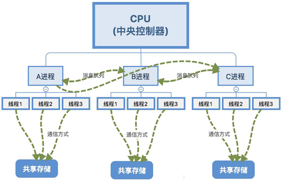

* 是进程中的一个执行路径，共享一个内存空间，线程之间可以自由切换，并发执行。一个进程最少有一个线程。
* 多线程扩展了多进程的概念，使得同一个进程也可以并发处理多个任务。

***

### 进程与线程

一个操作系统中可以运行多个进程，一个进程中中可以有多个线程，每个进程有自己独立的内存，这块内存会在主存中有一段映射，而该进程中的所有线程共享这块内存。并且，每个线程又有自己独立的内存（栈内存等）。

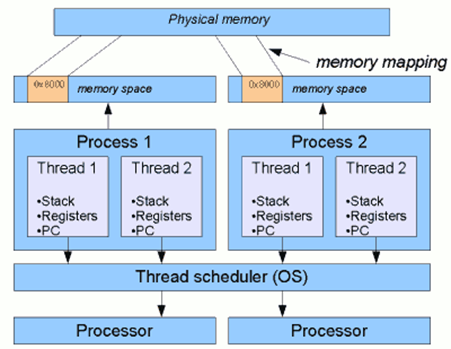


| 区别     | 进程                                                         | 线程                                                         |
| -------- | ------------------------------------------------------------ | ------------------------------------------------------------ |
| 根本区别 | 系统进行资源分配和调用的独立单位                             | 进程中的单个顺序控制流，是操作系统调度和执行的最小单位       |
| 所处环境 | 每个进程都有独立的代码和数据空间（进程上下文），进程间的切换会有较大的开销 | 线程可以看成是轻量级的进程，同一个进程内的线程共享代码和数据空间，每个线程有独立的运行栈和程序计数器，线程切换开销小 |
| 分配内存 | 系统在运行的时候会为每个进程分配独立的内存区域               | 除CPU以外，不会为线程分配内存（线程所使用的资源是它所属的进程的资源），线程组只能共享资源 |
| 包含关系 | 进程可以有一个或多个线程，如一个进程内拥有多个线程，则执行过程不是一条线，而是多条线共同执行 | 线程是进程的一部分，所以线程有时又被称为轻权进程或者轻量级进程 |
***
### 线程调度
**分时调度**

* 所有线程轮流使用CPU的使用权，平均分配每个线程占用CPU的时间

**抢占式调度**

* 优先让优先级高的线程使用CPU，如果线程的优先级相同，那么会随机选择一个（线程随机行），Java使用的为抢占式调度。
* CPU使用抢占式调度模式在多个线程间进行着高速的切换。对于CPU的一个核心而言，某个时刻，只能执行一个线程，而CPU在多个线程间切换速度相对我们的感觉要快，看上去就是在同一时刻运行。其实，多线程程序并不能提高程序的运行速度，但能够提高程序运行效率，让CPU的使用率更高。

***
### 同步与异步
**同步**：排队执行，效率低但是安全
**异步**：同时执行，效率高但是数据不安全
***
### 并发与并行
**并发**：指两个或多个事件在**同一时间段内**发生
**并行**：指两个或多个时间在**同一时刻**发生（同时发生）
***
## 并发编程
### 并发编程三要素

* 原子性：指的是一个或多个操作，要么全部执行要么就全部都不执行，原子性是数据一致性的保障。
* 可见性：指多个线程操作一个共享变量时，其中一个线程对变量进行修改后，其他线程可以立即看到修改后的结果。
* 有序性：程序的执行顺序按照代码的先后顺序执行。单线程简单的事，多线程并发就不容易保障了。
***
### 死锁现象

死锁是指两个或两个以上的线程在执行过程中，由于竞争资源或者由于彼此通信而造成的一种阻塞的现象，若无外力作用，它们将无法推进下去，此时称系统处于死锁状态或系统产生了死锁。


***
### 线程状态
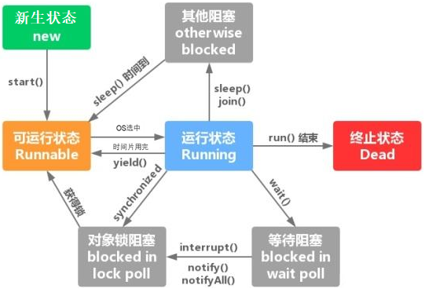 
线程生命周期，总共有五种状态：

1. 新生状态（New）：当线程对象创建后，即进入了新生状态，如
```java
Thread t = new MyThread();
```
2. 就绪状态（Runnable）：当调用了线程对象的start()方法，线程即进入就绪状态，处于就绪状态的线程，只是说明此线程已经做好了准备，随时等待CPU调度执行，并不是说执行了start()方法此线程就会立即执行。

3. 运行状态（Running）：当CPU开始调度处于就绪状态的线程时，此时线程才得以真正执行，即进入到运行状态。注意：就绪状态实际进入到运行状态的唯一入口，也就是说，线程想要进行运行状态执行，首先必须处于就绪状态中。

4. 阻塞状态（Blocked）：处于运行状态中的线程由于某种原因，暂时放弃对CPU的使用权，停止执行，此时进入阻塞状态，只有当引起阻塞的原因消除时，线程便进入到就绪状态，才有机会再次被CPU调用以进入到运行状态。
    根据阻塞产生的原因不同，阻塞状态又可以分为三种：
a. 等待阻塞：运行状态中的线程执行wait()方法，使得本线程进入到等待阻塞状态
b. 同步阻塞：线程在获取synchronized同步锁失败（锁被其他线程占用），它会进入同步阻塞状态
c. 其他阻塞：通过调用线程的sleep()或者join()或发出I/O请求时，线程会进入到阻塞状态。当sleep()状态超时、join()等待线程终止或者超时、或者I/O处理完毕时，线程重新转入就绪状态

5. 死亡状态（Dead）：线程执行完了或者因异常退出了run()方法，该线程结束生命周期。（其实还有一种可能，就是通过stop()方法来强制终止一个线程，但是stop()方法太暴力，现已过时，现常用两阶段终止模式来实现）
***
### 创建和运行线程
#### TestThread

Thread类实现了Runnable接口，可以创建线程实例。启动线程的唯一方法就是通过Thread类的start()实例方法。start()方法是一个native方法，它将通知底层操作系统，最终由操作系统启动一个新线程，操作系统将执行run()方法。
测试代码：
```java
package javase.thread;

public class TestThread extends Thread{
    public static void main(String[] args) {
       for (int i = 0; i < 10; i++) {
           new TestThread().start();
       }
    }

    @Override
    public void run() {
       System.out.println(this.getName());
    }
}
```
执行结果：
```
Thread-1
Thread-0
Thread-2
Thread-3
Thread-4
Thread-6
Thread-5
Thread-7
Thread-8
Thread-9
```
#### TestRunnable
如果自己定义的类已经extends另一个类，就无法extends Thread，此时可以实现一个Runnable接口。
这种方式是代理模式的体现。Thread类中定义了一个Runnable类型的成员变量（`private Runnable target; /* What will be run. */`），当构造方法中传入一个Runnable的实例target后，最终会调用方法对上述成员变量赋值（`this.target = target`），而Thread类本身也实现了Runnable接口，这是典型的**代理模式**的应用。
测试代码：
```java
package javase.thread;

public class TestRunnable implements Runnable {
    public static void main(String[] args) {
       TestRunnable target = new TestRunnable();
       for (int i = 0; i < 10; i++) {
           new Thread(target).start();
       }
    }

    @Override
    public void run() {
       System.out.println(Thread.currentThread().getName());
    }
}
```
执行结果：
```
Thread-0
Thread-1
Thread-3
Thread-2
Thread-4
Thread-5
Thread-7
Thread-6
Thread-8
Thread-9
```
#### TestCallable
```java
package javase.thread;

import java.util.concurrent.Callable;
import java.util.concurrent.ExecutionException;
import java.util.concurrent.FutureTask;


public class TestCallable implements Callable<String>{

    public static void main(String[] args) throws InterruptedException， ExecutionException {
       TestCallable callable = new TestCallable();
       for (int i = 0; i < 10; i++) {
           //FutureTask与线程是一一对应的，所以必须在for循环内部创建
           FutureTask<String> target = new 
FutureTask<String>(callable);
           new Thread(target，"Thread"+i).start();
           System.out.println(target.get());//get()方法是一个阻塞方法
       }
    }

    @Override//操作系统会自动调用call相当于Thread.run
    public String call() throws Exception {
       System.out.println(Thread.currentThread().getName());
       return Thread.currentThread().getName();
    }
}
```
执行结果：
```
Thread0
Thread0
Thread1
Thread1
Thread2
Thread2
Thread3
Thread3
Thread4
Thread4
Thread5
Thread5
Thread6
Thread6
Thread7
Thread7
Thread8
Thread8
Thread9
Thread9
```
可以看出，线程之间是轮流执行的，因为FutureTask对象的get()方法是阻塞式方法，如果将System.out.println(target.get());这行代码注释掉，执行结果就不一样了。
注释后的执行结果：
```
Thread1
Thread2
Thread0
Thread4
Thread6
Thread5
Thread3
Thread7
Thread9
Thread8
```
#### TestThreadPool
ExecutorService、Callable、Future三个接口实际上都是属于Executor框架。返回结果的线程是在JDK1.5中引入的新特性，有了这种特征就不需要再为了得到返回值而大费周折了。而且自己实现了也可能漏洞百出，有返回值的任务必须实现Callable接口。类似的，无返回值的任务必须实现Runnable接口。
```java
package javase.thread;

import java.util.concurrent.Callable;
import java.util.concurrent.ExecutionException;
import java.util.concurrent.ExecutorService;
import java.util.concurrent.Executors;
import java.util.concurrent.Future;

public class TestThreadPool {
    private static ExecutorService es = Executors.newFixedThreadPool(5);

    public static void main(String[] args) throws InterruptedException， ExecutionException {
       testRunnable();//无返回值
//     testCallable();//有返回值
    }

    private static void testRunnable() {
       Runnable task = new Runnable() {
           @Override
           public void run() {
              System.out.println(Thread.currentThread().getName());
           }
       };
       
       for (int i = 0; i < 6; i++) {
           es.submit(task);
       }
       es.shutdown();
    }

    private static void testCallable() throws InterruptedException， 
ExecutionException {
       Callable<String> task = new Callable<String>() {
           @Override
           public String call() throws Exception {//Callable的call()方法允许抛出异常，而Runnable的run()方法不允许抛出异常
              System.out.println(Thread.currentThread().getName()+"正在执行");
              return Thread.currentThread().getName();
           }
       };

       for (int i = 0; i < 6; i++) {
           Future<String> future = es.submit(task);
           String str = future.get();
           System.out.println(str+"执行完毕");
       }
       es.shutdown();
    }
}
```
调用testRunnable()方法的执行结果：
```
pool-1-thread-2
pool-1-thread-5
pool-1-thread-3
pool-1-thread-4
pool-1-thread-1
pool-1-thread-2
```
调用testCallable()方法的执行结果：
```
pool-1-thread-1正在执行
pool-1-thread-1执行完毕
pool-1-thread-2正在执行
pool-1-thread-2执行完毕
pool-1-thread-3正在执行
pool-1-thread-3执行完毕
pool-1-thread-4正在执行
pool-1-thread-4执行完毕
pool-1-thread-5正在执行
pool-1-thread-5执行完毕
pool-1-thread-1正在执行
pool-1-thread-1执行完毕
```
注意：Future对象的get()方法是阻塞式方法，线程无返回结果，get()方法会一直等待。

#### 比较创建多线程的三种方式

| 方式     | 优点                                                         | 缺点                                                         |
| -------- | ------------------------------------------------------------ | ------------------------------------------------------------ |
| Thread   | 编写简单，如果需要访问当前线程，无需调用静态方法Thread.currentThread()，通过this关键字即可。 | 线程类已经继承Thread类，所以不能再继承其他父类。             |
| Runnable | 线程类只是实现了Runnable接口，还可以继承其他类，避免了Java单继承的局限。适合多个相同的程序代码去处理同一个资源的情况，把线程和程序的代码、数据有效分离，较好地体现了面向对象的思想。 | 编程稍微复杂，如果要访问当前线程，则必须要使用Thread.currentThread()方法。 |
| Callable | Runnable规定重写的方法是run()，无返回值，不能抛异常；Callable规定重写的方法是call()，可以有返回值，可以抛出异常。运行Callable任务可以拿到一个Future对象，表示异步计算的结果。 | 如果需要获取异步计算的结果，那运行速度慢。                   |

### 常用方法

| 变量和类型     | 方法名                       | 功能描述                                                 | 注意点                                                       |
| -------------- | ---------------------------- | -------------------------------------------------------- | ------------------------------------------------------------ |
| void           | start()                      | 启动一个线程，在新的线程中运行run方法中的代码            | start方法只是让线程进入就绪，里面的代码不一定立刻运行。每个线程对象的start方法只能调用一次，调用多次会出现异常：IllegalThreadStateException |
| void           | run()                        | 新线程启动后会调用的方法                                 | 如果在构造Thread对象时传递了Runnable参数，则线程启动后会调用Runnable中的run方法，否则默认不执行任何操作，但可以创建Thread的子类对象来覆盖默认行为。 |
| void           | join                         | 等待线程运行结束                                         |                                                              |
| void           | join(long n)                 | 等待线程运行结束，最多等待n毫秒                          |                                                              |
| long           | getId()                      | 获取线程长整形的id                                       | Id唯一                                                       |
| String         | getName()                    | 获取线程名                                               |                                                              |
| void           | setName(String name)         | 设置线程名                                               |                                                              |
| int            | getPriority()                | 获取线程优先级                                           |                                                              |
| void           | setPriority(int newPriority) | 设置线程优先级                                           | Java中规定线程优先级是1-10的整数，较大的优先级能提高该线程被CPU调度的几率 |
| Thread.State   | getState()                   | 获取当前线程的状态                                       | Java中线程状态是用6个枚举值表示，分别是NEW，RUNNABLE，BLOCKED，WAITING，TIMED_WATING，TERMINATED |
| boolean        | isInterrupted()              | 判断当前线程是否被打断                                   | 不会清除打断标记                                             |
| boolean        | isAlive()                    | 判断当前线程是否存活                                     |                                                              |
| boolean        | isDaemon()                   | 判断当前线程是否是守护线程                               |                                                              |
| void           | interrupte()                 | 打断线程                                                 | 如果被打断的线程正在sleep，wait，join会导致被打断的线程抛出InterruptedException，并清除打断标记；如果打断正在运行的线程，则会设置打断标记；park的线程被打断，也会设置打断标记 |
| static boolean | interrupted()                | 判断当前线程是否被打断                                   | 会清除打断标记                                               |
| static Thread  | currentThread()              | 获取当前正在被执行的线程                                 |                                                              |
| static void    | sleep(long millis)           | 让当前执行的线程休眠n毫秒，休眠让出CPU的时间片给其他线程 |                                                              |
| static void    | yield()                      | 提示线程调度器让出当前线程对CPU的使用                    | 主要是为了测试和调试                                         |

#### start与run

**调用run()**

```java
  Thread t1 = new Thread("t1") {    
	@Override    
	public void run() {      
		log.debug(Thread.currentThread().getName());
		FileReader.read("D:\\Kafka简介.mp4");    
	}
  };

  t1.run();  
  log.debug("do other things ...");
```

输出：

```
15:21:03 [main] c.Test - main
15:21:03 [main] c.FileReader - read [Kafka简介.mp4] start ...
15:21:03 [main] c.FileReader - read [Kafka简介.mp4] end ... cost: 588 ms
15:21:03 [main] c.Test - do other things ...
```

可见，程序仍在main线程运行，`FileReader.read()`方法调用还是同步的。


**调用start()**

将上述代码的`t1.run();`改为`t1.start();`

输出：

```
15:28:42 [main] c.Test - do other things ...
15:28:42 [t1] c.Test - t1
15:28:42 [t1] c.FileReader - read [Kafka简介.mp4] start ...
15:28:43 [t1] c.FileReader - read [Kafka简介.mp4] end ... cost: 579 ms
```

可见，线程中t1线程在运行，`File Reader.read()`方法调用是异步的。


线程在创建后的状态是NEW，在调用start()方法后的状态是RUNNABLE，如果再次调用start()方法，会出现异常         IllegalThreadStateException 。

```java
	Thread t1 = new Thread() {
		@Override
		public void run() {
			log.debug("running...");
		}
	};
	t1.setName("t1");
	log.debug(t1.getState().toString());
	t1.start();
	log.debug(t1.getState().toString());
```

输出：

```
15:38:53 [main] c.Test - NEW
15:38:53 [main] c.Test - RUNNABLE
15:38:53 [t1] c.Test - running...
```


```java
	Thread t1 = new Thread() {
		@Override
		public void run() {
			log.debug("running...");
		}
	};
	t1.setName("t1");
	log.debug(t1.getState().toString());
	t1.start();
	t1.start();
	log.debug(t1.getState().toString());
```

如果重复调用start()方法，输出：

```
15:44:59 [main] c.Test - NEW
Exception in thread "main" 15:44:59 [t1] c.Test - running...
java.lang.IllegalThreadStateException
	at java.lang.Thread.start(Thread.java:708)
	at com.xiaoma.concurrent.Test.main(Test.java:17)
```


小结：

- 直接调用run()是在主线程中执行了run()方法，并没有启动新的线程
- 调用start()是启动新的线程，通过新线程执行run()方法中的代码

------

#### sleep与yield

##### sleep

- 调用sleep()会让当前线程进入Timed_Waiting状态（阻塞）

- 其它线程可以使用interrupt方法打断正在睡眠的线程，这时sleep()方法会抛出 InterruptedException异常 

- 睡眠结束后的线程未必会立刻得到执行（Runnable状态）

- 建议用 TimeUnit的sleep()代替Thread的sleep()来获得更好的可读性

```java
  package com.xiaoma.concurrent;
  
  import lombok.extern.slf4j.Slf4j;
  
  @Slf4j(topic = "c.Test")
  public class Test {
  	public static void main(String[] args) {
  		Thread t1 = new Thread("t1") {
  			@Override
  			public void run() {
  				try {
  					//线程执行sleep()进入TIMED_WAITING状态
  					//等足两秒再继续执行,执行完毕进入TERMINATED状态
  					Thread.sleep(2000);
  				} catch (InterruptedException e) {
  					e.printStackTrace();
  				}
  			}
  		};
  		t1.start();
  		log.debug("t1 state:{}",t1.getState());//RUNNABLE
  		
  		try {
  			Thread.sleep(1000);//main线程等待1秒,t1线程运行
  		} catch (InterruptedException e) {
  			e.printStackTrace();
  		}
  		log.debug("t1 state:{}",t1.getState());//TIMED_WAITING
          
  		try {
  			Thread.sleep(1000);//main线程等待1秒,t1线程运行
  		} catch (InterruptedException e) {
  			e.printStackTrace();
  		}		
  		log.debug("t1 state:{}",t1.getState());//TERMINATED
  	}
  
  }
```

输出：

```
16:34:57 [main] c.Test - t1 state:RUNNABLE
16:34:58 [main] c.Test - t1 state:TIMED_WAITING
16:34:59 [main] c.Test - t1 state:TERMINATED
```


如果调用了线程的interrupt()方法：

```java
package com.xiaoma.concurrent;

import lombok.extern.slf4j.Slf4j;

@Slf4j(topic = "c.Test")
public class Test {
	public static void main(String[] args) {
		Thread t1 = new Thread("t1") {
			@Override
			public void run() {
				try {
					log.debug("enter sleep...");
					Thread.sleep(2000);
				} catch (InterruptedException e) {
					log.debug("wake up...");
					e.printStackTrace();
				}
			}
		};
		t1.start();
		

		try {
			Thread.sleep(1000);//main线程等待1秒,t1线程运行
		} catch (InterruptedException e) {
			e.printStackTrace();
		}

		log.debug("interrupt...");
		t1.interrupt();
	}

}
```

输出：

```
16:41:35 [t1] c.Test - enter sleep...
16:41:36 [main] c.Test - interrupt...
java.lang.InterruptedException: sleep interrupted
	at java.lang.Thread.sleep(Native Method)
16:41:36 [t1] c.Test - wake up...
	at com.xiaoma.concurrent.Test$1.run(Test.java:13)
```
***
##### yield

- 调用yield会让当前线程从Running进入Runnable就绪状态，然后调度执行其他线程
- 具体的实现依赖于操作系统的任务调度器
***
##### 线程优先级
- 线程优先级会提示调度器优先调度该线程，但它仅仅是一个提示，调度器可以忽略它
- 如果cpu比较忙，那么优先级高的线程会优先获得时间片，但cpu闲时，优先级几乎没作用

***

#### join方法详解

##### 为什么需要join

执行下面的代码，打印的r是什么值？

```java
package com.xiaoma.concurrent;

import java.util.concurrent.TimeUnit;
import lombok.extern.slf4j.Slf4j;

@Slf4j(topic = "c.Test")
public class Test {
	static int r = 0;
	public static void main(String[] args){
		test1(); 
	} 
	private static void test1() {
		log.debug("开始");  
		Thread t1 = new Thread(() -> {        
			log.debug("开始");        
			try {
				TimeUnit.SECONDS.sleep(1);
			} catch (InterruptedException e) {
				e.printStackTrace();
			}
			log.debug("结束");        
			r = 10;
		},"t1");    
		t1.start();    
		log.debug("结果为:{}", r);    
		log.debug("结束"); 
	}
}
```

输出：

```
17:39:06 [main] c.Test - 开始
17:39:06 [t1] c.Test - 开始
17:39:06 [main] c.Test - 结果为:0
17:39:06 [main] c.Test - 结束
17:39:07 [t1] c.Test - 结束
```

分析：

因为主线程和线程t1是并行执行的，t1线程需要1秒之后才能算出r=10；而主线程一开始就要打印r的结果，所以只能打印出r=0。

解决方案：

用sleep行不行，为什么？不行，需要sleep多长时间不确定。可以用join，加在t1.start()之后即可。

```java
package com.xiaoma.concurrent;

import java.util.concurrent.TimeUnit;
import lombok.extern.slf4j.Slf4j;

@Slf4j(topic = "c.Test")
public class Test {
	static int r = 0;
	public static void main(String[] args){
		test1(); 
	} 
	private static void test1()  {
		log.debug("开始");  
		Thread t1 = new Thread(() -> {        
			log.debug("开始");        
			try {
				TimeUnit.SECONDS.sleep(1);
			} catch (InterruptedException e) {
				e.printStackTrace();
			}
			log.debug("结束");        
			r = 10;
		},"t1");    
		t1.start();
		try {
			t1.join();//其他线程需要等t1线程先执行完
		} catch (InterruptedException e) {
			e.printStackTrace();
		}
		log.debug("结果为:{}", r);    
		log.debug("结束"); 
	}

}
```

以调用方角度来讲，如果<u>需要等待结果返回才能继续运行</u>就是**同步**；如果<u>不需要等待结果返回就能继续运行</u>就是**异步**。

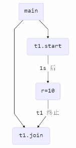

##### 等待多个结果

问：下面的代码cost大约多少秒？

```java
package com.xiaoma.concurrent;

import java.util.concurrent.TimeUnit;
import lombok.extern.slf4j.Slf4j;

@Slf4j(topic = "c.Test")
public class Test {
	static int r1 = 0;
	static int r2 = 0;
	public static void main(String[] args) throws InterruptedException{
		test1(); 
	} 
	private static void test1() throws InterruptedException  {
		Thread t1 = new Thread(()-> {
			try {
				TimeUnit.SECONDS.sleep(1);
			} catch (InterruptedException e) {
				e.printStackTrace();
			}
			r1 = 10;
		},"t1");
		Thread t2 = new Thread(()-> {
			try {
				TimeUnit.SECONDS.sleep(2);
			} catch (InterruptedException e) {
				e.printStackTrace();
			}
			r1 = 20;
		},"t2");
		

		t1.start();
		t2.start();
		long begin = System.currentTimeMillis();
		log.debug("join begin");
		t1.join();
		log.debug("t1 join end");
		t2.join();
		log.debug("t2 join end");
		long end = System.currentTimeMillis();

		log.debug("r1:{} r2:{} cost:{}",r1,r2,end-begin);
	}

}
```

输出：

```
18:43:42 [main] c.Test - join begin
18:43:43 [main] c.Test - t1 join end
18:43:44 [main] c.Test - t2 join end
18:43:44 [main] c.Test - r1:20 r2:0 cost:2002
```

分析：

第一个join：等待t1时，t2并没有停止，而在运行

第二个join：1s后，执行到此，t2也运行了1s，因此只需要再等待1s

如果颠倒两个join呢？

输出：

```
18:46:38 [main] c.Test - r1:20 r2:0 cost:2001
```

同样也是将近2s

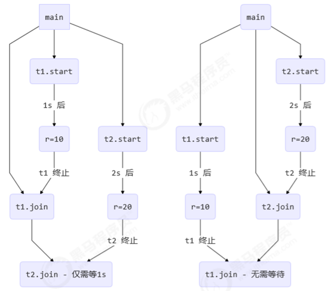

##### 有时效的join

**等够时间：**

```java
package com.xiaoma.concurrent;

import java.util.concurrent.TimeUnit;
import lombok.extern.slf4j.Slf4j;

@Slf4j(topic = "c.Test")
public class Test {
	static int r1 = 0;
	static int r2 = 0;
	public static void main(String[] args) throws InterruptedException{
		test1(); 
	} 
	private static void test1() throws InterruptedException  {
		Thread t1 = new Thread(()-> {
			try {
				TimeUnit.SECONDS.sleep(1);
			} catch (InterruptedException e) {
				e.printStackTrace();
			}
			r1 = 10;
		},"t1");
		long begin = System.currentTimeMillis();
		t1.start();
		//线程执行结束会导致join结束
        t1.join(1500);
        long end = System.currentTimeMillis();
		log.debug("r1:{} r2:{} cost:{}",r1,r2,end-begin);
	}

}
```

输出：

```
20:40:35 [main] c.Test - r1:10 r2:0 cost:1002
```

主线程无需等待1500ms，也就等待了1002ms。


**没等够时间：**

将`TimeUnit.SECONDS.sleep(1);`改为`TimeUnit.SECONDS.sleep(2);` 输出：

```
20:43:58 [main] c.Test - r1:0 r2:0 cost:1501
```

主线程等待1500ms就不等待了，直接取r1的值，这时t1线程还没有进行修改，值为0。

***

#### interrupt方法详解

##### 打断sleep，wait，join的线程

这几个方法都会让线程进入阻塞状态，打断阻塞状态的线程，会清空打断状态，以sleep为例：

```java
Thread t1 = new Thread(()-> {
	try {	
		log.debug("sleep...");
		TimeUnit.SECONDS.sleep(3);
	} catch (InterruptedException e) {
		e.printStackTrace();
	}
},"t1");
t1.start();

//等待1s再打断
TimeUnit.SECONDS.sleep(1);
log.debug("interrupt...");
t1.interrupt();

//等待1ms,以防t1线程还没进入catch块就输出了t1线程的状态
TimeUnit.MILLISECONDS.sleep(1);
log.debug("打断状态:{}",t1.isInterrupted());
```

输出：

```
10:38:06 [t1] c.Test - sleep...
10:38:07 [main] c.Test - interrupt...
java.lang.InterruptedException: sleep interrupted
	at java.lang.Thread.sleep(Native Method)
	at java.lang.Thread.sleep(Thread.java:340)
	at java.util.concurrent.TimeUnit.sleep(TimeUnit.java:386)
	at com.xiaoma.concurrent.Test.lambda$0(Test.java:17)
	at java.lang.Thread.run(Thread.java:748)
10:38:07 [main] c.Test - 打断状态:false
```

##### 打断正常运行的线程

打断正常运行的线程，不会清空打断状态，并且线程还会正常执行。

```java
	Thread t2 = new Thread(()-> {
		while (true) {
			boolean interrupted = Thread.currentThread().isInterrupted();
			if(interrupted) {//被打断后退出,让线程结束执行,这种方式更加优雅,可以自己决定是否结束线程,还可以做善后处理等操作
				log.debug("打断状态:{}",interrupted);
				break;
			}
		}
	},"t2");
	t2.start();

	//主线程等待1秒,打断t2线程
	TimeUnit.SECONDS.sleep(1);
	log.debug("interrupt...");
	t2.interrupt();
```

输出：

```
10:47:45 [main] c.Test - interrupt...
10:47:45 [t2] c.Test - 打断状态:true
```

##### *模式之两阶段终止模式

```java
package com.xiaoma.concurrent;

import java.util.concurrent.TimeUnit;
import lombok.extern.slf4j.Slf4j;

@Slf4j
public class TestTwoPhaseTermination {
	public static void main(String[] args) throws InterruptedException {
		TPTInterrupt t =  new TPTInterrupt();
		t.start();

		TimeUnit.SECONDS.sleep(5);
		log.debug("stop");
		t.stop();
	}

}
@Slf4j(topic = "c.TPTInterrupt")
class TPTInterrupt{
	private Thread monitor;
	public void start() {
		monitor = new Thread(()->{
			while (true) {
				if (monitor.isInterrupted()) {
					log.debug("料理后事");
					break;
				}
				try {
                    //防止很多线程先获取monitor的执行逻辑
					TimeUnit.SECONDS.sleep(2);
					log.debug("执行监控记录");
				} catch (InterruptedException e) {
					//睡眠过程中出现异常需要设置打断标记
					monitor.interrupt();
				}
			}
		},"监控线程") ;
		monitor.start();
	}
	public void stop() {
		monitor.interrupt();
	}
}
```

输出：

```
12:26:31 [监控线程] c.TPTInterrupt - 执行监控记录
12:26:33 [监控线程] c.TPTInterrupt - 执行监控记录
12:26:34 [main] c.TestTwoPhaseTermination - stop
12:26:34 [监控线程] c.TPTInterrupt - 料理后事
```

#### 打断park线程

打断park线程不会清空打断状态

```java
Thread t1 = new Thread(()-> {
	log.debug("park...");
	LockSupport.park();//park方法无需捕获异常
	log.debug("unpark...");
	log.debug("打断状态:{}",Thread.currentThread().isInterrupted());
	},"t1");
t1.start();

TimeUnit.SECONDS.sleep(1);
log.debug("interrupt...");
t1.interrupt();
```

输出：

```
12:35:32 [t1] c.Test - park...
12:35:33 [main] c.Test - interrupt...
12:35:33 [t1] c.Test - unpark...
12:35:33 [t1] c.Test - 打断状态:true
```


如果打断标记已经是true，则park会失效。

```java
Thread t1 = new Thread(()-> {
	for (int i = 0; i < 5; i++) {
		log.debug("park...");
		LockSupport.park();
		log.debug("打断状态:{}",Thread.currentThread().isInterrupted());
		}
	},"t1");
t1.start();
		
TimeUnit.SECONDS.sleep(1);
log.debug("interrupt...");
t1.interrupt();
```

输出：

```
13:03:50 [t1] c.Test - park...	//第一次会阻塞住,直到interrupt
13:03:51 [main] c.Test - interrupt...
13:03:51 [t1] c.Test - 打断状态:true
13:03:51 [t1] c.Test - park...	//第二次不会阻塞(park方法失效),继续执行
13:03:51 [t1] c.Test - 打断状态:true
13:03:51 [t1] c.Test - park...
13:03:51 [t1] c.Test - 打断状态:true
13:03:51 [t1] c.Test - park...
13:03:51 [t1] c.Test - 打断状态:true
13:03:51 [t1] c.Test - park...
13:03:51 [t1] c.Test - 打断状态:true
```

 提示：可以使用Thread.interrupted()清除打断状态  

```java
Thread t1 = new Thread(()-> {
	for (int i = 0; i < 5; i++) {
		log.debug("park...");
		LockSupport.park();
		log.debug("打断状态:{}",Thread.interrupted());
	}
},"t1");
t1.start();
	
TimeUnit.SECONDS.sleep(1);
log.debug("interrupt...");
t1.interrupt();
```
输出：

```
13:10:24 [t1] c.Test - park...
13:10:25 [main] c.Test - interrupt...
13:10:25 [t1] c.Test - 打断状态:true
13:10:25 [t1] c.Test - park...	
```

由此可见，第二次也会阻塞住，因为Thread.interrupted()会清除打断状态，所以park方法会生效，此时程序阻塞住并没有执行结束。

#### 不推荐的方法

还有一些不推荐使用的方法，这些方法已过时，容易破坏同步代码块，造成线程死锁。

| 方法      | 功能描述                      |
| --------- | ----------------------------- |
| stop()    | 停止线程运行=》两阶段终止模式 |
| suspend() | 挂起（暂停）线程运行=》wait() |
| resume()  | 恢复线程运行=》notify()       |

### 主线程与守护线程

默认情况下，Java进程需要等待所有线程都运行结束，才会结束。有一种特殊的线程叫做守护线程，只要其它非守护线程运行结束了，即使守护线程的代码没有执行完，也会强制结束。

```java
log.debug("开始运行...");
Thread t1 = new Thread(()-> {
	log.debug("开始运行...");
	TimeUnit.SECONDS.sleep(2);
	log.debug("运行结束...");
},"t1");
//设置该线程为守护线程
t1.setDaemon(true);
t1.start();
	
TimeUnit.SECONDS.sleep(1);
log.debug("运行结束...");
```
输出：

```
13:43:58 [main] c.Test - 开始运行...
13:43:58 [t1] c.Test - 开始运行...	
13:43:59 [main] c.Test - 运行结束...
```

由此可见，主线程结束后t1线程就结束了，`log.debug("运行结束...");`不再执行。

**注意点：**

- 垃圾回收线程就是一种守护线程

- Tomcat中的Acceptor和Poller线程都是守护线程，所以Tomcat接收到shutdown命令后，不会等待它们处理完当前请求

### 线程同步

#### TicketThread.java

```java
package javase.thread;

public class TicketThread extends Thread{
	//static:将票数设置为共享变量,否则就是每个窗口各卖各的,各卖10张票
	private static Integer ticket = 10;
	
	@Override
	public void run() {
		while(true) {
			if (ticket<=0) {//还有票就卖,没票线程就执行结束
				break;
			}
			try {
				Thread.sleep(100);
			} catch (InterruptedException e) {
				e.printStackTrace();
			}
			System.out.println(Thread.currentThread().getName()+"售出一张票,还剩"+(--ticket)+"张票");
		}
	}

    public static void main(String[] args) {
        //创建3个线程,模拟三个窗口卖票
        TicketThread w1 = new TicketThread();
        w1.setName("窗口1");
        TicketThread w2 = new TicketThread();
        w2.setName("窗口2");
        TicketThread w3 = new TicketThread();
        w3.setName("窗口3");

        w1.start();
        w2.start();
        w3.start();
    }

}
```

输出：

```
窗口2售出一张票,还剩9张票
窗口1售出一张票,还剩9张票
窗口3售出一张票,还剩9张票
窗口3售出一张票,还剩8张票
窗口2售出一张票,还剩7张票
窗口1售出一张票,还剩8张票
窗口2售出一张票,还剩6张票
窗口3售出一张票,还剩6张票
窗口1售出一张票,还剩5张票
窗口2售出一张票,还剩4张票
窗口3售出一张票,还剩4张票
窗口1售出一张票,还剩4张票
窗口3售出一张票,还剩3张票
窗口2售出一张票,还剩1张票
窗口1售出一张票,还剩2张票
窗口1售出一张票,还剩0张票
窗口2售出一张票,还剩0张票
窗口3售出一张票,还剩-1张票
```

#### TicketRunnable.java

Thread的继承方式，继承了Thread的方式就没法再继承其他类了，因为java中是单继承，怎么办呢？可以实现Runnable接口来实现多线程售票。

把任务用Runnable进行封装，三个线程并发执行一个任务。

```java
package javase.thread;

public class TicketRunnable implements Runnable{
	//多个窗口一起卖这10张票
	private Integer ticket = 10;

    @Override
    public void run() {
        while(true) {
            if(ticket<=0) {
                break;
            }
            try {
                Thread.sleep(100);
            } catch (InterruptedException e) {
                e.printStackTrace();
            }
            System.out.println(Thread.currentThread().getName()+"售出一张票,还剩"+(--ticket)+"张票");
        }
    }

    public static void main(String[] args) {
        TicketRunnable target = new TicketRunnable();
        Thread w1 = new Thread(target,"窗口1");
        Thread w2 = new Thread(target,"窗口2");
        Thread w3 = new Thread(target,"窗口3");

        w1.start();
        w2.start();
        w3.start();
    }

}
```

输出：

```
窗口2售出一张票,还剩9张票
窗口3售出一张票,还剩9张票
窗口1售出一张票,还剩9张票
窗口2售出一张票,还剩8张票
窗口1售出一张票,还剩7张票
窗口3售出一张票,还剩6张票
窗口1售出一张票,还剩5张票
窗口3售出一张票,还剩3张票
窗口2售出一张票,还剩4张票
窗口1售出一张票,还剩2张票
窗口3售出一张票,还剩2张票
窗口2售出一张票,还剩1张票
窗口1售出一张票,还剩0张票
窗口3售出一张票,还剩-1张票
窗口2售出一张票,还剩0张票
```

#### 线程安全问题

可以看出三个窗口并发执行，一起卖票，多次执行出现问题，一张票竟然多次售卖，如第一张票，多个窗口都卖出了，有时甚至会出现**超卖**现象。

罪魁祸首是--ticket，看似很乖一肚子坏水哦，它看似是一个命令，其实是多个命令组成，这就造成了它的命令非原子性，在高并发时，一个线程还未执行完成，另一个线程就进来了。

以i++为例，i++内部做了三次指令操作，两次内存访问：

1. 从内存中读取i变量的值到CPU的寄存器
2. 在寄存器中i自增1
3. 将寄存器中的值写入内存

 怎么解决以上问题呢呢？可以通过线程锁Synchronized。

```java
package javase.thread;

public class TicketRunnable implements Runnable{
	//多个窗口一起卖这10张票
	private Integer ticket = 10;
    @Override
    public void run() {
        while(true) {
            synchronized (this) {
                if(ticket<=0) {
                    break;
                }
                try {
                    Thread.sleep(100);
                } catch (InterruptedException e) {
                    e.printStackTrace();
                }
                System.out.println(Thread.currentThread().getName()+"售出一张票,还剩"+(--ticket)+"张票");
            }
        }
    }

    public static void main(String[] args) {
        TicketRunnable target = new TicketRunnable();
        Thread w1 = new Thread(target,"窗口1");
        Thread w2 = new Thread(target,"窗口2");
        Thread w3 = new Thread(target,"窗口3");

        w1.start();
        w2.start();
        w3.start();
    }
}
```
#### 同步监视器

- synchronized(obj){}中的obj称为同步监视器
- 同步代码块中同步监视器可以是任何对象，但是推荐使用共享资源作为同步监视器
- 同步方法中无需指定同步监视器，因为同步方法的监视器默认是this，如果是静态方法，那么监视器是当前类的字节码对象


同步监视器的执行过程：

1. 第一个线程访问，锁定同步监视器，执行其中代码
2. 第二个线程访问，发现同步监视器被锁定，无法访问
3. 第一个线程访问完毕或时间片用完，解锁同步监视器
4. 第二个线程访问，发现同步监视器未锁，锁定并访问

### 生产者与消费者

生产者消费者模式是一个十分经典的多线程协作的模式，实际上主要是包含了两类线程：

- 生产者线程:用于生产数据
- 消费者线程:用于消费数据

为了解耦生产者和消费者的关系，通常会采用共享的数据区域，就像是一个仓库

- 生产者生产数据之后直接放置在共享数据区中，并不需要关心消费者的行为
- 消费者只需要从共享数据区中取获取数据，并不需要关心生产者的行为

```java
package javase.thread;

import java.util.LinkedList;
import java.util.Queue;

public class Test {
	public static void main(String[] args) {
		MessageQueue queue = new MessageQueue(2);
        for (int i = 0; i < 3; i++) {
            int id = i;
            new Thread(() -> {
                queue.put(new Message(id , "值"+id));
            }, "生产者" + i).start();
        }

        new Thread(()-> {
            while(true) {
                try {
                    Thread.sleep(1000);
                } catch (InterruptedException e) {
                    e.printStackTrace();
                }
                queue.take();
            }
        },"消费者").start();
	}
}
```


```java
//消息队列类,java线程之间通信
class MessageQueue{
	//消息的队列集合
	private Queue<Message> queue = new LinkedList<Message>();
	//队列容量
	private int capacity;
    public MessageQueue(int capacity) {
        this.capacity = capacity;
    }

    //存入消息
    public void put(Message message) {
        synchronized (queue) {
            //检查队列是否已满
            while(queue.size()>=capacity) {
                try {
                    System.out.println("queue is full![" + Thread.currentThread().getName() + "] waiting for consumer.");
                    queue.wait();
                } catch (InterruptedException e) {
                    e.printStackTrace();
                }
            }
            //将消息加入队列尾部
            queue.offer(message);
            System.out.println("queue add element,[" + Thread.currentThread().getName() + "]producing value:" + message);
            //消费者往队列中存入消息后,唤醒因队列为空却想获取消息的消费者
            queue.notifyAll();
        }		
    }

    //获取消息
    public Message take() {
        synchronized (queue) {
            //检查队列是否为空
            while(queue.isEmpty()) {
                try {
                    System.out.println("queue is empty![" + Thread.currentThread().getName() + "] waiting for producer.");
                    //消费者等待获取消息(因为此时队列为空)
                    queue.wait();
                } catch (InterruptedException e) {
                    e.printStackTrace();
                }
            }
            //从队列头部获取消息并返回
            Message message = queue.poll();
            System.out.println("queue remove element,[" + Thread.currentThread().getName() + "] consuming value:" + message);
            //消费者获取到消息后,唤醒因队列已满却想生产消息的消费者
            queue.notifyAll();
            return message;
        }
    }
}
        	
```
```java
class Message{
	private Integer id;
	private Object message;
    public Message() {

    }
    public Message(Integer id, Object message) {
        this.id = id;
        this.message = message;
    }

    public Integer getId() {
        return id;
    }
    public Object getMessage() {
        return message;
    }

    @Override
    public String toString() {
        return "Message [id=" + id + ", message=" + message + "]";
    }
}
```

输出：

```
queue add element,[生产者0] producing value:Message [id=0, message=值0]
queue add element,[生产者2] producing value:Message [id=2, message=值2]
queue is full![生产者1] waiting for consumer.
queue remove element,[消费者] consuming value:Message [id=0, message=值0]
queue add element,[生产者1] producing value:Message [id=1, message=值1]
queue remove element,[消费者] consuming value:Message [id=2, message=值2]
queue remove element,[消费者] consuming value:Message [id=1, message=值1]
queue is empty![消费者] waiting for producer.
```

分析：

```
//调用了生产者线程中同步代码块中的queue.wait()方法,当前生产者线程释放锁并进入休息室(WaitSet,不具备再次竞争锁的权利) 
queue is full![生产者1] waiting for consumer.	
//EntryList中等待获取对象锁的消费者线程此时获取到对象锁并开始执行,执行完成后调用queue.notifyAll()方法,唤醒休息室中的生产者线程,此时该生产者线程进入EntryList等待获取锁
queue remove element,[消费者] consuming value:Message [id=0, message=值0]
//EntryList中的生产者线程再次获取到对象锁,开始执行
queue add element,[生产者1] producing value:Message [id=1, message=值1]
```

#### 等待与通知

- **wait()**
  正在执行的线程释放锁，进入休息室（WaitSet，即等待区，不具备直接竞争锁的权利，被唤醒之后会进入EntryList，可重新竞争锁）
- **notify()**
  正在执行的线程继续执行，通知休息室的其中一个线程可进入EntryList重新竞争锁
- **notifyAll()**
  正在执行的线程继续执行，通知休息室中的所有线程全部都进入EntryList竞争锁


注意点：

- 必须在同步代码块中调用

- 必须在加锁的对象上等待或发出通知

- wait()外总应该是一个循环条件检查（轮询）

***

#### 线程同步监视器模型

 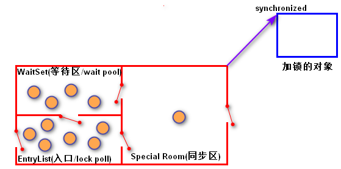                                                                                  

***

### 线程锁

#### 悲观锁和乐观锁

- 悲观锁：还是像它的名字一样，对于并发间操作产生的线程安全问题持悲观状态，悲观锁认为竞争总是发生，因此每次对某资源进行操作时，都会持有一个独占的锁，就像synchronized，不管三七二十一，直接上了锁就操作资源了。
- 乐观锁：就像它的名字一样，对于并发间操作产生的线程安全问题持乐观态度，乐观锁认为竞争不总是会发生，因此它不需要持有锁，将比较-替换（CAS）这两个动作作为一个原子操作尝试去修改内存中的变量，如果失败则表示发生冲突，那么就应该有相应的重试逻辑

***

#### 两种常见的锁

##### synchronized

```java
package javase.thread;

public class TicketThread extends Thread{
	//static:将票数设置为共享变量,否则就是每个窗口各卖各的,各卖10张票
	private static Integer ticket = 10;
    @Override
    public void run() {
        while(true) {
            //不能锁this,不同窗口是各自的this,也不能锁ticket,因为ticket一直在变
            synchronized (TicketThread.class) {
                if (ticket<=0) {//还有票就卖,没票线程就执行结束
                    break;
                }
                try {
                    Thread.sleep(100);
                } catch (InterruptedException e) {
                    e.printStackTrace();
                }
                System.out.println(Thread.currentThread().getName()+"售出一张票,还剩"+(--ticket)+"张票");
            }
        }

    }

    public static void main(String[] args) {
        //创建3个线程,模拟三个窗口卖票
        TicketThread w1 = new TicketThread();
        w1.setName("窗口1");
        TicketThread w2 = new TicketThread();
        w2.setName("窗口2");
        TicketThread w3 = new TicketThread();
        w3.setName("窗口3");

        w1.start();
        w2.start();
        w3.start();
    }
}
```
##### ReentrantReadWriteLock

```java
package javase.thread;

import java.util.concurrent.locks.ReentrantReadWriteLock;

public class TicketLock implements Runnable{
	private Integer ticket = 10;
	//jdk1.6前,性能差异很大
	//1.6之后,synchronized的底层实现类似Lock,性能伯仲之间
	private ReentrantReadWriteLock lock = new ReentrantReadWriteLock(true);

	@Override
	public void run() {
		while(true) {
			try {
				lock.writeLock().lock();
				if(ticket <= 0) {
					break;
				}
				try {
					Thread.sleep(100);
				} catch (InterruptedException e) {
					e.printStackTrace();
				}
				System.out.println(Thread.currentThread().getName()+"售出一张票,还剩"+(--ticket)+"张票");
			} catch (Exception e) {
				e.printStackTrace();
			}finally {
				//防止死锁,会自动释放,而synchronized不会释放
				lock.writeLock().unlock();
			}
		}
		
	}
	
	public static void main(String[] args) {
		Runnable target = new TicketLock();
		Thread w1 = new Thread(target,"窗口1");
		Thread w2 = new Thread(target,"窗口2");
		Thread w3 = new Thread(target，"窗口3");
	
		w1.start();
		w2.start();
		w3.start();
	}
}
```

##### 区别

需要注意的是，用sychronized修饰的方法或者语句块在代码执行完之后锁会自动释放，而用Lock需要我们手动释放锁，所以为了保证锁最终被释放（发生异常情况），**要把互斥区放在try内，释放锁放在finally内**！

与互斥锁相比，读-写锁允许对共享数据进行更高级别的并发访问。虽然一次只有一个线程（writer 线程）可以修改共享数据，但在许多情况下，任何数量的线程可以同时读取共享数据（reader 线程）从理论上讲，与互斥锁定相比，使用读-写锁允许的并发性增强将带来更大的性能提高。

##### 自旋

很多synchronized里面的代码只是一些很简单的代码，执行时间非常快，此时等待的线程都加锁可能是一种不太值得的操作，因为线程阻塞涉及到用户态和内核态切换的问题。既然synchronized里面的代码执行得非常快，不妨让等待锁的线程不要被阻塞，而是在synchronized的边界做忙循环，这就是自旋.如果做了多次忙循环发现还没有获得锁，再阻塞，这样可能是一种更好的策略。
```java
	while(true) {
		synchronized (this) {
			if(ticket<=0) {
				break;
			}
			try {
				Thread.sleep(100);
			} catch (InterruptedException e) {
				e.printStackTrace();
			}
			System.out.println(Thread.currentThread().getName()+"售出一张票,还剩"+(--ticket)+"张票");
		}
	}
```
### 线程共享

#### ThreadLocal

JDK1.2的版本中就提供了java.lang.ThreadLocal，ThreadLocal为解决多线程程序的并发问题提供了一种新的解决思路。使用这个工具类可以很简洁地编写出优美的多线程程序。这里注意线程锁是解决并发安全问题，而ThreadLocal是解决线程共享问题，何为共享呢？

例如：我们要使用一个对象，这个对象要在不同线程中传递，怎么保持一份呢?不是新对象呢？就需要使用ThreadLocal来保存和传递这个对象。

#### 结构

可以看到ThreadLocal内部由ThreadLocalMap本质就是一个Map结构。其内部保存Entry对象，Entry的key是弱引用(用完就释放)，value是强引用（GC回收，如果有引用回收不了）。ThreadLocal被保存在各自的线程Thread中，线程底层由操作系统保证其隔离。相当于共享变量在每个线程中复制了一份，这样共享变量就不会有访问冲突了。其本质是线程私有了。当然不会造成冲突，从而间接的解决了线程安全问题。实际开发，特别框架中广泛用到。

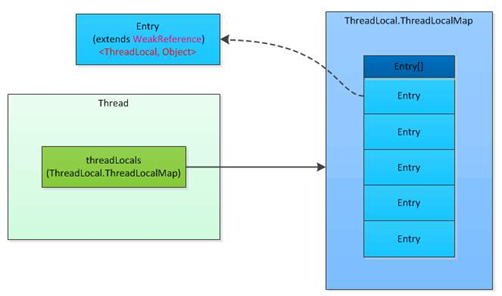

#### 副本

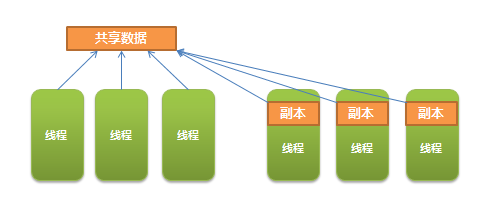

数据保存在ThreadLocalMap集合中，这样数据就被每个线程所绑定，操作系统会维护线程的隔离，也就是不能互相访问，从而巧妙的避免线程安全问题，而它所消耗的资源几乎没有，多线程下也不会发生阻塞，性能非常好，框架底层广泛使用。

#### 弱引用强引用

使用ThreadLocal最大一个缺点就是其会发生内存泄漏，那什么原因造成它会发生内存泄漏呢？由于ThreadLocalMap的key是弱引用，而value是强引用。

查看源码：

```java
static class ThreadLocalMap {
    static class Entry extends WeakReference<ThreadLocal<?>> {
        /** The value associated with this ThreadLocal. */
        Object value;
        Entry(ThreadLocal<?> k, Object v) {
        super(k);
        value = v;
        }
    }
}
```
那什么是弱引用？什么是强引用呢？要讨论ThreadLocal内存泄漏问题，先得了解什么是对象的弱引用？什么是对象的强引用？

这里我们不做深层探讨，要讨论它又要牵扯出GC java的垃圾回收机制，又是一大片概念，一旦展开同学们直接就晕倒了，所以这里我们就不展开了，大家记住java中对象有四种引用关系：强引用、弱引用、软引用、虚引用，大概了解概念即可。


强引用：默认的对象都是强引用，如：`String s = "tony";` 由于对象被其他对象所调用，GC干不掉。

弱引用：弱引用生命周期很短，不论当前内存是否充足，都只能存活到下一次垃圾收集之前。也就是说GC时就会被干掉。

#### 内存泄露

对象申请后不释放，积累多了就会发生内存泄漏。这种情况实际开发中非常常见，但非常难以监测.我们可以由很多现象的发生推测内存有泄漏的情况。例如：刚开始我们使用一款软件时操作非常流畅，但使用时间长了，软件开始卡顿，重启一下，又飞快如飞.这就是典型的内存泄漏。
ThreadLocalMap的key是弱引用，而Value是强引用。这就导致了一个问题，ThreadLocal在没有外部对象强引用时，发生GC时弱引用Key会被回收，而Value不会回收，如果创建ThreadLocal的线程一直持续运行，那么这个Entry对象中的value就有可能一直得不到回收，发生内存泄露。

如何避免泄漏？
既然Key是弱引用，那么我们要做的事，就是在调用ThreadLocal的get()、set()方法完成后再调用remove方法，将Entry节点和Map的引用关系移除，这样整个Entry对象在GC Roots分析后就变成不可达了，下次GC的时候就可以被回收。
如果使用ThreadLocal的set方法之后，没有显示的调用remove方法，就有可能发生内存泄露，所以养成良好的编程习惯十分重要，使用完ThreadLocal之后，记得调用remove方法。

```java
ThreadLocal<Session> threadLocal = new ThreadLocal<Session>();
try {
    threadLocal.set(new Session(1, "tony"));
    // 其它业务逻辑
} finally {
    threadLocal.remove();
}
```

#### 线程锁与ThreadLocal的区别

线程锁实现了线程的同步，线程排队按顺序执行.线程阻塞，前面没有执行完成，后面就只能等待，前面的执行完成，后面才能进行执行。

概括来说，对于多线程资源共享的问题，线程锁同步机制采用了“以时间换空间”的方式，而ThreadLocal采用了“以空间换时间“的方式。前者仅提供一份变量，让不同的线程排队访问，而后者为每一个线程都提供了一份变量，因此可以同时访问而互不影响。

ThreadLocal是解决线程安全问题一个很好的思路，它通过为每个线程提供一个独立的变量副本解决了变量并发访问的冲突问题。在很多情况下，ThreadLocal比直接使用synchronized同步机制解决线程安全问题更简单，更方便，且结果程序拥有更高的并发性。

#### 日期转换类并发异常

SimpleDateFormat类是线程非安全的，多线程并发访问时就会造成异常。

```java
package javase.thread;

import java.text.ParseException;
import java.text.SimpleDateFormat;
import java.util.Date;

public class TestSimpleDateFormat implements Runnable{
	private static final SimpleDateFormat sdf = 
			new SimpleDateFormat("yyyy-MM-dd");
	@Override
	public void run() {
		Date date = null;
		try {
			date = sdf.parse("2019-9-28");
		} catch (ParseException e) {
			e.printStackTrace();
		}
		System.out.println(date);
	}
	
    public static void main(String[] args) {
        Runnable target = new TestSimpleDateFormat();
        for (int i = 0; i < 5; i++) {
            new Thread(target).start();
        }
    }

}
```

输出：

```
Exception in thread "Thread-3" java.lang.NumberFormatException: For input string: ""
	at java.lang.NumberFormatException.forInputString(NumberFormatException.java:65)
	at java.lang.Long.parseLong(Long.java:601)
	at java.lang.Long.parseLong(Long.java:631)
	at java.text.DigitList.getLong(DigitList.java:195)
	at java.text.DecimalFormat.parse(DecimalFormat.java:2084)
	at java.text.SimpleDateFormat.subParse(SimpleDateFormat.java:2162)
	at java.text.SimpleDateFormat.parse(SimpleDateFormat.java:1514)
	at java.text.DateFormat.parse(DateFormat.java:364)
	at javase.thread.TestSimpleDateFormat.run(TestSimpleDateFormat.java:14)
	at java.lang.Thread.run(Thread.java:748)
Sun Sep 28 00:00:00 CST 2200
Sun Sep 28 00:00:00 CST 2200
Sun Mar 28 00:00:00 CST 20192027
Sun Mar 28 00:00:00 CST 20192027
```

由上面我们证明了SimpleDateFormat类的确是线程非安全的，多线程并发访问时这个转换还未完成，那个转换就开始了，导致转换参数错误。

##### 解决方案1

我们分析下，上面什么原因造成的呢？我们访问的是成员变量，成员变量在高并发下就会产生线程安全问题。那我们说过成员变量共享引起的错误最简单的解决方案就是不共享。那我们就改成方法内局部变量，这样每次都new创建新的对象。

```java
package javase.thread;

import java.text.ParseException;
import java.text.SimpleDateFormat;
import java.util.Date;

public class TestSimpleDateFormat implements Runnable{
	@Override
	public void run() {
		Date date = null;
		try {
			date = new SimpleDateFormat("yyyy-MM-dd").parse("2019-9-28");
		} catch (ParseException e) {
			e.printStackTrace();
		}
		System.out.println(date);
	}

    public static void main(String[] args) {
        Runnable target = new TestSimpleDateFormat();
        for (int i = 0; i < 5; i++) {
            new Thread(target).start();
        }
    }

}
```

问题是解决了，但每次都new创建新的对象，这样内存空间浪费比较大，显然不是最佳方案。

##### 解决方案2

使用同步锁，但程序显然会阻塞，无法并发执行，工作效率低。

```java
package javase.thread;

import java.text.ParseException;
import java.text.SimpleDateFormat;
import java.util.Date;

public class TestSimpleDateFormat implements Runnable{
	private static final SimpleDateFormat sdf = 
			new SimpleDateFormat("yyyy-MM-dd");
	@Override
	public void run() {
		Date date = null;
		synchronized(sdf) {
			try {
				date = sdf.parse("2019-9-28");
			} catch (ParseException e) {
				e.printStackTrace();
			}
			System.out.println(date);
		}
	}
	
    public static void main(String[] args) {
        Runnable target = new TestSimpleDateFormat();
        for (int i = 0; i < 5; i++) {
            new Thread(target).start();
        }
    }

}
```

##### 解决方案3

用jdk1.8中的日期格式类DataFormatter，DateTimeFormatter，但这就需要改动现有项目中所有用到这个工具类的代码，工作量较大。而且API写的很烂，不太好用，暂时不推荐使用。

##### 解决方案4

用ThreadLocal，一个线程一个SimpleDateFormat对象。

```java
package javase.thread;

import java.text.ParseException;
import java.text.SimpleDateFormat;
import java.util.Date;

public class TestSimpleDateFormat implements Runnable{
	private static final ThreadLocal<SimpleDateFormat> local = new ThreadLocal<SimpleDateFormat>() {
		@Override
		protected SimpleDateFormat initialValue() {
			return new SimpleDateFormat("yyyy-MM-dd");
		}
	};

    @Override
    public void run() {
        Date date = null;
        try {
            date = local.get().parse("2019-9-28");
        } catch (ParseException e) {
            e.printStackTrace();
        }
        System.out.println(date);

    }

    public static void main(String[] args) {
        Runnable target = new TestSimpleDateFormat();
        for (int i = 0; i < 5; i++) {
            new Thread(target).start();
        }
    }

}
```

### 线程池

在实际使用中，线程是很占用系统资源的，如果对线程管理不善，很容易导致系统问题。因此，在大多数并发框架中都会使用线程池来管理线程，使用线程池管理线程主要有如下好处：
- 重复利用已有的线程继续执行任务，降低线程在创建和销毁时造成的消耗
- 提高系统响应速度
- 对线程进行合理的管理，根据系统的承受能力调整可运行线程数量

#### 工作原理

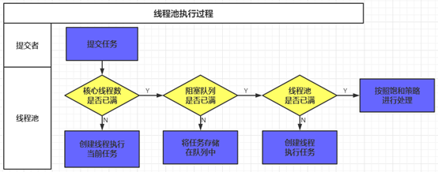

线程池执行所提交的任务过程：

1. 先判断线程池中核心线程池所有的线程是否都在执行任务。如果不是，则新创建一个线程执行刚提交的任务。否则进入第2步；
2. 判断当前阻塞队列是否已满，如果未满，则将提交的任务放置在阻塞队列中。否则进入第3步；

3. 判断线程池中所有的线程是否都在执行任务，如果没有，则创建一个新的线程来执行任务，否则，交给饱和策略进行处理。

#### 线程池的分类

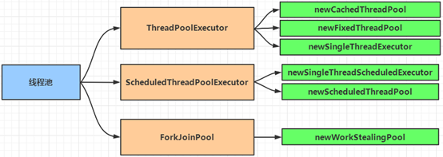

Executors类中提供了一些静态方法，可以用来创建线程池，下面我们读一下这些静态方法的文档注释：

- newCachedTreadPool()

```
	Creates a thread pool that creates new threads as needed(按需创建新的线程), but will reuse previously constructed threads when they are  available(重用之前构造的可用的线程). These pools will typically improve the performance of programs that execute many short-lived asynchronous tasks(短时间的异步的任务).
	Calls to {@code execute} will reuse previously constructed  threads if available. If no existing thread is available, a new thread will be created and added to the pool. 
Threads that have  not been used for sixty seconds are terminated and removed from the cache. Thus, a pool that remains idle(空闲) for long enough will not consume any resources(消耗任何资源).
	Note that pools with similar  properties but different details (for example, timeout parameters) may be created using {@link ThreadPoolExecutor} constructors(请注意,可以使用ThreadPoolExecutor构造器创建具有相似的属性但不同详细信息(例如,超时参数)的池).
```

- newFixedThreadPool()

```
	Creates a thread pool that reuses a fixed number of threads operating off a shared unbounded queue(重用在共享无边界队列上运行的固定数量的线程).  At any point, at most {@code nThreads} threads will be active processing tasks(最多nThreads个线程是处理任务的活动状态).
	If additional tasks are submitted(提交) when all threads are active, they will wait in the queue until a thread is available.
	If any thread terminates due to a failure during execution prior to shutdown(如果在关闭之前执行过程中由于执行失败导致任何线程终止), a new one will take its place(替换) if needed to execute subsequent(随后的) tasks.  The threads in the pool will exist until it is explicitly(明确地) {@link ExecutorService#shutdown shutdown}.
```

- newSingleThreadExecutor()

```
	Creates an Executor that uses a single worker thread operating off an unbounded queue. (Note however that if this single thread terminates due to a failure during execution prior to shutdown, a new one will take its place if needed to execute subsequent tasks.) 
	Tasks are guaranteed(保证) to execute sequentially(顺序地), and no more than one task will be active at any given time(并且在任意给定的时间不会有多个线程是活动的). Unlike the otherwise equivalent(相等的) {@code newFixedThreadPool(1)} the returned executor is guaranteed not to be reconfigurable to use additional threads.
```

- newScheduledThreadPool()

```
     Creates a thread pool that can schedule commands to run after a given delay(延迟), or to execute periodically(定期地/周期性地).  
```

- newSingleThreadScheduledExecutor()

```
	Creates a single-threaded executor that can schedule commands  to run after a given delay, or to execute periodically. 
	Note  however that if this single thread terminates due to a failure during execution prior to shutdown, a new one will take its place if needed to execute subsequent tasks. 
	Tasks are guaranteed to execute sequentially, and no more than one task  will be active at any given time. Unlike the otherwise equivalent {@code newScheduledThreadPool(1, threadFactory)}  the returned executor is guaranteed not to be reconfigurable to use additional threads.
```

- newWorkStealingPool()

```
	Creates a thread pool that maintains enough threads to support the given parallelism level(并行级别), and may use multiple queues to reduce contention. 
	The parallelism level corresponds(对应) to the maximum number of threads actively engaged in, or available to  engage in, task processing. The actual number of threads may grow(增长) and shrink(收缩) dynamically. A work-stealing pool makes no guarantees about the order in which submitted tasks are executed(不能保证提交的任务的执行顺序).
```

#### 线程池的生命周期

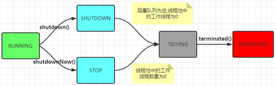

- RUNNING：能接受新提交的任务，并且也能处理阻塞队列中的任务
- SHUTDOWN：关闭状态，不再接受新提交的任务，但却可以继续处理阻塞队列中已保存的任务
- STOP：不能接受新任务，也不处理队列中的任务，会中断正在处理任务的线程
- TIDYING：如果所有的任务都已终止了，workerCount（有效线程数）为0，线程池进入该状态后会调用terminated()方法进入TRMINATED状态
- TERMINATED：在terminated()方法执行后进入该状态，默认terminated()方法中什么也没有做

#### 线程池的创建

##### ThreadPoolExecutor

以newCachedThreadPool()为例：

```java
package javase.thread.pool;

import java.util.concurrent.ExecutorService;
import java.util.concurrent.Executors;

public class TestThreadPoolExecutor {
	public static void main(String[] args) {
        //1.创建线程池
		ExecutorService pool = Executors.newCachedThreadPool();
		Runnable task = ()->
			System.out.println(Thread.currentThread().getName()+" is running...");

		for (int i = 0; i < 20; i++) {
			//2.提交任务
			pool.execute(task);
		}
		//3.关闭线程池
		pool.shutdown();
	}

}
```

输出：

```
pool-1-thread-1 is running...
pool-1-thread-7 is running...
pool-1-thread-2 is running...
pool-1-thread-6 is running...
pool-1-thread-3 is running...
pool-1-thread-1 is running...
pool-1-thread-2 is running...
pool-1-thread-6 is running...
pool-1-thread-7 is running...
pool-1-thread-8 is running...
pool-1-thread-4 is running...
pool-1-thread-2 is running...
pool-1-thread-6 is running...
pool-1-thread-8 is running...
pool-1-thread-12 is running...
pool-1-thread-11 is running...
pool-1-thread-10 is running...
pool-1-thread-5 is running...
pool-1-thread-9 is running...
pool-1-thread-7 is running...
```

从以上执行结果可以看出，空闲的线程可以得到重用。

##### ScheduledThreadPoolExecutor

以newScheduledThreadPool(int corePoolSize)为例：

**执行延时任务：**

```java
package javase.thread.pool;

import java.util.concurrent.Executors;
import java.util.concurrent.ScheduledExecutorService;
import java.util.concurrent.ScheduledFuture;
import java.util.concurrent.TimeUnit;

public class TestScheduledThreadPool {
    public static void main(String[] args) {
        //1.创建线程池
        ScheduledExecutorService pool = Executors.newScheduledThreadPool(3);
        Runnable task = ()->System.out.println(Thread.currentThread().getName() + 
        " is running...");

        System.out.println(System.currentTimeMillis());

        //2.提交任务
        ScheduledFuture<?> schedule = pool.schedule(task, 3, TimeUnit.SECONDS);
        System.out.println(System.currentTimeMillis());

        //3.关闭线程池(关闭状态,不再接受新提交的任务,但却可以继续处理阻塞队列中已保存的任务)
        pool.shutdown();
        System.out.println(System.currentTimeMillis());
    }
}
```

输出：

```
1589162731818
1589162731819
1589162731819
pool-1-thread-1 is running...
```

从以上执行结果可以看出：

打印当前时间毫秒值跟`pool.schedule(command,delay,unit)`语句是异步执行的，甚至`pool.shutdown()`语句跟`pool.schedule(command,delay,unit)`语句也是异步执行的，后者延迟一定的时间再执行。


修改一下代码验证延迟执行时间：

```java
package javase.thread.pool;

import java.util.concurrent.Executors;
import java.util.concurrent.ScheduledExecutorService;
import java.util.concurrent.ScheduledFuture;
import java.util.concurrent.TimeUnit;

public class TestScheduledThreadPool {
    public static void main(String[] args) {
        //1.创建线程池
        ScheduledExecutorService pool = Executors.newScheduledThreadPool(3);
        System.out.println(System.currentTimeMillis());

        //2.提交任务
        ScheduledFuture<?> schedule = pool.schedule(()->{
        System.out.println(System.currentTimeMillis()+" schedule begin...");
        System.out.println(Thread.currentThread().getName()+" is running...");}
        , 3  //延迟3秒
        , TimeUnit.SECONDS);

        //3.关闭线程池(进入关闭状态,不再接受新提交的任务,但却可以继续处理阻塞队列中已保存的任务)
        pool.shutdown();
    }
}
```

输出：

```
1589164262516
1589164265559 schedule begin...
pool-1-thread-1 is running...
```


**执行定时任务：**

```java
package javase.thread.pool;

import java.util.concurrent.Executors;
import java.util.concurrent.ScheduledExecutorService;
import java.util.concurrent.TimeUnit;

public class TestScheduledThreadPool {
	public static void main(String[] args) {
		//1.创建线程池
		ScheduledExecutorService pool = Executors.newScheduledThreadPool(3);
		System.out.println(System.currentTimeMillis());
	
		//2.提交任务
		for (int i = 0; i < 4; i++) {
			int id = i;
			pool.scheduleAtFixedRate(()->{
				System.out.println(System.currentTimeMillis() + " task-" + id + " [" + Thread.currentThread().getName() + "] is running...");
					}
					, 1		//延迟一秒执行
					, 3     //每三秒执行一次
					, TimeUnit.SECONDS);
		}
	
		//3.关闭线程池(进入关闭状态,不再接受新提交的任务,但却可以继续处理阻塞队列中已保存的任务)
		//执行scheduleAtFixedRate方法的话,不能调用shutdown方法
		//pool.shutdown();
	}
}
```
输出：

```
1589166867458
1589166868494 task-0 [pool-1-thread-1] is running...
1589166868494 task-3 [pool-1-thread-1] is running...
1589166868494 task-1 [pool-1-thread-2] is running...
1589166868494 task-2 [pool-1-thread-3] is running...
1589166871493 task-0 [pool-1-thread-1] is running...
1589166871493 task-1 [pool-1-thread-2] is running...
1589166871493 task-2 [pool-1-thread-1] is running...
1589166871493 task-3 [pool-1-thread-3] is running...
1589166874494 task-0 [pool-1-thread-2] is running...
1589166874494 task-1 [pool-1-thread-1] is running...
1589166874494 task-3 [pool-1-thread-2] is running...
1589166874494 task-2 [pool-1-thread-3] is running...
```

##### ForkJoinPool

newWorkStealingPool的创建和使用：

```java
package javase.thread.pool.forkjoin;

import java.io.IOException;
import java.util.concurrent.ExecutorService;
import java.util.concurrent.Executors;
import java.util.concurrent.TimeUnit;

/**
 * WorkStealingPool:工作窃取线程池
 * 
 * 假设共有三个线程同时执行(A,B,C),
 * 当A,B线程池尚未处理任务结束,而C线程已经处理完毕,则C线程会从A或者B中窃取任务执行,这就叫工作窃取
 *
 *  WorkStealingPool是使用ForkJoinPool实现的
 */
public class TestForkJoinPool {
	public static void main(String[] args) throws IOException {
		//cpu核数
		System.out.println(Runtime.getRuntime().availableProcessors());
		
		//workStealingPool会自动启动cpu核数个线程去执行任务
		ExecutorService pool = Executors.newWorkStealingPool();
		System.out.println(System.currentTimeMillis());
		
		//我的cpu核数为6,先启动一个线程执行任务1,需要1s执行完毕
		pool.execute(new R(1000));
		
		//再启动12个线程执行任务2,需要2s执行完毕
		for (int i = 0; i < Runtime.getRuntime().availableProcessors()*2; i++) {
			//当i=5时,在此之前已6个线程都处于运行状态,此时会等待最先空闲下来的线程,显然就是执行任务1的线程
			//1s后,该线程空闲下来,便开始执行任务2
			pool.execute(new R(2000));
		}
		
		//因为workStealingPool是deamon线程,即后台线程,守护线程
		//所以当main方法结束时,此方法虽然还在后台运行,但是无输出
		//可以通过对主线程阻塞解决
		System.in.read();
	}
	
	static class R implements Runnable{
		private int time;
		
		public R(int time) {
			this.time = time;
		}

		@Override
		public void run() {
			try {
				TimeUnit.MILLISECONDS.sleep(time);
			} catch (InterruptedException e) {
				e.printStackTrace();
			}
			System.out.println(System.currentTimeMillis()+Thread.currentThread().getName()+" "+time);
		}
	}
}

```

输出：

```
6				//我的电脑是6核cpu
1589190783939
1589190784942ForkJoinPool-1-worker-1 1000  //1 第一个线程一秒执行完毕,用时1秒
1589190785942ForkJoinPool-1-worker-4 2000  //2
1589190785942ForkJoinPool-1-worker-2 2000  //3
1589190785942ForkJoinPool-1-worker-3 2000  //4
1589190785942ForkJoinPool-1-worker-6 2000  //5
1589190785942ForkJoinPool-1-worker-5 2000  //6,在这之前已用到全部6个线程
1589190786943ForkJoinPool-1-worker-1 2000	//1 第一个线程执行完就抢占任务开始执行
1589190787942ForkJoinPool-1-worker-5 2000	//2 
1589190787942ForkJoinPool-1-worker-3 2000   //3
1589190787942ForkJoinPool-1-worker-4 2000   //4
1589190787942ForkJoinPool-1-worker-2 2000   //5
1589190787942ForkJoinPool-1-worker-6 2000   //6
1589190788944ForkJoinPool-1-worker-1 2000   //1
```


**打印0-100的数值（用多线程并行执行）**

```java
package javase.thread.pool.forkjoin;

import java.util.concurrent.ForkJoinPool;
import java.util.concurrent.RecursiveAction;
import java.util.concurrent.TimeUnit;

/** 打印0-100的数值(用多线程并行执行) */
public class ForkJoinPoolAction {
	public static void main(String[] args) throws InterruptedException {
		PrintTask task = new PrintTask(0, 100);
		//创建实例,并执行分割任务
		ForkJoinPool pool = new ForkJoinPool();
		pool.execute(task);
		
		pool.awaitTermination(2, TimeUnit.SECONDS);
		pool.shutdown();
	}
	
	static class PrintTask extends RecursiveAction{
		private static final long serialVersionUID = 8100608290676130959L;
		//最多只能打印20个数
		private static final int THRESHOLD = 20;
		private int start;
		private int end;
		
		public PrintTask(int start, int end) {
			this.start = start;
			this.end = end;
		}
		
		@Override
		protected void compute() {
			if (end - start < THRESHOLD) {
				for (int i = start; i < end; i++) {
					System.out.println(Thread.currentThread().getName()+" i="+i);
				}
			}else {
				int middle = (start+end)/2;
				PrintTask left = new PrintTask(start, middle);
				PrintTask right = new PrintTask(middle, end);
				//并行执行两个"小任务"
				left.fork();
				right.fork();
			}
		}
	}
}
```

输出：

```
ForkJoinPool-1-worker-5 i=75
ForkJoinPool-1-worker-3 i=62
ForkJoinPool-1-worker-3 i=63
ForkJoinPool-1-worker-3 i=64
ForkJoinPool-1-worker-2 i=37
ForkJoinPool-1-worker-2 i=38
ForkJoinPool-1-worker-2 i=39
ForkJoinPool-1-worker-2 i=40
ForkJoinPool-1-worker-2 i=41
ForkJoinPool-1-worker-6 i=50
ForkJoinPool-1-worker-1 i=87
ForkJoinPool-1-worker-1 i=88
ForkJoinPool-1-worker-4 i=12
ForkJoinPool-1-worker-1 i=89
ForkJoinPool-1-worker-6 i=51
ForkJoinPool-1-worker-6 i=52
ForkJoinPool-1-worker-6 i=53
ForkJoinPool-1-worker-6 i=54
ForkJoinPool-1-worker-6 i=55
ForkJoinPool-1-worker-6 i=56
ForkJoinPool-1-worker-2 i=42
ForkJoinPool-1-worker-3 i=65
ForkJoinPool-1-worker-3 i=66
ForkJoinPool-1-worker-3 i=67
ForkJoinPool-1-worker-3 i=68
ForkJoinPool-1-worker-3 i=69
ForkJoinPool-1-worker-3 i=70
ForkJoinPool-1-worker-3 i=71
ForkJoinPool-1-worker-3 i=72
ForkJoinPool-1-worker-5 i=76
ForkJoinPool-1-worker-3 i=73
ForkJoinPool-1-worker-3 i=74
ForkJoinPool-1-worker-3 i=25
ForkJoinPool-1-worker-3 i=26
ForkJoinPool-1-worker-3 i=27
ForkJoinPool-1-worker-3 i=28
ForkJoinPool-1-worker-3 i=29
ForkJoinPool-1-worker-3 i=30
ForkJoinPool-1-worker-3 i=31
ForkJoinPool-1-worker-3 i=32
ForkJoinPool-1-worker-3 i=33
ForkJoinPool-1-worker-3 i=34
ForkJoinPool-1-worker-3 i=35
ForkJoinPool-1-worker-2 i=43
ForkJoinPool-1-worker-6 i=57
ForkJoinPool-1-worker-1 i=90
ForkJoinPool-1-worker-4 i=13
ForkJoinPool-1-worker-4 i=14
ForkJoinPool-1-worker-1 i=91
ForkJoinPool-1-worker-1 i=92
ForkJoinPool-1-worker-1 i=93
ForkJoinPool-1-worker-6 i=58
ForkJoinPool-1-worker-2 i=44
ForkJoinPool-1-worker-3 i=36
ForkJoinPool-1-worker-5 i=77
ForkJoinPool-1-worker-3 i=0
ForkJoinPool-1-worker-2 i=45
ForkJoinPool-1-worker-6 i=59
ForkJoinPool-1-worker-1 i=94
ForkJoinPool-1-worker-4 i=15
ForkJoinPool-1-worker-1 i=95
ForkJoinPool-1-worker-6 i=60
ForkJoinPool-1-worker-6 i=61
ForkJoinPool-1-worker-2 i=46
ForkJoinPool-1-worker-3 i=1
ForkJoinPool-1-worker-5 i=78
ForkJoinPool-1-worker-3 i=2
ForkJoinPool-1-worker-2 i=47
ForkJoinPool-1-worker-2 i=48
ForkJoinPool-1-worker-2 i=49
ForkJoinPool-1-worker-1 i=96
ForkJoinPool-1-worker-4 i=16
ForkJoinPool-1-worker-1 i=97
ForkJoinPool-1-worker-3 i=3
ForkJoinPool-1-worker-5 i=79
ForkJoinPool-1-worker-3 i=4
ForkJoinPool-1-worker-1 i=98
ForkJoinPool-1-worker-4 i=17
ForkJoinPool-1-worker-4 i=18
ForkJoinPool-1-worker-4 i=19
ForkJoinPool-1-worker-4 i=20
ForkJoinPool-1-worker-4 i=21
ForkJoinPool-1-worker-4 i=22
ForkJoinPool-1-worker-4 i=23
ForkJoinPool-1-worker-4 i=24
ForkJoinPool-1-worker-1 i=99
ForkJoinPool-1-worker-3 i=5
ForkJoinPool-1-worker-5 i=80
ForkJoinPool-1-worker-5 i=81
ForkJoinPool-1-worker-5 i=82
ForkJoinPool-1-worker-5 i=83
ForkJoinPool-1-worker-3 i=6
ForkJoinPool-1-worker-3 i=7
ForkJoinPool-1-worker-5 i=84
ForkJoinPool-1-worker-3 i=8
ForkJoinPool-1-worker-5 i=85
ForkJoinPool-1-worker-3 i=9
ForkJoinPool-1-worker-5 i=86
ForkJoinPool-1-worker-3 i=10
ForkJoinPool-1-worker-3 i=11
```

从0到100（不含100）都打印了，且没有重复打印。

**对数组进行求和（用多线程并行执行）**

```java
package javase.thread.pool.forkjoin;

import java.util.Random;
import java.util.concurrent.ForkJoinPool;
import java.util.concurrent.ForkJoinTask;
import java.util.concurrent.RecursiveTask;

public class ForkJoinPoolTask {
	public static void main(String[] args) throws Exception {
		int[] arr = new int[100];
		Random random = new Random();
		int total = 0;
		//初始化100个数组元素
		for (int i = 0; i < arr.length; i++) {
			//对数组元素赋值(0-20之间的随机值)
			arr[i] = random.nextInt(20);
			//累加求和
			total += arr[i];
		}
		System.out.println("数组总和:"+total);
		
		SumTask task = new SumTask(arr, 0, arr.length);
		//创建一个通用池,这是jdk1.8提供的
		ForkJoinPool pool = ForkJoinPool.commonPool();
		//提交分解的SumTask任务
		ForkJoinTask<Integer> future = pool.submit(task);
		//获取计算的结果
		Integer result = future.get();
		System.out.println("多线程计算数组总和:"+result);
		//关闭线程池
		pool.shutdown();
	}
	
	static class SumTask extends RecursiveTask<Integer>{
		private static final long serialVersionUID = -6115833930931724680L;
		
		//每个小任务,最多只累加20个数
		private static final int THRESHOLD = 20;
		private int[] arr;
		private int start;
		private int end;
		
		public SumTask(int[] arr, int start, int end) {
			this.arr = arr;
			this.start = start;
			this.end = end;
		}

		@Override
		protected Integer compute() {
			int sum = 0;
			//当end与start之间的差小于threshold时,开始进行实际的累加
			if (end - start < THRESHOLD) {
				for (int i = start; i < end; i++) {
					System.out.println(Thread.currentThread().getName()+" i="+i);
					sum += arr[i];
				}
				return sum;
			}else {//当end与start之间的差大于threshold时,将大任务分解成小任务
				int middle = (start+end)/2;
				SumTask left = new SumTask(arr, start, middle);
				SumTask right = new SumTask(arr, middle, end);
				//并行执行两个小任务
				left.fork();
				right.fork();
				//把两个小任务累加的结果合并起来
				return left.join()+right.join();
			}
		}
	}
}
```

输出：

```
数组总和:1006
ForkJoinPool-1-worker-1 i=0
ForkJoinPool-1-worker-4 i=75
ForkJoinPool-1-worker-1 i=1
ForkJoinPool-1-worker-3 i=50
ForkJoinPool-1-worker-3 i=51
ForkJoinPool-1-worker-3 i=52
ForkJoinPool-1-worker-5 i=12
ForkJoinPool-1-worker-1 i=2
ForkJoinPool-1-worker-4 i=76
ForkJoinPool-1-worker-1 i=3
ForkJoinPool-1-worker-5 i=13
ForkJoinPool-1-worker-3 i=53
ForkJoinPool-1-worker-6 i=25
ForkJoinPool-1-worker-3 i=54
ForkJoinPool-1-worker-5 i=14
ForkJoinPool-1-worker-1 i=4
ForkJoinPool-1-worker-4 i=77
ForkJoinPool-1-worker-1 i=5
ForkJoinPool-1-worker-5 i=15
ForkJoinPool-1-worker-3 i=55
ForkJoinPool-1-worker-6 i=26
ForkJoinPool-1-worker-3 i=56
ForkJoinPool-1-worker-5 i=16
ForkJoinPool-1-worker-1 i=6
ForkJoinPool-1-worker-4 i=78
ForkJoinPool-1-worker-1 i=7
ForkJoinPool-1-worker-5 i=17
ForkJoinPool-1-worker-3 i=57
ForkJoinPool-1-worker-6 i=27
ForkJoinPool-1-worker-3 i=58
ForkJoinPool-1-worker-5 i=18
ForkJoinPool-1-worker-1 i=8
ForkJoinPool-1-worker-4 i=79
ForkJoinPool-1-worker-1 i=9
ForkJoinPool-1-worker-5 i=19
ForkJoinPool-1-worker-3 i=59
ForkJoinPool-1-worker-6 i=28
ForkJoinPool-1-worker-3 i=60
ForkJoinPool-1-worker-5 i=20
ForkJoinPool-1-worker-1 i=10
ForkJoinPool-1-worker-4 i=80
ForkJoinPool-1-worker-4 i=81
ForkJoinPool-1-worker-4 i=82
ForkJoinPool-1-worker-1 i=11
ForkJoinPool-1-worker-5 i=21
ForkJoinPool-1-worker-3 i=61
ForkJoinPool-1-worker-3 i=62
ForkJoinPool-1-worker-3 i=63
ForkJoinPool-1-worker-6 i=29
ForkJoinPool-1-worker-6 i=30
ForkJoinPool-1-worker-6 i=31
ForkJoinPool-1-worker-3 i=64
ForkJoinPool-1-worker-3 i=65
ForkJoinPool-1-worker-3 i=66
ForkJoinPool-1-worker-3 i=67
ForkJoinPool-1-worker-3 i=68
ForkJoinPool-1-worker-3 i=69
ForkJoinPool-1-worker-5 i=22
ForkJoinPool-1-worker-4 i=83
ForkJoinPool-1-worker-5 i=23
ForkJoinPool-1-worker-3 i=70
ForkJoinPool-1-worker-3 i=71
ForkJoinPool-1-worker-3 i=72
ForkJoinPool-1-worker-6 i=32
ForkJoinPool-1-worker-3 i=73
ForkJoinPool-1-worker-5 i=24
ForkJoinPool-1-worker-4 i=84
ForkJoinPool-1-worker-4 i=85
ForkJoinPool-1-worker-4 i=86
ForkJoinPool-1-worker-5 i=87
ForkJoinPool-1-worker-3 i=74
ForkJoinPool-1-worker-6 i=33
ForkJoinPool-1-worker-5 i=88
ForkJoinPool-1-worker-2 i=37
ForkJoinPool-1-worker-5 i=89
ForkJoinPool-1-worker-6 i=34
ForkJoinPool-1-worker-5 i=90
ForkJoinPool-1-worker-2 i=38
ForkJoinPool-1-worker-5 i=91
ForkJoinPool-1-worker-6 i=35
ForkJoinPool-1-worker-5 i=92
ForkJoinPool-1-worker-2 i=39
ForkJoinPool-1-worker-5 i=93
ForkJoinPool-1-worker-6 i=36
ForkJoinPool-1-worker-5 i=94
ForkJoinPool-1-worker-5 i=95
ForkJoinPool-1-worker-5 i=96
ForkJoinPool-1-worker-5 i=97
ForkJoinPool-1-worker-5 i=98
ForkJoinPool-1-worker-5 i=99
ForkJoinPool-1-worker-2 i=40
ForkJoinPool-1-worker-2 i=41
ForkJoinPool-1-worker-2 i=42
ForkJoinPool-1-worker-2 i=43
ForkJoinPool-1-worker-2 i=44
ForkJoinPool-1-worker-2 i=45
ForkJoinPool-1-worker-2 i=46
ForkJoinPool-1-worker-2 i=47
ForkJoinPool-1-worker-2 i=48
ForkJoinPool-1-worker-2 i=49
多线程计算数组总和:1006
```

#### 阻塞队列

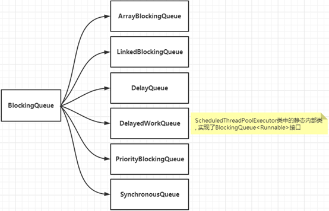

##### ArrayBlockingQueue

基于数组的阻塞队列实现，在ArrayBlockingQueue内部，维护了一个定长数组，以便缓存队列中的数据对象，除此以外，ArrayBlockingQueue内部还保存着两个整型变量，分别标识着队列的头部和尾部在数组中的位置。

ArrayBlockingQueue在生产者放入数据和获取数据，都是共用同一个锁对象，由此也意味着两者无法真正并行运行，这点尤其不同于LinkedBlockingQueue;按照实现原理来分析，ArrayBlockingQueue完全可以采用分离锁，从而实现生产者和消费者操作的完全并行运行。Doug Lea之所以没有这样去做，也许是因为ArrayBlockingQueue的数据写入和获取操作已经足够轻巧，以至于引入独立的锁机制，除了给代码带来额外的复杂性外，其在性能上完全占不到任何便宜。

ArrayBlockingQueue和LinkedBlockingQueue之间还有一个明显的不同之处在于，前者在插入或删除元素时不会产生或销毁任何额外的对象实例，而后者则会生成一个额外的Node对象。这在长时间内需要高效并发地处理大批量数据的系统中，其对于GC的影响还是存在一定的区别。而在创建ArrayBlockingQueue时，我们还可以控制对象的内部锁是否采用公平锁，默认采用非公平锁。

```java
package javase.thread.blockingqueue;

import java.util.concurrent.BlockingQueue;

public class Producer implements Runnable {
	private BlockingQueue<Integer> queue;
	private static int element = 0;

	public Producer(BlockingQueue<Integer> queue) {
		this.queue = queue;
	}

	@Override
	public void run() {
		try {
			while(element<20) {
				System.out.println("将放入元素"+element);
				queue.put(element++);
			}
		} catch (Exception e) {
			System.out.println("生产者在等待空闲空间的时候被打断了!");
			e.printStackTrace();
		}
		System.out.println("生产者已经终止了生产过程!");
	}
}
```

```java
package javase.thread.blockingqueue;

import java.util.concurrent.BlockingQueue;

public class Consumer implements Runnable{
	private BlockingQueue<Integer> queue;

	public Consumer(BlockingQueue<Integer> queue) {
		this.queue = queue;
	}

	@Override
	public void run() {
		try {
			while(true) {
					System.out.println("取出元素:"+queue.take());
			}
		} catch (InterruptedException e) {
			System.out.println("消费者在等待新产品的时候被打断了!");
			e.printStackTrace();
		}
	}
}
```

```java
package javase.thread.blockingqueue;

import java.util.concurrent.ArrayBlockingQueue;
import java.util.concurrent.BlockingQueue;

public class TestArrayBlockingQueue {
	public static void main(String[] args) {
		BlockingQueue<Integer> queue = new ArrayBlockingQueue<Integer>(3, true);
		Producer producer = new Producer(queue);
		Consumer consumer = new Consumer(queue);
		new Thread(producer).start();
		new Thread(consumer).start();
	}
}
```

输出：将放入元素0

```
将放入元素1
将放入元素2
将放入元素3
将放入元素4
取出元素:0
取出元素:1
将放入元素5
取出元素:2
将放入元素6
取出元素:3
将放入元素7
将放入元素8
取出元素:4
取出元素:5
将放入元素9
取出元素:6
将放入元素10
取出元素:7
将放入元素11
将放入元素12
取出元素:8
取出元素:9
将放入元素13
取出元素:10
将放入元素14
将放入元素15
取出元素:11
取出元素:12
将放入元素16
取出元素:13
将放入元素17
取出元素:14
将放入元素18
取出元素:15
将放入元素19
取出元素:16
生产者已经终止了生产过程!
取出元素:17
取出元素:18
取出元素:19
```

##### LinkedBlockingQueue

基于链表的阻塞队列实现，同ArrayBlockingQueue类似，其内部也维持着一个数据缓冲队列（该队列由一个链表构成），当生产者往队列中放入一个数据时，队列会从生产者手中获取数据，并缓存在队列内部，而生产者立即返回；只有当队列缓冲区达到最大值缓冲容量时（LinkedBlockingQueue可以通过构造函数指定该值），才会阻塞生产者队列，直到消费者从队列中消费掉一份数据，生产者线程会被唤醒，反之对于消费者这端的处理也基于同样的原理。而LinkedBlockingQueue之所以能够高效地处理并发数据，还因为其对于生产者端和消费者端分别采用了独立的锁来控制数据同步，这也意味着在高并发的情况下生产者和消费者可以并行地操作队列中的数据，以此来提高整个队列的并发性能。

ArrayBlockingQueue和LinkedBlockingQueue的区别：

1. 队列中锁的实现不同
   ArrayBlockingQueue实现的队列中的锁是没有分离的，即生产和消费用的是同一个锁
   LinkedBlockingQueue实现的队列中的锁是分离的，即生产用的是putLock，消费是takeLock
2. 队列大小初始化方式不同
   ArrayBlockingQueue实现的队列中必须指定队列的大小
   LinkedBlockingQueue实现的队列中可以不指定队列的大小，但是默认是Integer.MAX_VALUE

##### DelayQueue

DelayQueue中的元素只有当指定的延迟时间到了，才能够从队列中获取到该元素。DelayQueue是一个没有大小限制的队列，因此往队列中插入数据的操作（生产者）永远不会被阻塞，而只有获取数据的操作（消费者才会被阻塞）。

使用场景：

DelayQueue使用场景较少，但都相当巧妙，常见的例子比如使用一个DelayQueue来管理一个超时未响应的连接队列。

```java
package javase.thread.blockingqueue;

import java.util.concurrent.DelayQueue;
import java.util.concurrent.Delayed;
import java.util.concurrent.TimeUnit;

public class TestDelayQueue {
	public static void main(String[] args) {
		DelayQueue<DelayTask> queue = new DelayQueue<DelayTask>();
		queue.add(new DelayTask("1", 1000L, TimeUnit.MILLISECONDS));
		queue.add(new DelayTask("2", 2000L, TimeUnit.MILLISECONDS));
		queue.add(new DelayTask("3", 3000L, TimeUnit.MILLISECONDS));
		System.out.println("queue put done");
		
		try {
			while (!queue.isEmpty()) {
				DelayTask task = queue.take();
				System.out.println(task.getName()+":"+System.currentTimeMillis());
			}
		}catch (Exception e) {
			e.printStackTrace();
		}
	}

	static class DelayTask implements Delayed{
		private String name;
		private Long delayTime;
		private TimeUnit delayTimeUnit;
		private Long executeTime;//ms
		
		public String getName() {
			return name;
		}
		public Long getDelayTime() {
			return delayTime;
		}
		public TimeUnit getDelayTimeUnit() {
			return delayTimeUnit;
		}
		public Long getExecuteTime() {
			return executeTime;
		}

		public DelayTask(String name, Long delayTime, TimeUnit delayTimeUnit) {
			this.name = name;
			this.delayTime = delayTime;
			this.delayTimeUnit = delayTimeUnit;
			this.executeTime = System.currentTimeMillis()+delayTimeUnit.toMillis(delayTime);
		}

		@Override
		public int compareTo(Delayed o) {
			if(this.getDelay(TimeUnit.MILLISECONDS) > o.getDelay(TimeUnit.MILLISECONDS)) {
				return 1;
			}else if(this.getDelay(TimeUnit.MILLISECONDS) < o.getDelay(TimeUnit.MILLISECONDS)) {
				return -1;
			}
			return 0;
		}

		@Override
		public long getDelay(TimeUnit unit) {
			return unit.convert(executeTime - System.currentTimeMillis(), TimeUnit.MILLISECONDS);
		}

	}
}
```

输出：

```
queue put done
1:1589258858886
2:1589258859884
3:1589258860885
```

##### PriorityBlockingQueue

基于优先级的阻塞队列（优先级的判断通过构造函数传入的Comparator对象来决定），但需要注意的是PriorityBlockingQueue并不会阻塞数据生产者，而只会在没有可消费的数据时，阻塞数据的消费者。因此使用的时候要特别注意，生产者生产数据的速度绝对不能快于消费者消费数据的速度，否则时间一长，会最终耗尽所有的可用堆内存空间。在实现PriorityBlockingQueue时，内部控制线程同步的锁采用的是公平锁。

```java
package javase.thread.blockingqueue;

import java.util.concurrent.PriorityBlockingQueue;

public class TestPriorityBlockingQueue {
	public static void main(String[] args) throws Exception {
		PriorityBlockingQueue<Task> queue = new PriorityBlockingQueue<Task>();
		Task t1 = new Task();
		t1.setId(3);
		t1.setName("id为3");
		
		Task t2 = new Task();
		t2.setId(4);
		t2.setName("id为4");
		
		Task t3 = new Task();
		t3.setId(1);
		t3.setName("id为1");
		
		queue.add(t1);	//3
		queue.add(t2);	//4
		queue.add(t3);  //1
		
		System.out.println("容器：" + queue);
		System.out.println(queue.take().getId());
		System.out.println("容器：" + queue);
	}
	
	static class Task implements Comparable<Task>{
		private int id;
		private String name;
		
		public int getId() {
			return id;
		}
		public void setId(int id) {
			this.id = id;
		}

		public String getName() {
			return name;
		}
		public void setName(String name) {
			this.name = name;
		}

		@Override
		public int compareTo(Task o) {
			return this.id>o.getId()?1:(this.id<o.getId()?-1:0);
		}
		@Override
		public String toString() {
			return "Task [id=" + id + ", name=" + name + "]";
		}
	}

}
```

输出：

```
容器：[Task [id=1, name=id为1], Task [id=4, name=id为4], Task [id=3, name=id为3]]
1
容器：[Task [id=3, name=id为3], Task [id=4, name=id为4]]
```

##### SynchronousQueue

​		一种无缓冲的等待队列，类似于无中介的直接交易，有点像原始社会中的生产者和消费者，生产者拿着产品去集市销售给产品的最终消费者，而消费者必须亲自去集市找到所要商品的直接生产者，如果一方没有找到合适的目标，那么对不起，大家都在集市等待。相对于有缓冲的BlockingQueue来说，少了一个中间经销商的环节(缓冲区)，如果有经销商，生产者直接把产品批发给经销商，而无需在意经销商最终会将这些产品卖给那些消费者，由于经销商可以库存一部分商品，因此相对于直接交易模式，总体来说采用中间经销商的模式会吞吐量高一些（可以批量买卖）；但另一方面，又因为经销商的引入，使得产品从生产者到消费者中间增加了额外的交易环节，单个产品的及时响应性能可能会降低。
　　声明一个SynchronousQueue有两种不同的方式，它们之间有着不太一样的行为。公平模式和非公平模式的区别：
　　如果采用公平模式：SynchronousQueue会采用公平锁，并配合一个FIFO队列来阻塞多余的生产者和消费者，从而体系整体的公平策略；
　　如果采用非公平模式（SynchronousQueue默认）：SynchronousQueue采用非公平锁，同时配合一个LIFO队列来管理多余的生产者和消费者，而后一种模式，如果生产者和消费者的处理速度有差距，则很容易出现饥渴的情况，即可能有某些生产者或者是消费者的数据永远都得不到处理。

```java
package javase.thread.blockingqueue;

import java.util.Random;
import java.util.UUID;
import java.util.concurrent.BlockingQueue;
import java.util.concurrent.SynchronousQueue;

public class TestSynchronousQueue {
	public static void main(String[] args) {
		final BlockingQueue<String> synchronousQueue = new SynchronousQueue<String>();

        SynchronousQueueProducer queueProducer = new SynchronousQueueProducer(synchronousQueue);
        new Thread(queueProducer).start();

        SynchronousQueueConsumer queueConsumer1 = new SynchronousQueueConsumer(synchronousQueue);
        new Thread(queueConsumer1).start();

        SynchronousQueueConsumer queueConsumer2 = new SynchronousQueueConsumer(synchronousQueue);
        new Thread(queueConsumer2).start();
	}
	
	static class SynchronousQueueProducer implements Runnable{
		private BlockingQueue<String> queue;
		final Random random = new Random();

		public SynchronousQueueProducer(BlockingQueue<String> queue) {
			this.queue = queue;
		}

		@Override
		public void run() {
			while(true) {
				String data = UUID.randomUUID().toString();
				System.out.println("put:"+data);
				try {
					queue.put(data);
					Thread.sleep(1000);
				} catch (InterruptedException e) {
					e.printStackTrace();
				}
			}
		}
	}
	
	static class SynchronousQueueConsumer implements Runnable{
		private BlockingQueue<String> blockingQueue;

        public SynchronousQueueConsumer(BlockingQueue<String> queue) {
            this.blockingQueue = queue;
        }

        @Override
        public void run() {
            while (true) {
                try {
                    String data = blockingQueue.take();
                    System.out.println(Thread.currentThread().getName()
                            + " take(): " + data);
                    Thread.sleep(2000);
                } catch (InterruptedException e) {
                    e.printStackTrace();
                }
            }
        }
	}

}
```

输出：

```
put:bdcb688f-3e3f-4117-adcf-49bae0cd42ca
Thread-2 take(): bdcb688f-3e3f-4117-adcf-49bae0cd42ca
put:f1c4fcce-ee20-47c5-8999-eee05c504b9b
Thread-1 take(): f1c4fcce-ee20-47c5-8999-eee05c504b9b
put:7b1bbbd2-d88b-4413-9898-969ba3617656
Thread-2 take(): 7b1bbbd2-d88b-4413-9898-969ba3617656
put:5dba7893-8767-44d0-adc8-8b38d73042e5
Thread-1 take(): 5dba7893-8767-44d0-adc8-8b38d73042e5
put:a90bd277-6945-4f68-ab7d-e4b8ce646123
Thread-2 take(): a90bd277-6945-4f68-ab7d-e4b8ce646123
put:0f103a7b-c7e7-4125-8eec-994c24d44461
Thread-1 take(): 0f103a7b-c7e7-4125-8eec-994c24d44461
put:d5c1cbf7-063f-4b94-940d-8837db260dad
Thread-2 take(): d5c1cbf7-063f-4b94-940d-8837db260dad
put:7a0406c5-5193-4969-88bf-b76fbb906b55
Thread-1 take(): 7a0406c5-5193-4969-88bf-b76fbb906b55
put:0404bb0b-3d13-4b9d-91f0-35c4c358f269
Thread-2 take(): 0404bb0b-3d13-4b9d-91f0-35c4c358f269
```

#### 拒绝策略

- ThreadPoolExecutor.AbortPolicy
  丢弃任务并抛出RejectedExecutionException异常
- ThreadPoolExecutor.DiscardPolicy
  丢弃任务,但是不抛出异常
- ThreadPoolExecotor.DiscardOldestPolicy
  丢弃队列中最前面的任务,然后重新尝试执行任务（重复此过程）
- ThreadPoolExecotor.CallerRunsPolicy
  由调用线程处理该任务

#### execute方法执行逻辑

源码中execute方法的注释：

```
   Proceed in 3 steps:
   
   1. If fewer than corePoolSize threads are running, try to start a new thread with the given command as its first task.  The call to addWorker atomically checks runState and workerCount, and so prevents false alarms that would add threads when it shouldn't, by returning false.
   
   2. If a task can be successfully queued, then we still need to double-check whether we should have added a thread (because existing ones died since last checking) or that the pool shut down since entry into this method. So we recheck state and if necessary roll back the enqueuing if stopped, or start a new thread if there are none.
   
   3. If we cannot queue task, then we try to add a new thread.  If it fails, we know we are shut down or saturated and so reject the task.
```

   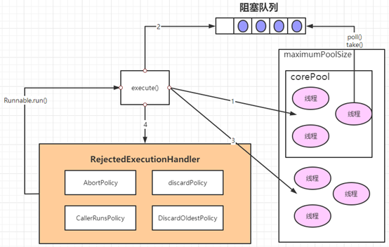

1. 如果当前运行的线程少于corePoolSize，则会创建新的线程来执行新的任务；
2. 如果运行的线程个数等于或者大于corePoolSize，则会将提交的任务存放到阻塞队列workQueue中；
3. 如果当前workQueue队列已满的话，则会创建新的线程来执行任务；
4. 如果线程个数已经超过了maximumPoolSize，则会使用饱和策略来进行处理。

#### 线程池的关闭

关闭线程池，可以通过shutdown和shutdownNow两个方法。
原理：遍历线程池中的所有线程,然后依次中断

- shutdownNow首先将线程池的状态设置为STOP，然后尝试停止所有的正在执行和未执行任务的线程，并返回等待执行任务的列表

- shutdown只是将线程池的状态设置为SHUTDOWN状态，然后中断所有没有正在执行任务的线程
