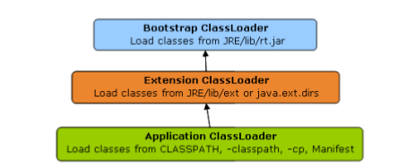
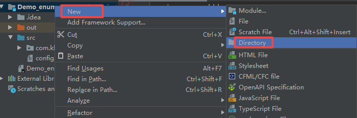
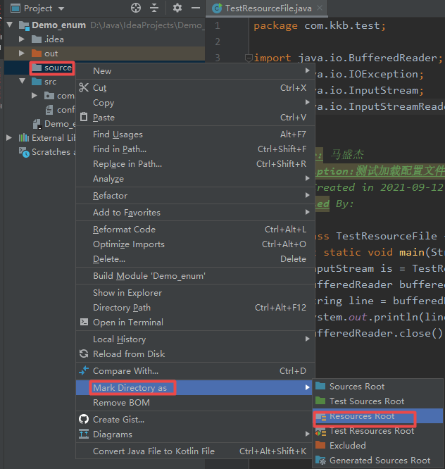
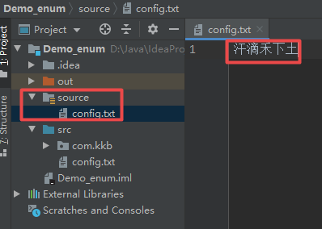

# 枚举

## 初识枚举

枚举是JDK1.5推出的一种新的类型（特殊的类），主要用于更加严格的约束变量类型。在JDK1.5之前，通过多例设计模式可以实现枚举的定义。

多例设计模式：

- 构造方法私有化
- 在类的内部提供有若干个实例，通过静态方法获取实例

JDK1.5之前：

**Color.java：**

```java
package com.kkb.bean;

/**
 * @Author: 马盛杰
 * @Description:多例模式实现枚举
 * @Date Created in 2021-09-11 11:25
 * @Modified By:
 */
public final class Color {
    private static final Color RED = new Color("红色");
    private static final Color GREEN = new Color("绿色");
    private static final Color BLUE = new Color("蓝色");

    private String title;

    public String getTitle() {
        return title;
    }

    private Color() {
    }

    private Color(String title) {
        this.title = title;
    }

    public static Color getInstance(int i){
        switch (i) {
            case 1:
                return RED;
            case 2:
                return GREEN;
            case 3:
                return BLUE;
            default:
                return null;
        }
    }

    @Override
    public String toString() {
        return "Color{" +
                "title='" + title + '\'' +
                '}';
    }
}
```

**TestEnum01.java：**

```java
package com.kkb.test;

import com.kkb.bean.Color;

/**
 * @Author: 马盛杰
 * @Description:测试多例实现枚举
 * @Date Created in 2021-09-11 11:34
 * @Modified By:
 */
public class TestEnum01 {
    public static void main(String[] args) {
        Color instance = Color.getInstance(1);
        System.out.println(instance.getTitle());
    }
}
```

运行结果：

```
红色
```

JDK1.5之后：

**Color.java：**

```java
package com.kkb.enumpck;

/**
 * @Author: 马盛杰
 * @Description：枚举类
 * @Date Created in 2021-09-11 11:43
 * @Modified By:
 */
public enum Color {
    RED,GREEN,BLUE;//此处为实例化对象
}
```

**TestEnum02.java：**

```java
package com.kkb.test;

import com.kkb.enumpck.Color;

/**
 * @Author: 马盛杰
 * @Description:测试枚举
 * @Date Created in 2021-09-11 11:50
 * @Modified By:
 */
public class TestEnum02 {
    public static void main(String[] args) {
        Color red = Color.RED;
        System.out.println(red);
        Color green = Color.GREEN;
        System.out.println(green);
        Color blue = Color.BLUE;
        System.out.println(blue);
    }
}
```

运行结果：

```
RED
GREEN
BLUE
```


需要说明的是，用enum定义的枚举实际上仅仅是一个继承了抽象类Enum的实现类而已。

```java
//抽象类不能被实例化
public abstract class Enum<E extends Enum<E>>
        implements Comparable<E>, Serializable {
    //枚举的名字
    private final String name;
    public final String name() {
        return name;
    }

	//枚举的索引
    private final int ordinal;
    public final int ordinal() {
        return ordinal;
    }

	//构造方法
    protected Enum(String name, int ordinal) {
        this.name = name;
        this.ordinal = ordinal;
	}

    public String toString() {
        return name;
	}
    
    public final boolean equals(Object other) {
        return this==other;
    }
    
    public final int hashCode() {
        return super.hashCode();
    }
    
    protected final Object clone() throws CloneNotSupportedException {
        throw new CloneNotSupportedException();
    }
    
    // 比较枚举与指定对象的顺序
    public final int compareTo(E o) {
        Enum<?> other = (Enum<?>)o;
        Enum<E> self = this;
        if (self.getClass() != other.getClass() && // optimization
            self.getDeclaringClass() != other.getDeclaringClass())
            throw new ClassCastException();
        return self.ordinal - other.ordinal;
    }
    
    // 返回与此枚举常量的枚举类型相对应的class对象
    public final Class<E> getDeclaringClass() {
        Class<?> clazz = getClass();
        Class<?> zuper = clazz.getSuperclass();
        return (zuper == Enum.class) ? (Class<E>)clazz : (Class<E>)zuper;
    }
    
    // 返回带指定名称的指定枚举类型的枚举常量（这是一个静态方法，这是常用的一个方法）
    public static <T extends Enum<T>> T valueOf(Class<T> enumType,
                                                String name) {
        T result = enumType.enumConstantDirectory().get(name);
        if (result != null)
            return result;
        if (name == null)
            throw new NullPointerException("Name is null");
        throw new IllegalArgumentException(
            "No enum constant " + enumType.getCanonicalName() + "." + name);
    }

    protected final void finalize() { }

    /**
     * prevent default deserialization
     */
    private void readObject(ObjectInputStream in) throws IOException,
        ClassNotFoundException {
        throw new InvalidObjectException("can't deserialize enum");
    }

    private void readObjectNoData() throws ObjectStreamException {
        throw new InvalidObjectException("can't deserialize enum");
    }
}
```

通过Luyten反编译Color.class

```java
package com.kkb.enumpck;

public enum Color {
    RED("RED",0),
    BLUE("BLUE",1);
    GREEN("GREEN",2);
    
    //默认提供了带参的构造,就不再提供无参构造,所以上面的实例后面需要带参数
    private Color(final String s, final int n) {
    }
}
```

通过javap得到jvm指令：

```
Microsoft Windows [版本 10.0.19041.1165]
(c) Microsoft Corporation。保留所有权利。

D:\Java\IdeaProjects\Demo_enum\out\production\Demo_enum\com\kkb\enumpck>javap -v Color.class
Classfile /D:/Java/IdeaProjects/Demo_enum/out/production/Demo_enum/com/kkb/enumpck/Color.class
  Last modified 2021-9-11; size 980 bytes
  MD5 checksum f6d8d55a0305d11f288abd1745b2873b
  Compiled from "Color.java"
public final class com.kkb.enumpck.Color extends java.lang.Enum<com.kkb.enumpck.Color>
  minor version: 0
  major version: 52
  flags: ACC_PUBLIC, ACC_FINAL, ACC_SUPER, ACC_ENUM
Constant pool:
   #1 = Fieldref           #4.#39         // com/kkb/enumpck/Color.$VALUES:[Lcom/kkb/enumpck/Color;
   #2 = Methodref          #40.#41        // "[Lcom/kkb/enumpck/Color;".clone:()Ljava/lang/Object;
   #3 = Class              #20            // "[Lcom/kkb/enumpck/Color;"
   #4 = Class              #42            // com/kkb/enumpck/Color
   #5 = Methodref          #14.#43        // java/lang/Enum.valueOf:(Ljava/lang/Class;Ljava/lang/String;)Ljava/lang/Enum;
   #6 = Methodref          #14.#44        // java/lang/Enum."<init>":(Ljava/lang/String;I)V
   #7 = String             #15            // RED
   #8 = Methodref          #4.#44         // com/kkb/enumpck/Color."<init>":(Ljava/lang/String;I)V
   #9 = Fieldref           #4.#45         // com/kkb/enumpck/Color.RED:Lcom/kkb/enumpck/Color;
  #10 = String             #17            // BLUE
  #11 = Fieldref           #4.#46         // com/kkb/enumpck/Color.BLUE:Lcom/kkb/enumpck/Color;
  #12 = String             #18            // GREEN
  #13 = Fieldref           #4.#47         // com/kkb/enumpck/Color.GREEN:Lcom/kkb/enumpck/Color;
  #14 = Class              #48            // java/lang/Enum
  #15 = Utf8               RED
  #16 = Utf8               Lcom/kkb/enumpck/Color;
  #17 = Utf8               BLUE
  #18 = Utf8               GREEN
  #19 = Utf8               $VALUES
  #20 = Utf8               [Lcom/kkb/enumpck/Color;
  #21 = Utf8               values
  #22 = Utf8               ()[Lcom/kkb/enumpck/Color;
  #23 = Utf8               Code
  #24 = Utf8               LineNumberTable
  #25 = Utf8               valueOf
  #26 = Utf8               (Ljava/lang/String;)Lcom/kkb/enumpck/Color;
  #27 = Utf8               LocalVariableTable
  #28 = Utf8               name
  #29 = Utf8               Ljava/lang/String;
  #30 = Utf8               <init>
  #31 = Utf8               (Ljava/lang/String;I)V
  #32 = Utf8               this
  #33 = Utf8               Signature
  #34 = Utf8               ()V
  #35 = Utf8               <clinit>
  #36 = Utf8               Ljava/lang/Enum<Lcom/kkb/enumpck/Color;>;
  #37 = Utf8               SourceFile
  #38 = Utf8               Color.java
  #39 = NameAndType        #19:#20        // $VALUES:[Lcom/kkb/enumpck/Color;
  #40 = Class              #20            // "[Lcom/kkb/enumpck/Color;"
  #41 = NameAndType        #49:#50        // clone:()Ljava/lang/Object;
  #42 = Utf8               com/kkb/enumpck/Color
  #43 = NameAndType        #25:#51        // valueOf:(Ljava/lang/Class;Ljava/lang/String;)Ljava/lang/Enum;
  #44 = NameAndType        #30:#31        // "<init>":(Ljava/lang/String;I)V
  #45 = NameAndType        #15:#16        // RED:Lcom/kkb/enumpck/Color;
  #46 = NameAndType        #17:#16        // BLUE:Lcom/kkb/enumpck/Color;
  #47 = NameAndType        #18:#16        // GREEN:Lcom/kkb/enumpck/Color;
  #48 = Utf8               java/lang/Enum
  #49 = Utf8               clone
  #50 = Utf8               ()Ljava/lang/Object;
  #51 = Utf8               (Ljava/lang/Class;Ljava/lang/String;)Ljava/lang/Enum;
{
  public static final com.kkb.enumpck.Color RED;
    descriptor: Lcom/kkb/enumpck/Color;
    flags: ACC_PUBLIC, ACC_STATIC, ACC_FINAL, ACC_ENUM

  public static final com.kkb.enumpck.Color BLUE;
    descriptor: Lcom/kkb/enumpck/Color;
    flags: ACC_PUBLIC, ACC_STATIC, ACC_FINAL, ACC_ENUM

  public static final com.kkb.enumpck.Color GREEN;
    descriptor: Lcom/kkb/enumpck/Color;
    flags: ACC_PUBLIC, ACC_STATIC, ACC_FINAL, ACC_ENUM

  public static com.kkb.enumpck.Color[] values();
    descriptor: ()[Lcom/kkb/enumpck/Color;
    flags: ACC_PUBLIC, ACC_STATIC
    Code:
      stack=1, locals=0, args_size=0
         0: getstatic     #1                  // Field $VALUES:[Lcom/kkb/enumpck/Color;
         3: invokevirtual #2                  // Method "[Lcom/kkb/enumpck/Color;".clone:()Ljava/lang/Object;
         6: checkcast     #3                  // class "[Lcom/kkb/enumpck/Color;"
         9: areturn
      LineNumberTable:
        line 9: 0

  public static com.kkb.enumpck.Color valueOf(java.lang.String);
    descriptor: (Ljava/lang/String;)Lcom/kkb/enumpck/Color;
    flags: ACC_PUBLIC, ACC_STATIC
    Code:
      stack=2, locals=1, args_size=1
         0: ldc           #4                  // class com/kkb/enumpck/Color
         2: aload_0
         3: invokestatic  #5                  // Method java/lang/Enum.valueOf:(Ljava/lang/Class;Ljava/lang/String;)Ljava/lang/Enum;
         6: checkcast     #4                  // class com/kkb/enumpck/Color
         9: areturn
      LineNumberTable:
        line 9: 0
      LocalVariableTable:
        Start  Length  Slot  Name   Signature
            0      10     0  name   Ljava/lang/String;

  static {};
    descriptor: ()V
    flags: ACC_STATIC
    Code:
      stack=4, locals=0, args_size=0
         0: new           #4                  // class com/kkb/enumpck/Color
         3: dup
         4: ldc           #7                  // String RED
         6: iconst_0
         7: invokespecial #8                  // Method "<init>":(Ljava/lang/String;I)V
        10: putstatic     #9                  // Field RED:Lcom/kkb/enumpck/Color;
        13: new           #4                  // class com/kkb/enumpck/Color
        16: dup
        17: ldc           #10                 // String BLUE
        19: iconst_1
        20: invokespecial #8                  // Method "<init>":(Ljava/lang/String;I)V
        23: putstatic     #11                 // Field BLUE:Lcom/kkb/enumpck/Color;
        26: new           #4                  // class com/kkb/enumpck/Color
        29: dup
        30: ldc           #12                 // String GREEN
        32: iconst_2
        33: invokespecial #8                  // Method "<init>":(Ljava/lang/String;I)V
        36: putstatic     #13                 // Field GREEN:Lcom/kkb/enumpck/Color;
        39: iconst_3
        40: anewarray     #4                  // class com/kkb/enumpck/Color
        43: dup
        44: iconst_0
        45: getstatic     #9                  // Field RED:Lcom/kkb/enumpck/Color;
        48: aastore
        49: dup
        50: iconst_1
        51: getstatic     #11                 // Field BLUE:Lcom/kkb/enumpck/Color;
        54: aastore
        55: dup
        56: iconst_2
        57: getstatic     #13                 // Field GREEN:Lcom/kkb/enumpck/Color;
        60: aastore
        61: putstatic     #1                  // Field $VALUES:[Lcom/kkb/enumpck/Color;
        64: return
      LineNumberTable:
        line 10: 0
        line 9: 39
}
Signature: #36                          // Ljava/lang/Enum<Lcom/kkb/enumpck/Color;>;
SourceFile: "Color.java"

D:\Java\IdeaProjects\Demo_enum\out\production\Demo_enum\com\kkb\enumpck>
```

根据反编译获取到的以上信息可知，枚举类中定义了一些静态常量，这些静态常量的类型还是当前类的类型，在类加载时由静态初始化块对这些静态常量进行初始化。此外，枚举类中还定义了如下静态方法用于获取当前枚举类中的所有实例和指定名称的实例。

```
public static com.xiaoma.Color[] values();
public static com.xiaoma.Color valueOf(java.lang.String);
```

## 枚举中的其他成员

- 除了定义实例（其实是定义了静态常量，静态初始化块和构造方法）外，枚举类中还可以定义属性、构造方法、普通方法和抽象方法。
- 构造方法不能使用public声明，如果没有无参构造，定义的实例必须调用其他带参数的构造方法。
- 枚举实例必须放在首行，如果还定义了其他成员，最后一个实例后面要加上一个分号，实例之间用逗号分隔。
- 枚举类可以实现接口，需要在枚举类中重写抽象方法。
- 枚举类中可以定义抽象方法，但是在每一个枚举实例都必须使用匿名内部类的形式重写抽象方法。

```
package com.kkb.enumpck;

/**
 * @Author: 马盛杰
 * @Description：枚举类
 * @Date Created in 2021-09-11 11:43
 * @Modified By:
 */
public enum Color implements Message{
    RED("红色"),GREEN("绿色"),BLUE("蓝色");
    // 定义属性
    private String title;
    // 定义构造方法
    private Color(String title) {
        this.title = title;
    }

    // 定义普通方法
    public String getInfo(){
        return this.title;
    }

    // 实现父类Message中的抽象方法
    @Override
    public String getTitle() {
        return getInfo();
    }
}

interface Message{
    String getTitle();
}
```

也可以在每一个实例中使用匿名内部类的形式重写父类中的方法。

```java
package com.kkb.enumpck;

/**
 * @Author: 马盛杰
 * @Description：枚举类
 * @Date Created in 2021-09-11 11:43
 * @Modified By:
 */
public enum Color implements Message{
    RED("红色"){
        @Override
        public String getTitle() {
            return this.getInfo();
        }
    },GREEN("绿色"){
        @Override
        public String getTitle() {
            return this.getInfo();
        }
    },BLUE("蓝色"){
        @Override
        public String getTitle() {
            return this.getInfo();
        }
    };
    // 定义属性
    private String title;
    // 定义构造方法
    private Color(String title) {
        this.title = title;
    }

    // 定义普通方法
    public String getInfo(){
        return this.title;
    }
}

interface Message{
    String getTitle();
}
```

枚举类还允许类中定义抽象方法，此时要求每一个枚举对象都必须重写此抽象方法，跟以上实现接口的抽象方法类似。

## 枚举的应用

枚举可以在switch语句块中使用。

```java
package com.kkb.test;

import com.kkb.enumpck.Color;

/**
 * @Author: 马盛杰
 * @Description:
 * @Date Created in 2021-09-11 15:07
 * @Modified By:
 */
public class TestEnum {
    public static void main(String[] args) {
        Color red = Color.RED;
        System.out.println(red.getInfo());
        switch (red) {
            case RED:
                System.out.println("FF0000");
                break;
            case GREEN:
                System.out.println("00FF00");
                break;
            default:
                System.out.println("0000FF");
                break;
        }
    }
}
```

当需要定义一组常量时，如性别，月份，强烈建议使用枚举类型。

在使用中需要注意的是：

- 一旦定义了枚举，最好不要妄图修改里面的值，除非修改是必要的。
- 枚举类不能有子类，因为其枚举类默认被final修饰
- 只能有private构造方法
- switch中使用枚举时，直接使用常量名，不用携带类名
- 不能定义name属性，因为自带name属性
- 不要为枚举类中的属性提供set方法，不符合枚举最初设计初衷。

# 注解

注解（Annotation 标识@interface），JDK1.5开始引入的新特性。Annotation像一种修饰符一样，应用于包、类型、构造方法、方法、成员属性、参数及本地变量的声明语句中。

Annotation可以增强我们的代码，同时利用反射技术可以扩充实现很多功能。它们被广泛应用于三大框架底层。现在最流行的开发都是基于注解方式，代码量少，框架可以根据注解自动生成很多代码，从而减少代码量，程序更易读。如今火爆的SpringBoot就完全基于注解技术实现。

## 内置注解

- @Override   

  重写的方法（方法名相同，参数列表不同；返回值类型、异常类型相同或是其子类类型；访问权限大于等于父类）

- @Deprecated  

  弃用的

- @FunctionalInterface

  函数式接口（有且仅有一个抽象方法）

- @SuppressWarnings

  抑制编译时的警告信息

  ```java
  @SuppressWarnings("unchecked")		//抑制单类型的警告
  @SuppressWarnings("unchecked","rawtypes")		//抑制多类型的警告
  @SuppressWarnings("all")		//抑制所有类型的警告
  ```

  参数列表：

  | 关键字                   | 用途                                               |
  | ------------------------ | -------------------------------------------------- |
  | all                      | 抑制所有警告                                       |
  | boxing                   | 抑制装箱、拆箱操作时的警告                         |
  | cast                     | 抑制映射相关的警告                                 |
  | dep-ann                  | 抑制启用注释的警告                                 |
  | deprecation              | 抑制过期方法警告                                   |
  | fallthrough              | 抑制确在switch中break的警告                        |
  | finally                  | 抑制在finally模块没有返回的警告                    |
  | hiding                   | 抑制相对于隐藏变量的局部变量的警告                 |
  | incomplate-switch        | 忽略没有完整的switch语句                           |
  | nls                      | 忽略非nls格式的字符                                |
  | null                     | 忽略对null的操作                                   |
  | rawtypes                 | 使用generics时忽略没有指定相应的类型               |
  | restriction              | 抑制禁止使用劝阻或禁止引用的警告                   |
  | serial                   | 忽略在serializable类中没有声明serialVersionUID变量 |
  | static-access            | 抑制不正确的静态访问方式警告                       |
  | synthetic-access         | 抑制子类没有按最优方法访问内部类的警告             |
  | unchecked                | 抑制没有进行类型检查操作的警告                     |
  | unqualified-field-access | 抑制没有权限访问的域的警告                         |
  | unused                   | 抑制没被使用过的代码的警告                         |

## 元注解

元注解就是描述注解的注解，就4个。

### @Target

源码分析：

**Target.java：**

  ```java
  package java.lang.annotation;
  
  /**
   * Indicates the contexts in which an annotation type is applicable. 
   * 指示注解类型适用的上下文
   *
   * @since 1.5
   */
  @Documented
  @Retention(RetentionPolicy.RUNTIME)
  @Target(ElementType.ANNOTATION_TYPE)
  public @interface Target {
      /**
       * Returns an array of the kinds of elements an annotation type
       * can be applied to.
  	 * 返回注解类型可以应用于的元素种类的数组
       */
      ElementType[] value();
  }
  ```

ElementType.java：

  ```java
  package java.lang.annotation;
  
  public enum ElementType {
      /** Class, interface (including annotation type), or enum declaration 类,接口(包括注解类型)或枚举声明*/
      TYPE,
  
      /** Field declaration (includes enum constants) 字段声明(包括枚举常量)*/
      FIELD,
  
      /** Method declaration 方法声明*/
      METHOD,
  
      /** Formal parameter declaration 形式参数声明 */
      PARAMETER,
  
      /** Constructor declaration 构造方法声明*/
      CONSTRUCTOR,
  
      /** Local variable declaration 局部变量声明*/
      LOCAL_VARIABLE,
  
      /** Annotation type declaration 注解类型声明,元注解中就是用的这个值*/
      ANNOTATION_TYPE,
  
      /** Package declaration 包声明*/
      PACKAGE,
  
      /**
       * Type parameter declaration  类型参数声明
       * @since 1.8
       */
      TYPE_PARAMETER,
  
      /**
       * Use of a type  使用类型
       * @since 1.8
       */
      TYPE_USE
  }
  ```

  ### @Retention

源码分析：

**Retation.java：**

  ```java
  package java.lang.annotation;
  
  /**
   * Indicates how long annotations with the annotated type are to
   * be retained.  If no Retention annotation is present on
   * an annotation type declaration, the retention policy defaults to
   * {@code RetentionPolicy.CLASS}.
   * 指示注解类型的注释将保留多长时间.如果注释类型声明上没有Retention注解,
   * 则保留策略默认是RetentionPolicy.CLASS.
   *
   * @since 1.5
   */
  @Documented
  @Retention(RetentionPolicy.RUNTIME)
  @Target(ElementType.ANNOTATION_TYPE)
  public @interface Retention {
      /**
       * @return the retention policy(保留策略)
       */
      RetentionPolicy value();
  }
  ```

RetationPolicy.java：

  ```java
  package java.lang.annotation;
  
  /**
   * Annotation retention policy.注解保留策略
   *
   * @since 1.5
   */
  public enum RetentionPolicy {
      /**
       * Annotations are to be discarded by the compiler. 源码将被编译器丢弃
       */
      SOURCE,
  
      /**
       * Annotations are to be recorded in the class file by the compiler
       * but need not be retained by the VM at run time.(运行时非保留)
       * This is the default behavior.(这是默认行为)
       */
      CLASS,
  
      /**
       * Annotations are to be recorded in the class file by the compiler and
       * retained by the VM at run time, (运行时保留)
       * so they may be read reflectively.(可以通过反射读取它们) 
       *
       * @see java.lang.reflect.AnnotatedElement
       */
      RUNTIME
  }
  ```

### @Inherited

指示注释类型是自动继承的

### @Documented

 生成javadoc时会包含注释，不常用

## 自定义注解

 使用@interface自定义注解时，自动继承了java.lang.annotation.Annotation接口。

定义规则：

- @interface用来声明一个注解，格式：public @interface 注解名{}，通过@interface定义注解后该注解不能继承其他的注解或接口
- 注解中的每一个方法实际上是声明的注解配置参数，方法的名称就是配置参数的名称，方法的返回值类型就是参数的类型，返回值类型只能是基本类型/Class/String/enum，可以通过default来声明参数的默认值
- 如果只有一个参数成员，一般参数名为value
- 在使用注解的时候每个配置参数都必须要有值（除非是已经设置了默认值）

自定义注解案例：

**Controller.java（1.定义注解）：**

```java
package javapro.spring.annotation;

import static java.lang.annotation.ElementType.TYPE;
import static java.lang.annotation.RetentionPolicy.RUNTIME;

import java.lang.annotation.Retention;
import java.lang.annotation.Target;

@Retention(RUNTIME)	//运行时保留
@Target(TYPE)			//类声明
public @interface Controller {
	String value() default "";
}
```

**HelloController.java（2.类声明时使用注解）：**

```java
ackage javapro.spring.test;

import javapro.spring.annotation.Controller;

@Controller("helloController")
public class HelloController {
	
}
```

**TestAnnotation.java（3.通过反射获取类的注解）：**

```java
package javapro.spring.test;

import javapro.spring.annotation.Controller;

public class TestAnnotation {
	public static void main(String[] args) throws ClassNotFoundException {
		Class<?> clazz = Class.forName("javapro.spring.test.HelloController");
		Controller controller = clazz.getDeclaredAnnotation(Controller.class);
		System.out.println(controller);
		System.out.println(controller.value());
	}
}
```

执行结果：

```
@javapro.spring.annotation.Controller(value=helloController)
helloController
```

# 反射

反射（Reflaction）是Java程序开发语言的特性之一，它允许运行中的Java程序对自身进行检查，或者说“自审”，也称作“自省”。反射非常强大，它甚至能直接操作程序中的私有属性。我们前面学习概念private的成员只能类内部访问，外部是不行的，但这个规则被赤裸裸的打破了。

反射就像一面镜子，它可以在运行时获取一个类的所有信息，可以获取到任何定义的信息（包括成员变量，成员方法，构造器等），并且可以操纵类的字段、方法、构造器等部分,实现了动态编程。

## 为什么需要反射

好好地new User();不是很好吗，为什么要去通过反射创建对象呢？这个问题就好像是在问你为什么要去餐馆吃饭呢？

例如：我们要吃个牛排大餐，如果我们自己创建，就什么都得管理。好处是，每一步做什么我都很清晰，坏处是什么都得自己实现，那不是累死了。牛接生你管，吃什么你管，屠宰你管，运输你管，冷藏你管，烹饪你管，上桌你管。就拿做菜来说，你能有特级厨师做的好？

那怎么办呢？有句话说的好，专业的事情交给专业的人做，饲养交给农场主，屠宰交给刽子手，烹饪交给特级厨师.那我们干嘛呢？

我们翘起二郎腿直接拿过来吃就好了。

再者，饭店把东西做好，不能扔在地上，我们去捡着吃吧，那不是成原始人了。那怎么办呢？很简单，把做好的东西放在一个容器里，如把牛排放在盘子里。

在开发的世界里，spring就是专业的组织，它来帮我们创建对象，管理对象。我们不在new对象，而直接从spring提供提供的容器中beans获取即可。Beans底层其实就是一个Map<String,Object>，最终通过getBean("user")来获取。而这其中最核心的实现就是利用反射技术。

总结一句话，类不是你创建的，而是第三方，此时你要获得这个类的底层功能调用，就需要用到反射技术实现。

## 案例：通过反射访问类成员

**Hello.java：**

```java
package javapro.spring.classes;

//未加注解的类,容器忽略不做处理
public class Hello {
	//私有属性
	private String name = "Allen";
	
	//默认无参构造
	public Hello() {
		System.out.println("执行了无参构造方法");
	}

	//带参构造
	public Hello(String name) {
		System.out.println("执行了带参构造方法");
		this.name = name;
	}

	//常规方法
	public String hi() {//方法,利用反射可以调用
		return name;
	}
	
	@Override
	public String toString() {
		return super.toString()+"["+name+"]";
	}
}
```

**TestReflect.java：**

```java
package javapro.spring.test;

import java.lang.reflect.Constructor;
import java.lang.reflect.Field;
import java.lang.reflect.Method;

import org.junit.Test;

import javapro.spring.classes.Hello;

//可以改变对象的创建方式
//可以获取私有属性,正常是无法外部获取的
public class TestReflect {
	//java要玩反射必须先得到Class类
	@Test	//java获取类的三种方式
	public void testGetClass() throws ClassNotFoundException {
		//方式1:	类名.class(包括基本类型和引用类型）
		Class<Hello> clz = Hello.class;
		System.out.println(clz);
		
		//方式2:	对象.getClass()
		Hello hello = new Hello();
		Class<?> clz1 = hello.getClass();
		System.out.println(clz1);
		
		//方式3:	Class.forName(类的全路径--包名.类名)
		Class<?> clz2 = Class.forName("javapro.spring.classes.Hello");
		System.out.println(clz2);
	}
	
	@Test	//通过反射获取私有属性
	public void testPrivateField() throws Exception {
		Class<Hello> clz = Hello.class;
		Hello hello = clz.newInstance();
		Field[] fields = clz.getDeclaredFields();
		for (Field field : fields) {
			//设置私有属性可访问
			field.setAccessible(true);
			
			String fieldName = field.getName();
			String fieldValue = (String) field.get(hello);
			System.out.println(fieldName+"="+fieldValue);
		}
	}
	
	@Test	//通过反射获取所有构造方法,包括无参构造和带参构造
	public void testConstructor() throws Exception {
		Class<Hello> clz = Hello.class;
		
		//获取全部构造方法
		Constructor<?>[] constructors = clz.getDeclaredConstructors();
		for (Constructor<?> constructor : constructors) {
			System.out.println(constructor);
		}
		
		//获取无参构造并创建对象
		Constructor<Hello> con = clz.getDeclaredConstructor();
		Hello hello = con.newInstance();
		System.out.println(hello);
		
		//获取带参构造并创建对象
		con = clz.getDeclaredConstructor(String.class);
		hello = con.newInstance("Kitty");
		System.out.println(hello);
	}
	
	@Test
	public void testMethod() throws Exception {
		Class<Hello> clz = Hello.class;
	
		Method[] methods = clz.getDeclaredMethods();
		for (Method method : methods) {
			System.out.println(method.getName());
		}
		
		//获取hi方法并回调,输出获取的返回值
		Method method = clz.getDeclaredMethod("hi");
		Object invoke = method.invoke(clz.newInstance());
		System.out.println(invoke);
	}
}
```

## 类加载器

反射应用的入口为“字节码对象”，任意的一个类在同一个JVM内部，字节码对象是唯一的，此字节码对象会在第一次类加载时创建，用于存储类的结构信息（元数据信息）。  

Java类加载器（Java Classloader）是Java运行时环境（Java Runtime Environment）的一部分，负责动态加载Java类到Java虚拟机的内存空间中。

java默认有三种类加载器：

- BootstrapClassLoader（引导启动类加载器）：
  嵌在JVM内核中的加载器，该加载器是用C++语言写的，主要负载加载JAVA_HOME/lib下的类库，引导启动类加载器无法被应用程序直接使用。
- ExtensionClassLoader（扩展类加载器）：
  是由sun.misc.Launcher$ExtClassLoader实现的，主要加载JAVA_HOME/lib/ext目录中的类库。它的父加载器为BootstrapClassLoader。
- AppClassLoader（应用类加载器）：
  AppClassLoader是应用程序类加载器，负责加载应用程序classpath目录下的所有jar和class文件。它的父加载器为ExtensionClassLoader。

类通常是按需加载，即第一次使用该类时才加载。
双亲委派模型：一个类加载器收到了类加载的请求，它首先不会自己去尝试加载这个类，而是把这个请求委托给父类加载器去完成，每一个层次的类加载器都是如此，因此所有的加载请求最终都应该传送到顶层的启动类加载器中，只有当父类加载器反馈自己无法完成这个加载请求（它的搜索范围中没有找到所需要加载的类）时，子加载器才会尝试自己去加载.
使用双亲委托机制的好处是：能够有效确保一个类的全局唯一性，当程序中出现多个限定名相同的类时，类加载器在执行加载时，始终只会加载其中的某一个类。



源码分析：

```java
	protected Class<?> loadClass(String name, boolean resolve)
        throws ClassNotFoundException
    {
        synchronized (getClassLoadingLock(name)) {
            // First, check if the class has already been loaded
            Class<?> c = findLoadedClass(name);
            if (c == null) {
                long t0 = System.nanoTime();
                try {
                    if (parent != null) {
                        c = parent.loadClass(name, false);
                    } else {
                        c = findBootstrapClassOrNull(name);
                    }
                } catch (ClassNotFoundException e) {
                    // ClassNotFoundException thrown if class not found
                    // from the non-null parent class loader
                }

                if (c == null) {
                    // If still not found, then invoke findClass in order
                    // to find the class.
                    long t1 = System.nanoTime();
                    c = findClass(name);

                    // this is the defining class loader; record the stats
                    sun.misc.PerfCounter.getParentDelegationTime().addTime(t1 - t0);
                    sun.misc.PerfCounter.getFindClassTime().addElapsedTimeFrom(t1);
                    sun.misc.PerfCounter.getFindClasses().increment();
                }
            }
            if (resolve) {
                resolveClass(c);
            }
            return c;
        }
    }
```

### 加载配置文件

在src目录下新增一个config.txt的文件，文件内容为“锄禾日当午”。

编写测试代码加载配置文件：

```java
package com.kkb.test;

import java.io.BufferedReader;
import java.io.IOException;
import java.io.InputStream;
import java.io.InputStreamReader;

/**
 * @Author: 马盛杰
 * @Description:测试加载配置文件（主要测试配置文件的位置）
 * @Date Created in 2021-09-12 13:26
 * @Modified By:
 */
public class TestResourceFile {
    public static void main(String[] args) throws IOException {
        InputStream is = TestResourceFile.class.getClassLoader().getResourceAsStream("config.txt");
        BufferedReader bufferedReader = new BufferedReader(new InputStreamReader(is));
        String line = bufferedReader.readLine();
        System.out.println(line);
        bufferedReader.close();
    }
}
```

执行结果：

```
锄禾日当午
```

可以发现执行成功了，其实类加载器默认加载的是src路径下的文件，但是当项目存在resource root目录时，就变成了加载resource root下的文件了，即使没加载到也不会再到src下进行加载了。


创建resource root目录，新增一个config.txt的文件，文件内容为“汗滴禾下土”。








执行相同的测试代码，执行结果为：

```
汗滴禾下土
```

## 自省

自省是Java基于反射所提供的一套应用到JavaBean的API。

bean类：

- 拥有无参构造器
- 所有属性私有
- 所有属性提供get/set方法
- 实现了序列化接口

Java提供了一套java.beans包的api , 对于反射的操作, 进行了封装 !

**Express.java：**

```java
package com.kkb.bean;

import java.io.Serializable;

/**
 * @Author: 马盛杰
 * @Description:
 * @Date Created in 2021-09-12 14:09
 * @Modified By:
 */
public class Express implements Serializable {
    private static final long serialVersionUID = 1L;
    private String number;
    private String name;
    private String phoneNumber;
    private String address;

    public Express() {
    }

    public String getNumber() {
        return number;
    }

    public void setNumber(String number) {
        this.number = number;
    }

    public String getName() {
        return name;
    }

    public void setName(String name) {
        this.name = name;
    }

    public String getPhoneNumber() {
        return phoneNumber;
    }

    public void setPhoneNumber(String phoneNumber) {
        this.phoneNumber = phoneNumber;
    }

    public String getAddress() {
        return address;
    }

    public void setAddress(String address) {
        this.address = address;
    }

    @Override
    public String toString() {
        return "Express{" +
                "number='" + number + '\'' +
                ", name='" + name + '\'' +
                ", phoneNumber='" + phoneNumber + '\'' +
                ", address='" + address + '\'' +
                '}';
    }
}
```

**TestIntrospector.java：**

```java
package com.kkb.test;

import com.kkb.bean.Express;

import java.beans.BeanInfo;
import java.beans.IntrospectionException;
import java.beans.Introspector;
import java.beans.PropertyDescriptor;
import java.lang.reflect.Method;

/**
 * @Author: 马盛杰
 * @Description:
 * @Date Created in 2021-09-12 14:19
 * @Modified By:
 */
public class TestIntrospector {
    public static void main(String[] args) throws IntrospectionException {
        Class c = Express.class;
        BeanInfo beanInfo = Introspector.getBeanInfo(c);
        PropertyDescriptor[] propertyDescriptors = beanInfo.getPropertyDescriptors();
        for (PropertyDescriptor propertyDescriptor : propertyDescriptors) {
            System.out.println("------------------------------");
            Method get = propertyDescriptor.getReadMethod();
            System.out.println(get);
            Method set = propertyDescriptor.getWriteMethod();
            System.out.println(set);
        }
    }
}
```

执行结果：

```
------------------------------
public java.lang.String com.kkb.bean.Express.getAddress()
public void com.kkb.bean.Express.setAddress(java.lang.String)
------------------------------
public final native java.lang.Class java.lang.Object.getClass()
null
------------------------------
public java.lang.String com.kkb.bean.Express.getName()
public void com.kkb.bean.Express.setName(java.lang.String)
------------------------------
public java.lang.String com.kkb.bean.Express.getNumber()
public void com.kkb.bean.Express.setNumber(java.lang.String)
------------------------------
public java.lang.String com.kkb.bean.Express.getPhoneNumber()
public void com.kkb.bean.Express.setPhoneNumber(java.lang.String)
```

