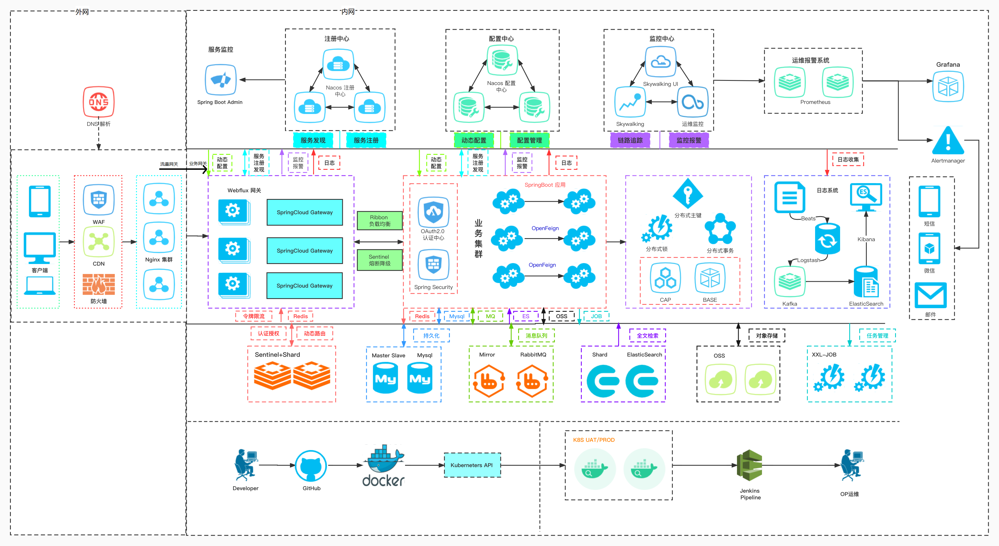
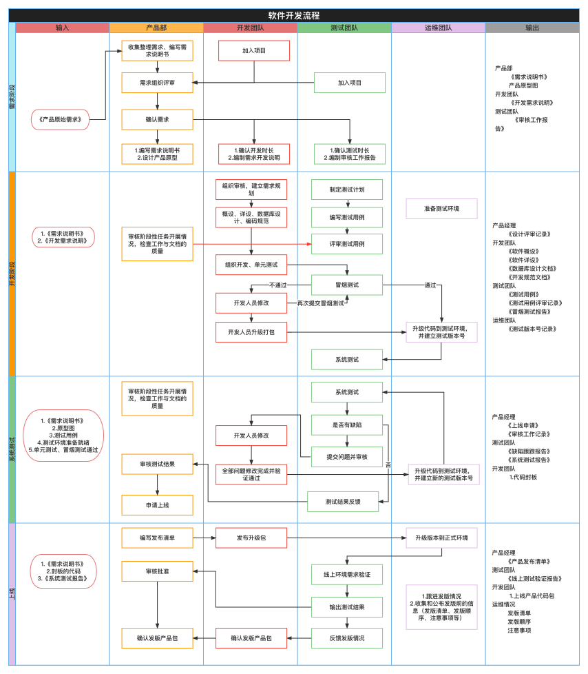
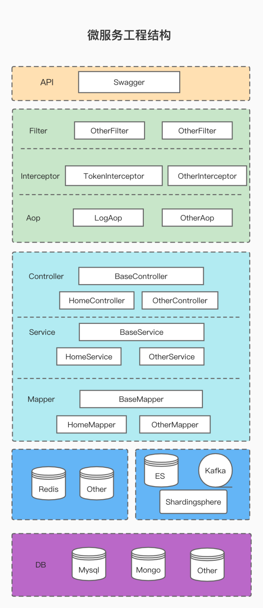
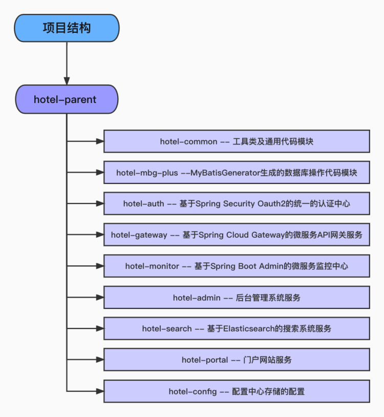
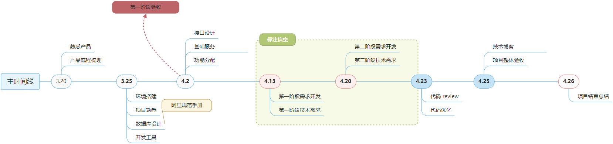
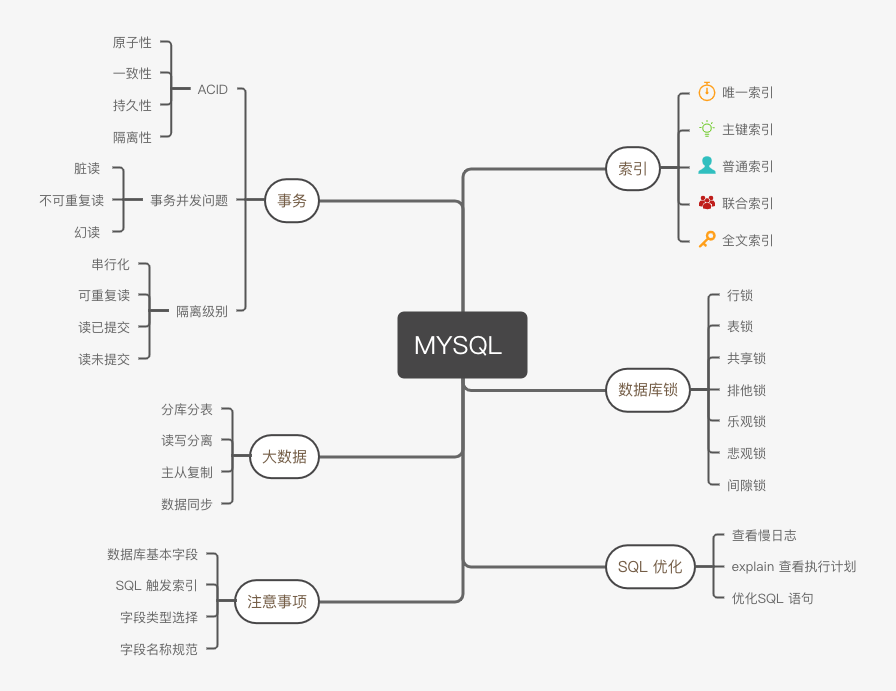

# 酒旅项目立项

## 项目背景

> 依托微信小程序和App客户端提供线上预定酒店和旅游产品的互联网产品.

- 解决用户痛点1: 提高了用户搜索酒店和预定酒店的效率
- 解决用户痛点2: 售后功能保障了用户的合法权益
- 解决用户痛点3: 基于数据分析提供给用户多需求场景的组合产品

## 技术架构



1. 用户在客户端发起请求,进行DNS(Domain Name System域名服务器)解析,其中WAF(Web Application Firewall)、CDN(Content Distribution Network内容分发网络)、防火墙
2. 再通过Nginx集群反向代理到Spring5.0之后添加的WebFlux网关,SpringClound Gateway结合配置中心实现动态路由,结合Redis集群(Sentinel和shard保证了集群的高可用)进行认证授权和令牌限流
3. 另一方面还可以同时与Nacos合作为它提供监控报警和日志,集成服务注册发现功能,Nacos集群在整个架构中都能提供服务注册发现与动态配置和动态管理功能,整合SpringBoot Admin进行服务监控
4. 同时Gateway可以通过Ribbon进行负载均衡、Sentinel熔断降级和业务集群建立桥梁,形成联系,业务调用之前通过SpringSecurity框架和OAuth2认证中心整合JWT进行公钥私钥的颁发授权与相应验签认证功能
5. SpringBoot应用在业务集群中通过OpenFeign进行相互调用,中间还整合Redis、MySQL、RabbitMQ、ES、OSS、XXL-JOB等工具.其中Redis集群可以用来做分布式数据缓存;MySQL主从复制进行数据的持久化;RabbitMQ进行系统解耦削峰填谷异步调用;ES全文搜索引擎整合Kibana、Logstash进行近实时搜索、分析和可视化的全文检索;使用阿里云OSS云存储服务进行对象存储、企业数据管理;使用xxl-job进行分布式任务调度.
6. 业务集群还与分布式相挂钩,有着分布式主键、分布式锁、分布式事务,其中有两个理论,一个是CAP(Consistency一致性、Availability可用性、Partitiontolerance分区容错性,这三个要素最多只能同时实现两点,不可能三者兼顾)理论,一个是BASE(Basically Available基本可用、Soft State软状态、Eventual Consistency最终一致性,即使无法做到强一致性,CAP的核心就是强一致性,但应用可以采用合适的方式达到最终一致性)
7. 日志收集通过Beats、ELK和Kafka整合完成,具体过程是这样的:Beats用于日志数据采集使用,Logstash收集日志,发送给Kafka进行解耦、流量削峰和异步处理,然后通过Elasticsearch集群存储日志数据,索引日志数据,再通过Kibana视图形式展示日志信息,更加人性化地在客户端进行检索以及相关操作.
8. 以Skywalking为核心的运维监控中心提供链路追踪和监控报警机制,与运维报警系统Prometheus结合Grafana最终和AlertManager通过短信、微信或者邮件的形式给模块负责人发送警告通知
9. 最终Developer将代码文件上传到GitHub上通过docker容器部署,使用K8s API对资源进行编排,管理应用的全生命周期,同时也提高发布与更新版本的效率,然后通过Jenkins Pipeline进行整个构建、测试、交付等持续集成,运维人员继续对这些进行维护.

## 开发流程



## 项目工程结构





## 里程碑



3.20: 熟悉产品,产品流程梳理

3.25: 环境搭建,项目熟悉,数据库设计(阿里规范手册),开发工具

4.2: 接口设计,基础服务,功能分配

4.13: 第一阶段需求开发,第一阶段技术需求

4.20: 第二阶段需求开发,第二阶段技术需求

4.23: 代码review,代码优化

4.25: 技术博客,项目整体验收

4.26: 项目结束总结

# 数据库设计

数据库设计工具: [CHINER元数建模](https://gitee.com/robergroup/chiner#https://gitee.com/robergroup/chiner-java.git)



  

## 建表规约

- 表必备几个字段
  - 主键 id: bigint(20) unsigned NOT NULL AUTO_INCREMENT
  - 创建时间 create_time: timestamp NOT NULL DEFAULT CURRENT_TIMESTAMP
  - 更新时间 update_time: timestamp NOT NULL DEFAULT CURRENT_TIMESTAMP ON UPDATE CURRENT_TIMESTAMP COMMENT
  - 乐观锁 revision
  - 逻辑删除 deleted: tinyint(1) unsigned NOT NULL DEFAULT '0'

- 合适的字符存储长度,不但节约数据库表空间、节约索引存储,更重要的是提升检索速度.

  正例:无符号值可以避免误存负数,且扩大了表示范围

  | 对象     | 年龄区间  | 类型              | 字节 | 表示范围       |
  | -------- | --------- | ----------------- | ---- | -------------- |
  | 人       | 150岁之内 | tinyint unsigned  | 1    | 0~255          |
  | 龟       | 数百岁    | smallint unsigned | 2    | 0~65535        |
  | 恐龙化石 | 数千万年  | int unsigned      | 4    | 0~约42亿       |
  | 太阳     | 约50亿年  | bigint unsigned   | 8    | 0~约10的19次方 |

- 字符集和排序规则的选择  DEFAULT CHARSET=utf8mb4 COLLATE=utf8mb4_general_ci

  > utf8与utf8mb4

  MySQL在5.5.3之后增加了utf8mb4字符编码,mb4即most bytes 4.简单说utf8mb4是utf8的超集并完全兼容utf8,能够用四个字节存储更多的字符.

  抛开MySQL数据库,标准的UTF-8字符集编码是可以用1~4个字节去编码21位字符,这几乎包含了世界上所有能看见的语言了.然而在MySQL里实现的utf8最长使用3个字节,也就是只支持到了Unicode中的基本多文本平面(U 0000至U FFFF),包含了控制符、拉丁文、中、日、韩等绝大多数国际字符,但并不是所有,最常见的就算是手机端常用的表情字符emoji和一些不常用的汉字,如"墅",这些需要四个字节才能编码出来.

- 存储引擎的选择  ENGINE=InnoDB

- 表名、字段名必须使用小写字母或数字,禁止出现数字开头,禁止两个下划线中间只出现数字.

  MySQL在Windows下不区分大小写,但在Linux下默认是区分大小写的.因此,数据库名、表名、字段名都不允许出现任何大写字母,避免节外生枝.

  正例: aliyun_admin, rdc_config, level3_name

  反例: AliyunAdmin, rdcConfig, level_3_name

- 表名不使用复数名词

- 禁用保留字,如desc、range、match、delayed等,请参考MySQL官方保留字

- 主键索引名为`pk_字段名`;唯一索引名为`uk_字段名`,普通索引名则为`idx_字段名`

- 小数类型为decimal,禁止使用float和double

- 如果存储的字符串长度几乎相等,使用char定长字符串类型

- varchar是可变长字符串,不预先分配存储空间,长度不要超过5000,如果存储长度大于此值,定义字段类型为text,独立出来一张表,用主键来对应,避免影响其他字段索引率

- 字段允许适当冗余,以提高查询性能,但必须考虑数据一致.冗余字段应遵循:

  - 不是频繁修改的字段
  - 不是唯一索引的字段
  - 不是varchar超长字段,更不能是text字段

  正例: 各业务线经常冗余存储商品名称,避免查询时需要调用IC服务获取

- 字段尽量不能为空,给默认值(否则有可能导致索引失效)

- 库名与应用名尽量一致

- 表的命名最好遵循"业务名称_表的作用"

  正例: alipay_task / force_project / trade_config / tes_question

- 如果修改字段含义或对字段表示的状态追加时,需要及时更新字段注释

## 索引规约

- 业务上具有唯一特性的字段,即使是组合字段,也必须建成唯一索引

  不要以为唯一索引影响了 insert 速度,这个速度损耗可以忽略,但提高查找速度是明显的;另外,即使在应用层做了非常完善的校验控制,只要没有唯一索引,根据墨菲定律,必然有脏数据产生.

- 全部都是单表操作,禁止join.多表关联查询在业务层进行处理.

- 在 varchar 字段上建立索引时,必须指定索引长度,没必要对全字段建立索引,根据实际文本区分度决定索引长度

  索引的长度与区分度是一对矛盾体,一般对字符串类型数据,长度为 20 的索引,区分度会高达 90%以上,可以使用 count(distinct left(列名，索引长度)) / count(*) 的区分度来确定

- 页面搜索严禁左模糊或者全模糊,如果需要请走搜索引擎来解决

  索引文件具有 B-Tree 的最左前缀匹配特性,如果左边的值未确定,那么无法使用此索引.

- 如果有 order by 的场景,请注意利用索引的有序性.order by 最后的字段是组合索引的一部
  分,并且放在索引组合顺序的最后,避免出现 filesort 的情况,影响查询性能

  正例: where a = ? and b = ? order by c; 索引: a_b_c

  反例: 索引如果存在范围查询,那么索引有序性无法利用,如: WHERE a > 10 ORDER BY b; 索引 a_b 无法排序.

- 利用覆盖索引来进行查询操作,避免回表.

- SQL 性能优化的目标: 至少要达到 range 级别,要求是 ref 级别,如果可以是 const 最好

  说明: 

  1) consts 单表中最多只有一个匹配行(主键或者唯一索引),在优化阶段即可读取到数据

  2) ref 指的是使用普通的索引(normal index)

  3) range对索引进行范围检索

  反例: explain 表的结果,type = index,索引物理文件全扫描,速度非常慢,这个 index 级别比较 range 还低,与全表扫描是小巫见大巫.

- 建组合索引的时候,区分度最高的在最左边

  正例: 如果 where a = ? and b = ?, a 列的几乎接近于唯一值,那么只需要单建 idx_a 索引即可.
  说明: 存在非等号和等号混合判断条件时,在建索引时,请把等号条件的列前置.如: where c > ? and d = ? 那么即使 c 的区分度更高,也必须把 d 放在索引的最前列,即建立组合索引 idx_d_c

- 防止因字段类型不同造成的隐式转换,导致索引失效

- 创建索引时避免有如下极端误解:

  - 索引宁滥勿缺.认为一个查询就需要建一个索引.
  - 吝啬索引的创建.认为索引会消耗空间、严重拖慢记录的更新以及行的新增速度
  - 抑制唯一索引.认为唯一索引一律需要在应用层通过"先查后插"方式解决

# API设计

API设计工具: ApiPost

1. 请求方式只用 GET/POST
2. 请求路径按照任务分配表上的写
3. GET 请求的参数在 Query 里面填写,POST 在 Body 里写.不要混用
4. 不要使用 RESTFul 的路径传参
5. 参数名采用驼峰命名
6. 数据库中存在的字段的参数，命名要保持一致
7. 如果参数中用多个 id 参数，必须区分命名，且要与数据库一致
8. 传参的实例值尽量真实一点
9. 类型要选择正确，类型的选项很多自己看看。
10. 参数描述简练准确
11. 响应数据示例的格式必须的实际的格式
12. 响应数据的类型和描述和请求参数的要求一致
13. 金额数据: 后端使用整数存,但是到了前端部分要转化为小数

# 代码上的优化

1.设置非空验证

官网：http://hibernate.org/validator

例：

```
public class Car {

   @NotNull
   private String manufacturer;

   @NotNull
   @Size(min = 2, max = 14)
   private String licensePlate;

   @Min(2)
   private int seatCount;

   // ...
}
```

2.一些配置不要放在业务层

例：

```
@Configuration
public class DruidConfig {

    /**
     * 配置Druid 监控启动页面
     *
     * @return servletRegistrationBean
     */
    @Bean
    @ConditionalOnMissingBean
    public ServletRegistrationBean<Servlet> druidStartViewServlet() {
        ServletRegistrationBean<Servlet> servletRegistrationBean = new ServletRegistrationBean<Servlet>(new StatViewServlet(), "/druid/*");
        // 白名单
//        servletRegistrationBean.addInitParameter("allow", "127.0.0.1");
        // 黑名单
        servletRegistrationBean.addInitParameter("deny", "192.168.1.100");
        // 登录查看信息的账密，用于登录Druid监控后台
        servletRegistrationBean.addInitParameter("loginUsername", "druid");
        servletRegistrationBean.addInitParameter("loginPassword", "druid");
        // 是否能够重置数据
        servletRegistrationBean.addInitParameter("resetEnable", "true");
        return servletRegistrationBean;
    }
```

3.不用try catch

使用全局捕捉异常例GlobalExceptionHandler、ApiException直接引common模块使用。

4.if else问题

可以直接if return让代码简洁。

```
if{
	...
}
return ...
```

5.日志打印问题

在主要流程打印日志，节约资源。

6.接口注释写好增加可读性。

7.if else特别多时用switch语句，让代码干净整洁些。

8.相应模块写在对应模块里，例如admin的写admin模块里。

9.使用mybatis-plus 例如Service直接继承Iservice的方法简洁代码

10.minio上传文件单独写一个service

11.字符串拼接问题

12.redis的使用要修改

13.mybatis-plus使用LambdaQueryWrapper通过方法引用的方式来使用实体字段名的操作

例：

```
	LambdaQueryWrapper<User> lambda3 = Wrappers.<User>lambdaQuery();
	lambda3.like(User::getName, "雨").lt(User::getAge, 40);
```

14.大小写问题例如DTO、VO

15.非空用hutool工具

> 重要知识点：

不要写两表联查，可以单表多查一次，调两个service就行，然后用Java的流拼起来，原因：

1. 单表走索引好保证，很难保证联合查询走索引，所以不见得联查会有多快
2. 系统拆分联合查询很难分出来

# 总结

经过这一个月忙碌的时间，这个项目自己写代码的时间可能不太长，但是花费的精力确实很大，从最开始什么都没有，什么都不知道的小白，慢慢了解软件开发的全过程，从需求设计，数据库设计，接口设计、熟悉版本控制工具的使用，代码编写阶段与代码review，期间的很多次小组会议，共同学习阿里开发规约等团队协作。对未来的工作也有了相对更为全面深刻的认知，期间我遇到了很多问题。下面列举总结一下

1. 首先就应该是工具的熟悉与使用了，比如项目中使用到的git是我很久之前浅显地学习了一些，在实际操作中还闹出没有update直接pull到master分支的情况，再就是ApiPost和Chinner的使用，这些之前都没接触过，中间还出现为保存文件就直接退出的乌龙，所以以后一定要及时备份保存相关数据，还有就是使用ProgressOn这种在线画图工具来帮我们整理思路
2. 其次是数据库的设计，原来也听说过这些都是架构师帮你想好的，你只需要去具体的使用就行。当这次真的自己去设计的时候，有很多相关知识就得应用起来，比如数据库三大范式，每个表中涉及到的字段，存在的话都是有一定的原因的，有时候因为需要方便而设计冗余字段，有时候还需要设计中间表，这就需要站在整个系统业务这一宏观角度去思考这些问题，再就是约束和索引的创建，约束用来保证字段的唯一性、不为空或者方便查询的外键，从而保证数据的正确性、有效性、完整性；首先要明确索引的创建的目的，是为了提高查询速度，但是索引的创建本身就是比较消耗磁盘性能，需要减少磁盘IO次数，只有在数据量很大的时候，当创建索引之后的提升比索引本身的消耗高的时候才适合创建，明确适合创建索引的情况，比如频繁作为WHERE查询条件的字段，DISTINCT字段、经常GROUP BY和ORDER BY的字段等等。同时我们应该也要注意索引失效的情况，比如使用了select * 、索引列上有计算、用了函数、不满足最左匹配、like左边包含%、使用OR关键字、NOT IN和NOT EXISTS等等。这些都是我需要在面试和以后工作的时候十分清楚的。还有就是在数据库的设计中我们需要重点关注最新的阿里开发规约，命名规范和一些必需的字段以及某些字段用的数据类型，尤其是跟金额相关的数据要格外注意，等以后工作的话在金额方面造成精度丢失可就是大事了。

3. 再来谈接口设计这一块。具体设计是根据前端页面，确定接收的参数和传给前端的参数，有些参数在实体表中不存在的情况下很多时候还需要自己封装DTO来进行数据的传输，前后端的交互也是项目中很关键的一个部分，后期代码开发出来之后进行一系列的联调来确保程序可以正常进行。这就让我想起了自己原来做练手小项目的时候，就一边后端debug，一边在前端服务器查看请求传递的json数据，不然用Postman直接报个500或者404也没什么太多的头绪去修改。在设计接口的时候团队最好统一参数的传递格式，倒也不一定要用Restful风格，接口名称模块名+具体功能名，中间用 / 隔开，而且当功能名的词数过多时，应该用 - 来分开，而不是我们经常用的驼峰命名法。
4.  最后需要扩展提升的就是对于微服务和中间件的熟悉，当前对于Redis、MQ、ES等的使用还是有很大的欠缺 

接下来要多学习的地方：先多看这个项目大家写的代码，并选择其中一些有代表的功能自己去手动实现，把基础再打扎实一些，多背面试题，刷算法题，巩固多线程这些东西，并且去系统学习计算机网络和操作系统，弥补非科班的短板。上文的Redis和MQ知识的学习是必不可少的，MySQL相关知识基础也要打牢再就是多去熟悉各种微服务理论知识以及实际的应用。再就是有时间的情况下对JVM有一个初步的系统的了解，在以后的工作中多关注一些深入的点和一些细节上的东西。


